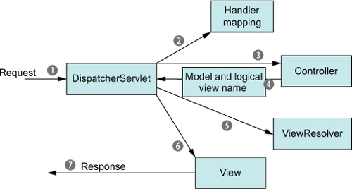
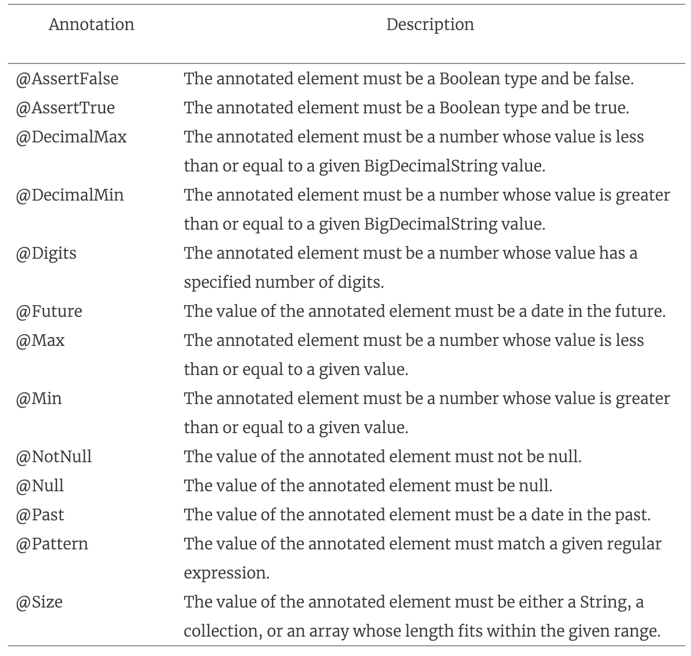

# 5강
## 1. 스프링 MVC 시작하기
- 사용자가 웹브라우저에서 작업을 하면, 리퀘스트가 서버로 들어가고, 작업 처리 후 리스폰스를 반환한다.
- 그 작업 처리를 해주는 부분이 스프링 MVC 이다.



- 1에서 리퀘스트가 들어 올 때, 사용자가 원하는 정보가 포함되어 전달이 된다.
- 리퀘스트의 첫 정거장은 프로트 컨트롤러 역할을 하는 DispatcherServlet이다.
- DispatcherServlet의 임무는 리퀘스트를 스프링 MVC 컨트롤러로 전달하는 일이다.
- 일반적으로 어플리케이션은 여러개의 컨트롤러가 있어서 어떠한 컴포넌트로 찾아갈지 2의 핸들러 매핑에게 도움을 청한다.
- 핸들러 매핑을 통해 컨트롤러가 선택되면, DispatcherServlet은 선택된 컨트롤러 3으로 리퀘스트를 전달한다.
- 컨트롤러에서 요청은 페이로드 (사용자에 의해 입력된 정보) 를 떨군다. 
- 컨트롤러가 내부 로직을 타서 리퀘스트를 잘 처리하면, 브라우저에 표시되기 위한 형태의 정보를 반환하는데, 이것을 보통 모델이라고 한다.
- 이때 컨트롤러는 뷰의 이름도 같이 던지게 되는데, DispatcherServlet은 이걸 받아서 view resolver에서 적절핟 뷰를 매핑해 다시 던져준다.
- 위의 작업이 완료되면, 이제 리스폰스에 해당 정보를 담아 화면단으로 던져준다.

## 2. 스프링 MVC 설정하기
### 2-1. DispatcherServlet 설정하기
- DispatcherServlet을 설정하는 방법은 web.xml 과 java 설정이 있다. web.xml은 버림

```java
public class SpittrWebAppInitializer
        extends AbstractAnnotationConfigDispatcherServletInitializer {
        
        @Override
        protected String[] getServletMappings() {
            //DispatcherServlet을 /에 매핑
            return new String[] {"/"};
        }

        @Override
        protected Class<?>[] getRootConfigClasses() {
            return new Class<?>[] {RootConfig.class};
        }

        @Override
        protected Class<?>[] getServletConfigClasses() {
            // 설정 클래스를 지정해 준다.
            return new Class<?>[] {WebConfig.class};
        }
    }
```
 
- 서블릿 3.0 환경에서 컨테이너는 클래스패스 내의 javax.servlet.ServletContainerInitializer 인터페이스를 구현한 모든 클래스들을 찾아보도록 되어 있다.
- 여기서 발견된 클래스들은 서블릿 컨테이너들을 설정하는데 사용된다.
- 스프링은 SpringServletContainerInitailizer의 구현을 제공하고, 순차적으로 WebApplicationInitializer의 구현 클래스를 찾아 설정을 위임한다.
- 스프링에선 AbstractAnnotationConfigDispatcherServletInitializer라고 하는 미리 구성되어있는 WebApplicationInitializer의 구현체를 만들어 놓았다.
- 위의 코드 설정도, AbstractAnnotationConfigDispatcherServletInitializer를 상속 받아 기초 설정들을 스프링이 찾을 수 있도록 설정을 해 주었음.

### 2-2. 두 애플리케이션 컨텍스트
- DispatcherServlet이 시작되면 스프링 어플리케이션 컨텍스트를 생성하고, WebConfig 에서 설정된 빈을 로딩한다.
- DispatcherServlet은 컨트롤러, 뷰리졸버, 핸들러 매핑과 같은 웹 컴포넌트가 포함된 빈을 로딩한다.
- ContextLoaderListener는 그 외의 다른 빈들을 로딩한다.
- 내부적으로 AbstractAnnotationConfigDispatcherServletInitializer는 DispatcherServlet과 ContextLoaderListenr를 생성한다.
- ContextLoader의 설정은 RootConfig 에 설정되어있고, DispatcherServlet은 WebConfig에 설정 되어 있다.
- 이러한 java클래스를 사용한 DispatcherServlet 설정 방식은 톰캣 7 과 같이 서블릿 3.0 이상을 지원하는 서버에서반 작동을 한다.

### 2-3 스프링 MVC 활성화하기
- 가장 간단하게 MVC 설정 방법은 @EnableWebMvc 어노테이션을 붙여주는거다
```java
@Configuration
@EnableWebMvc
public class WebConfig {
    
}
```
- 위와 같이 설정하면, 기본적인 MVC를 적용한다는 것을 스프링에겐 알려주지만 조금더 디테일한 설정이 필요하다

```java
@Configuration
@EnableWebMvc // Spring MVC 활성화
@ComponentScan("spitter.web") // component scan 활성화
public class WebConfig
public class WebConfig extends WebMvcConfigurerAdapter {
    @Bean
    public ViewResolver viewResolver() {
        // JSP 뷰 리졸버 설정
        InternalResourceViewResolver resolver = new InternalResourceViewResolver();
        resolver.setPrefix("/WEB-INF/views/");
        resolver.setSuffix(".jsp");
        resolver.setExposeContextBeansAsAttributes(true);
        return resolver;
    }

    @Override
    public void configurerDefaultServletHandling(
        DefaultServlethandlerConfigurer configurer) {
        // 정적 콘텐츠 처리 설정
        configurer.enalbe();
    }
}
```

- 이런식으로 추가적인 설정을 통해 필요한 설정들을 해줘야 한다.
- 참고 RootConfig
```java
@Configuration
@ComponentScan(basePackages={"spitter"},
    excludeFilters={
        @Filter(type=FilterType.ANNOTATION, value=EnableWebMvc.class)
    })
public class RootConfig {
    // 자세한건 뒤에서 보도록합시당
}
```

- Spitter 어플리케이션을 예제 소스로 개발한다.
- Spring + Twitter 란다..
- MVC 에서 컨트롤러는 메소드를 포함하는 단순한 클래스, @RequestMapping이 있다.

## 3. 간단한 컨트롤러 작성하기

```java
@Controller
public class HomeController {

  @RequestMapping(value="/", method=GET)
  public String home() {
    return "home";
  }
}
```

- 위의 컨트롤러에서 리턴을 단순히 스트링 "home"을 해주지만, 이 String은 스프링 MVC에 의해 렌더링할 뷰의 이름으로 해석이 된다.
- DispatcherServlet은 뷰 리졸버에게 이 뷰의 이름으로 실제 뷰를 결정하도록 요청한다.
- 실제로 WebConfig에서 jsp로 설정을 해서 home.jsp로 찾아가게 된다.
- HomeController를 다른 관점에서 보면, 어노테이션만 제외하면 POJO이다.

### 3-1 컨트롤러 테스팅

```java
public class HomeControllerTest {
    @Test
    public void testHomePage() throws Exception {
        HomeController controller = new HomeController();
        assertEquals("home", controller.home());
    }
}
```

- 위와같은 형태는 완전 야매 테스트코드로, 단순 컨트롤러 호출시 String home을 리턴하는지만 봐줘서 MVC와는 관계가 없다.

```java
public class HomeControllerTest {
    @Test
    public void testHomePage() throws Exception {
        HomeController controller = new HomeController();
        MockMvc mockMvc = standaloneSetup(controller).build(); // MockMvc 셋업
        mockMvc.perform(get("/"))
                .andExpect(view().name("home"));
    }
}
```

- 위의 테스트코드는 MockMvc 객체를 통해 "/" 에 get 메소드를 호출해 해당 뷰 이름이 home인지 체크한다.

### 3-2 클래스 레벨 요청 처리 정의하기
- 클래스 레벨로 패스 매핑을 위한 부분을 따로 두도록 변경해 보자

```java
@Controller
@RequestMapping("/")
public class HomeController {

    @RequestMapping(method=GET) // 이런식으로 분리해준다.
    public String home() {
        return "home";
    }
}
```

- 위의 소스에는 클래스 레벨에서 핸들러 메소드는 "/" 하나를 사용한다.

```java
@Controller
@RequestMapping({"/", "/homepage"}) // 이런식으로 핸들러를 2개를 받을 수도 있다.
public class HomeController() {
    ...
}
```

### 3-3 뷰에 모델 전달
- 실제로 위에처럼 간단하게 스트링만 넘겨주면 편하겠지만, 데이터를 화면에 넘겨줘야할일이 많다.(거의 대부분이다)
- 위의 예시에서 데이터에 접근하기위한 SpittleRepository를 정의해 준다.
```java
public interface SpittleRepository {
    List<Spittle> findSpittles(long max, int count); // 최대 ID값 , 총 갯수
}
```

```java
package spittr;

import java.util.Date;

public class Spittle {
  private final Long id;
  private final String message;
  private final Date time;
  private Double latitude;
  private Double longitude;

  public Spittle(String message, Date time) {
    this(message, time, null, null);
  }

  public Spittle(String message, Date time, Double longitude, Double latitude) {
    this.id = null;
    this.message = message;
    this.time = time;
    this.longitude = longitude;
    this.latitude = latitude;
  }

  public Long getId() {
    return id;
  }

  public String getMessage() {
    return message;
  }

  public Date getTime() {
    return time;
  }

  public Double getLatitude() {
    return latitude;
  }

  public Double getLongitude() {
    return longitude;
  }

  @Override
  public int hashCode() {
    return HashCodeBuilder.reflectionHashCode(this, "id", "time");
    // Apache Common Langs
  }

  @Override
  public boolean equals(Object that) {
    return EqualsBuilder.reflectionEquals(this, that, "id", "time");
    // Apache Common Langs
  }
}
```

- 기본적인 POJO vo 형태이며, haseCode 와 eqauls는 apache common langs 내 메소드를 사용했다.

```java
@Test
public void shouldShowRecentSpittles() throws Exception {
    List<Spittle> expectedSpittles = createSpittleList(20);
    SpittelRepository mockRepository = mock(SpittleRepository.class); // Mock 저장소
    when(mockRepository.findSpittles(Long.MAX_VALUE, 20))
        .thenReturn(expectedSpittles);

    SpittleController controller = new SpittleController(mockRepository);
    MockMvc mockMvc = standaloneSetup(controller)
        .setSingleView(new InternalResourceView("/WEB-INF/views/spittles.jsp"))
        .build();

    mockMvc.perform(get("/spittles"))
        .andExpect(view().name("spittles"))
        .andExpect(model().attributeExists("spittleList"))
        .andExpect(model().attribute("spittleList", 
                                    hasItems(expectedSpittles.toArray())));    
}
```
- /spittles에 대한 GET 요청을 수행하고, 뷰 이름이 spittles인지 모델이 spittleList인지 테스트 한다.

```java
@Controller
@RequestMapping("/spittles")
public class SpittleController {

    private SpittleRepository spittleRepository;

    @Autowired
    public SpittleController(SpittleRepository spittleRepository) {
        this.spittleRepository = spittleRepository; 
        // 이 구현체를 구현한게 없어서 오토와이어안됨..
    }

    @RequestMapping(method=RequestMethod.GET)
    public String spittles(Model model) {
        // model 추가
        model.addAtrribute(spittleRepository.findSpittles(
            Long.MAX_VALUE, 20
        ));
        return "spittles"
    }
}
```

- 이런식으로 Model을 추가해 값을 넘길 수도 있다. Map같은거 써도되는데 개인적으로 비추
- 위의 모델은 key,value로 매핑되는데, 키가 없을경우 값으로 설정된 객체 타입으로 추측한다.
- 위엔 객체 타입이 List<Spittle> 이므로, 키는 spittleList로 추측된다.

```java
@RequestMapping(method=RequestMethod.GET)
public List<Spittle> spittles() {
    return spittleRepository.findSpittles(Long.MAX_VALUE, 20);
}
```

- 모델과는 다른 방법인데, 뷰이름이나 모델을 리턴하는게 아닌 Spittle List를 리턴한다.
- 이럴 경우, 핸들러 메소드가 객체나 컬렉션의 리턴값은 모델로 설정하고, 키는 타입에 따라 추측한다. (spittleList)
- 뷰의 네임은 요청 패스를 통해 추론되는데, /spittles의 GET요청을 처리하는거로 확인되어, spittles로 뷰네임을 설정해 준다.
- 위의 spittles를 호출하면, Spittle 객체 리스트는 SpittleList 키와 함께 모델에 저장되고, 뷰 자체의 이름은 spittles가 된다. 
= InternalResourceViewResolver에 설정된 방법에 따라 뷰는 spittles.jsp로 찾아간다.

## 4. 요청 입력받기
- 클라이어트에서 컨트롤러의 핸들러 메소드로 데이터를 전달해주는 방법
```
1. 쿼리 파라미터
2. 폼 파라미터
3. 패스 변수
```

### 4-1 쿼리 파라미터
- 위의 SpittleController에서 max 파라미터와 count 파라미터를 받게 구현해보자

```java
@Test
public void shouldShowRecentSpittles() throws Exception {
    List<Spittle> expectedSpittles = createSpittleList(20);
    SpittelRepository mockRepository = mock(SpittleRepository.class); // Mock 저장소
    when(mockRepository.findSpittles(238900, 50)) // max 와 count 파라미터를 예상
        .thenReturn(expectedSpittles);

    SpittleController controller = new SpittleController(mockRepository);
    MockMvc mockMvc = standaloneSetup(controller)
        .setSingleView(new InternalResourceView("/WEB-INF/views/spittles.jsp"))
        .build();

    mockMvc.perform(get("/spittles?max=238900&count=50")) // 쿼리 파라미터로 값을 받는다.
        .andExpect(view().name("spittles"))
        .andExpect(model().attributeExists("spittleList"))
        .andExpect(model().attribute("spittleList", 
                                    hasItems(expectedSpittles.toArray())));    
}
```

- 기존과 달라진 점은 GET 요청을 max 와 count를 쿼리 파라미터로 포함시켜 받은 점이다

```java
@RequestMapping(method=RequestMapping.GET)
public List<Spittle> spittles (
    @RequestParam(value="max",
                  defaultValue=MAX_LONG_AS_STRING) long max,
    @RequestParam("count") int count) {
        // @RequestParam 어노테이션으로 쿼리파라미터로 받을 변수들을 설정해 준다.
        // 초기값 설정도 가능
        ...
    }
}
```

### 4-2 패스 파라미터

- 위와 같은 쿼리 파라미터는 동작은 되지만, 리소스 관점에서 이상적인 방식은 아니다.
- 리소스가 쿼리 파라미터가 아닌 URL 패스에 의해 식별되어야 이상적임
- 즉 /spittles/show?abcd=def 따위보다 /spittles/show/def 이런게 좀더 보기 좋다
- 전자는 검색될 리소스를 식별하지만, 후자는 파라미터에 대한 동작을 서술하는데 기본적으로는 HTTP 상의 RPC이다.
- 이런 패스 파라미터를 사용하기 위해선, @RequestMapping 패스에 플레이스홀더를 사용한다.

```java
@RequestMapping(value="/{spittleId}", method=ReequestMethod.GET)
public String spittle(
    @PathVariable("spittleId") long spittleId,
    Model model) {
        model.addAtribute(spittleRepository.findOne(spittleId))
        return "spittle";
    }
``` 
- 이런식으로 @RequestMapping 엔 {플레이스홀더} 로 처리를 하고, 실제 파라미터로 @PathVariable을 사용해 값을 받아온다.

```java
@RequestMapping(value="/{spittleId}", method=ReequestMethod.GET)
public String spittle(
    @PathVariable long spittleId, Model model) {
        model.addAtribute(spittleRepository.findOne(spittleId))
        return "spittle";
    }
``` 

- 패스 파라미터와, 파라미터 인자가 이름이 같으면 키값이 보기싫으니까 생략도 가능
- 요기서 모델로 담아준거는 Spittle 객체이므로, 키값은 spittle 이고, 실제 jsp에선 아래처럼 사용한다.

```html
<div class="spittleView">
    <div class="spittleMessage"><c:out value="${spittle.message}"></div>
</div>
```

### 4-3 Form
- 위와 같이 패스 파라미터로 보낼때 값이 몇개 없으면 간단하게 보낼 수 있지만 만항지면 복잡해진다.
- 이럴 때 사용하는게 바로 폼

```html
...
<form method="POST">
    FirstName: <input type="text" name="firstName" /> <br/>
    ...

    <input type="submit" value="Register" />
</form>
...
```
- 등록 form jsp

```java
@Controller
@RequestMapping("/spittr")
public class SpitterController {
    private SpitterRepository spitterRepository;
    
    @Autowired
    public SpitterController(SpitterRepository spitterRepository) {
        this.spitterRepository = spitterRepository;
    }

    @RequestMapping(value="/register", method=GET) 
    public String showRegistrationForm() {
        return registerForm;
    }

    @RequestMapping(value="/register", method=POST)
    public String processingRegistration(Spitter spitter) {
        spitterRepository.save(spitter);

        return "redirect:/spitter/" + spitter.getUsername();
    }

    @RequestMapping(value="/{username}", method=GET
    public String showSpitterProfile(
            @PathVariable String username, Model model) {
        Spitter spitter = spitterRepository.findByUsername(username);
        model.addAttribute(spitter);
        return "profile"
}
}
```

- 위의 post 메소드를 살펴보면, 위의 html에서 보내주는 Spitter 객체 형태로 파라미터로 받고, 저장한다.
- 이후에 리다이렉트를 해주는데, InternalResourceViewResolver에서 처리하며, forward도 있음

### 4-4 Form 검증
- 사용자가 username이나 password를 비워둔 채로 폼을 제출하면, 공백으로 Spitter 객체를 생서하게 된다.
- 요런 경우 잘못된 요청이므로, 걸러줘야 한다.
- 핸들러 메소드를 검증 로직따위로 꽉꽉 채우지 말고, 스프링에서 제공하는 자바 인증 api를 사용하면 좋다.



```java
public class Spitter {
    private Long id;

    @NotNull
    @Size(min=5,  max=16)
    private String username;
    ...
}
```

```java
@RequestMapping(value="/register", method=POST)
public String processRegistration(
    @Valid Spitter spitter, Errors erros) {
        if(errors.hasErrors()) {
            return "registerForm"
        }
        // 검증 오류가 나면 error 에서 잡힌다.
        ...
    }
```