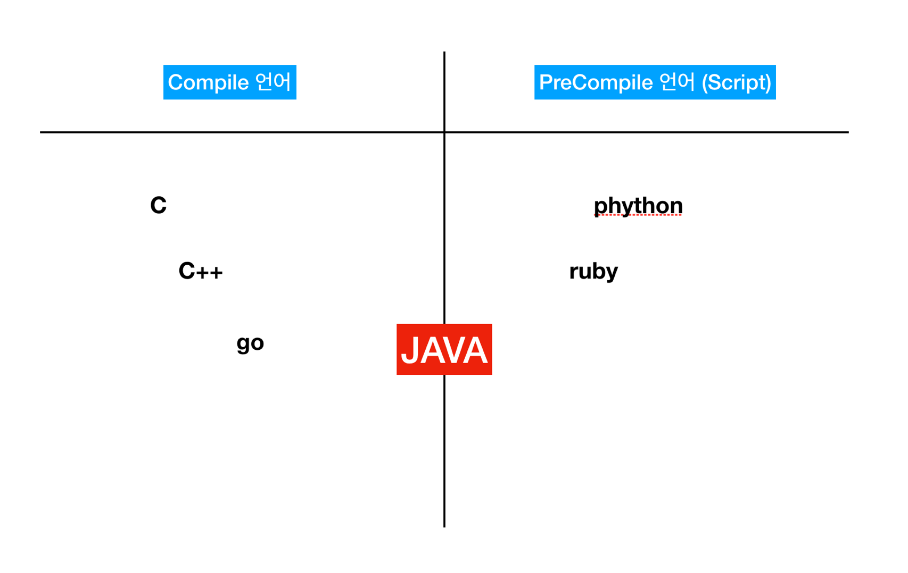

# Compile언어 vs PreCompile 언어 



컴파일 언어와 스크립트 언어의 차이는 컴파일이 완료된 이후 나오는 결과물의 차이이다.

### 컴파일언어
```
c나 c++, go같은애들은 빌드(컴파일)를 하게되면 실행파일 (binary파일)이 나온다. 즉 빌드되는 환경에 따라서 실행파일이 될수도, 안될수도있다. 
예를들어 맥환경에서 go를 빌드하면, 같은 맥환경에서는 실행이 되지만, 리눅스에서는 실행이안된다.
```

### 스크립트언어
```
스크립트 언어는 빌드시 특정 vm위에서 돌게되서 environment safe 하다. 즉 어느환경에서 돌리건 상관없이 다 vm위에서 돌아가서 맥에서 돌리건, 리눅스에서 돌리건 상관없다.
```

### 예외 케이스
```
자바같은 경우는 약간 짬뽕된 언어로, compile을 하긴 하는데, 컴파일 실행 시 바이너리 파일이 나오는게 아니라 .class파일(byte code)이 나온다. 그 .class파일을 jvm환경에서 돌려 역시 아무대서나 돌려도 된다.
```

### 도커적용
```
이걸 docker 환경에서 적용해 보면, dockerfile 생성시  environment safe 한 언어들은 로컬환경에서 빌드하고, 빌드한 파일을 docker image로 옮길 수 있지만, go나 c같은 언어들은 도커파일 내부에서 빌드를 진행해야한다.
여기에 추가적으로 특이한 케이스가 node 인데, node는 그자체는 precompile언어이지만, 라이브러리중에 c++로 구현된게 있어서 도커파일 내부에서 빌드를 보통 진행한다. (npm)
```