# GoCD

## 1. Job 
job은 여러개의 태스크들로 구성됨. 태스크가 실패하면, 잡이 실패됨. 그런경우 남은 태스크들은 안돌게된다.

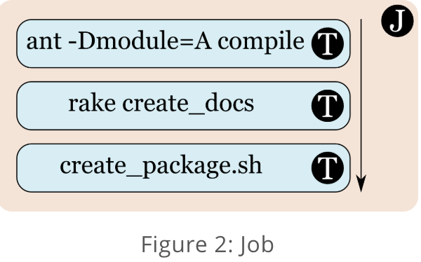

위의 이미지로 보면, 태스크가 3개인데, 위에서부터 실행되고 독립적이다. 만약 ant 를 하는거에서 뭐 환경변수가 변하고 이래도 나머지엔 영향을 안미친다.

## 2.Stage 
Stage는 여러개의 job 들로 구성되어 있음. 역시나 독립적으로 돈다. 

이말은 GoCD는 병렬적으로 stage안에 있는 job들이 구동이 가능하단 소리. 만약, 하나의 job이 실패하면 스테이지는 그 job이 실패했다고 판단한다.

근데 나머지는 독립적이니까 잘돈다. (각각의 잡들이 독립적으로 실행됨)

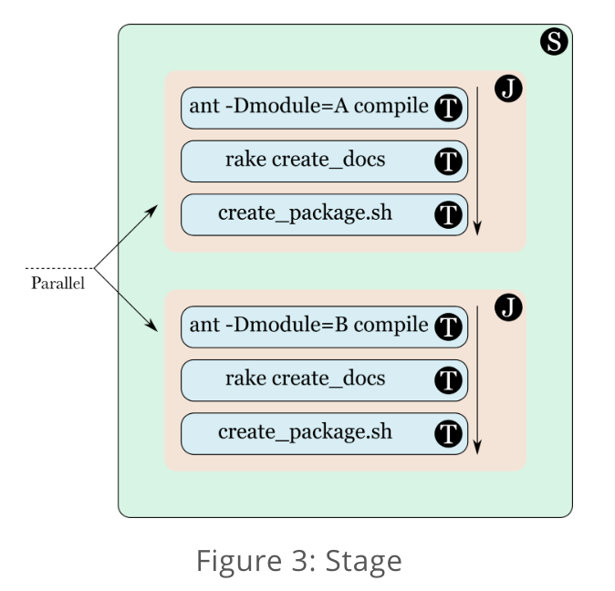

위의 이미지에선 스테이지 내에 잡이 2개가 돌고있음. 하나가 실패하건 말건 나머지는 자기 꺼 돌림 

## 3.Pipeline
파이프라인은 여러개의 스테이지로 구성되어 있고, 각각의 스테이지들은 순서에 따라 돌게 된다.

만약 스테이지가 실패하면, 파이프라인은 실패했다고 간주하고 뒤이어 실행될 스테이지들은 실행되지 않는다.

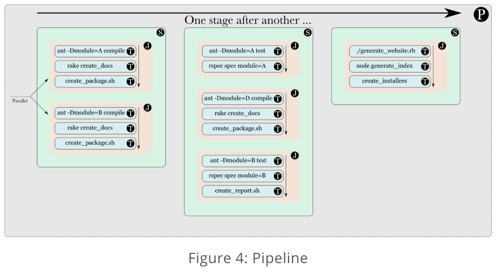

위의 그림에선 3개의 스테이지가 파이프라인을 구성하고 있다. 첫번째는 2개의 잡이 있고, 두번째는 3개의 잡, 마지막껀 하나의 잡이 있다. 만약 첫번째 스테이지가 실패하면 나머지도 실행안된다.

## 4.Materials and triggers (or When do these tasks, jobs, stages and pipelines run?)
material은 파이프라인을 실행시켜주는 매개체.. 라고보면된다. 

GoCD 서버는 계속해서 지정된 material을 polling 하고 새로운 변화 (like commit, push, pr 이겠지) 를 캐치하면 파이프라인이 트리거 된다.

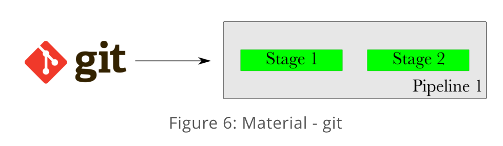

git material 을 보면, commit 이 오면 파이프라인이 실행된다.

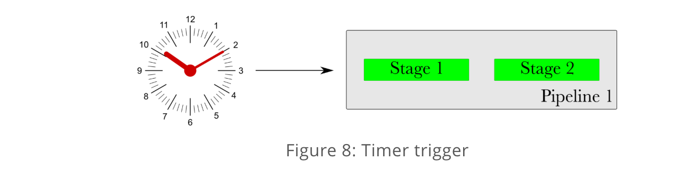

타이머 트리거도 있음. 뭐 시간되면 도는거겠지 (배치로 쓰면 좋을듯)

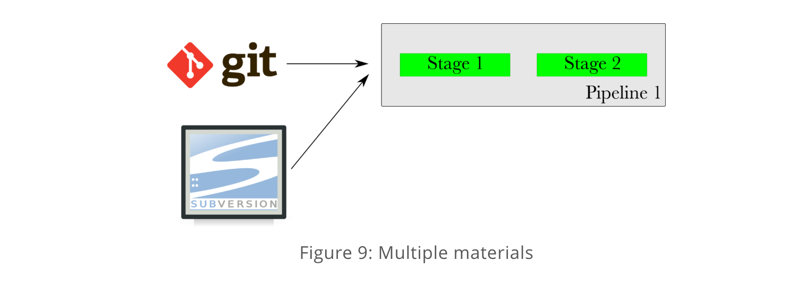

여러개로 트리거 걸수도 있음.

## 5.Pipeline dependency material
material은 파이프라인의 스테이지가 다른 파이프라인의 material로 사용될 때 유용성이 높다.

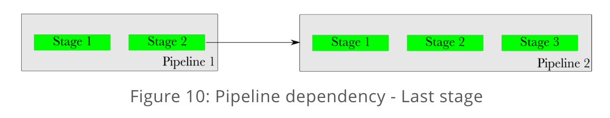

위의 이미지에선 파이프라인 1의 스테이지 2가 파이프라인2로 연결 구성되어 있다. 

파이프라인 1의 스테이지2가 성공적으로 끝나면, 파이프라인2가 트리거된다. 

이럴경우 파이프라인 1은 Upstream Pipeline이라 불리고, 파이프라인 2는 Downstream Pipeline이라고 불림. 

파이프라인 1의 스테이지 2는 이럴경우, 파이프라인 2의 Upstream Dependency로 불림.

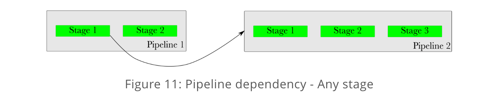

아무파이프라인의 아무 스테이지가 material로 사용될 수 있다. 위의 그림처럼 파이프라인 1의 스테이지1이 완료되면 파이프라인 2가 실행되게 트리거될수도 있지.

## 6.Fan-out and Fan-in
materials는 다운스트림 파이프라인에 fan-out도 할 수 있는데, materials의 완료가 여러개의 다운스트림 파이프라인을 트리거 하는 경우이다.

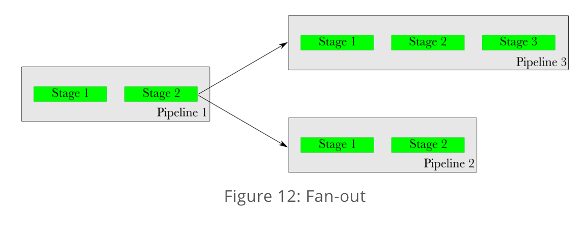

요런 그림형식인데, fan out의 매개체가 항상 파이프라인 dependency material일 필요는 없고, 어떤 material 이건 상관없다. (like git 같은거일듯..)

fan-in은 downstream pipeline 트리거를 위해서 여러개의 upstream material 이 필요한 상황이다.

팬인의 중요하고 흥미로운 측면 중 하나는 GoCD가 다운 스트림 파이프 라인을 트리거하기 전에 업스트림 파이프 라인의 버전이 일관되게 유지된다는 것이다.

위 그림에서 파이프 라인 1의 2 단계가 느리고 파이프 라인 2의 1 단계가 빠르면 파이프 라인 3은 파이프 라인 1이 완료 될 때까지 기다렸다가 트리거함.

파이프 라인 2가 빠르게 완료 되었기 때문에 파이프 라인 1의 불일치 또는 이전 revision으로 트리거되지 않는다.

## 7.Value Stream Map (VSM)
vsm은 upstream dependencies 와 downstream pipeline 트리거들의 end-to-end 의 view 다. 

어떠한 파이프라인이 트리거되는게 결정되면, GoCD의 fan-in / fan-out resolution은 모든 디펜던시 일관성을 고려한다.

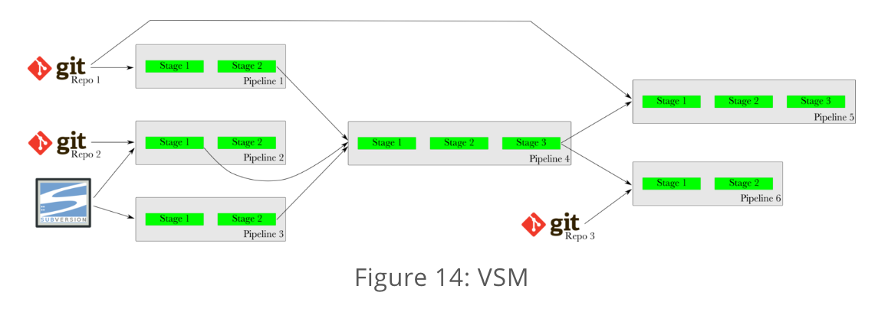

이거시 무슨 소리냐 하면, 위의 그림에서 repo1의 깃이 커밋되면, GoCD는 바로 파이프라인5를 트리거 하지않는다.

파이프라인 1이 완료되는걸 기다리고, 그리고 4가 될때까지 다 기다리고 파이프라인 5가 실행된다. 

결과적으로, 파이프라인 1에 사용된것과 동일한 repo1의 깃 버전으로 파이프라인 5가 실행된다. 

## 8.Artifacts
모든 GoCD 안의 Job들은 파일 / 디렉토리 Artifacts를 발행할수 있다. 

잡이 다 돌고나면, GoCD는 지정된 아티팩트가 사용자 및 기타 다운 스트림 단계 및 파이프 라인에 공개되어 제공 될 수 있도록 한다.

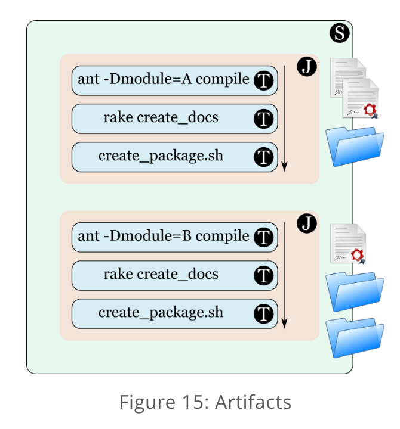

위의 그림에선 job1은 파일두개 디렉토리 한개의 아티팩트를 가지고 있음. 뭐이렇게 알아두면 되듯..

## 9.Fetching artifacts
GoCD는 Fetch Artifatc Task를 제공하는데, 다른 ancestor pipeline이 접근.. 가능하게 하는거. 즉 지금 파이프라인의 아무 upstream pipeline.

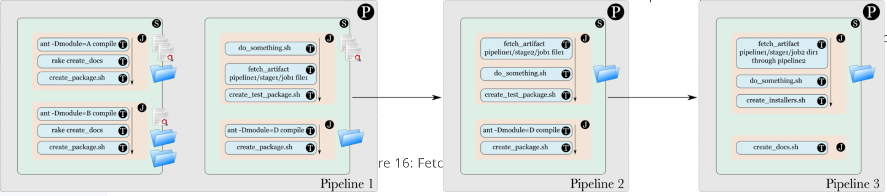

위의 그림에서 파이프 라인 1의 1 단계 작업은 일부 아티팩트를 게시한다. 2 단계에서는 페치 아티팩트 태스크가 1 단계에서 공개 된 아티팩트를 fetch한다. 그런 다음, 파이프 라인 2에서 Fetch 아티팩트 태스크는 파이프 라인 1에 공개 된 아티팩트를 fetch한다. 마지막으로 다운 스트림 인 파이프 라인 3에서 페치 아티팩트 태스크가 파이프 라인 1에서 파이프 라인 2를 통해 아티팩트를 fetch 한다.

## 10.Agent
GoCD agent는 GoCD 에코시스템에서의 워커다.

그냥 뭐 material change 뜰때 poll하고 .. 그런거라고 보면될듯

GoCD 서버에 리포트도 날리고.. 

—> 젠킨스 슬레이브 노드같은거라고 생각하면 된다.

## 11.Environment
잘알고 있는 환경변수다.
대충 보니까 순서대로 오버라이딩함.
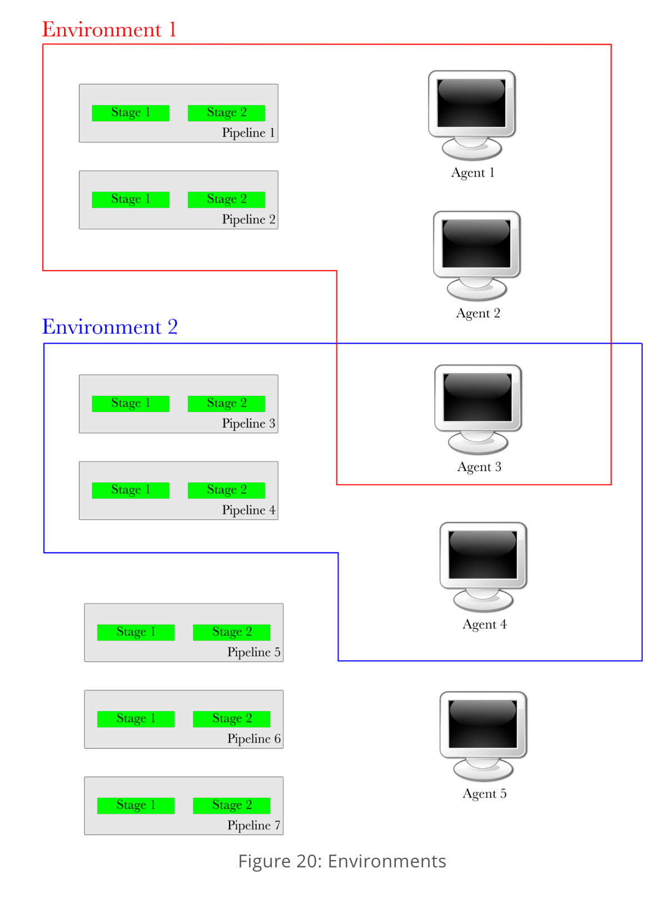

이런식으로 설정이 가능하고

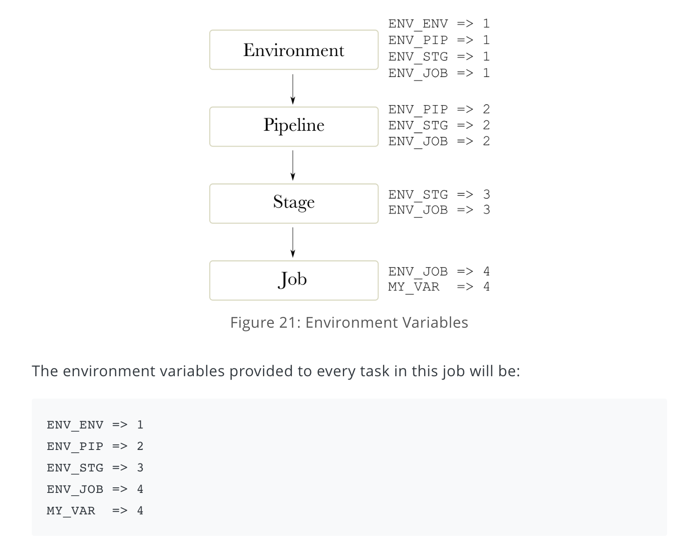

이런식으로 오버라이딩 할 수 있다

참고 
https://docs.gocd.org/current/introduction/concepts_in_go.html

https://www.linux.com/tutorials/set-cicd-pipeline-kubernetes-part-1-overview/

https://www.linux.com/tutorials/set-cicd-pipeline-jenkins-pod-kubernetes-part-2/

https://www.linux.com/tutorials/run-and-scale-distributed-crossword-puzzle-app-cicd-kubernetes-part-3/

https://www.linux.com/tutorials/set-cicd-distributed-crossword-puzzle-app-kubernetes-part-4/

https://zerobig-k8s.tistory.com/22 -> 위 4개 한글해석 잘해놓은 블로그

https://bcho.tistory.com/1234

필요한 정보 - jenkins / spinnaker / gocd / helm (중요)