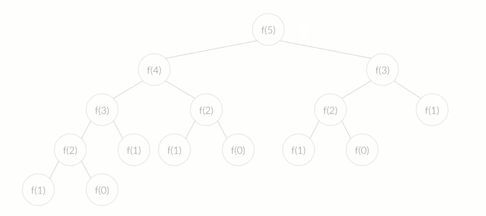
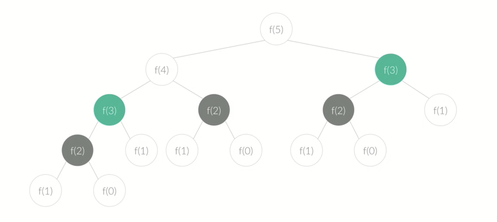

# 알고리즘 기초 1

[[toc]]

## 알고리즘 시작

### 시간 복잡도
- Big O - 가장 오래걸리는 케이스에 대한 계산
- 시간 복잡도는 소스를 보고 계산할 수도 있고, 소스를 작성하기 전에 먼저 계산해 볼 수 있다.
- 실제 돌리는거보다 계산한 시간복잡도가 적은 경우에만 코드를 작성한다
- 시간 = 대충 5억에 1초라고 보면 된다
- 시간 복잡도에 대한건 단순 알고리즘 풀때만이 아니라, 웹사이트 만들거나 이런 경우에도 당연히 고려해야 할 부분.

### 시간 복잡도 계산
- Big O Notation에서 상수는 버린다.
- 두 가지 항이 있을 때, 변수가 같으면 큰 것만 빼고 다 버림
- 변수가 다른 두 항은 걍 냅둔다.

### 사용한 메모리
- 보통 많은 공간을 사용하는건 배열
- 배열이 사용한 공간: 배열의 크기 X 자료형의 크기
- 보통 1억에 380메가 (대략) 
- 문제에선 공간은 크게 신경 안써도 되지만, 메모리 제한이 있는 문제는 고려가 필요
- 불필요한 공간이 없다면, 대부분 메모리 제한은 알아서 지켜진다.

### 입출력
- Java : Scanner, System.out
- 입력이 많으면 BufferedReader 사용
- 출력이 많을 경우 BufferedWriter 사용
- 또는 출력이 많은 경우 StringBuilder로 한 문자열로 만들어 출력을 한 번만


## 자료구조

### 스택
- 한쪽 끝에서만 자료를 넣고 뺄 수 있는 자료구조
- 넣는거 push, 빼는건 pop
- [구현 소스](https://github.com/gwegwe1234/AlgorithmStudy/blob/master/CodePlusAlgo/src/StackMain.java)

#### 스택의 구현
- 일차원 배열 하나로 구현할 수 있다.

```java
int stack[10000];
int size = 0;

void push(int data) {
    stack[size] = data;
    size += 1;
}

int pop() {
    stack[size-1] = 0;
    size -= 1;
}

...
```

- Stack = Last in First Out

#### 단어 뒤집기
- 문장의 단어를 모두 뒤집는 문제
- Stack을 써줄 경우 제일 좋다
- BigO = O(N) - 하나의 통 문자 일 때, 스택에 죄다 넣는 시간인 N이 걸린다.
- [구현 소스](https://github.com/gwegwe1234/AlgorithmStudy/blob/master/CodePlusAlgo/src/WordReverseMain.java)

#### 괄호
- () / (()) / (())() 이런게 올바른거
- 모든 괄호를 다찾으면 O(N*N) 
- 스택을 이용하면 좋다.
- 스택에는 여는 괄호만 넣는다. (정답의 후보를 담음)
- ( 가 나오면 스택에 넣고, ) 가 나오면 스택에서 하나 빼서 ( 인지 확인한다.
- 또는 하나를 뺄 수 있는지 확인한다.
- [구현 소스](https://github.com/gwegwe1234/AlgorithmStudy/blob/master/CodePlusAlgo/src/ParenthesisMain.java)

#### 스택 수열
- 1~N 까지의 수를 오름차순으로 넣고 빼면서 하나의 수열을 만들 수 있는가?
- 임의의 수열 A가 있을 때 스택을 이용해 이 수열을 만들수 있는지 확인
- 예를 들어 4,3,6,8,7,5,2,1 이면, ++++--++-++-----로 가능
- [구현 소스](https://github.com/gwegwe1234/AlgorithmStudy/blob/master/CodePlusAlgo/src/StackListMain.java)

### 큐
- First In First Out
- 한쪽 끝에서만 자료를넣고 다른 한쪽 끝에서만 뺄 수 있는 자료구조
- `BFS`에서 많이 쓰임
- 1차원 배열로 구현 가능

```java
int[] queue = new int[10000];
int begin = 0;
int end = 0;

void push(int data) {
    queue[end] = data;
    end += 1;
}

int pop() {
    queue[begin] = 0;
    begin += 1;
}

boolean empty() {
    if (begin == end) {
        return true
    } else {
        return false;
    }
}

int size() {
    return end-begin;
}
```

#### 조세퍼스 문제
- 1번부터 N번까지 N명의 사람이 원을 이루면서 앉아 있고, 양의 정수 M이 주어진다.
- 순서대로 M번째 사람을 제거한다.
- 남은 사람들중에 M번째 또 제거
- 모두 제거 될 때 까지
- 제거되는 순서를 조세퍼스 순열이라고 한다.

### 덱(Deque)
- 양 끝에서만 자료를 넣고 뺄 수 있는 자료구조
- Double-ended queue의 약자
- 큐도 되고 스택도 되고..
- BFS에서 볼 수 있다

## 수학 1

### 나머지 연산
- modular arithmetic
- 컴퓨터의 정수는 저장할 수 있는 범위가 저장되어 있기 때문에, 답을 M으로 나눈 나머지를 출력하라는 문제가 많다.
- (A+B) mod M = ((A mod M) + (B mod M)) mod M => 곱셈, 뺄셈도 적용됨
- 뺄셈은 (A % M - B % M + M) % M

### 최대 공약수
- GCD
- 공통된 약수중 가장 큰 정수
- 제일 쉬운 방버븐 2부터 min(A,B) 까지 계속 나눠본다

```java
int g = 1;
for (int i = 2; i <= min(A,B) i++) {
    if (A % i == 0 && B % i == 0) {
        g = i;
    }
}
```

- 더 좋은 방법은 유클리드 호제법
- r = a%b
- GCD(a,b) = GCD(b,r) 
- 재귀로 짜면 된다.

```java
int gcd(int a, int b) {
    if (b == 0) {
        return a;
    } else {
        return gcd(b, a%b);
    }
}
```

- 재귀가 아닌 경우

```java
int gcd(int a, int b) {
    while (b != 0) {
        int r = a % b;
        a = b;
        b = r;
    }

    return a;
}
```

### 최소 공배수
- LCM
- A X B = GCD X LCM
- LCM = A X B / GCD

### 소수
- 소수 : 약수가 1과 자기 자신 밖에 없는 수
```java
1. 어떤 수 N이 소수인지 아닌지 판별하는 방법
2. N보다 작거나 같은 모든 자연수 중에서 소수를 찾아내는 방법
```

#### 1번 구현
- 그냥 다 찾는다.
- O(N)
```java
boolean isPrime(int n) {
    if (n < 2) {
        return false;
    }

    for (int i = 2; i < n; i++) {
        if (n % i == 0) {
            return false;
        }
    }

    return true;
}
```

- 다른 좋은 방법은 N이 소수가 되려면, 2보다 크거나 같고, N/2보다 작거나 같은 자연수로 나누어 떨어지면 안된다.
- O(N/2)

```java
boolean isPrime(int n) {
    if (n < 2) {
        return false;
    }

    for (int i = 2; i <= n/2; i++) {
        if (n % i == 0) {
            return false;
        }
    }

    return true;
}
```

- 제일 좋은 경우엔 N이 소수가 되려면, 2보다 크거나 같고, 루트 N보다 작거나 같은 자연수로 나누어 떨어지면 안된다.
- O(root N)

```java
boolean isPrime(int n) {
    if (n < 2) {
        return false;
    }

    for (int i = 2; i * i <= n; i++) {
        if (n % i == 0) {
            return false;
        }
    }

    return true;
}
```

#### 2번 구현
- NrootN 이라 시간이 오래걸린다.
- `에라토스테네스의 체`를 사용
- 지워지지 않은 수중에서 가장 작은 수는 2
- 2는 소수이고 2의 배수는 모두 지운다.
- 지워지지 않은 수 중 가장 작은 수인 3의 배수를 모두 지운다.
- 그다음 5의배수 ...
- 이렇게 다 구하고 남은 것들이 소수이다.

```java
int prime[100]; // 소수 저장
int pn=0; // 소수의 개수
boolean check[101]; // 지워졌으면 true;
int n = 100; // 100까지 소수
for (int i = 2; i <= n; i++) {
    if(check[i] == false) { // 지워지지 않았으면
        prime[pn++] = i;
        for (int j = i * i; j <= n; j+=i) {
            check[j] = true;
        }
    }
}
```

### 골드바흐의 추측
- 2보다 큰 모든 짝수는 두 소수의 합으로 표현 가능하다.
- 위의 문장에 3을 더하면
- 5보다 큰 모든 홀수는 세 소수의 합으로 표현 가능하다. 로 바뀐다.
- 증명 안됨
- 10의 18승까진 증명이 됨
- 백만 이하의 짝수에 대해 골드 바흐의 추측을 검증하는 문제
- N = a + b;
- check[N-b] == false

### 팩토리얼
- N!은 매우크다
- 팩토리얼 0의 개수 구하는 문제
- 그냥 다 곱해서 구하려고 하면 너무 오래걸리거나, 정수형 크기보다 커서 구하기 어렵다
- 10! = 36288`00` => 0이 2개
- 10!이 0이 2개인 이유는 10!을 소인수분해 해서 2와 5의배수 개수를 구하면 된다.
- 근데 2보다 5가 더 적으니까 5의 개수만 구하면 된다.
- N! 0의 개수 = [N/5] + [N/5*5] + [N/5*5*5]... 

### 조합 0의 개수
- nCm 
- n! / (n-m)! * m!
- 이건 2, 5 둘다 구해서 둘 중 작은거로 해야된다.

## 다이나믹 프로그래밍
- 큰 문제를 작은 문제로 나눠서 푸는 알고리즘 (문제의 크기)
- Dynamic은 간지나보인다고 붙인거고 아무런 의미가 없다..(?)
- 두 가지 속성을 만족해야 다이나믹 프로그래밍 문제 풀이가 가능하다.

```java
1. Overlapping Subproblem : 겹치는 부분 문제
2. Optimal Substructure : 최적 부분 구조
```

### Overlapping Subproble
- 피보나치 수
- F0 = 0
- F1 = 1
- Fn = Fn-1 + Fn-2(n>=2)
- n번째가 큰 문제, n-1, n-2 는 작은 문제
- 큰 문제와 작은 문제는 같은 방법으로 풀 수 있다.
- 문제를 작은 문제로 쪼갤 수 있다.
- 보통 재귀로 푼다

### Optimal Substructure
- 문제의 정답을 작은 문제의 정답에서 구할 수 있다.
- 예시
- 서울에서 부산을 가는 가장 빠른 길이 대전과 대구를 순서대로 거쳐야 한다면,
- 대전에서 부산을 가는 가장 빠른 길은 대구를 거쳐야 한다.
- 뭐 이런식..
- Optimal Substructure를 만족한다면, 문제의 크기에 상관 없이 어떤 한 문제의 정답은 일정하다.
- 10번째 피보나치 수를 구하면서 구한 4번째 피보나치 수 == 9번째 피보나치 수를 구하면서 구한 4번째 피보나치 수 == 8번째 ...
- 4 번째 피보나치 수는 항상 같다.

### Overlapping + Optimal
- 매번 같은 답이 나오는걸 계속 쓰면 비 효율적이다.
- Optimal Structure를 만족하기 때문에, 같은 문제를 구할 때마다 정답이 같다.
- 따라서 정답을 이미 구했으면, 정답을 어딘가에 메모 (memorization) 한다.

### 피보나치 수
```java
int fibonacci(int n) {
    if (n <= 1) {
        return n;
    } else {
        return fibonacci(n-1) + fibonacci(n-2);
    }
}
```

- 위의 코드는 아래와 같이 호출된다.



 - 중복 호출이 매우 많다.

 

 - 이런건 한번만 구하도록 해보자

 ```java
int memo[100];
int fibonacci(int n) {
    if (n <= 1) {
        return n;
    } else {
        if (memo[n] > 0) {
            return memo[n]; // 이미 해당 값이 있다는 거니까, 그냥 저장된 값 리턴해준다.
        }
        memo[n] = fibonacci(n-1) + fibonacci(n-2);
        return memo[n];
    }
}
 ```

 - 기존 피보나치는 하나가 2번씩 푸니가 O(2의 n)
 - DnymicProgramming 은 문제를 한번씩만 푸니까 문제의 개수 X 무제 1개를 푸는 시간 ==> O(N)
 
### 다이나믹 프로그래밍 구현 방법
 ```java
1. Top-down  : 재귀
2. Bottom-up : 반복
 ```

- 두 방법의 시간 복잡도 비교는 알수가 없다. (매번 다르다고 보면 된다)
- 크게 고민할 필요는 없다

#### Bottom-up
 - 문제를 크기가 작은 문제부터 차례대로 푼다
 - 문제의 크기를 조금씩 크게 만들면서 문제를 점점 푼다
 - 작은 문제를 풀면서 왔기 때문에, 큰 문제는 항상 풀 수 있다.
 - 반복하다 보면 가장 큰 문제를 풀 수 있다
 - 보통 반복문으로 구현

 ```java
int d[100];
int fibonnaci(int n) {
    d[0] = 0;
    d[1] = 1;
    for (int i = 2; i <= n; i++) {
        d[i] = d[i-1] + d[i-2];
    }

    return d[n];
}
 ```

 ## 문제
 ### 1로 만들기
 - D[i] = i를 1로 만드는데 필요한 최소 연산 횟수
 - i에게 가능한 경우
 ```java
 1. i가 3으로 나누어 떨어졌을 때, 3으로 나누는 경우
 2. i가 2로 나누어 떨어졌을 때, 2로 나누는 경우
 3. i에서 1을 빼는 경우
 ```

 - `D[N] = min(D[N/3], D[N/2], D[N-1]) + 1;`
- [탑다운 구현 소스](https://github.com/mbiostudy/codeplus-algorithm/blob/main/gwangtae/gwegwe-algorithm/src/MakeOneTopDown.java)
- [바텀업 구현 소스](https://github.com/mbiostudy/codeplus-algorithm/blob/main/gwangtae/gwegwe-algorithm/src/MakeOneBottomUp.java)

### 2 X n 타일링
- 점화식 : D[n] = 2 X n 을 채우는 방법의 수
- 2 X n 직사각형이 있을 때, 가장 오른쪽에 타일을 놓을 수 있는 방법은 총 2가지
- 경우의 수 : D[n-1] / D[n-2] 
- 즉 2 X n을 구할 수 있는 방법은 2개다
- `D[n] = D[n-1] + D[n-2]`
- [구현 소스](https://github.com/mbiostudy/codeplus-algorithm/blob/main/gwangtae/gwegwe-algorithm/src/TwoMultipleNTiling.java)

### 2 X n 타일링2
- 2 X 2 정사각형 케이스도 추가
- `D[n] = D[n-1] + D[n-2] + D[n-2]`
- [구현 소스](https://github.com/mbiostudy/codeplus-algorithm/blob/main/gwangtae/gwegwe-algorithm/src/TwoMultipleNTiling2.java)

### 1,2,3 더하기
- 정수 n을 1,2,3의 합으로 나타내는 방법의 수를 구하는 문제
- 점화식 : D[n] = n을 1,2,3의 합으로 나타내는 방법의 수
- o + o + o + o ... + o = n
- 케이스는 맨 마지막에 1,2,3이 더해지는 케이스가 있다.
- 그 전엔 n-1, n-2, n-3 까지의 합이 된다.
- D[0] = 1
- `D[n] = D[n-1] + D[n-2] + D[n-3]`
- [구현 소스](https://github.com/mbiostudy/codeplus-algorithm/blob/main/gwangtae/gwegwe-algorithm/src/OneTwoThreePlus.java)

### 카드 구매하기
- 카드 N개를 구매해야 한다.
- 카드팩은 총 N가지 종류가 존재한다.
- i번째 카드팩은 i개의 카드를 담고 있고, 가격은 P[i]원 이다.
- 카드 N개를 구매하는 비용의 최대값을 구하는 문제
- 1 <= i <= n
- `D[n] = max(D[n-i] + P[i])`
- [구현 소스](https://github.com/mbiostudy/codeplus-algorithm/blob/main/gwangtae/gwegwe-algorithm/src/BuyingCard.java)

### 1,2,3 더하기 5
- 정수 n을 1,2,3의 합으로 나타내는 방법의 수를 구하는 문제
- 근데 같은수를 연속으로 두 번 이상 사용하면 안된다.
- D[i][j] = u를 1,2,3의 합으로 나타내는 방법의 수, 마지막에 사용한 수는 j
- D[i][1] = D[i-1][2] + D[i-1][3] / D[i][2] = D[i-2][1] + D[i-2][3] / D[i][3] = D[i-3][1] + D[i-3][2]
- 초기화의 예외가 필요하다. 

### 쉬운 계단 수
- 인접한 자리의 차이가 1이 나는 수를 계단 수라고 한다.
- 예 : 45656
- 길이가 N인 계단 수의 개수를 구하는 문제
- D[N][L] = 길이가 N인 계단수, 마지막 수 L
- D[N][L] = D[N-1][L-1] + D[N-1][L+1]
- [구현 소스](https://github.com/mbiostudy/codeplus-algorithm/blob/main/gwangtae/gwegwe-algorithm/src/EasyStairNumber.java)

### 이친수
- 이진수 베이스
- 이친수는 0으로 시작하지 않는다.
- 1이 연속으로 나타나지 않는다.
- N자리 이친수의 개수를 구하는 문제
- D[N][L] = N자리 이친수, 마지막 수 L
- D[N][0] = D[N-1][0] + D[N-1][1]
- D[N][1] = D[N-1][0]
- [구현 소스](https://github.com/mbiostudy/codeplus-algorithm/blob/main/gwangtae/gwegwe-algorithm/src/TwoCrazyNumber.java)

### 가장 긴 증가하는 부분 수열
- 수열 A가 주어졌을 때, 가장 긴 증가하는 부분 수열을 구하는 문제
- 예시 : 10, 20, 10, 30, 20, 50 이면 10,20,30,50 이 답
- `D[i] = max(D[j]) + 1 / j < i, A[j] < A[i]` 

### 연속합
- n개의 정수로 이루어진 임의의 수열이 주어짐
- 이 중 연속된 몇 개의 숫자를 선택해서 구할 수 있는 합 중 가장 큰 합을 구한다.
- 숫자는 한 개 이상 선택
