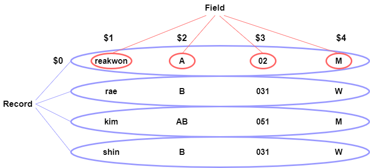

## Basic Terminal Commands

[[toc]]

### grep 
- 입력으로 전달된 파일의 내용에서 특정 문자열을 찾는 명령어
- 단순 문자열 매칭이 아닌 정규표현식에 의한 패턴 매칭 방식 사용
- grep 명령어 옵션

```sh
    grep [OPTION...] PATTERN [FILE...]
        -E        : PATTERN을 확장 정규 표현식(Extended RegEx)으로 해석.
        -F        : PATTERN을 정규 표현식(RegEx)이 아닌 일반 문자열로 해석.
        -G        : PATTERN을 기본 정규 표현식(Basic RegEx)으로 해석.
        -P        : PATTERN을 Perl 정규 표현식(Perl RegEx)으로 해석.
        -e        : 매칭을 위한 PATTERN 전달.
        -f        : 파일에 기록된 내용을 PATTERN으로 사용.
        -i        : 대/소문자 무시.
        -v        : 매칭되는 PATTERN이 존재하지 않는 라인 선택.
        -w        : 단어(word) 단위로 매칭.
        -x        : 라인(line) 단위로 매칭.
        -z        : 라인을 newline(\n)이 아닌 NULL(\0)로 구분.
        -m        : 최대 검색 결과 갯수 제한.
        -b        : 패턴이 매치된 각 라인(-o 사용 시 문자열)의 바이트 옵셋 출력.
        -n        : 검색 결과 출력 라인 앞에 라인 번호 출력.
        -H        : 검색 결과 출력 라인 앞에 파일 이름 표시.
        -h        : 검색 결과 출력 시, 파일 이름 무시.
        -o        : 매치되는 문자열만 표시.
        -q        : 검색 결과 출력하지 않음.
        -a        : 바이너리 파일을 텍스트 파일처럼 처리.
        -I        : 바이너리 파일은 검사하지 않음.
        -d        : 디렉토리 처리 방식 지정. (read, recurse, skip)
        -D        : 장치 파일 처리 방식 지정. (read, skip)
        -r        : 하위 디렉토리 탐색.
        -R        : 심볼릭 링크를 따라가며 모든 하위 디렉토리 탐색.
        -L        : PATTERN이 존재하지 않는 파일 이름만 표시.
        -l        : 패턴이 존재하는 파일 이름만 표시.
        -c        : 파일 당 패턴이 일치하는 라인의 갯수 출력.
```

- grep 사용 예제

```sh
$ grep [OPTION] [PATTERN] [FILE]

$ grep "User" robots.txt

결과 : User-agent: *
```

### awk
- 텍스트가 저장되어 있는 파일을 원하는 대로 필터링하거나 추가해주거나 기타 가공을 통해서 나온 결과를 행과 열로 출력해주는 명령어
- 언어라고 보면 될정도로 기능이 많다



- AWK에서 레코드가 $0, 그리고 $1,...$N은 필드를 나타내는 열을 나타낸다

#### test file

```sh
name    phone           birth           sex     score
reakwon 010-1234-1234   1981-01-01      M       100
sim     010-4321-4321   1999-09-09      F       88
nara    010-1010-2020   1993-12-12      M       20
yut     010-2323-2323   1988-10-10      F       59
kim     010-1234-4321   1977-07-17      M       69
nam     010-4321-7890   1996-06-20      M       75
```

#### awk 사용법

```sh
awk pattern {action} 
```

#### 열만 출력하기

```sh
$ awk '{ print $1 }' ./test.txt

name
reakwon
sim
nara
yut
kim
nam

$ awk '{ print $1, $2, $3 }' ./test.txt

name phone birth
reakwon 010-1234-1234 1981-01-01
sim 010-4321-4321 1999-09-09
nara 010-1010-2020 1993-12-12
yut 010-2323-2323 1988-10-10
kim 010-1234-4321 1977-07-17
nam 010-4321-7890 1996-06-20
```

#### 특정 패턴이 포함된 레코드 출력

```sh
$ awk '/rea/' ./test.txt

reakwon 010-1234-1234   1981-01-01      M       100
```

#### 출력에 추가 내용 첨가

```sh
$ awk '{ print ("name:" $1, "," "phone : " $2) }' ./test.txt

name:name ,phone : phone
name:reakwon ,phone : 010-1234-1234
name:sim ,phone : 010-4321-4321
name:nara ,phone : 010-1010-2020
name:yut ,phone : 010-2323-2323
name:kim ,phone : 010-1234-4321
name:nam ,phone : 010-4321-7890
```

#### if 문

```sh
$ awk '{ if ( $4 == "M" && $5 >= 80) print ($0) }' ./test.txt

reakwon 010-1234-1234   1981-01-01      M       100
```

#### 내장함수

```sh
$ awk '{ print ("name leng : " length($1), "substr(0,3) : " substr($1,0,3)) }' ./test.txt

name leng : 4 substr(0,3) : nam
name leng : 7 substr(0,3) : rea
name leng : 3 substr(0,3) : sim
name leng : 4 substr(0,3) : nar
name leng : 3 substr(0,3) : yut
name leng : 3 substr(0,3) : kim
name leng : 3 substr(0,3) : nam
```

#### 반복문

```sh
$ awk '{
for(i=0;i<2;i++)
 print( "for loop :" i "\t" $1, $2, $3)
}' ./test.txt

for loop :0	name phone birth
for loop :1	name phone birth
for loop :0	reakwon 010-1234-1234 1981-01-01
for loop :1	reakwon 010-1234-1234 1981-01-01
for loop :0	sim 010-4321-4321 1999-09-09
for loop :1	sim 010-4321-4321 1999-09-09
for loop :0	nara 010-1010-2020 1993-12-12
for loop :1	nara 010-1010-2020 1993-12-12
for loop :0	yut 010-2323-2323 1988-10-10
for loop :1	yut 010-2323-2323 1988-10-10
for loop :0	kim 010-1234-4321 1977-07-17
for loop :1	kim 010-1234-4321 1977-07-17
for loop :0	nam 010-4321-7890 1996-06-20
for loop :1	nam 010-4321-7890 1996-06-20
```

### sed
- Stream Editor의 약자
- 원본 텍스트 파일을 편집하는 명령어
- vi와 다른점은 명령어 형태로 편집이 돼서 vi처럼 실시간 편집이 아님
- 원본을 건드리지 않고 편집 (-i 옵션 넣으면 원본 변경)

```sh
$ sed -n -e 'command' [input file]
```

### lsof
- list of files의 약자로 시스템의 열린 파일 목록을 확인하는 명령어

### curl
- 서버에 데이터 전송 또는 조회를 위한 명령어
- 흔히 하는 그 curl

```sh
$ curl [options] [URL...]
```

### wget
- web get
- 네트워크 다운로더

```sh
$ wget [옵션]... [URL]...
```

### tail
- 로그보는 명령어

```sh
$ tail -n [라인 수] [파일 명]
```

### head
- 파일 앞부분 보여주는 명령어

```sh
$ head [옵션]... 파일명
```

### less
- 내용을 스크롤할 수 있도록 텍스트를 출력하는 명령어

### find
- 파일검색

### ssh
- sh 접속

### kill
- 프로세스 kill

### 참조
- [https://recipes4dev.tistory.com/157](https://recipes4dev.tistory.com/157)
- [https://reakwon.tistory.com/163](https://reakwon.tistory.com/163)
- [https://reakwon.tistory.com/164](https://reakwon.tistory.com/164)
- [https://bigsun84.tistory.com/295](https://bigsun84.tistory.com/295)
