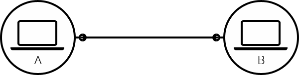

## How does the internet work?

[[toc]]

### 단순한 네트워크

- 두 개의 컴퓨터가 통신이 필요할 때, 우리는 다른 컴퓨터와 물리적으로 또는 무선으로 연결되어야 한다

- 이런 네트워크는 두 대의 컴퓨터로 제한되지 않아, 원하는 만큼의 컴퓨터를 연결할 수 있다. 
- 이럴 경우 10대의 컴퓨터를 연결하는 경우, 컴퓨터 당 9개의 플러그가 달린 45개의 케이블이 필요
- 매우 복잡해진다

- 이런 문제 해결을 위해 라우터에 연결
- 라우터는 특정 컴퓨터에서 보낸 메세지를 다른 컴퓨터로 올바르게 보내주는 역할을 한다
- 이럴 경우 10대의 컴퓨터에는 10개의 케이블만 필요

### 네트워크 속의 네트워크
- 수십대는 위의 방법으로 하면 되지만, 수천, 수억대의 컴퓨터를 연결하려면 어떻게 해야할까?
- 하나의 라우터로 수많은 컴퓨터 연결은 불가능하다
- 이런 문제를 해결하기 위해서 라우터끼리 연결을 하면 됨

- 또 다른 라우터끼리 또 연결이 가능하다

- 이런식으로..
- 이렇게 연결한 네트워크는 인터넷이라고 부르는 것에 가까워 져 직접적으로 연결된 라우터 통신은 접근이 가능해 지지만, 다른 집(아주 먼곳)은 접근이 불가능하다.
- 이런 문제를 해결하기 위해 이미 깔려있는 전화기 기반의 시설을 사용한다.
- 이 전화시설과 네트워크를 연결하려면 `모뎀`이 필요하다
- 모뎀은 네트워크 정보를 전화 시설에서 처리할 수 있는 정보로 바꾸고, 반대의 경우도 마찬가지로 처리한다.

- 이제 우리의 네트워크는 전화 시설에 연결되는데, 그 다음 단계인 우리의 네트워크에서 도달하려는 아주 먼 네트워크로 메세지를 보내는 것
- 이런 서비스를 제공하는게 ISP(Internet Service Provider)
- ISP는 모두 함께 연결되는 몇몇 특수한 라우터를 관리하고, 다른 ISP의 라우터에도 엑세스가 가능하다.
- 즉 아주아주 많은 동네 라우터랑 연결하는 큰 라우터라고 보면 이해하기 쉽다

### 컴퓨터 찾기
- 이제 이렇게 하나의 컴퓨터에서 다른 컴퓨터로 메세지를 보내려면, 특정 컴퓨터 지정이 필요하다
- 네트워크에 연결된 모든 컴퓨터에는 IP주소라는 고유한 주소가 존재한다
- 주소는 점으로 구분 된 네 개의 숫자로 구성된 주소 (ipv4, ipv6)
- 숫자로 구성된건 찾아가기가 어려워서 사람이 알아보기 쉬운 이름을 붙이는데 그게바로 DNS

### 참조
- [인터넷은 어떻게 동작하는가?](https://developer.mozilla.org/ko/docs/Learn/Common_questions/How_does_the_Internet_work)