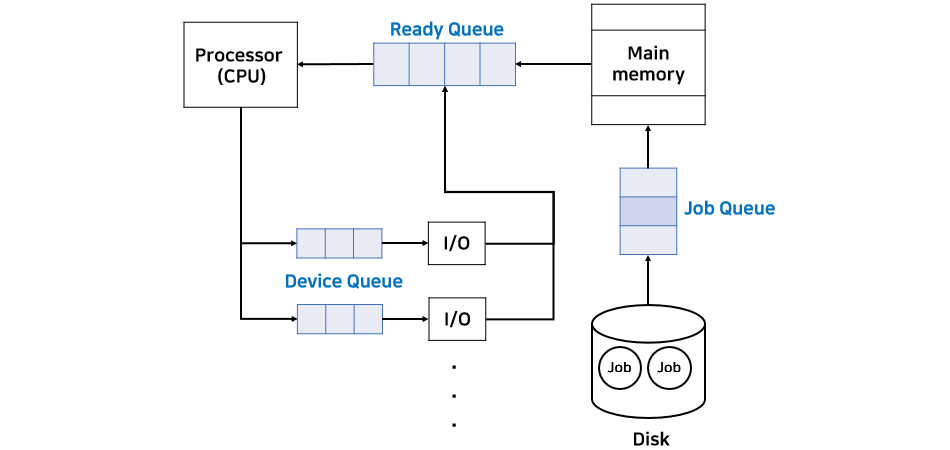

## Process Management

[[toc]]

### 1. 프로세스
- 메인 메모리에 할당되어 실행중인 상태인 프로그램

### 2. 프로세스 상태
- New : 프로그램이 메인 메모리에 할당
- Ready : 할당된 프로그램이 초기화 같은 작업 진행을 위한 준비
- Running : CPU가 해당 프로세스 실행
- Waiting : 프로세스가 끝나지 않은 시점에서 I/O로 인해 CPU를 사용하지 않고 다른 작업을 진행. 해당 작업이 완료되면 ready상태로 변경돼야 함
- Terminated : 프로세스 종료

### 3. PCB (Process Control Block)
- 프로세스에 대한 모든 정보가 모여 있는 곳
- 프로세스 상태, PID, program counter, register 값 등

### 4. 프로세스 큐
- 프로세스는 일반적으로 여러개가 한 번에 수행돼서 순서가 필요
- 그런 순서 대기를 넣는곳이 프로세스 큐
- 각 큐 내부에는 각 프로세스의 PCB가 저장되어 있다

