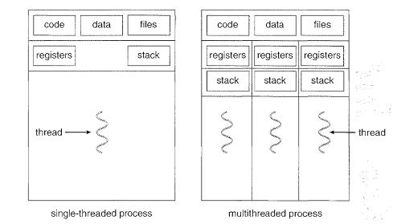

## Thread and Concurrency

[[toc]]

### 쓰레드란?
- 쓰레드는 CPU 스케쥴링의 기본단위 또는 프로세스 안에서의 흐름
- PC, 레지스터 집합, 스택 공간으로 이루어져 있어 프로세스와 유사하지만 오버헤드를 줄일 수 있도록 크기가 더 작다
- 각각의 스레드는 각자의 레지스터 상태와 스택을 가짐
- 하나의 프로세스 안에서도 여러 개의 스레드가 생성 될 수 있고, 프로세스를 위한 코드와 주소 공간 그리고 운영 자원을 공유 할 수 있다.
- 스레드는 작은 컨텍스트를 사용해 생성과 스위칭에 비용을 줄여준다

- 왼쪽의 싱글 스레드는 기존의 프로세스랑 동일하다
- 오른쪽의 멀티 스레드는 기존의 PCB보다 훨씬 작은, 여러개의 TCB (Thread Control Block)을 가지고, 공유된 데이터를 통한 통신이 더 쉽다.
- Context Switching도 쉬워진다

### 멀티 쓰레드 & 병렬

- 병행성 (병렬로 보임)
- 두 테스크는 병렬로 동시에 실행되는거 처럼 보여도 실제로 한 시점에 둘 중 하나의 테스크만 실행된다.
- 이런 방식은 싱글 프로세스에서 계산속도를 증가시켜주는데, 쓰레드별로 컨텍스트 스위칭이 가능하기 떄문

- 병렬성
- 코어가 여러개면 여러 개의 스레드가 동시에 수행된다
- 내부적으로 하나의 프로세스에서도 물론 여러개의 스레드 태스크가 동작됨

 

- 이런 구조는 병행성과 병렬성을 달성해서 효율이 좋아지는 장점이 있다
- 자원을 공유하고 경제적인 구조
- 결국 여러 개의 쓰레드를 사용하는 구조는 프로그램 실행 속도를 증가 시킬 수 있다

### 참조
- [https://velog.io/@ssseungzz7/OS-concurrency-and-thread](https://velog.io/@ssseungzz7/OS-concurrency-and-thread)