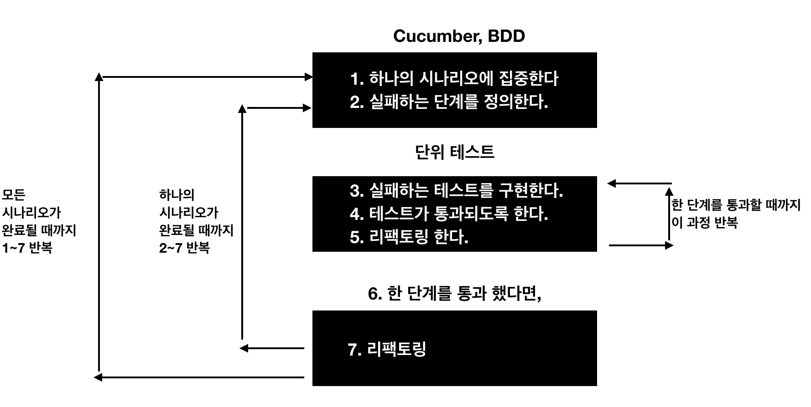

# 4강
[[toc]]

## 테스트 피라미드
- 테스트 단계는 단위테스트 -> 서비스 수준의 통합 테스트 -> 전체 시스템 테스트로 나눠진다.


- 위로 갈 수록 품질 측면에서 효과가 있지만, 에러가 발생했을 때 원인을 찾기가 어렵다.
- 테스트를 작성할 때, 위에서 부터 (전체시스템) 테스트 프로세스를 만들면 좋다.
- BDD 방법론으로, 스토리 기반으로 기능을 결정하고, 실패하는 케이스를 만들어 테스트를 진행한다.



- Gherkin과 같은 언어로 작성해 테스트를 작성한다.

```
기능 : 사용자인 내가 search 엔드 포인트를 호출하면 나는 새끼 고양이의 목록을 수신할 것이다.
```

```feature
Scenario : Invalid query(잘못된 요청)

Given I have no search criteria(검색 기준에 없는 경우에)
When I call the search endpoint(search 엔드 포인트를 호출하면)
Then I should receive a bad request message(잘못된 요청이라는 메세지를 받는다.)
```

### 단위 테스트
- 테스트의 세가지 법칙
    - 첫 번째 : 실제 코드를 작성하기 전에 실패하는 단위 테스트를 먼저 작성한다.
    - 두 번째 : 컴파일에 실패하지 않으면서 실패하기에 충분한 수준으로만 단위 테스트를 작성한다.
    - 세 번재 : 현재 실패하는 테스트를 통과할 수 있는 수준으로만 실제 코드를 작성한다.
- Go에서 마이크로서비스를 테스트하는 가장 효과적인 방법은 HTTP 인터페이스를 통해 모든 테스트를 실행하지 않는것.
- 단위 테스트를 통해 핸들러와 코드를 테스트를 한고, Cucumber 테스트와 연결해 테스트를 해 100퍼센트의 커버리지를 만든다.

```go
package main

import (
	"log"
	"net/http"
)

func main()  {
	err := http.ListenAndServe(":2323", &handlers.SearchHandler{})
	if err != nil {
		log.Fatal(err)
	}
}
```

- 이런식으로 main 함수에서 handlers를 별도의 패키지로 분리한다.
- 이런식으로 코드를 나누면 각 코드를 개별적으로 테스트할 수 있다.
- 테스트 파일의 규칙은 *_test.go 로 파일명을 적어야하고, 테스트 메소드 시그니쳐는 아래와 같이 작성한다.

```go
func TestXxx(*testing T)
```

- 실제 테스틐 코드를 작성 할 때 이름을 잘 짓는게 중요하다.
- 처음 테스트 코드는 검색 기준이 요청과 함께 전송이 됐는지 확인하는 테스트이다.

```go
func TestSearchHandlerReturnsBadRequestWhenNoSearchCriteriaIsSent(t *testing.T) {
    handler := SearchHandler{}
    request := httptest.NewRequest("GET", "/search", nil)
    response := httptest.NewRecorder()

    handler.ServeHTTP(response, request)

    if response.Code != http.StatusBadRequest {
        t.Errorf("Expected BadRequest got %v", response.Code)
    }
}
```

- net/http/httptest 패키지에는 NewRequest, NewRecorder라는 mock 객체를 사용할 수 있다.

#### http.NewRequest
- NewRequest 메소드는 서버로 들어오는 요청을 리턴하며 이걸 http.Handler에다가 전달할 수 있다.

```go
func NewRequest(method, target string, body io.Reader) *http.Request
```

#### http.NewRecorder
- ResponseRecorder 타입은 핸들러에 전달하는 ResponseWriter의 인스턴스가 된다.
- ResponseRecorder타입은 http.ResponseWriter를 구현한 것으로 프로그램의 모든 변화를 기록하므로, assert문을 작성할 수 있다.

```go
type ResponseRecorder struct {
    Code int // WriteHeader에 있는 HTTP 응답 코드
    HeaderMap http.Header // HTTP 응답 헤더
    Body *bytes.Buffer // nil이 아니라면, 응답에 쓰여있는 데이터가 추가될 bytes.Buffer

    Flushed bool
}
```

- 이제 가짜 요청과 가짜 응답으로 ServeHTTP 메소드를 호출하고, 정상적인 결과가 오는지 확인하면 된다.
- 핸들러에서 리턴된 응답 코드가 BadRequest인지 테스트를 하고, BadRequest 가 아니면 에러를 발생시킨다.
- 즉 위의 테스트 소스를 실행시키면, ServeHTTP에서 200이 떨어지므로, 테스트가 실패로 떨어지게 된다.
- 검색을 하는 값을 넣지 않으면 400에러를 넣어야되는데, 200이 발생함으로써 테스트가 실패하게된다. (초기 테스트 케이스만 만들면 당연히 실패)

```go
func (c *T) Errorf(format string, args ...interface{})
```

- 테스트 실행은 go -v -race ./... 로 한다.
- 실패하는 테스트를 가지고 테스트를 통과하기 위한 구현 코드를 작성한다.

```go
decoder := json.NewDecoder(r.Body)
defer r.Body.Close()

request := new(searchRequest)
err := decoder.Decode(request)
if err != nil {
    http.Error(rw, "Bad Request", http.StatusBadRequest)
    return
}
```

- 위의 소스를 돌려보면 request는 비어있어서, 400 에러를 뱉어내고, 테스트 코드가 통과하게 된다.
- 아래는 쿼리에 빈 문자열이 있는 요청을 전달하는 경우 실패하는지에 대한 테스트 코드이다.

```go
func TestSearchHandlerReturnsBadRequestWhenBlankSearchCriteriaIsSent(t *testing.T) {
    handler := SearchHandler{}
    data, _ := json.Marshal(searchRequest{})
    request := httptest.NewRequest("POST", "/search", bytes.NewReader(data))
    response := httptest.NewRecorder()

    handler.ServeHTTP(response, request)

    if (response.Code != http.StatusBadRequest) {
        t.Errorf("Expected BadRequest got %v", response.Code)
    }
}
```

- 위의 테스트는 200이 떨어지므로 실패한다.
- 이제 이 코드를 좀더 보기좋게 수정해보자

```go
func TestSearchHandlerReturnsBadRequestWhenBlankSearchCriteriaIsSent(t *testing.T) {
	r, rw, handler := setupTest(&searchRequest{})

	handler.ServeHTTP(rw, r)

	if rw.Code != http.StatusBadRequest {
		t.Errorf("Expected BadRequest got %v", rw.Code)
	}
}
```

- 두가지 테스트에서 공통으로 사용할 setup 메소드를 추가해 테스트소스를 리팩토링한다.
    - 설정(Setup)
    - 실행(Execute)
    - 단정(Assert)
- setup 부분을 따로 함수로 빼준다.
- 이제 ServeHTTP 함수에선, 쿼리 길이 체크 함수를 추가해 주면 된다.

```go
if err != nil || len(request.Query) < 1 {
    http.Error(rw, "Bad Request", http.StatusBadRequest)
    return
}
```

### 의존성 주입과 모의 객체 만들기
- Search 핸들러에서 항목을 리턴하는 테스트를 통과하려면 데이터 저장소가 필요하다.
- 인메모리 디비를 만들 수도 있고, 새로운 디비에 구현하던지간에 실제 디비에 연동하지 않고 테스트가 가능해야 한다.
- 이러한 이유로 테스트에서 핸들러를 대체할 수 있도록 핸들러의 종속성을 관리해야 한다.
- 이럴때 DI 를 사용해 외부에서 핸들러로 의존성을 전달해 준다.
- 이런 의존성 있는 코드를 스텁이나 mock 객체로 생성해야 한다.
- 예제에 새로운 인메모리 데이터 저장소를 생성한다.

```go
type Store interface {
    Search(name string) []kitten
}
```

- 간단하게 새끼 고양이의 목록을 슬라이스 타입으로 하드코딩하고, search 메소드는 매개 변수로 전달된 검색기준에 일치하는 이름이 있으면 선택해서 뱉어내준다.
- 만든 데이터 저장소를 핸들러에서 의존성을 연결해 주자.
- 간단하게 ServeHTTP 메소드를 구현한 Search 구조체에 의존성을 추가해 주면 된다.

```go
type Search struct {
	DataStore data.Store // 이런식으로 실제 ServeHTTP를 구현한 Search 구조체에 넣어주면, 의존성이 추가된다고 보면 된다.
}
```

- 구체화된 타입 대신에 인터페이스에 대한 참조를 사용하는 방식에 유의한다.
- 이렇게 인터페이스를 사용하면 Store 인터페이스를 구현하는 객체는 무엇이든 위 객체 대신 사용이 가능하다. -> 다형성
- 이제 이런 DataStore로 사용할 mock 객체를 만들어 준다.

```go
// MockStore는 테스트용 데이터 저장소의 모의 구현
type MockStore struct {
    mock.Mock
}

// Search 메소드
func (m *MockStore) Search(name string) []kitten {
    args := m.Mock.Called(name)

    return args.Get(0).([]kitten)
}
```

- MockStore 라는 구조체는 mock.Mock타입을 내부에 포함해서, 내장된 Mock을 통해 mick.Mock 구조체의 모든 메소드를 얻을 수 있다.
- 약간 자바의 의존성 설정처럼 List list = new ArrayList<>(); 를 하면, list에서 ArrayList 기능을 다 쓸수 있는 느낌이라고 보면 될듯

```go
func setupTest(d interface{}) (*http.Request, *httptest.ResponseRecorder, Search) {
	mockStore = &data.MockStore{}

	h := Search{
		DataStore: mockStore,
	}
	rw := httptest.NewRecorder()

	if d == nil {
		return httptest.NewRequest("POST", "/search", nil), rw, h
	}

	body, _ := json.Marshal(d)
	return httptest.NewRequest("POST", "/search", bytes.NewReader(body)), rw, h
}

```

- setup 소스

```go
func TestSearchHandlerCallsDataStoreWithValidQuery(t *testing.T) {
	r, rw, handler := setupTest(&searchRequest{Query: "Fat Freddy's Cat"})
	mockStore.On("Search", "Fat Freddy's Cat").Return(make([]data.Kitten, 0))

	handler.ServeHTTP(rw, r)

	mockStore.AssertExpectations(t)
}
```

- 테스트 설정을 하기위해, setupTest를 해주고, On 함수를 통해, 예상 값을 mock에다가 추가해 준다.
- On 사용시, Search를 매개 변수로 On을 호출하지않으면, 나중에 Search 메소드를 호출할 때 초기설정이 안됐는데 Search가 호출됐다고 에러가난다.
- 즉 명시적으로 특정 메소드를 호출했는지를 확인할 수 있다.
- 위의 예시에선, mockStore는 "Fat Freddy's Cat"이라는 파라미터로 Search메소드가 호출될 때 kitten 배열이 리턴되길 기대한다.
- 이런식으로 Mock을 활용하면 좋음

### 코드 커버리지
- 코드 커버리지는 작성중인 코드가 적절한 범위 내에 있는지 확인하기 위한 훌륭한 측정지표이다.

```
go test -cover ./...
```

- 결과는 다음과 같다.

```
go test -cover ./mocktest 

ok      github.com/gwegwe1234/go-in-action/chapter9/mocktest    0.013s  coverage: 0.0% of statements
```

- 간단한 테스트는 테스트 커버리지를 높일 수 있지만, 특정 디비에 연결하는 테스트같은건 모의 테스트를 짜는게 일반 소스 짜는거보다 더 오래걸리 수도 있다.
- 즉 실제 운영에서 테스트를 하는건 더 말이 안되고, 수동으로 테스트를 하는짓도 별로다.
- 이런 통합테스트는 Cucumber를 사용하면 아주 좋다.

```feature
# language: ko
기능: 오늘이 금요일 인가요?
  오늘이 금요일인지 확인하기 위해
  사용자는
  오늘이 금요일인지 질문한다

  시나리오 개요: 오늘은 금요일이거나 금요일이 아니다
    먼저 오늘은 "<요일>"이다
    만약 오늘이 금요일인지 묻는다면
    그러면 "<대답>"라고 대답할 것이다

    예:
      | 요일  | 대답  |
      | 월요일 | 그렇다 |
      | 화요일 | 아니오 |
      | 수요일 | 아니오 |
      | 목요일 | 아니오 |
      | 금요일 | 그렇다 |
      | 일요일 | 아니오 |
```

- Cucumber를 사용하면, 비 기술 분야의 사람들과의 대화로도 테스트 케이스 생성이 가능하다.
- go에서는 godog이라는 프레임워크를 사용한다.
- godog 명령어를 사용하면, 정의되지 않은 샘플 소스를 준다.
- 해당 소스를 수정해서 테스트 케이스를 작성

```go
package main

import (
	"flag"
	"fmt"
	"github.com/DATA-DOG/godog"
	"github.com/DATA-DOG/godog/colors"
	"os"
	"testing"
)

var opt = godog.Options{Output: colors.Colored(os.Stdout)}

func init() {
	godog.BindFlags("godog.", flag.CommandLine, &opt)
}

func TestMain(m *testing.M) {
	flag.Parse()
	opt.Paths = flag.Args()

	status := godog.RunWithOptions("godogs", func(s *godog.Suite) {
		FeatureContext(s)
	}, opt)

	if st := m.Run(); st > status {
		status = st
	}
	os.Exit(status)
}

func 오늘은_이다(day string) error {
	Today = day
	return nil
}

func 오늘이_금요일인지_묻는다면() error {
	Answer = "아니오"

	if Today == "금요일" {
		Answer = "그렇다"
	}
	return nil
}

func 라고_대답할_것이다(expectedAnswer string) error {
	if Answer != expectedAnswer {
		return fmt.Errorf("아니오라고 대답할 것이다")
	}
	return nil
}

func FeatureContext(s *godog.Suite) {
	s.Step(`^오늘은 "([^"]*)"이다$`, 오늘은_이다)
	s.Step(`^오늘이 금요일인지 묻는다면$`, 오늘이_금요일인지_묻는다면)
	s.Step(`^"([^"]*)"라고 대답할 것이다$`, 라고_대답할_것이다)
}
```

## 벤치마킹 및 프로파일링
### 벤치마크
- go test -bench -benchmem 을 실행해 벤치마크를 실행한다.

```
go test -bench=. -benchmem

goos: darwin
goarch: amd64
pkg: github.com/gwegwe1234/go-in-action/chapter9/benchmarking

BenchmarkSprintf-16     20000000                66.0 ns/op            16 B/op          2 allocs/op
BenchmarkFormat-16      1000000000               2.28 ns/op            0 B/op          0 allocs/op
BenchmarkItoa-16        1000000000               2.30 ns/op            0 B/op          0 allocs/op

PASS
ok      github.com/gwegwe1234/go-in-action/chapter9/benchmarking        6.447s
```

### 프로파일링
- 프로그램의 실행 속도를 살펴볼때 가장 좋은 방법은 프로파일링
- 프로파일링은 어플리케이션을 실행하는 동안 자동으로 샘플 데이터를 수집한다.
- 이후 특정 기능의 실행 시간과 같은 데이터를 프로파일이라는 통계 요약으로 계산할 수 있다.
- Go 는 3가지 유형의 프로파일링을 지원한다.
    - CPU: CPU 실행 시간을 가장 많이 필요로 하는 프로세스를 식별
    - 힙 : 가장 많은 메모리를 할당하는 구문을 식별
    - 블로킹 : Go 루틴이 가장 많이 대기하도록 하는 동작을 식별
- 프로파일링 시작방법
    - import "net/http/pprof" 추가
    - 프로파일링 수동으로 시작

```go
import _ "net/http/pprof"

go func () {
    log.Println(http.ListenAndServe("localhost:6060", nil))
}
```

- 위의 방법은 HTTP 서버의 /debug/pprof/에 URL을 통해 접근할 수 있는 다양한 경로를 노출한다.
- 단점으로는 import 문을 go 파일에 추가하면 어플리케이션이 느려지고, 프로파일 정보를 노출하고 싶지 않은 공용 서비스도 프로파일링을 하게된다.
- 몇가지 다른 방법으로는, 추가적인 커맨드 라인 플래그를 전달해 어플리케이션을 시작할 때 프로파일러를 시작한다.

```go
var cpuprofile = flag.String("cpuprofile", "", "write cpu profile to file")
var memprofile = flag.String("memprofile", "", "write memory profile to file")
var store *data.MongoStore

func main() {
	flag.Parse()

	if *cpuprofile != "" {
		fmt.Println("Running with CPU profile")
		f, err := os.Create(*cpuprofile)
		if err != nil {
			log.Fatal(err)
		}
		pprof.StartCPUProfile(f)
	}

	sigs := make(chan os.Signal, 1)
	signal.Notify(sigs, syscall.SIGINT, syscall.SIGTERM)

	go func() {
		<-sigs
		fmt.Println("Finished")
		if *memprofile != "" {
			f, err := os.Create(*memprofile)
			if err != nil {
				log.Fatal(err)
			}
			runtime.GC()
			pprof.WriteHeapProfile(f)
			defer f.Close()
		}
		if *cpuprofile != "" {
			pprof.StopCPUProfile()
		}

		os.Exit(0)
	}()
```

- pprof.StopCPUProfile() 를 사용해 프로파일러를 시작하고 이메소드에 파일에 대한 참조를 전달한다.
- CPU프로파일링을 활성하하는 함수이다.
- 힙같은 경우는 다음과 같이 한다.

```go
pprof.Lookup("heap").WriteTo(f, 0)
func Lookup(name string) *Profile
```

- 정확히 뭔질모르겠음.. pprof 도구를 사용하면 좀더 정확하게 CPU 사용이나 기타등등 점유율 같은걸 볼 수 있는거 같다.