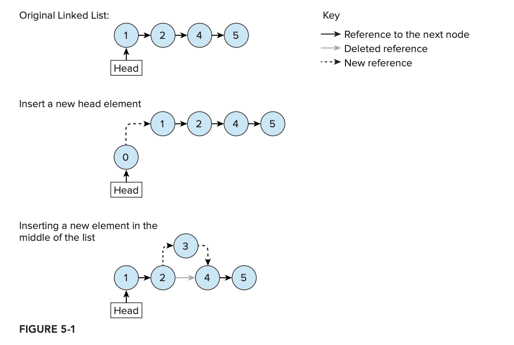
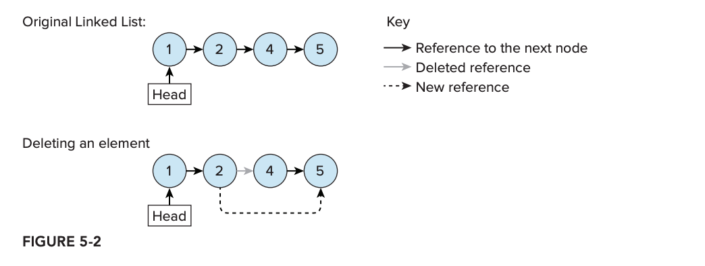
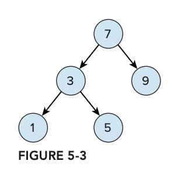
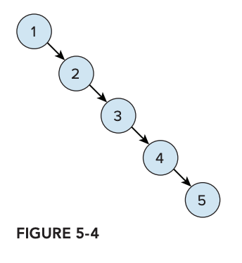
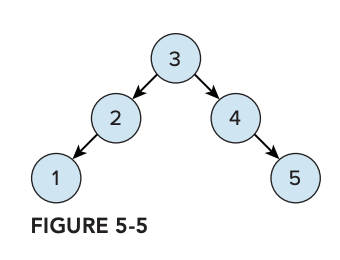
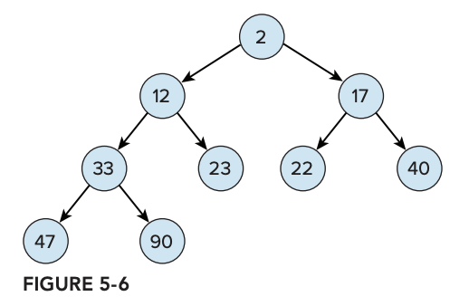
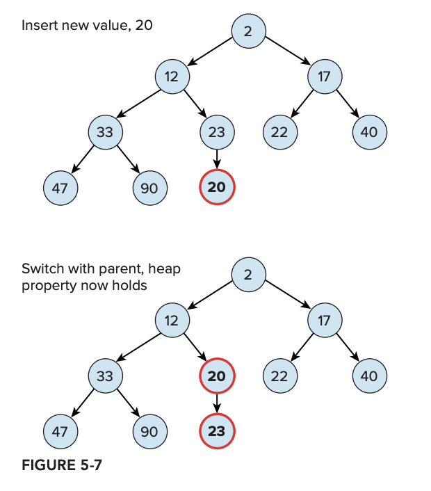
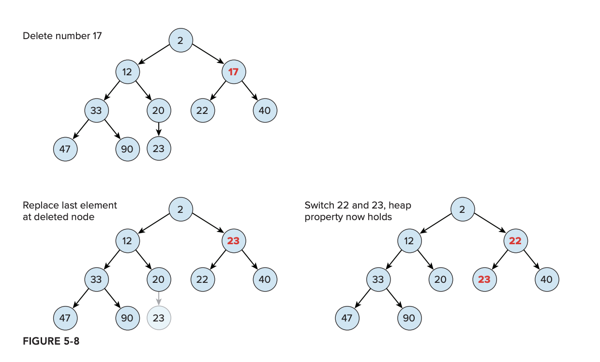
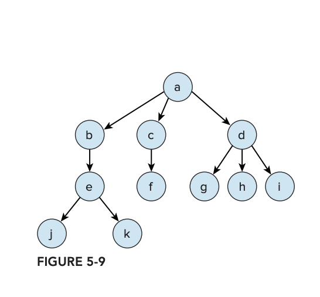
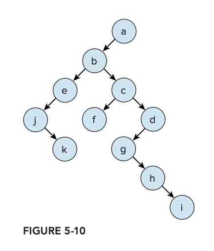

# 5강
[[toc]]
## 리스트
- 특정 값들이 순차적으로 정렬된 컬렉션
- 많이 사용하는건 LinkedList와 ArrayList
- 어떠한 리스트를 사용할 지는 상황에 맞춰서 골라야 한다
- 상황에 따라 더 적합한 리스트종류가 있으니 잘 고민해보자

## 배열과 리스트의 관계
- 리스트 구현 방법의 차이를 살펴보기 전에 배열이 어떻게 동작하는지 확인해보자

```java
@Test
public void arrayDefinitions() {
    final int[] integers = new int[3];
    final boolean[] bools = {false, true, true, false};
    final String[] strings = new String[] {"one", "two"};

    final Random r = new Random();
    final String[] randomArrayLength = new String[r.nextInt(100)];    
}
```

- 배열은 알다시피 크기를 정해줘야 쓸 수 있다.
- int 처럼 명시적으로 지정해도 되고, bools 처럼 암묵적으로 정해줘도 된다.
- 뭐가 됐건 배열은 JVM에서 돌리려면 반드시 사이즈를 알아야 한다.
- 인덱스 값으로 배열에 접근이 가능한데, 배열 주소값으로 찾아가는 형태
- 배열을 늘리는건 크기가 더 큰 배열을 만들어서 싹다 복사후에 바라보는 주소를 바꾸는 형태이다

```java
@Test
public void arrayCopy() {
    int[] integers = {0, 1, 2, 3, 4};

    int[] newIntegerArray = new int[integers.length + 1];
    System.arraycopy(integers, 0, newIntegersArray, 0, integers.length);
    integers = newIntegersArray;
    integers[5] = 5;

    assertEquals(5, integers[5]);
}
```

- 요렇게 재할당을 해주는 경우에 배열대신에 List 인터페이스를 사용할 수가 있다.
- ArrayList는 인덱스 값으로 바로 저장된 값을 찾기가 쉽다.
- ArrayList는 배열의 초기 크기를 지정 할 수 있다.
- 만약 꽉찬 ArrayList에 새로운 원소를 추가하면 ArrayList는 자동으로 더 큰 배열을 재할당 한다.
- 그래서 계속 늘려서 배열 메모리를 많이 먹느니, 처음부터 크게 잡는게더 나을 수도 있다.
- 만약 ArrayList 중간에 뭘 추가할라고하면, 또 새로 만들어야되서 매우 비효울적이다.
- 또한 ArrayList원소를 삭제한다고 배열 사이즈가 줄어드는 것도 아니다.
- 따라서 원소의 개수가 계속 변하는 리스트라면 LinkedList가 더 낫다

```java
public class SimpleLinkedList<E> {
    private static class Element<E> {
        E value;
        Element<E> next;
    }
    private Element<E> head;
}
```

- LinkedList 인스턴스는 Element라는 리스트의 첫 부분을 가리키는 head값만 참조한다.
- Element 클래스 내부엔 다음 원소를 가리키는 재귀타입의 next가 있어서, 리스트 사이에 넣고 빼고가 쉽다.



- 원소 추가 하는 방법



- 원소 빼는 방법

### 정리
- 리스트의 사이즈가 클수록 ArrayList가 더 효율적이다.
- ArrayList는 바로 인덱스에 접근이 가능해 조회가 얼마 안걸리지만 LinkedList는 전부다 순회해야 되서 조회가 오래걸린다.
- ArrayList는 값 추가하거나 빼는게 비효율적인 반면, LinkedList는 값 추가나 빼는게 효율적이다.

```java
Q1. Queue와 Deque 는 무엇인가?
```

- Queue는 선입 선출 자료구조를 구현한 자바 인터페이스 
- 새 원소를 추가하는 add 메소드, 오래된 원소를 제거하는 remove 메소드, 
가장 오래된 원소를 반환하지만 삭제는 안하는 peek 메소드가 있다.
- Deque는 Queue를 상속받았으며, 양끝에 원소 추가가 가능한 자료구조이다.
- LinkedList는 Deque를 구현한다.

```java
@Test
public void queueInsertion() {
    final Queue<String> queue = new LinkedList<>();
    queue.add("first");
    queue.add("sencod");
    queue.add("third");

    assertEquals("first", queue.remove());
    assertEquals("second", queue.remove());
    assertEquals("third", queue.peek());
    assertEquals("third", queue.remove());    
}
```

## 트리
- 트리는 자식(children) 이라고 불리는 원소를 많이 가진 나무구조형 자료구조이다.
- 기본사용은 이진트리 (binary tree)로, 이진트리는 하나의 부모노드가 두개의 자식노드를 갖는다.



- 이진 트리의 구현 중 하나로, 위의 그림과 같이 이진 검색 트리가 있다.
- 부모노드의 왼쪽 자식노드엔 작은값을, 오른쪽 자식 노드엔 큰값을 넣는다.

```java
public class SimpleTree<E extends Comparable> {
    private E value;
    private SimpleTree<E> left;
    private SimpleTree<E> right;
    ... // 생성자, 게터, 세터 
}
```

- 위의 소스를 보면, SimpleTree 클래스를 자식으로 갖는 재귀 타입이다.
#
- 이진트리를 검색하는 소스는 다음과 같다.

```java
public boolean search(final E toFind) {
    if (toFind.equals(value)) {
        return true;
    }

    if (toFind.compareTo(value) < 0 && left != null) {
        return left.search(toFind);
    }

    return right != null && right.search(toFind);
}
```

- 재귀형태로, 계속해서 맞는 값을 찾을 때까지 좌, 우 자식 노드를 찾는 형태이다.
#
- 트리 삽입 소스는 다음과 같다.

```java
public void insert(final E toInsert) {
    if (toInsert.compareTo(value) < 0) {
        if (left == null) {
            left = new SimpleTree<>(toInsert, null, null);
        } else {
            left.insert(toInsert);
        }
    } else {
        if (right == null) {
            right = new SimpleTree<>(toInsert, null, null);
        } else {
            right.insert(toInsert);
        }
    }
}
```

- 역시 재귀를 사용해서 알맞는 위치가 나올때 까지 타고 들어가서, 알맞은곳에 추가된다.
#
- null 객체로 트리구성을 하는 방법도 있다. leaf라는 개념을 사용한다.

```java
public interface Tree<E extends Comparable> {
    boolean search(E toFind);
    void insert(E toInsert);
}

public class Node<E extends Comparable> implements Tree<E> {
    ...

    @Override
    public boolean search(E toFind) {
        if (toFind.equals(value)) {
            return true;
        }
        if (toFind.compareTo(value) < 0) {
            return left.search(toFind);
        }

        return right.search(toFind);
    }
    ...
}

public class Leaf<E extends Comparable> implements Tree<E> {
    ...
    
    @Override
    public boolean search(E toFind) {
        return false;
    }

    ...
}
```

- 이런식으로, 트리의 끝까지 원소를 검색하다보면, Leaf 객체는 false를 반환하도록 짜준다.
- 비슷한 형식으로 새로운 노드객체로 Leaf 객체를 변경시키는 insert도 만들 수 있다.
- 여기서 문제가 되는 점은 불균형한 트리 모양이 나오는 경우가 생길 수 있다는 점이다.

```java
final SimpleTree<Integer> root = new SimpleTree<>(1, null, null);
root.insert(2);
root.insert(3);
root.insert(4);
root.insert(5);
```



- 위는 분명 이진 트리이지만, 연결리스트 마냥 모양새가 상당히 구리다.
#
- 그래서 초기에 나온 균형잡힌 이진 탐색 트리가 AVL트리 이다.
- AVL 트리는 어떤 노드든 모든 자식의 깊이 차이가 1을 넘지 않도록 만든다.
- 균형이 안맞으면 계속 삽입 / 삭제를 반복하며 균형이 이쁘게 되도록 맞춰준다.
- 검색 삽입 삭제할때 빅 오는 O(log n)이 걸린다.



#
- 이진트리는 검색 외에도 이진 힙 (binary heap)으로 쓰인다.
- 아래 트리는 자식노드가 부모노드보다 큰 속성을 갖도록 균형이 잡힌 트리이다.



- Comparator 객체로 특정 순서 비교하는 로직을 사용한다.
- 구현 시엔 가장 작은 원소를 트리의 최상단에 놓는다.
- 이럴 경우, 가작 작은 값에 접근하거나 할 때 매우 유용하다.
- 물론 이런 구조는 정렬할 땐 매우 구림
- 값을 삽입 할 땐, 트리의 가장 낮은 레벨에다가 넣고, 부모랑 비교해가면서 새값이 부모보다 더 클때 까지 교환한다.



- 힙을 순서가 있는 큐로 사용 될 때는, 힙에서 원소가 없어질 때도 많다.
- 그럴 경우에도 균형은 유지되어야 한다.



- 이진트리 말고 n-진 트리도 있다.



- 근데 가만 보면 이거도 2지트리로 바꿀 수 있다.



## 맵
- 키 밸류 형태의 저장 자료구조이다.
- 맵은 Map 인터페이스를 구현해서 사용한다.

### HashMap
- 키값을 통해 밸류를 찾는데, hashcode를 사용하여 찾는다.
- HashMap 클래스용 테이블에 값을 삽입하면, hashCode 메소드가 해당 값을 읽은다음,
int 범위 안에 유효한 값을 반환한다.
- 문제는 동일하지 않은 객체들이 같은 hashCode 메소드 값을 반환하는 상황이 있다는 점이다.
- 구조상으로 서로 다른 객체가 같은 해시 테이블에 들어가는 상황이 발생 할 수도 있기때문에
- 이런 문제를 해결하기 위해 두번째 해시 함수를 갖기도 하지만, 위치를 다시 계산하다보면 결국은 충돌 가능성이 있다.
- 그래서 나온 해결책이 각 테이블의 원소에 대한 값들의 리스트를 저장하고, 같은 테이블 인덱스와 연결되는 모든 테이블 키를 리스트의 값으로 추가하는 것이다.
- 죄다 돌면서 확인한다.
#
- 또한 테이블 크기에 따라 충돌 가능서이 다르다.
- HashMap 객체를 생성 할 때 부하계수를 명시하는데, 이 계수를 다 채우면 테이블 크기를 2배로 늘린다.
- 테이블 크기가 조정되면 모든 원소들이 전부다 재배치를 하게 되는데, 리소스를 많이 먹으니 처음부터 사이즈가 클 것 같으면 아예 HashMap을 크게 설정하자

### TreeMap
- 이진트리 자료구조를 이용한 키-밸류 자료구조이다.
- 트리의 각 노드가 키 - 밸류 쌍이 된다.
- 자연스런 순서로 정렬하려면 Comparable 인터페이스를 사용하고, 직접 순서를 결정하고 싶으면 Comparator 인터페이스를 이용하자
- TreeMap은 키를 정렬 가능한 순서에 따라 저장하기 때문에 hashCode 메소드는 사용하지 않는다.
- O(log n)

### HashMap? TreeMap?
- TreeMap은 순서가 보장되어 전체 컬렉션을 반복, 순회할 때 키의 순서가 보존되지만, HashMap은 순서따윈 없다

### LinkedHashMap
- 순서가 있는 HashMap

### ConcurrentHashMap
- 스레드 세이프하고, 값을 쓰는 도중에도 값을 읽어서 반환할 수 있다.

## 집합 (Set)
- 집합은 중복을 허용하지 않는 순서 없는 객체들의 모임

```java
@Test
public void setExample() {
    final Set<String> set new HashSet<>();
    set.add("hello");
    set.add("bye");
    set.add("hello");

    assertEquals(2, set.size())l
}
```

- 중복따윈 허용하지 않으므로 hello는 한번만 저장된다.
- HashSet은 HashMap 클래스 기반으로 구현되었으므로, 값을 맵 키로 저장한다.
- 저장된 값은 객체


