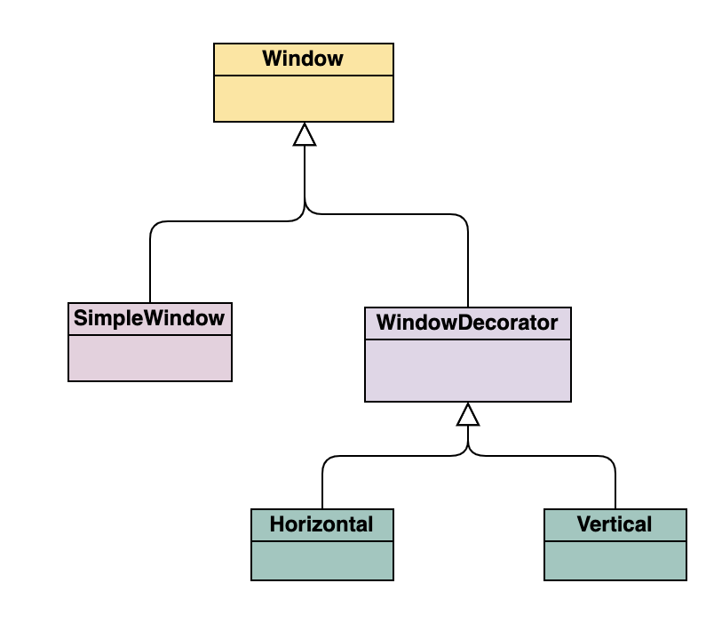

# 6강

[[toc]]

## 예제 패턴 살펴보기

### Q1. 빌더 패턴은 얼마나 유용한가?
- 필드의 갯수가 많을 경우, 생성자나 세터를 통해 값을 설정하는건 복잡하고 헷갈린다.

```java
public class Animal {
    private final String dog;
    private final String cat;
    private final String pig;
    ...
}
```

- 이런식으로 만들면 생성자의 인수로 너무 많이 들어가게 되서 복잡해진다.
- setter 를 사용해도 되는데, builder패턴을 사용하면 좀더 깔끔하다.

```java
public class BuilderVo {

  private String builderStringAttribute;
  private Integer builderIntAttriute;
  private Float builderFloatAttribute;

  public BuilderVo() {
  }

  public BuilderVo(String builderStringAttribute, Integer builderIntAttriute,
      Float builderFloatAttribute) {
    this.builderStringAttribute = builderStringAttribute;
    this.builderIntAttriute = builderIntAttriute;
    this.builderFloatAttribute = builderFloatAttribute;
  }

  public static class Builder {

    private String builderStringAttribute;
    private Integer builderIntAttriute;
    private Float builderFloatAttribute;

    public Builder withString(final String builderStringAttribute) {
      this.builderStringAttribute = builderStringAttribute;
      return this;
    }

    public Builder withInt(final Integer builderIntAttriute) {
      this.builderIntAttriute = builderIntAttriute;
      return this;
    }

    public Builder withFloat(final Float builderFloatAttribute) {
      this.builderFloatAttribute = builderFloatAttribute;
      return this;
    }

    public BuilderVo build() {
      if (builderStringAttribute == null ||
          builderIntAttriute == null ||
          builderFloatAttribute == null) {
        throw new IllegalStateException("Cannot create BuilderVo");
      }
      return new BuilderVo(builderStringAttribute, builderIntAttriute, builderFloatAttribute);
    }
  }
}
```

- Builder 클래스. 생성시에 인자가 하나라도 빠져 있으면 IllegalStateException을 던져준다.

```java
  @Test
  public void legalBuilderTest() {
    final Builder builder = new Builder();
    final BuilderVo builderVo = builder
        .withString("ABCD")
        .withInt(1234)
        .withFloat(1234.0F)
        .build();
  }

  @Test(expected = IllegalStateException.class)
  public void illegalBuilderTest() {
    final Builder builder = new Builder();
    final BuilderVo builderVo = builder
        .withString("ABCD")
        .withInt(1234)
        .build();
  }
```

- 실제 Builder로 객체를 생성 & 테스트하는 코드
- 특정 인자를 디폴트 값으로 설정도 가능하다.

```java
public class BuilderVoDefaultValue {

  private String builderStringAttribute;
  private Integer builderIntAttriute;
  private Float builderFloatAttribute;

  public BuilderVoDefaultValue() {
  }

  public BuilderVoDefaultValue(String builderStringAttribute, Integer builderIntAttriute,
      Float builderFloatAttribute) {
    this.builderStringAttribute = builderStringAttribute;
    this.builderIntAttriute = builderIntAttriute;
    this.builderFloatAttribute = builderFloatAttribute;
  }

  public static class Builder {

    private String builderStringAttribute = "Default Value";
    private Integer builderIntAttriute;
    private Float builderFloatAttribute;

    public Builder withString(final String builderStringAttribute) {
      this.builderStringAttribute = builderStringAttribute;
      return this;
    }

    public Builder withInt(final Integer builderIntAttriute) {
      this.builderIntAttriute = builderIntAttriute;
      return this;
    }

    public Builder withFloat(final Float builderFloatAttribute) {
      this.builderFloatAttribute = builderFloatAttribute;
      return this;
    }

    public BuilderVoDefaultValue build() {
      if (builderIntAttriute == null ||
          builderFloatAttribute == null) {
        throw new IllegalStateException("Cannot create BuilderVoDefaultValue");
      }
      return new BuilderVoDefaultValue(builderStringAttribute, builderIntAttriute,
          builderFloatAttribute);
    }
  }
}
```

```java
@Test
public void builderWithDefaultValueTest(){
  final BuilderVoDefaultValue.Builder builder = new BuilderVoDefaultValue.Builder();
  final BuilderVoDefaultValue builderVoDefaultValue = builder
      .withInt(1234)
      .withFloat(1234.0F)
      .build();
}
```

### Q2. 스트레티지 패턴의 예를 보여줄 수 있는가?
- 스트레티지 패턴은 지정된 알고리즘의 세부 구현을 변경할 필요 없이 쉽게 교환할 수 있게 해주는 디자인 패턴
- 실행 중이더라도 구현된 알고리즘은 교활할 수 있어서, DI에 자주 사용된다.

```java
// 콘솔 게임 인터페이스 작성
// 게임기를 키는 메소드와 게임기를 끄는 메소드를 추상화 한다.
public interface ConsoleGame {
  public void turnOnGameConsole();
  public void turnOffGameConsole();
}
```

```java
// 콘솔 게임 인터페이스를 구현한 Switch, Ps4 클래스 작성
public class Ps4 implements ConsoleGame {

  @Override
  public void turnOnGameConsole() {
    System.out.println("PS4 turned on");
  }

  @Override
  public void turnOffGameConsole() {
    System.out.println("PS4 turned off");
  }
}

public class Switch implements ConsoleGame {

  @Override
  public void turnOnGameConsole() {
    System.out.println("Switch turned on");
  }

  @Override
  public void turnOffGameConsole() {
    System.out.println("Switch turned off");
  }
}
```

```java
// 실제로 게임을 할 GamePlayer 클래스 작성
public class GamePlayer {

  private ConsoleGame consoleGame;

  public GamePlayer(ConsoleGame consoleGame) {
    this.consoleGame = consoleGame;
  }

  public void playGame() {
    consoleGame.turnOnGameConsole();
    System.out.println("게임을 한다.");
    consoleGame.turnOffGameConsole();
  }
}
```

- GamePlayer 생성자의 인자로 인터페이스로 구현한 ConsoleGame 자료형의 객체를 받아, 실제로 선언할 때 어떠한 콘솔 종류의 게임을 받을지 미룬다.

```java
public class StrategyPatternTest {

  @Test
  public void strategyPatternPs4Test() {
    ConsoleGame consoleGame = new Ps4();
    GamePlayer gamePlayer = new GamePlayer(consoleGame);
    gamePlayer.playGame();
  }

  @Test
  public void strategyPatternSwitchTest() {
    ConsoleGame consoleGame = new Switch();
    GamePlayer gamePlayer = new GamePlayer(consoleGame);
    gamePlayer.playGame();
  }
}
```

- 실제로 테스트를 한 결과
```java
PS4 turned on
게임을 한다.
PS4 turned off

Switch turned on
게임을 한다.
Switch turned off
```

- 이런 패턴의 장점은, 만약 새로운 게임기기 XBOX가 추가되면, 기존의 소스의 수정없이 ConsoleGame을 구현한 XBOX만 추가하면 쉽게 구현이 가능하다.


### Q3. 템플릿 메소드 패턴은 어떻게 사용하는가?
- 템플릿 메소드 패턴은 공통된 기능은 상위 클래스에서 구현하고, 나머진 다 하위 클래스에 위임하는 패턴이다.

```java
public class Stack {

  private final LinkedList<Integer> stack;

  public Stack() {
    stack = new LinkedList<>();
  }

  public Stack(final LinkedList<Integer> initialState) {
    this.stack = initialState;
  }

  public void push(final int number) {
    stack.add(0, number);
  }

  public Integer pop() {
    return stack.remove(0);
  }

  public Stack filter(final StackPredicate filter) {
    final LinkedList<Integer> initialState = new LinkedList<>();
    for (Integer integer : stack) {
      if (filter.isValid(integer)) {
        initialState.add(integer);
      }
    }
    return new Stack(initialState);
  }
}

public interface StackPredicate {

  boolean isValid(int i);
}
```

- Stack Class의 필터를 보면, 필터링을 하는 로직을 인터페이스에다가 분리해 놓았다.(공통기능)

```java
public class TemplateMethodPatternTest {

  private Stack stack;

  @Before
  public void createStack() {
    stack = new Stack();
    for (int i = 1; i <= 10; i++) {
      stack.push(i);
    }
  }

  @Test
  public void evenPredicate() {
    final Stack filtered = stack.filter(new StackPredicate() {
      @Override
      public boolean isValid(int i) {
        return (i % 2 == 0);
      }
    });
    assertEquals(Integer.valueOf(10), filtered.pop());
    assertEquals(Integer.valueOf(8), filtered.pop());
    assertEquals(Integer.valueOf(6), filtered.pop());
  }

  @Test
  public void allPredicate() {
    final Stack filtered = stack.filter(new StackPredicate() {
      @Override
      public boolean isValid(int i) {
        return true;
      }
    });
    assertEquals(Integer.valueOf(10), filtered.pop());
    assertEquals(Integer.valueOf(9), filtered.pop());
    assertEquals(Integer.valueOf(8), filtered.pop());
  }
}
```

- 실제 테스트 로직을 보면, isValid 메소드를 인터페이스에서 오버라이딩해 설정해줘서, 로직이 분리되어 있다. (공토된 기능..? 이라기엔 예시가 좀이상)

## 일반적으로 사용하는 패턴
### Q4. 데코레이터 패턴의 예를 설명할 수 있는가?
- 특정 객체의 기능을 설정하거나 변경할 수 있게 해준다.
- 특정 인터페이스를 구현한 클래스가 있을 때, 특정 기능들을 추가하기 위해 나온 패턴
- [위키피디아](https://ko.wikipedia.org/wiki/%EB%8D%B0%EC%BD%94%EB%A0%88%EC%9D%B4%ED%84%B0_%ED%8C%A8%ED%84%B4)
- 기 구현된 구조에서 새로운 기능을 추가 할 때, 중복적으로 추가하기 싫은 경우에 쓰기 좋다. -> 새기능 권한 위임
- 대표적인 예로는 InputStream, OutputStream이 있다.
- Window 예제 구현



```java
public interface Window {

  public void draw(); // draws the Window

  public String getDescription(); // returns a description of the Window
}
```

- 윈도우 인터페이스

```java
public class SimpleWindow implements Window {

  @Override
  public void draw() {
    System.out.println("Draw Simple Window");
  }

  @Override
  public String getDescription() {
    return "Simple Window";
  }
}
```

- 윈도우 인터페이스를 구현하는 실제 사용 객체인 SimpleWindow

```java
public class WindowDecorator implements Window {

  protected Window decoratedWindow; // the Window being decorated

  public WindowDecorator(Window decoratedWindow) {
    this.decoratedWindow = decoratedWindow;
  }

  @Override
  public void draw() {
    // draw window
  }

  @Override
  public String getDescription() {
    return "Window Decorator";
  }
}
```

- 윈도우에 새로운 데코레이션을 넣기위한 추상 클래스 추가

```java
public class HorizontalScrollBarDecorator extends WindowDecorator {

  public HorizontalScrollBarDecorator(Window decoratedWindow) {
    super(decoratedWindow);
  }

  public void draw() {
    drawHorizontalScrollBar();
    decoratedWindow.draw();
  }

  private void drawHorizontalScrollBar() {
    System.out.println("Draw Horizontal Scroll Bar");
  }

  public String getDescription() {
    return decoratedWindow.getDescription() + ", including horizontal scrollbars";
  }
}
```

```java
public class VerticalScrollBarDecorator extends WindowDecorator {

  public VerticalScrollBarDecorator(Window decoratedWindow) {
    super(decoratedWindow);
  }

  public void draw() {
    drawVerticalScrollBar();
    decoratedWindow.draw();
  }

  private void drawVerticalScrollBar() {
    System.out.println("Draw Vertical Scroll Bar");
  }

  public String getDescription() {
    return decoratedWindow.getDescription() + ", including vertical scrollbars";
  }
}
```

- 윈도우에 추가할 데코레이션 클래스들. 실제로 Window를 구현한 WindowDecorator를 상속받아서, 심플 윈도우에서 따로 소스 추가 없이 위의 데코 기능들을 추가 할 수 있다.

```java
@Test
public void decoratorPatternTest() {
  Window decoratedWindow = new HorizontalScrollBarDecorator(new VerticalScrollBarDecorator(
      new SimpleWindow()));
  decoratedWindow.draw();
  System.out.println(decoratedWindow.getDescription());
}

결과 : 
Draw Horizontal Scroll Bar
Draw Vertical Scroll Bar
Draw Simple Window
Simple Window, including vertical scrollbars, including horizontal scrollbars
```

### Q5. 플라이웨이트 패턴의 구현 방법을 설명할 수 있는가?
- 플라이웨이트 패턴은 몇 개의 객체에 많은 값을 공유해야 할 때 유용
- 이런 인스턴스들은 객체가 없어지지 않으면 해당 값들을 공유할 수 있다.

```java
public static Integer valueOf(int i) {
    if (i >= IntegerCache.low && i <= IntegerCache.high)
        return IntegerCache.cache[i + (-IntegerCache.low)];
    return new Integer(i);
}
```

```java
private static class IntegerCache {
        static final int low = -128;
        static final int high;
        static final Integer cache[];

        static {
            // high value may be configured by property
            int h = 127;
            String integerCacheHighPropValue =
                sun.misc.VM.getSavedProperty("java.lang.Integer.IntegerCache.high");
            if (integerCacheHighPropValue != null) {
                try {
                    int i = parseInt(integerCacheHighPropValue);
                    i = Math.max(i, 127);
                    // Maximum array size is Integer.MAX_VALUE
                    h = Math.min(i, Integer.MAX_VALUE - (-low) -1);
                } catch( NumberFormatException nfe) {
                    // If the property cannot be parsed into an int, ignore it.
                }
            }
            high = h;

            cache = new Integer[(high - low) + 1];
            int j = low;
            for(int k = 0; k < cache.length; k++)
                cache[k] = new Integer(j++);

            // range [-128, 127] must be interned (JLS7 5.1.7)
            assert IntegerCache.high >= 127;
        }

        private IntegerCache() {}
    }
```

```java
@Test
public void sameIntegerInstances() {
  final Integer a = Integer.valueOf(56);
  final Integer b = Integer.valueOf(56);

  assertSame(a,b);

  final Integer c = Integer.valueOf(472);
  final Integer d = Integer.valueOf(472);

  assertNotSame(c,d);
}
```

- Integer가 대표적인 플라이웨이트 패턴
- 캐시에서 설정된 범위에 있으면, 추가로 설정하지 않고 자원을 공유한다.
- 매번 new Integer를 해대지 말자

### Q6. 싱글톤 패턴은 어떻게 사용하는가?
- 싱글톤 패턴은 클래스가 오직 하나의 인스턴스만 생성하는 것을 보장하는 패턴
- 디비나 웹 서비스 등에서 해당 인스턴스에 접근할 수 있는 유일한 지점을 만드는데 사용

```java
public class Singleton {

  // 잘못된 예제
  private static Singleton INSTANCE;

  public static Singleton getInstance() {
    if (INSTANCE == null) {
      INSTANCE = new Singleton();
    }

    return INSTANCE;
  }

  public void singletonMethod() {
    // operations here
  }

  // 제대로 된 예제
  public enum SingletonEnum {
    ENUM;

    public void singletonMethod() {
      // operations here
    }
  }
}
```

- 잘못된 예제에선, getInstance에서 인스턴스 값이 null 이거나 if문 때문에 인스턴스가 초기화 되기 전에 스레드가 변경되거나 하면, 다른 스레드들이 getInstance를 호출하고, 계속해서 마구잡이로 생성하게 된다.
- enum을 사용하자