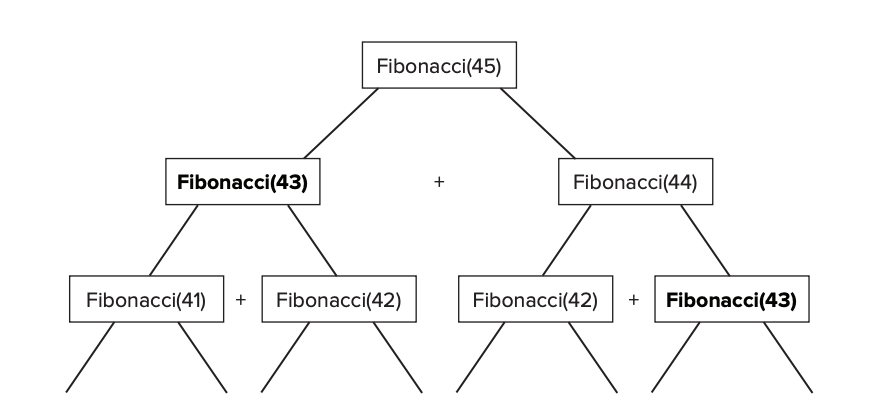

# 7강

[[toc]]

## FizzBuzz 구현하기
### Q1. 면접 문제
```
1에서 n까지의 숫자를 출력하되 3의 배수는 Fizz라는 문자열을 출력하고, 
5의 배수는 Buzz라는 문자열을 출력하고, 15의 배수는 FizzBuzz라는 문자열을 출력하는 알고리즘을 작성하라.
```

```java
import java.util.ArrayList;
import java.util.List;
import org.springframework.util.StringUtils;

public class FizzBuzz {

  // version1
  public static List<String> fizzBuzz(final int n) {
    final List<String> toReturn = new ArrayList<>();
    for (int i = 1; i <= n; i++) {
      if (i % 15 == 0) {
        toReturn.add("FizzBuzz");
      } else if (i % 5 == 0) {
        toReturn.add("Buzz");
      } else if (i % 3 == 0) {
        toReturn.add("Fizz");
      } else {
        toReturn.add(Integer.toString(i));
      }
    }

    return toReturn;
  }

  // version 2
  public static List<String> alternativeFizzBuzz(final int n) {
    final List<String> toReturn = new ArrayList<>();
    for (int i = 1; i <= n; i++) {
      final String word = toWord(3, i, "Fizz") + toWord(5, i, "Buzz");

      if (StringUtils.isEmpty(word)) {
        toReturn.add(word);
      } else {
        toReturn.add(word);
      }
    }

    return toReturn;
  }

  private static String toWord(final int divisor, final int value, final String word) {
    return value % divisor == 0 ? word : "";
  }
}
```

- 간단하게는 version1 처럼 짤 수 있지만, 추상화 단계까지 고려해서 2로 짜자.
- 15로 먼저 나눠줘야 경우의수가 최대한 줄어든다.

## 피보나치 수열 구현하기
### Q2. 면접문제
```
1에서 n까지의 피보나치 수열을 반환하는 메소드를 작성하라.
```

- 피보나치 수열은 두 개의 이전 값을 더한값이 다음 값이 되는 숫자 목록
- 첫 수는 0, 두번짼 1

```java
public static List<Integer> fibonacci(int n) {
    if (n < 0) {
      throw new IllegalArgumentException(
          "n must not be less than zero");
    }
    if (n == 0) {
      return new ArrayList<>();
    }
    if (n == 1) {
      return Arrays.asList(0);
    }
    if (n == 2) {
      return Arrays.asList(0, 1);
    }
    final List<Integer> seq = new ArrayList<>(n);
    seq.add(0);
    n = n - 1;
    seq.add(1);
    n = n - 1;
    while (n > 0) {
      int a = seq.get(seq.size() - 1);
      int b = seq.get(seq.size() - 2);
      seq.add(a + b);
      n = n - 1;
    }
    return seq;
  }
```

- 첫 줄에서 0보다 작은거 체크를 주의하자

```java
  @Test
  public void fibonacciList() {
    assertEquals(0, fibonacci(0).size());
    assertEquals(Arrays.asList(0), fibonacci(1));
    assertEquals(Arrays.asList(0, 1), fibonacci(2));
    assertEquals(Arrays.asList(0, 1, 1), fibonacci(3));
    assertEquals(Arrays.asList(0, 1, 1, 2), fibonacci(4));
    assertEquals(Arrays.asList(0, 1, 1, 2, 3), fibonacci(5));
    assertEquals(Arrays.asList(0, 1, 1, 2, 3, 5), fibonacci(6));
    assertEquals(Arrays.asList(0, 1, 1, 2, 3, 5, 8), fibonacci(7));
    assertEquals(Arrays.asList(0, 1, 1, 2, 3, 5, 8, 13), fibonacci(8));
  }
```

- 테스트!

### Q3. 면접 문제
```java
피보나치 수열의 n번째 값을 반환하는 메소드를 작성하라.
```

- 위의 피보나치의 변형문제로, n번째 값이 뭔지 찾아야 한다.
- 0 을 반환하면 0을 반환하고, 1을 입력하면 1, 2를 입력하면 1.. 이런식으로 반환
- 앞에서 구현한 메소드를 호출해서 마지막값을 찾는 방법이 있지만, 메모리 터져버림
- 재귀를 사용해보자

```java
Fibonacci(n) = Fibonacci(n-1) + Fibonacci(n-2)
```

```java
public static int fibN(int n) {
    if (n < 0) {
      throw new IllegalArgumentException("n must not be less than zero");
    }
    
    if (n == 1) {
      return 1;
    } 
    
    if (n == 0) {
      return 0;
    }
    
    return (fibN(n - 1) + fibN(n - 2));
  }
```

- 매우 깔끔하지만, 엄청나게 비효율적이다.
- 하나의 값을 찾기위해 동일한 값을 찾는 짓을 계속한다.



- map을 활용해 캐싱을 해서 찾자

```java
private Map<Integer, Integer> fibCache = new HashMap<>();

  public int cachedFibN(int n) {
    if (n < 0) {
      throw new IllegalArgumentException(
          "n must not be less than zero");
    }
    fibCache.put(0, 0);
    fibCache.put(1, 1);
    return recursiveCachedFibN(n);
  }

  private int recursiveCachedFibN(int n) {
    if (fibCache.containsKey(n)) {
      return fibCache.get(n);
    }
    int value = recursiveCachedFibN(n - 1) + recursiveCachedFibN(n - 2);
    fibCache.put(n, value);
    return value;
  }
```

- 이런식으로 호출의 결과를 다시 계산하는 걸 줄이려고 계산 결과를 저장해 캐시해두는 것을 메모리제이션 이라고 한다.

## 팩토리얼 구현하기
### Q4. 면접 문제
```
재귀적 방법을 사용하지 않는 팩토리얼 구현을 작성하라
```

```java
public static long factorial(int n) {
    if (n < 1) {
      throw new IllegalArgumentException("n must be greater than zero");
    }

    long toReturn = 1;
    for (int i = 1; i <= n; i++) {
      toReturn *= i;
    }

    return toReturn;
}
```

## 라이브러리 기능 구현하기
### Q5. 면접 문제
```
주어진 단어의 목록에서 특정 단어에 대한 전체 애너그램 목록을 반환하는 알고리즘을 작성하라
```

- 애너그램은 철자를 재별해서 새로운 단어를 만드는 장난짓거리

```java
public class Anagrams {

  final Map<String, List<String>> lookup = new HashMap<>();

  public Anagrams(final List<String> words) {
    for (final String word : words) {
      final String signature = alphabetize(word);
      if (lookup.containsKey(signature)) {
        lookup.get(signature).add(word);
      } else {
        final List<String> anagramList = new ArrayList<>();
        anagramList.add(word);
        lookup.put(signature, anagramList);
      }
    }
  }

  private String alphabetize(final String word) {
    final byte[] bytes = word.getBytes();
    Arrays.sort(bytes);
    return new String(bytes);
  }

  public List<String> getAnagrams(final String word) {
    final String signature = alphabetize(word);
    final List<String> anagrams = lookup.get(signature);
    return anagrams == null ? new ArrayList<String>() : anagrams;
  }
}
```

- 서명을 키로 맵에다가 해당 서명에 맞는 목록들을 저장하고, 실제로 찾을때 해당 서명에 맞는 아나그램 목록들을 찾아다준다. 

### Q6. 면접 문제
```
문자열을 뒤집기 위한 메소드를 작성하라
```

```java
public static String reverse(final String s) {
    final StringBuilder builder = new StringBuilder(s.length());
    for (int i = s.length() - 1; i >= 0; i--) {
      builder.append(s.charAt(i));
    }
    return builder.toString();
  }

  public static String inPlaceReverse(final String s) {
    final StringBuilder builder = new StringBuilder(s);
    for (int i = 0; i < builder.length() / 2; i++) {
      final char tmp = builder.charAt(i);
      final int otherEnd = builder.length() - i - 1;
      builder.setCharAt(i, builder.charAt(otherEnd));
      builder.setCharAt(otherEnd, tmp);
    }
    return builder.toString();
  }
```

- 스트링 빌더를 사용하자

### Q7. 면접문제
```
연결 리스트의 위치를 어떻게 뒤집을 수 있을까?
```

```java
public static <T> LinkedList<T> reverse(final LinkedList<T> original) {
    if (original == null) {
      throw new NullPointerException("Cannot reverse a null list");
    }
    if (original.getNext() == null) {
      return original;
    }
    final LinkedList<T> next = original.next;
    original.next = null;
    final LinkedList<T> othersReversed = reverse(next);
    next.next = original;
    return othersReversed;
  }
```

- 재귀를 사용한다.

### Q8. 면접 문제
```
단어가 팰린드롬인지 어떻게 확인할 수 있을까?
```

- 팰린드롬은 뒤집어도 같은단어 eve 같은

```java
public static boolean isPalindrome(final String s) {
    final String toCheck = s.toLowerCase();
    int left = 0;
    int right = toCheck.length() - 1;
    while (left <= right) {
      while (left < toCheck.length() &&
          !Character.isLetter(toCheck.charAt(left))) {
        left++;
      }
      while (right > 0 && !Character.isLetter(toCheck.charAt(right))) {
        right--;
      }
      if (left > toCheck.length() || right < 0) {
        return false;
      }
      if (toCheck.charAt(left) != toCheck.charAt(right)) {
        return false;
      }
      left++;
      right--;
    }
    return true;
  }
```