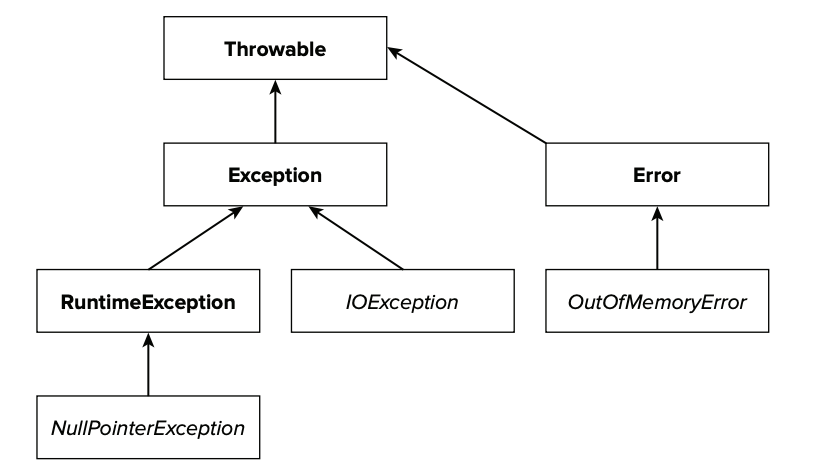
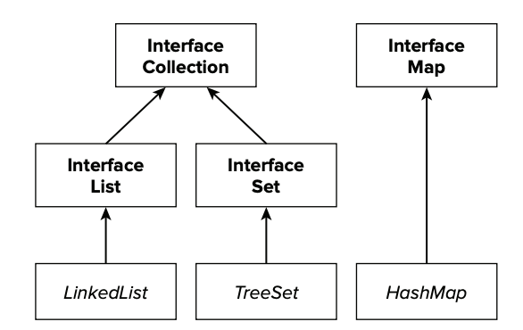

# 8강

[[toc]]

## 원시 타입
### Q1. 몇 가지 자바 원시 타입의 이름을 지정하고 이 타입이 JVM에서 어덯게 처리되는지 설명하라

- Boolean, int, double 같은 기본타입은 원시(primitive) 타입
- 원시 타입은 null이 될 수 없어, 객체와 같은 참조 타입과는 다른 방식으로 다룬다. 
- 원시 타입의 종류와 크기 표

| 타입 | 크기|
| --- | --- |
| boolean | 1 |
| short | 16 |
| int | 32 |
| long | 64 |
| float | 32 |
| double | 64 |
| char | 16 |

- 원시 타입을 정의할 때 값이 할당되지 않으면 기본값으로 지정된다
- 필요한 경우엔 원시 타입을 적절한 타입으로 변환도 가능

```java
// 상위 개념 타입으로 암시적으로 타입 변환
int value = Integer.MAX_VALUE;
long biggerValue = value + 1;
```

- char를 제외하곤 컴파일러에서 자동으로 형변환을 해준다.

```java
// 하위 타입으로 명시적으로 타입 변환하기
long veryLargeNumber = Long.MAX_VALUE;
int fromLargeNumber = (int) veryLargeNumber;
```

- 보통 이런식으로 하위타입으로의 변환은 잘 안한다. 값이 변할 가능성이 있음

### Q2. 왜 Integer.MIN_VALUES에 대응하는 양수가 없는가?
- 보수 표현때문에 오버플로우가 발생한다

| 10진수 표현 | 2진수 표현 |
| --- | --- |
| 0 | 0000 0000 |
| 1 | 0000 0001 |
| 2 | 0000 0010 |

- 양수는 이렇게 표현하지만, 음수는 최상위 비트가 1이고, 나머지로 값을 측정한다.

| 10진수 표현 | 2진수 표현 |
| --- | --- |
| -1 | 1111 1111 |
| -2 | 1111 1110 |
| ... | ... |
| -127 | 1000 0001 |
| -128 | 1000 0000 |

- 음수에서 양수로 부호를 바꾸려면 모든 비트를 0 <-> 1 을 한 후 1을 더해줘야 한다.
- 그렇게 보면 가장 작은값인 -128은 뒤집고 더하면 0000 0000 가 되서 원하는 값이 안나오게 된다
- 이런경우가 *오버플로우*

```java
@Test
public void absoluteOfMostNegativeValue() {
    final int mostNegative = Integer.MIN_VALUE;
    final int negated = Math.abs(mostNegative);
    Assert.assertFalse("민밸류 절대값따윈 없다", negated > 0);
}
```

## 객체 이용하기
### Q3. 자바에서 객체란 무엇인가?
- 원시 타입을 제외하면 모든 변수들은 참조 타입 -> 객체
- 객체는 원시타입과는 다르게 null이 존재
- 변수에 null 설정이나 null 반환은 가능하지만, null에 대한 참조는 불가능

```java
@Test(expected = NullPointerException.class)
  public void expectNullPointerExceptionToBeThrown() {
    final String s = null;
    final int stringLength = s.length();
}
```

- 원시타입 같은 경우, int i = 30 처럼 선언되면 메모리에 직접 30이라는 값이 할당 된다.
- int j = i 에 값을 넣어주면 i에 할당된 값은 변화가 없이, j는 새로운 메모리에 30이라는 값이 다시 할당된다.
- 즉 j 할당 이후 j값이 변해도 i와는 전혀 상관이 없다.

```java
@Test
  public void callByValueTest() {
    int i = 10;
    int j = i;
    j = j + 10;
    Assert.assertEquals(10, i);
    Assert.assertEquals(20, j);
}
```

- List myList = new ArrayList(20) 같은 구문으로 생성하면, myList 객체를 변수에 할당할 때 해당 리스트는 메모리 위치를 가리킨다.
- 즉 값이 아닌 참조하는 주소값을 연결해 주는 형태여서 List myList2 = myList 를 하게되면 같은 객체를 가르키게 된다.
- 둘 중 하나의 값이 변하면 둘다 영향을 받음

```java
@Test
  public void callByReference() {
    List<String> myList = new ArrayList<>();
    myList.add("테스트 값");
    Assert.assertTrue(myList.size() == 1);

    List<String> myList2 = myList;
    myList2.add("두번째 테스트 값");
    Assert.assertTrue(myList.size() == 2);
}
```

### Q4. final 키워드는 객체 참조에 어떤 영향을 미치는가?
- 객체에 선언하는 final 키워드는 원시 타입에 선언하는 final 키워드와 동일한 역할을 한다.
- 즉 변수 정의에서 지정된 값처럼 한번 할당되면, 메모리 위치 변경이 불가능
- 하지만 객체 내부의 값들은 final 선언된게 아니면 개별적으론 변경이 가능

```java
@Test
  public void finalReferenceTest() {
    final int i = 42;
    i = 43; // 컴파일 에러 발생
    
    final List<String> list = new ArrayList<>();
    list = new ArrayList<>(); // 컴파일 에러 발생
}
```

### Q5. 객체의 가시성 수정자는 어떻게 작동하는가?
- 가시성 수정자(visibility modifier)는 클래스의 캡슐화된 상태와 인스턴스 행동을 조정하는 메소드의 접근을 제어하는 역할을 한다

| 가시성 | 수정자 | 범위 |
| --- | --- | --- |
| Least | private | 같은 클래스의 모든 인스턴스에서 접근 가능. 하위 클래스에서는 접근 불가능 |
| Least | < none > = default | 같은 패키지의 모든 클래스에서 접근 가능 |
| Least | protected | 모든 하위 클래스에서 접근 가능 |
| Most | public | 어디서든 접근 가능 |

### Q6. 메소드와 변수에 사용되는 static 키워드의 역할은 무엇인가?
- 정적 메소드와 정적 변수는 클래스 내부에 정의하지만 인스턴스에는 속하지 않는다.
- 보통 클래스 이름을 통해 정적 메소드, 변수에 접근한다

```java
@Test
  public void staticTest() {
    Assert.assertEquals(10, StaticExample.staticValue );
    StaticExample staticExample = new StaticExample();
    StaticExample staticExample1 = new StaticExample();

    staticExample.staticValue = 100;

    Assert.assertEquals(100, staticExample1.staticValue );
}
```

### Q7. 다형성과 상속이란 무엇인가?
- 다형성은 행동의 특정 타입에 대한 정의를 만들 수 있고, 행동을 구현하는 수많은 다른 클래스들을 갖게 한다.
- 상속은 부모 클래스에서 클래스의 행동과 정의를 가져다 사용할 수 있게 해준다.

```java
public class Rectangle {

  private int weight;
  private int height;

  public Rectangle() {

  }

  public Rectangle(final int weight, final int height) {
    this.weight = weight;
    this.height = height;
  }

  public int area() {
    return weight * height;
  }
}

public class Square extends Rectangle {

  public Square(int sideLength) {
    super(sideLength, sideLength);
  }
}
```

```java
@Test
  public void ineritanceTest() {
    List<Rectangle> list = new ArrayList<>();
    list.add(new Rectangle(5, 1));
    list.add(new Rectangle(4, 3));
    list.add(new Square(9));

    Assert.assertEquals(list.get(0).area(), 5);
    Assert.assertEquals(list.get(1).area(), 12);
    Assert.assertEquals(list.get(2).area(), 81);

}
```

### Q8. 객체의 일부 메소드가 오버라이드되었을 때 어떻게 사용되는지 설명하라
- equals와 hashCode 메소드를 생각하면 된다
- equals는 두 객체가 동일한 위치를 가르키는지 확인하고, hashCode는 해쉬값을 던진다.
- 보통 equals는 hashCode로 같은지 비교한다

```java
public class Game {

  private final String name;
  private final int version;

  public Game(String name, int version) {
    this.name = name;
    this.version = version;
  }

  @Override
  public int hashCode() {
    return name.hashCode() * version;
  }
}
```

```java
@Test
  public void wrongSetBehavior() {
    final Set<Game> people = new HashSet<>();

    final Game game1 = new Game("Archer", 3);
    final Game game2 = new Game("Archer", 3);

    Assert.assertNotEquals(game1, game2);
  }
```

- equals와 hashCode는 같이 구현해야한다.
- 위의 예제는 두 객체가 같아보이지만, 실제로 주소값이 달라 같지 않다.

## 자바 배열
### Q9. 자바에서 배열을 어떻게 표현하는가?
- 자바 배열에서 중요한 점은 배열을 객체로 취급한다는 것
- 배열은 toString() 메소드를 호출할 수도 있는 등 다양하게 활용이 가능하다.

```java
@Test
  public void arraysAsObjects() {
    Map<String, Object> mapping = new HashMap<>();
    mapping.put("key", new int[]{0,1,2,3,4,5}); // 배열도 객체로 취급받는다
    Assert.assertTrue(mapping.get("key") instanceof int[]);
  }
```

- 배열이 객체라는 소리는 참조로 전달될 수 있다는 뜻

```java
@Test
  public void arrayReference() {
    final int[] myArray = new int[]{1,2,3,4,5,6};
    int[] arrayReference2 = myArray;

    arrayReference2[5] = 99;
    Assert.assertTrue(myArray[5] == 99);
}
```

## String 이용하기
### Q10. String은 메모리에 어떻게 저장되는가?

```java
public final clas String implements java.io.Serializable, Comparable<String>, CharSequence {
    private final char[] value;
    ...
} 
```

- String 정의를 살펴보면 char배열로 이루어진 걸 알 수 있다.
- JVM과 컴파일러는 특정 상황에서 특별한 방법으로 String 객체를 처리한다.
- String 객체는 원시타입마냥 취급하낟. 따라서 new 키워드로 생성할 필요가 없다.
- 실제 컴파일 시에 ""로 선언된 String은 String 객체로 생성된다.

```java
@Test
  public void arrayReference() {
    String hello1 = new String("Hello World!");
    String hello2 = "Hello World!";

    Assert.assertEquals(hello1, hello2);
  }
```

### Q11. String 객체의 값을 변경할 수 있는가?
- String 클래스에서 String 객체의 값을 변경하는거처럼 보이는건 실제론 String 인스턴스를 반환하는 것
- 즉 절대 안바뀌고 새로 생성한다는 소리
- 장점으로는 스레드가 안전하다는 점이 있다.
- Integer, Double, Character, BigInteger 도 String과 마찬가지로 불변 객체이다.

### Q12. 인터닝이랑 무엇인가?
- String 리터럴은 실행할 때 JVM이 특별히 관리한다.
- 클래스가 JVM에 로드되면 모든 리터럴이 상수 풀에 위치한다.
- String 리터럴의 모든 반복은 풀 안의 같은 상수를 참조해서 이루어지는데, 이를 String Interning 이라고 한다.
- 즉 메모리를 아끼기위해 동일한 값(char 배열)을 갖는 경우엔 String pool에서 갖고오는 것
- Integer의 valueOf랑 비슷
- [링크](http://seosh81.info/?p=739)

## 제네릭 이해하기
### Q13. 컬렉션 API에서 제네릭을 어떻게 사용하는지 설명하라

- 제네릭은 '매개변수화된 타입' 이라고도 알려져 있다
- 대표적으로 List같은 컬렉션에서 사용한다.

```java
  private List authors;

  public class Author {
    private final String name;

    private Author(final String name) {
      this.name = name;
    }

    public String getName() {
      return name;
    }
  }

  @Before
  public void createAuthors() {
    authors = new ArrayList();

    authors.add(new Author("Park"));
    authors.add(new Author("Lee"));
    authors.add(new Author("Kim"));
  }

  @Test
  public void authorListAccess() {
    final Author author = (Author) authors.get(2);
    Assert.assertEquals(author.getName(), "Kim" );
  }
```

- authors는 따로 제네릭<> 안에다가 제한을 두지 않아서 Object형으로 리턴을 한다.
- 정확하게 형을 전환하기 위해선 소스의 수정이 필요하다

```java
  private List<Author> authors;

  public class Author {
    private final String name;

    private Author(final String name) {
      this.name = name;
    }

    public String getName() {
      return name;
    }
  }

  @Before
  public void createAuthors() {
    authors = new ArrayList();

    authors.add(new Author("Park"));
    authors.add(new Author("Lee"));
    authors.add(new Author("Kim"));
  }

  @Test
  public void authorListAccess() {
    final Author author = authors.get(2);
    Assert.assertEquals(author.getName(), "Kim" );
  }
```

### Q14. 주어진 Stack 클래스의 API가 제네릭을 사용하도록 수정하라

```java
public class Stack {
  private final List values;

  public Stack() {
    values = new LinkedList();
  }

  public void push(final Object object) {
    values.add(0, object);
  }

  public Object pop() {
    if (values.size() == 0) {
      return null;
    }

    return values.remove(0);
  }
}
```

- 첫번째로 Stack 클래스는 매개변수화 타입을 얻도록 선언이 필요

```java
public class GenericStack<E> {
    ...
```

- List 클래스도 제너릭으로 선언해 준다

```java
private final List<E> values;
```

- 이제 Push 메소드도 Object가 아닌 제너릭 타입을 받아야 한다

```java
public void push(final E element) {
    values.add(0, element);
}
```

- 생성자도 제너릭으로

```java
public GenericStack() {
    values = new LinkedList<E>();
}
```

- pop의 리턴타입도 제너릭으로

```java
public E pop() {
    if (values.size() == 0) {
      return null;
    }

    return values.remove(0);
}
```

### Q15. 타입의 변화는 제네릭에 어떻게 영향을 미치는가?

```java
class Rectangle;
class Square extends Rectangle;
```

- 두개의 상속관계 클래스가 있을 때 Rectangle을 받는 pushAll을 구현하면

```java
public static GenericStack<Rectangle> pushAll(final List<Rectangle> listOfRectangle) {
    final GenericStack<Rectangle> stack = new GenericStack<>();
    for (Rectangle r : listOfRectangle) {
      stack.push(r);
    }

    return stack
}
```

- 이럴 경우 테스트코드로 Rectangle을 넣으면 아주 잘된다.

```java
@Test
public void usePushAll() {
    final ArrayList<Rectangle> list = new ArrayList<>();
    for (int i = 0; i < 10; i++) {
      list.add(new Rectangle());
    }

    final GenericStack<Rectangle> genericStack = GenericStack.pushAll(list);

    Assert.assertNotNull(genericStack.pop());
}
```

- 하지만 Rectangle을 상속받은 Square로 테스트 코드 작성시 제대로 작동을 안한다

```java
@Test
public void usePushAllWithSquare() {
    final ArrayList<Square> list = new ArrayList<>();
    for (int i = 0; i < 10; i++) {
      list.add(new Square(3));
    }

    final GenericStack<Rectangle> genericStack = GenericStack.pushAll(list);

    Assert.assertNotNull(genericStack.pop());
}
```

- GenericStack.pushAll(list); 이 부분에서 컴파일 에러 발생
- 즉 상속 관계라 해도 정확하지 않은건 치환이 안된다.
- 이럴 때 상속되는 제네릭 형을 쓰도록 바꿔준다.

```java
public static GenericStack<Rectangle> pushAll(final List<? extends Rectangle> listOfRectangle) {
```

### Q16. 구상화 한다는 건 어떤 의미인가?
- 구상화(reified)는 실행 시에 이용할 수 있다는 의미이다.
- 기본적으로 제네릭 타입은 구상화가 아니다. 
- .class 파일 정의의 일부가 아닌, 제네릭 매개변수를 직접 사용하는 구현 코드의 모든 타입정보를 컴파일러가 확인하는 형식이다.

```java
public void genericTypesCheck() {
    List<String> strings = new ArrayList<>();
    strings.add("DieHard");
    strings.add("DieHard2");
    strings.add("DieHard3");
}
```

- 디컴파일러로 .class를 디컴파일 해보면

```java
public void genericTypesCheck() {
    ArrayList arrayList = new ArrayList<>();
    arrayList.add("DieHard");
    arrayList.add("DieHard2");
    arrayList.add("DieHard3");
}
```

- 모든 타입정보가 사라진다. 즉 이미 컴파일된 클래스 파일을 리스트에 가져오려면 컴파일 할 때 사용한 제네릭 매개변수 정보도 가져올 것으로 생각할 수 있다.

## 오토박싱과 언박싱 이해하기
### Q17. NullPointerException이 발생했을 때 원시 타입에 접근할 수 있는가?
- 오토박싱은 원시타입을 참조타입으로 바꿔준다. (int -> Integer)
- 언박싱은 참조타입을 원시타입으로 바꿔준다. null조심 (Integer -> int)

## 어노테이션 사용하기
### Q18. 어노테이션을 사용하는 예를 들어라
- Junit4가 대표적인 예시

```java
public class JunitTest extends TestCase {

  private int myInt;

  public void setUp() {
    myInt = 42;
  }

  public void testmyIntValue() {
    assertEquals(42, myInt);
  }

  public void tearDown() {
    myInt = -1;
  }
}
```

- Junit3에선 TestCase를 상속받아 정해진 형식대로 해야되는 귀찮음이 있었다.
- 어노테이션으로 바꾸면 굳이 메소드명같은거 신경쓸 필요 없음

### Q19. @Override 어노테이션은 어떤 역할을 하는가?
- @Override 어노테이션은 컴파일러에게 슈퍼 클래스의 메소드가 오버라이드 되었다고 알려준다.
- 슈퍼클래스에 해당 메소드가 없으면 에러가 난다.

## 명명 규칙 이해하기
- 클래스 : 항상 대문자로 시작하고 카멜케이스를 따른다. ex) Boolean, AbstractJUnit4SpringContextTests

- 변수와 메소드 : 항상 소문자로 시작하고 카멜케이스를 따른다. ex) int myInteger, pulbic String toString()

- 상수 : 상수는 모두 대문자로 쓰고 단어 사이는 밑줄로 처리한다. ex) public static final int HTTP_OK = 200;

## 예외 처리하기
### Q20. 자바의 예외 처리 구조를 이루는 주요 클래스를 설명하라


- 모든 클래스는 Throwable 클래스를 확장해서 예외 처리를 할 수 있다.
- 예외는 런타임 예외 이거나 검사형 예외 두 가지로 구분된다.
- 검사형 예외는 반드시 try catch를 구현해야 한다.

### Q21. 런타임 예외와 확인해야 하는 예외 중 어느 것이 더 좋은가?
- 검사형 예외는 throw Exception 따위 하지말고 throw UnknownHostException 처럼 정확한 명명 에러를 던져야 한다.
- 런타임 예외의 경우 try / catch / finally 모두 선택 사항이다. 
- 보통 런타임예외를 더 선호하는데 try catch finally는 유지보수도 어렵고 소스도 지저분해 진다.

### Q22. 연쇄 예외란 무엇인가?
- catch문에서 새로운 예외를 처리하는 것
- 새 예외의 생성자에는 이전 예외에 대한 참조를 추가한다.
- 이렇게 하는 이유는 전혀 처리되지 않은 예외를 디버깅하는 데 이런 연쇄 예외가 매우 유용하기 때문

```java
private int addNumbers(int first, int second) {
    if(first > 42) {
      throw new IllegalArgumentException("First Parameter must be small");
    }

    return first + second;
  }

  @Test
  public void exceptionTest() {
    int total = 0;
    try {
      total = addNumbers(100, 25);
      System.out.println("total =" + total);
    } catch (IllegalArgumentException e) {
      throw new IllegalStateException("Unable to add numbers together", e);
    }
}
```

- 이렇게 돌려보면 먼저 IllegalArgumentException에서 던지고, 이후에 catch에서 잡혀서 IllegalStateException 이 던져진다.

```xml
java.lang.IllegalStateException: Unable to add numbers together

	at com.java.myunjub.JavaBasic.ExceptionTest.exceptionTest(ExceptionTest.java:22)
	at sun.reflect.NativeMethodAccessorImpl.invoke0(Native Method)
...
Caused by: java.lang.IllegalArgumentException: First Parameter must be small
	at com.java.myunjub.JavaBasic.ExceptionTest.addNumbers(ExceptionTest.java:9)
	at com.java.myunjub.JavaBasic.ExceptionTest.exceptionTest(ExceptionTest.java:19)
	... 22 more

```

-  이런식으로 Caused by 문을 살펴보면 에러가 발생한 이유를 트랙킹 할 수 있다.

### Q23. try-with-resources 문은 무엇인가?
- 자바 7에서 도입된 문법으로, AutoCloseable 인터페이스를 구현한 FileReader 클래스를 이용해서 자동으로 종료를 시켜주는 문법이다

```java
@Test
public void demonstrateResourceHandling() {
    try(final FileReader reader = new FileReader("/tmp/filedata")) {
      final char[] buffer = new char[128];
      reader.read(buffer);
    }catch (IOException e) {
      e.printStackTrace();
    }
}
```

- try(내부에 선언) 이렇게 선언하면 자동으로 닫혀서 finally 작성이 필요가 없어진다.

## 표준 자바 라이브러리 사용하기
### Q24. 왜 private인 필드가 변하지 않도록 하기 위해 final 키워드를 선언해야 하는가?
- 접근자 메소드가 없는 final 지시자로 선언한 클래스가 있고, 모든 필드가 private 이라면 클래스가 변하지 않는다고 착각 할 수 있다.

```java
public final class JavaLibrary {

  private String author;
  private String bookTitle;

  public JavaLibrary(String author, String bookTitle) {
    this.author = author;
    this.bookTitle = bookTitle;
  }

  public String getAuthor() {
    return author;
  }
  
  public String getBookTitle() {
    return bookTitle;
  }
}
```

- 하지만 Reflection API를 이용하면 필드가 보이는지와는 상관 없이 모든 필드에 접근하고 변경이 가능하다.
- final 또한 절대 수정못한다고 알려져있지만, 실제로는 스프링의 IoC컨테이너 같이 @Autowired된거는 접근이 가능하다.

```java
@Test
public void mutateBookRecordState() throws NoSuchFieldException, IllegalAccessException{
    final JavaLibrary javaLibrary = new JavaLibrary("PARK", "KKK");
    final Field author = javaLibrary.getClass().getDeclaredField("author");
    author.setAccessible(true);
    author.set(javaLibrary, "LEE");

    Assert.assertEquals("LEE", javaLibrary.getAuthor());
}
```

- 이런식으로 Reflection을 이용하면 private 필드 값의 변경이 가능하다

### Q25. 다른 모든 컬렉션 API에서 상속되는 클래스는 어떤 것인가?


- 자바 컬렉션 프레임워크는 java.util 패키지에 포함되고, 모든 단일 원소 컬렉션은 Collection 인터페이스가 구현되어 있다.
- Collection에는 clear, size 같은게 있음
- Map은 Collection 인터페이스를 구현하진 않지만, 복잡하게 조금 연결은 되있음
- Map 인터페이스에는 Collection 인터페이스에서 Map 구성 요소에 접근할 수 있게 해주는 entrySet, keyset, value 메소드가 있음

### Q26. LinkedHashMap 클래스란 무엇인가?
- LinkedHashMap은 기본적으로 HashMap 클래스 속성을 갖고있음
- 키 인덱스를 빠르게 찾을 수 있고, 순서도 보장된다.

```java
@Test
public void showLinkedHashmapProperties() {
    
    final LinkedHashMap<Integer, String> linkedHashMap = new LinkedHashMap<>();
    
    linkedHashMap.put(10, "ten");
    linkedHashMap.put(20, "twenty");
    linkedHashMap.put(30, "thirty");
    linkedHashMap.put(40, "forty");
    linkedHashMap.put(50, "fifty");
    
    // works like a map
    assertEquals("fifty", linkedHashMap.get(50));
    
    // Respects insertion order
    final Iterator<Integer> keyIterator = linkedHashMap.keySet().iterator();
    assertEquals("ten", linkedHashMap.get(keyIterator.next()));
    assertEquals("twenty", linkedHashMap.get(keyIterator.next()));
    assertEquals("thirty", linkedHashMap.get(keyIterator.next()));
    assertEquals("forty", linkedHashMap.get(keyIterator.next()));
    assertEquals("fifty", linkedHashMap.get(keyIterator.next()));
    
    // The same is not true for HashMap
    final HashMap<Integer, String> regularHashMap = new HashMap<>();
    regularHashMap.put(10, "ten");
    regularHashMap.put(20, "twenty");
    regularHashMap.put(30, "thirty");
    regularHashMap.put(40, "forty");
    regularHashMap.put(50, "fifty");
    final ArrayList hashMapValues = new ArrayList<>(regularHashMap.values());
    final ArrayList linkedHashMapValues = new ArrayList<>(linkedHashMap.values());
    
    // the lists will have the same values, but in a different order
    assertFalse(linkedHashMapValues.equals(hashMapValues));
}
```

### Q27. Hashtable 클래스가 이미 존재하는데 왜 HashMap 클래스를 추가하는가?
- Hashtable / Vector는 1.2 이전부터 쓰이던 컬렉션류
- Hashtable은 동기화가 되고 병렬처리가 되지만 오버헤드 가능성이 높고, HashMap은 동기화가 안된다.
- 자바 5에서 병렬처리가가능한 Map인 ConcurrentHashMap이 추가되었으므로 이걸쓰자

## 자바 8

### Q28. 자바 8에서 예상되는 새기능(이미 추가됨)은 무엇인가?
- 인터페이스의 기본 구현 정의가 가능하다

```java
public interface Java8Interface {
    void alpha();
    int beta default { return 6; };
    String omega final { return "Cannot override"; };
}
```

- 또한 기본구현 + final도 가능하다
- 람다가 추가됨
- 람다는 따로 공부해보자