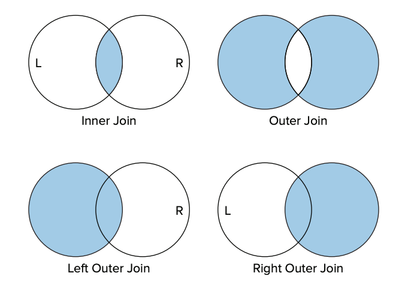
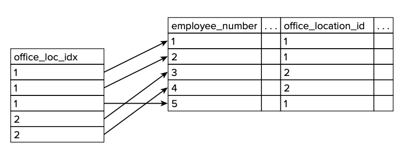

# 12강

[[toc]]

## SQL 소개
- SQL은 관계형 데이터베이스에서 데이터를 관리하고 질의를 하기 위해 사용하는 서너적 언어

### Q1. 관계형 데이터베이스에서 SQL을 사용해 어떻게 데이터를 검색할 수 있는가?
- 특정 테이블에 질의하고 싶을 때는 SELECT SQL 구문을 사용하면 된다.

```sql
SELECT name, office_location_id FROM employees;
```

- 위 쿼리는 모든 행을 반환한다.

::: tip
SQL 구문은 대, 소문자를 구분하지 않는다.
:::

- where 구문을 추가하면 조건을 넣어줄 수 있다.

```sql
SELECT * FROM employees where employee_number = 1;
```

- 조인도 가능하다.

```sql
SELECT * FROM employees, office_locations 
WHERE employees.office_location_id = office_locations.office_location_id
```

### Q2. 내부 조인과 외부 조인은 무엇인가?
- LEFT OUTER JOIN : 쿼리의 왼쪽에서부터 모든 행을 포함할 것이고, 매칭되는게 없다면 오른쪽엔 NULL을 대입.
- RIGHT OUTER JOIN : 반대

```sql
RIGHT OUTER JOIN

SELECT * FROM employees
RIGHT OUTER JOIN office_locations
ON employees.office_location_id = office_locations.office_location_id;
```

- 결과값을 표로 나타내보면

| name | location_name |
| --- | --- |
| ted.park | Gwangju |
| jade.jjj | Ori |
| NULL | Seoul |



### Q3. SQL은 데이터베이스의 데이터를 분석할 수 있는가?
- COUNT 함수

```sql
SELECT COUNT(*) from employees;
```

- 행 갯수를 반환한다.

```sql
SELECT SUM(annual_salary) from salaries;
```

- 합계를 반환한다.
- 기타등등 많음

### Q4. 데이터를 데이터베이스에 어덯게 저장하는가?
- INSERT 구문 사용

```sql
INSERT INTO employees VALUES (1, "ted.park", "Sawon", "1, Pine driver", CURDATE(), 1);
```

- UPDATE 구문 사용

```sql
UPDATE employees
set home_address = "Chowol Eop" 
where employee_number = 6;
```

- DELETE 구문 사용

```sql
DELETE FROM employees WHERE name = "sunny.sunny";
```

### Q5. 뷰는 무엇인가.
- 가상테이블
- 보고싶은거만 모아서 보여준다.

### Q6. DDL과 DML은 무엇인가?
- DML : SELECT, INSERT, UPDATE, DELETE등의 키워드를 사용해 데이터를 관리하는데 사용되는 구문의 집합
- DDL : 테이블 구조를 생성하고 관리하는데 사용하는 구문의 집합

### Q7. 비효율적인 쿼리의 성능은 어떻게 높일 수 있는가?
- 인덱스 사용



- 테이블에 데이터를 삽입하면 인덱스도 같이 만들어진다.
- 삽입시간은 더 길어지지만, 찾는 시간은 더 빨라진다.

### Q8. SQL로 데이터베이스를 다루기가 여의치 않을 때는 무엇을 할 수 있는가?
- 저장 프로시저 사용

### Q9. 트랜잭션이란 무엇인가?
- [ACID](https://ko.wikipedia.org/wiki/ACID) 네가지 속성 만족

### Q10. NoSQL이란 무엇인가?
- 관계형 데이터베이스 모델을 따르지 않는 데이터베이스
- MongoDB / 카산드라 / Memcached / 레디스 등등..

## 자바와 데이터베이스를 연결하는 JDBC

### Q11. 관계형 데이터베이스에 연결하기 위해 자바를 어떻게 사용하는가?
- JDBC 드라이버를 사용해 사용한다.

### Q12. SQL 쿼리를 실행하기 위해 자바를 어떻게 사용하는가?
- statement 인터페이스의 객체를 사용해 쿼리를 날린다.