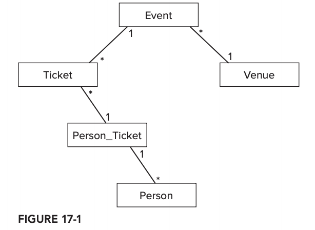

# 17강

[[toc]]

- 데이터베이스 구조는 다음과 같음



## 하이버네이트 사용하기
### Q1. 어떻게 하이버네이트를 사용해서 자바 객체를 만드는가?
- 하이버네이트는 데이터베이스 관계를 객체에 매핑하는 도구이므로, 이 entity들의 도메인 객체가 있어야 한다.
- 클래스들은 단순한 POJO이고, 각 객체는 관련 데이터베이스 테이블과 연결된다.

```java
public class Person {

  private int id;
  private String name;
  private String address;

  public Person() {
    // default no-arg constructor
  }

  public Person(int id, String name, String address) {
    this.id = id;
    this.name = name;
    this.address = address;
  }

  public int getId() {
    return id;
  }

  public void setId(int id) {
    this.id = id;
  }

  public String getName() {
    return name;
  }

  public void setName(String name) {
    this.name = name;
  }

  public String getAddress() {
    return address;
  }

  public void setAddress(String address) {
    this.address = address;
  }

  @Override
  public String toString() {
    return "Person{" +
        "name='" + name + '\'' +
        ", address='" + address + '\'' +
        '}';
  }
  // equals and hashCode omitted
}
```

- 하이버네이트를 쓰려면 기본적으로 인자가 없는 생성자가 포함되어야 한다.
- 클래스와 테이블 사이의 매핑을 명시해 주어야 한다.

```xml
<?xml version="1.0"?>
<!DOCTYPE hibernate-mapping PUBLIC
    "-//Hibernate/Hibernate Mapping DTD 3.0//EN"
    "http://hibernate.sourceforge.net/hibernate-mapping-3.0.dtd">
<hibernate-mapping package="com.wiley.acinginterview.chapter17">
    <class name="Person" table="PEOPLE">
        <id name="id" column="ID"/>
        <property name="name"/>
        <property name="address"/>
    </class>
</hibernate-mapping>
```

- 클래스의 필드들은 데이터베이스 테이블의 컬럼에 매치되므로, 매핑은 Person 객체의 속성만 명명하고 id 필드가 다른 객체용의 유일한 식별자로 동작한다.
- 어떤 디비를 쓰고 경로 설정 같은 부분은 따로 설정을 해준다.

```xml
<?xml version='1.0' encoding='utf-8'?>
<!DOCTYPE hibernate-configuration PUBLIC
    "-//Hibernate/Hibernate Configuration DTD 3.0//EN"
    "http://hibernate.sourceforge.net/hibernate-configuration-3.0.dtd">
<hibernate-configuration>
    <session-factory>
        <property name="connection.driver_class">
            com.mysql.jdbc.Driver
        </property>
        <property name="connection.url">
            jdbc:mysql://localhost:3306/ticketoffice
        </property>
        <property name="connection.username">nm</property>
        <property name="connection.password">password</property>
        <property name="dialect">
            org.hibernate.dialect.MySQLDialect
        </property>
        <property name="show_sql">true</property>
            <mapping
                resource="com/wiley/javainterviewsexposed/chapter17/Person.hbm.xml"/>
    </session-factory>
</hibernate-configuration>
```

- people 테이블의 행은 다음과 같다.

| id | name | address |
| -- | -- | -- |
| 1 | Sangjun Lee | Dangsan |
| 2 | Jihong Park | Hongchang Park |
| 3 | Youngsun Woo | Goo ui |

- 데이터베이스 쿼리 소스는 다음과 같다.

```java
@Test
public void retrievePeople() {
    final SessionFactory sessionFactory =
        new Configuration()
            .configure()
            .buildSessionFactory();
    final Session session = sessionFactory.openSession();
    final List<Person> actual = session
        .createQuery("from Person")
        .list();
    final List<Person> expected = Arrays.asList(
        new Person(1, "Sangjun Lee", "Dangsan"),
        new Person(2, "Jihong Park", "Hongchang Park"),
        new Person(3, "Youngsun Woo", "Goo ui"));
    assertEquals(expected, actual);
}
``` 

### Q2. 어떻게 하이버네이트를 이용해서 데이터베이스에 데이터를 입력하는가?
```java
@Test
public void storePerson() throws SQLException {
    final Session session = sessionFactory.openSession();
    final Transaction transaction = session.beginTransaction();

    final Person newPerson =
        new Person(4, "Bruce Wayne", "Gotham City");
    session.save(newPerson);
    transaction.commit();

    final Connection conn = DriverManager.getConnection(
        "jdbc:mysql://localhost:3306/ticketoffice",
        "nm",
        "password");
    final Statement stmt = conn.createStatement();

    final ResultSet rs = stmt.executeQuery(
        "select name from people where id = 4");

    assertTrue(rs.next());
    assertEquals("Bruce Wayne", rs.getString(1));
    rs.close();
    stmt.close();
    conn.close();
}
```

- Person 객체를 이용하는 하이버네이트 세션에서 save 메소드를 호출하는 것으로 Person 객체는 디비에 입력된다.

### Q3. 하이버네이트를 이용한 데이터베이스 테이블 조인은 어떻게 하는가?
