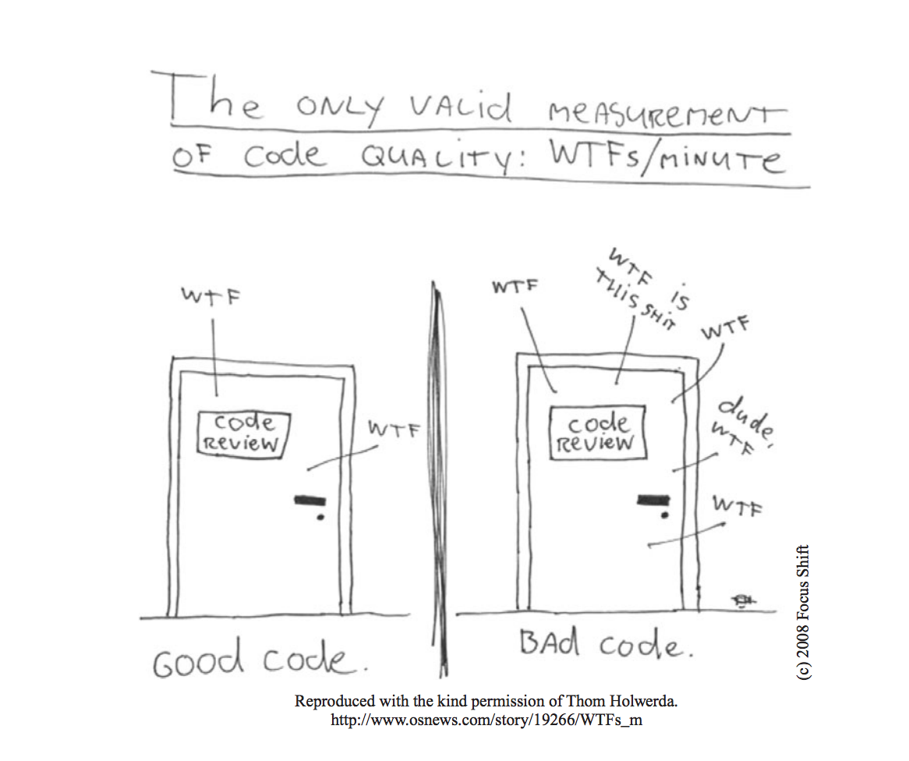

# 0강



- 코드의 품질은 WTF의 외침수와 반비례한다. 
- 좋은 코드를 위해 필요한건 장인정신이다.
- 장인정신을 익히는 과정은 두단계, 이론과 실전으로 나뉜다.
```
1. 장인에게 필요한 원칙, 패턴, 기법, 경험이라는 지식을 습득해야한다.
2. 열심히 일하고 연습해 지식을 몸과 마음으로 체득해야한다.
```
- 자전거를 타는사람한테 이론적으로 알려주는건 쉽지만, 실제로 이론만 알려주고 타라그러면 100퍼 넘어진다.
- 개발도 마찬가지로 이론만 알려주고 던져주면 그지같은 코드가 나오는법 
- 즉 개고생을 해봐야한다. -> 공감
- 이 책은 세부분으로 나뉘어진다.
```
1. 처음 몇장은 깨긋한 코드를 작성하는 원칙, 패턴, 실기를 설명
2. 문제가 있는 코드를 문제가 더 적은 코드로 고치는 연습 -> 집중력 필요
3. 결말 : 코드를 분석하고 정리하면서 모든 행위의 이유를 휴리스틱이나 냄새로 정리. 왜 이렇게 짰는지 등 정리한다.
```

- 모든 사례에서 코드를 변경 할 때마다 휴리스틱 번호를 표기. ex)[H22]
- 사례 연구에서 코드를 정리하면서 내린 각 결정과 휴리스틱 사이에서의 관계가 *매우* 중요하다.
- 사례를 열심히 파보고 짜보고 해보자. 안그러면 이 책을 읽는 의미가 없다.


