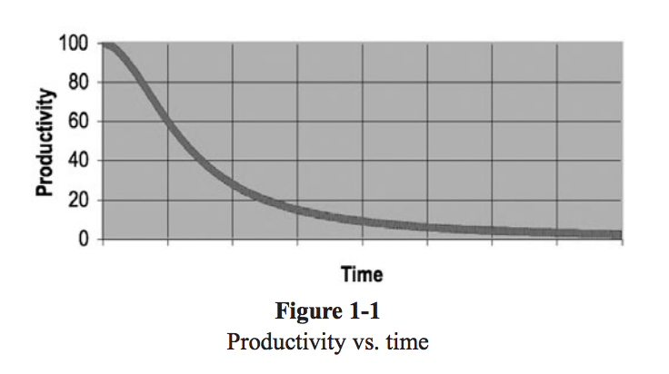

# 1강
- 프로그래머라면 개같은 코드로 고생한 경험이 무조건 있다.
- 심지어 우리도 쓰레기같이 코드를 짜고 나중에 고쳐야지(..) 라고 생각하고 넘어갈 때가 많음
- 절대로 다시 고칠일이 없다.
- 개발을 하다보면 거지같은 코드들을 고치다보면 *해석* 을 하는데 시간을 많이 쓰고, 계속 덧붙여 나가다보면 생산성을 바닥이 된다.


- 시간은 오래걸리고 생산성은 0이 되는 현상
#
- 나쁜 코드가 있다고 리팩토링을 하자고 한다.
- 새로운 프로젝트라 이사람 저사람이 붙어서 개발하지만, 기존 기능을 대체하기 위해 싹다 고치면, 그 코드는 어느새보면 또 별로인 코드다.
- 즉 뭘 하든간에 처음엔 깨끗한 코드를 만드려고 의식적으로(!) 짜야한다.
- 기한이 정해진 일도 마찬가지인데, 결국 더러운 코드보다 깨끗한 코드로 개발을 할 때 속도가 더 나온다는 사실을 잊지말자
#
- 깨끗한 코드를 구분하는 것과 깨끗한 코드를 작성하는건 엄연히 다른것!
- '코드감각' 이 없는 사람도, 어떠한 코드가 거지같다는거 정도는 알 수 있다.
- 하지만 '코드감각' 이 있는 사람은 거지같은 코드를 보면 좋은 모듈로 개선할 방안을 떠올리고, 고칠 계획을 수립한다.(이러한 단계가 되자)
#
- 깨끗한 코드란?
### 비야네 스트롭스트룹
```
나쁜 코드는 나쁜 코드를 유혹한다.
나쁜 코드를 고치려다보면 점점더 나쁜 코드가 된다.
깨진 창문과 같은 논리인데, 깨진 창문이 있으면 사람들이 신경을 안쓰고, 결국 자기가 창문을 부시고 다닌다는 얘기
철저한 오류처리도 중요하다. 
또한 메모리 누수 처리, 일관성 없는 명명법 등도 중요한 요소이다.
즉 세세하고 아주아주 꼼꼼하게 다 체크해가며 짜야 된다는 소리이다.
마지막으로 깨끗한 코드는 한가지를 잘해야 한다.
나쁜 코드는 여러가지 많은 일들을 하려고 애쓰다가 의도가 뒤섞이고 목적이 흐릿해진다.
깨끗한 코드는 한가지 일에 '집중' 한다는걸 잊지 말자
```

### 그레디 부치
```
가독성!
```

### 데이브 토마스
```
깨끗한 코드는 다른사람이 고치기 쉽다(..!)
테스트 케이스를 매우매우 강조
테스트 케이스가 없으면 아무리 읽기좋고 어쩌구 해도 깨긋하지 않다.
```

### 마이클 페더스
```
주의 깊게 코드를 짜자 (대충대충 노노)
```

### 론 제프리스
```
모든 테스트를 통과한다.
중복이 없다.
시스템 내 모든 설계 아이디어를 표현한다.
클래스, 메소드, 함수 등을 최대한 줄인다.
```

- 보이스카우트 원칙을 잘 지키자
- 캠프장은 처음 왔을 때보다 더 깨끗하게 해놓고 떠나라
- 채크아웃 할 때보다 좀더 깨끗한 코드를 체크인 하면 코드는 절대 나빠지지 않는다.
- 이책은 다양한 설계 원칙을 산발적으로 거론한다.
```
SRP (Single Responsibility Principle)
OCP (Open Closed Principle)
DIP (Dependency Inversion Principle)
```

