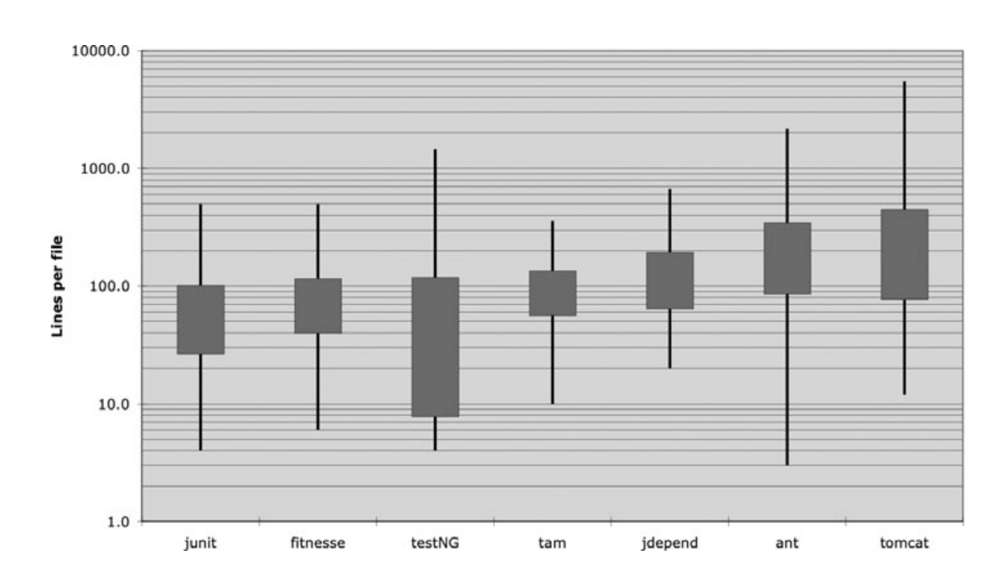
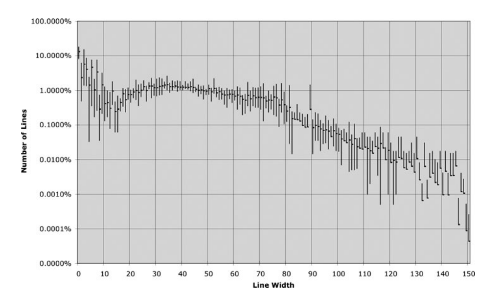

# 5강
[[toc]]
### 형식을 맞추는 목적
- 코드 형식은 매우매우 중요하다. 
- 코드 형식은 의사소통의 일환이다. 잊지말자

### 적절한 행 길이를 유지하라
- 세로길이는 어느정도가 적절할까?
- 자바에서 파일 크기는 클래스 크기와 밀접하다.



- 위의 그림을 보면 대부분의 소스들이 500줄은안넘어가고, 대다수가 200줄 미만이다.
- 500줄을 넘지않고 200줄 정도로의 파일로도 커다란 시스템을 구축 할 수 있다는걸 보여준다.
- 반드시 지켜야 할 규칙은 아니지만, 바람직한 규칙으로 삼으면 좋을듯

### 신문 기사처럼 작성하라
- 아주 좋은 신문 기사를 떠올려보면 독자는 위에서 아래로 읽는다.
- 좌상단에 기사를 몇마디로 요약하는 표제가 나옹는데, 독자는 표제를 보고 기사를 읽을지 말지를 결정한다.
- 소스파일도 비슷하게 작성한다.
- 이름은 간단하면서 설명하기 가능하게 짓고, 이름만 보고도 올바른 모듈을 살펴보는지 판단하도록 한다.

### 개념은 빈 행으로 분리하라
- 개념이 달라질땐 행을 분리해야 읽기가 편하다

```java
public class BoldWidget extends ParentWidget {

    public static final String REGEXP = "'''.+?'''";
    private static final Pattern pattern = Pattern.compile("'''(.+?)'''",
        Pattern.MULTILINE + Pattern.DOTALL
    );

    public BoldWidget(ParentWidget parent, String text) throws Exception {
      super(parent);
      Matcher match = pattern.matcher(text);
      match.find();
      addChildWidgets(match.group(1));
    }

    public String render() throws Exception {
      StringBuffer html = new StringBuffer("<b>");
      html.append(childHtml()).append("</b>");
      return html.toString();
    }
  }
```

- 이 소스를
```java
public class BoldWidget extends ParentWidget {
    public static final String REGEXP = "'''.+?'''";
    private static final Pattern pattern = Pattern.compile("'''(.+?)'''",
        Pattern.MULTILINE + Pattern.DOTALL);
    public BoldWidget(ParentWidget parent, String text) throws Exception {
      super(parent);
      Matcher match = pattern.matcher(text);
      match.find();
      addChildWidgets(match.group(1));}
    public String render() throws Exception {
      StringBuffer html = new StringBuffer("<b>");
      html.append(childHtml()).append("</b>");
      return html.toString();
    }
  }
```

-  이렇게 바꾸면 가독성이 너무 떨어져서 암호문같이 보인다

### 세로 밀집도
- 줄바꿈이 개념을 분리한다면 세로 밀집도는 연관성을 의미한다.
- 즉 서로 밀접한 코드 행은 세로로 가까이 놓여야 한다는 뜻
- 아래의 코드를 보면 의미없는 주석으로 두 인스턴스 변수를 떨어뜨려 놓았따.

```java
public class ReporterConfig {
    /**
    * The class name of the reporter listener
    */
    private String m_className;
    /**
    * The properties of the reporter listener
    */
    private List<Property> m_properties = new ArrayList<Property>();

    public void addProperty(Property property) {
      m_properties.add(property);
    }
}
```

- 변수가 떨어져있어서 괜히 헷갈린다.

```java
public class ReporterConfig {
    private String m_className;
    private List<Property> m_properties = new ArrayList<Property>();

    public void addProperty(Property property) {
      m_properties.add(property);
    }
}
```

- 이렇게 하는게 변수 2개 메소드 하나 이렇게 더 깔끔하게 잘보인다.

### 수직 거리
- 함수가 어떤 기능을 하는지 알고 싶은데 여기저기 뺑뺑이 돌면서 이 조각 저 조각이 *어디에* 있는지 찾고 기억하느라 시간과 노력을 소모하는 경험이 많다.
- 서로 밀집한 개념은 세로로 가까이 둬야 한다.
- 두 개념이 서로 다른 파일에 속한다면 규칙이 통하진 않는다.
- 하지만 타당한 근거가 없다면, 서로 밀접한 개념은 한 파일에 속해야 좋다
- 이게 바로 protected 변수를 피해야 하는 이유 중 하나이다.

#### 수직1. 변수선언
- 변수는 사용하는 위치에 최대한 가까이 선언
- 지역 변수는 각 함수 맨 처음에 선언

```java
private static void readPreferences() {
    InputStream is= null; // 요거
    try {
        is= new FileInputStream(getPreferencesFile());
        setPreferences(new Properties(getPreferences()));
        getPreferences().load(is);
    } catch (IOException e) {
        try {
            if (is != null)
            is.close();
        } catch (IOException e1) {
        }
    }
}
```

#### 수직2. 인스턴스 변수
- 반면 인스턴스 변수는 클래스 맨 처음에 선언한다.
- 변수간에 세로로 거리를 두지 않는다.

```java
public class TestForCleanCode {
    private String name;
    private String password;
    ...
}
```

#### 수직3. 종속 함수
- 한 함수가 다른 함수를 호출한다면 두 함수는 세로로 가까이 배치한다.
- 또한 가능하다면 호출하는 함수를 호출되는 함수보다 먼저 배치한다.
- 그럼 자연스럽게 읽힘

```java
public class WikiPageResponder implements SecureResponder {

  protected WikiPage page;
  protected PageData pageData;
  protected String pageTitle;
  protected Request request;
  protected PageCrawler crawler;

  public Response makeResponse(FitNesseContext context, Request request)
      throws Exception {
    String pageName = getPageNameOrDefault(request, "FrontPage");
    loadPage(pageName, context);
    if (page == null) {
      return notFoundResponse(context, request);
    } else {
      return makePageResponse(context);
    }
  }

  private String getPageNameOrDefault(Request request, String defaultPageName) {
    String pageName = request.getResource();
    if (StringUtil.isBlank(pageName)) {
      pageName = defaultPageName;
    }
    return pageName;
  }

  protected void loadPage(String resource, FitNesseContext context)
      throws Exception {
    WikiPagePath path = PathParser.parse(resource);
    crawler = context.root.getPageCrawler();
    crawler.setDeadEndStrategy(new VirtualEnabledPageCrawler());
    page = crawler.getPage(context.root, path);
    if (page != null) {
      pageData = page.getData();
    }
  }

  private Response notFoundResponse(FitNesseContext context, Request request)
      throws Exception {
    return new NotFoundResponder().makeResponse(context, request);
  }

  private SimpleResponse makePageResponse(FitNesseContext context)
      throws Exception {
    pageTitle = PathParser.render(crawler.getFullPath(page));
    String html = makeHtml(context);
    SimpleResponse response = new SimpleResponse();
    response.setMaxAge(0);
    response.setContent(html);
    return response;
  }
...
```

- 이렇게 호출되는 함수 순차적으로 정의를 해주면 좀더 잘읽힌다.

#### 수직4. 개념적 유사성
- 개념적으로 유사도가 높다면 같이 배치하도록 하자.
- 한 함수가 다른 함수를 호출해 생기는 직접적인 종속성
- 변수와 그 변수를 사용하는 함수도 비슷한 예이다.
- 아니면 비슷한 동작을 수행하는 함수도 좋은 예임

```java
public class Assert {
  static public void assertTrue(String message, boolean condition) {
    if (!condition)
      fail(message);
  }
  static public void assertTrue(boolean condition) {
    assertTrue(null, condition);
  }
  static public void assertFalse(String message, boolean condition) {
    assertTrue(message, !condition);
  }
  static public void assertFalse(boolean condition) {
    assertFalse(null, condition);
  } ...
```

- 위의 함수들은 개념적인 친화도가 매우 높다.
- 명명법이 똑같고, 기본 기능이 매우 유사하므로 같이 놓도록 하자

#### 수직5. 세로 순서
- 호출되는 함수를 호출하는 함수 밑에 놓자. 그래야 자연스럽게 읽히지~

### 가로 형식 맞추기
- 한 행은 가로로 얼마나 길어야 할까?



- 보통 45자 근처이고, 20~60 자 사이가 40퍼센트이다.
- 즉 명백하게 짧은 행을 선호한다.

### 가로 공백과 밀집도
- 가로로는 공백을 사용해 밀접한 개념과 느슨한 개념을 표현한다.

```java
private void measuerLine(String line) {
    lineCount++;
    int lineSize = line.length();
    totalChars += lineSize;
    lineWidthHistogram.addLine(lineSize, lineCount);
}
```

- 할당 연산자를 강조하려고 앞뒤에 공백을 줬다.
- 이러면 확실하게 좌우가 나눠진다는 것을 보여준다.
- 반면 함수 바로 뒤의 괄호는 붙여 썼다.
- 함수와 인수는 서로 밀접한 관계이기 때문에, 공백을 넣으면 한개념이 아니라 별개로 보인다.
- 함수를 호출하는 코드에서 괄호 안 인수는 공백으로 분리한다. 뭐 이런개념들임
- 연산자 우선순위를 강조하기 위해 공백을 사용하기도 함

```java
public class Quadratic {
  public static double root1(double a, double b, double c) {
    double determinant = determinant(a, b, c);
    return (-b + Math.sqrt(determinant)) / (2*a);
  }
  public static double root2(int a, int b, int c) {
    double determinant = determinant(a, b, c);
    return (-b - Math.sqrt(determinant)) / (2*a);
  }
  private static double determinant(double a, double b, double c) {
    return b*b - 4*a*c;
  }
}
```
- 근데 이런거 보긴편한대 보통 연산자같은건 ide에서 알아서 똑같은 간격을 유지해줘서 결국 보기힘듬..

### 가로 정렬
- 눈으로 보기엔 이뻐보이지만, 코드가 엉뚱한 부분을 강조해 진짜 의도가 가려지는 경우가 많다.
- 도구들도 저런 정렬은 해주지도 않아서 그냥 일반 방식으로 쓰자

```java
private String A =        A;
private String B =        B;
private String Alphabet = A;
```

### 들여 쓰기
- 들여쓰기는 매우 중요하다. 적당히 하나의 단계가 끝나거나 아래 계층으로 가면 해주고 그런다

```java
public class FitNesseServer implements SocketServer { private FitNesseContext
context; public FitNesseServer(FitNesseContext context) { this.context =
context; } public void serve(Socket s) { serve(s, 10000); } public void
serve(Socket s, long requestTimeout) { try { FitNesseExpediter sender = new
FitNesseExpediter(s, context);
sender.setRequestParsingTimeLimit(requestTimeout); sender.start(); }
catch(Exception e) { e.printStackTrace(); } }
```

- 정말 우주 쓰레기같은 코드가 아닐 수 없다. 
- 들여쓰기가 없다면 인간은 아마 코드를 못읽을 거임

### 들여쓰기 무시하기
- 가끔 한줄 짜리 간단한 if 문, while 문 같은 곳에서 들여 쓰기를 무시하고 싶어진다.
- 자제 하도록 하자
 
```java
public String render throws Exception { return "abcd"; }
```

### 팀 규칙
- 팀이 정한 규칙대로 같이 맞춰 하자