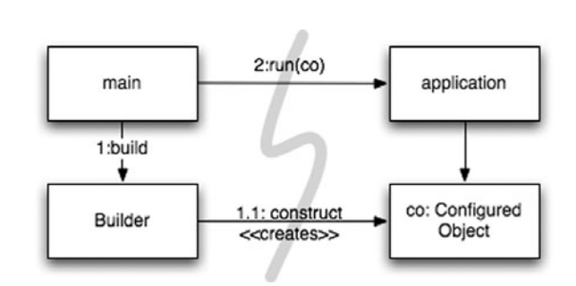
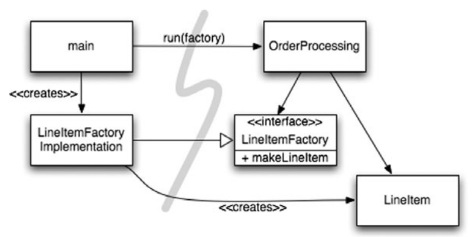
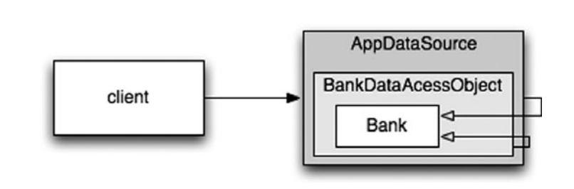

# 11강

[[toc]]

### 도시를 세운다면?
- 만약 도시를 세운다고 가정하면 모든 사항을 한명의 사람이 관리 할 순 없다.
- 수도 관리팀, 전기 관리팀 등등.. 각각의 역할이 나눠져 있다.
- 도시가 돌아가는 또다른 이유는 추상화와 모듈화 때문이다.
- 따라서 큰그림을 이해하지 못하더라도 개인이 관리하는 구성요소는 효율적으로 돌아간다.

<hr />

- 소프트웨어 팀도 마찬가지로 도시처럼 구성한다.
- 근데 막상 제작하는 시스템은 비슷한 수준으로 관심사를 묶거나, 추상화를 이루지 못한다.
- 즉 시스템 수준에도 높은 추상화를 유지하는 방법이 필요하다

### 시스템 제작과 시스템 사용을 분리하라 
- *제작*과 *사용*은 아주 다르다.

```java
소프트웨어 시스템은 (어플리케이션 객체를 제작하고 의존성을 서로 '연결'하는) 
준비과정과 (준비 과정 이후에 이어지는) 런타임 로직을 분리해야 한다.
```

- 시작 단계는 모든 어플리케이션이 풀어야 할 *관심사*다. 
- 관심사 분리는 우리 분야에서 가장 오래되고 가장 중요한 설계 기법
- but 대다수의 어플리케이션은 시작 단계라는 관심사를 분리하지 않는다.
- 준비 과정 코드를 주먹 구구식으로 구현하고, 런타임 로직과 마구 뒤섞어 버린다.

```java
public Service getService() {
    if (service == null) {
        service = new MyServiceImpl(...) // 모든 상황에 적합한 기본값일까?
    } 
    return service;
}
```

- 초기화 지연 (Lazy Initialization) 혹은 계산 지연(Lazy Evaluation) 기법이다.
    - 실제로 필요할 때까지 객체를 생성하지 않아 불필요한 부하가 걸리지 않는다.
    - 어떤 경우에도 null을 내뱉지 않는다.

<hr />

- 위와 같은 장점이 있지만, getService 메소드가 MyServiceImpl에 명시적으로 의존해버리는 문제가 잇다.
- 런타임 로직에서 MyServiceImpl 객체를 전혀 사용하지 않아도 의존성을 해결하지 않으면 컴파일 에러가 발생한다.
- 테스트에도 어려움이 있다. -> getService 테스트 하려고 테스트 전용 객체 생성 필요
- 무엇보다 해당 객체가 모든 상황에 적합한 객체인지 모른다는 사실이 가장 큰 문제이다.
- 이러한 초기화 지연 기법을 여기저기 사용하면 결국 시스템자체가 조잡해지고 중복이 난무하게 된다.

### Main 분리
- 시스템 생성과 시스템 사용 분리 방법
    - 생성과 관련된 코드는 모두 main에 맡긴다.
    - 나머지 시스템은 모든 객체가 생성되었고 모든 의존성이 연결되었다고 가정한다.



- 메인 함수에서 시스템에 필요한 객체를 생성하고 어플리케이션에 넘겨버리면, 어플리케이션은 객체를 사용만 한다.
- 어플리케이션은 메인에서 객체를 어떻게 생성했는지 전혀 모르고, 잘됐다고 가정을 해버리는 구조이다.

### 팩토리
- 객체가 생성되는 시점을 어플리케이션이 결정하는 방법도 있다.
- 예를 들어, 주문처리 시스템에서 어플리케이션은 LineItem 인스턴스를 생성해 Order에 추가한다.
- 이럴때 Abstract Factory 패턴을 이용한다.
- 이런식으로 짜면 생성시점은 어플리케이션이 결정하지만, 실제 객체를 생성하는 코드는 알 수 없다.



### 의존성 주입
- 사용과 제작을 분리하는 가장 강력한 메카니즘은 의존성 주입(Dependency Injection)이다.
- 의존성 주입은 제어의 역전 (Inversion Of Control) 기법을 의존성 관리에 적용한 메커니즘이다.
- 제어 역전에선 한 객체가 맡은 보조 책임을 새로운 객체에게 떠넘겨 버린다 -> SRP
- 의존성 관리 맥락에서 객체는 의존성 자체를 인스턴스로 만드는 책임은 지지 않는다.
- 이런 책임을 다른 *전담* 메커니즘에게 넘겨버린다. -> 제어의 역전 발생
- 보통 main 루틴이나 특수 *컨테이너*를 사용한다. (스프링 IOC 컨테이너 생각하면 될듯)

```java
MyService myService = (MyService)(jndiContext.lookup("NameOfMyService"));
```

- JNDI 검색은 DI를 부분적으로 구현한 기능이다.
- 호출하는 객체는 실제로 반환되는 객체의 유형을 제어하지 않는다.
- 대신 호출하는 객체는 의존성을 능동적으로 해결한다.

<hr />

- 하지만 진정한 DI는 클래스가 의존성 자체를 해결하려고 하지않고, setter 메소드같은거로 설정해서 완전히 수동적으로 해결한다.
- DI 컨테이너는 요청이 들어올 때마다 필요한 객체의 인스턴스를 만든 후 생성자 인수나 설정자 메소드를 사용해 의존성을 설정한다.

### 확장
- 조그만한 시골도시에 왕복 6차선도로를 처음부터 깔아버릴 순 없다.
- 시스템도 마찬가지로 처음부터 거대하게 짜버릴 순 없다.
- 처음부터 올바르게 시스템을 만든다는 믿음은 갖다 버리고, 오늘 주어진 업무에 맞춰 시스템을 구현해야 한다.
- 내일은 새로운 스토리에 맞춰 업무를 확장해 나가면 되고
- 이것이 반복적이고 점진적인 애자일의 핵심이다.

<hr/>

- 소스레벨에선 TDD 같은 방식으로 소스를 깨끗하게 점점더 발전 시킬 수 있다.
- 시스템은??

```java
소프트웨어 시스템은 물리적인 시스템과 다르다. 관심사를 적절히 분리해 관리한다면
소프트웨어 아키텍처는 점진적으로 발전할 수 있다.
```

- 횡단(cross-cutting) 관심사
- AOP는 횡단 관심사에 대처해 모듈성을 확보하는 일반적인 방법론

### 자바 프록시
- 자바 프록시는 단순한 상황에 적합
- 개별 객체나 클래스에서 메소드 호출을 감싸는 경우가 좋은 예
- 기본 JDK에서 제공하는 동적 프록시는 인터페이스만 지원한다.
- 클래스 프록시를 사용하려면 CGLIB, ASM, Javassist 같은 바이트 코드 라이브러리가 필요하다.
- 자바 프록시를 사용하면 깨끗한 코드를 작성하기가 어렵고, AOP해법에서 필요한 지점 (pointcut) 명시가 안되는 단점이 있다.

### 순수 자바 AOP 프레임워크
- 다행스럽게 대부분의 프록시는 거기서 거기인 코드라 순수 자바 관점을 구현하는 스프링 AOP 같은대서 내부적으로 프록시를 사용해 자동화를 한다.
- 스프링은 비지니스 논리를 POJO로 구현한다.
- 따라서 개념적으로 더 쉽고 간단하다.

<hr />

- 프로그래머는 설정 파일이나 API를 사용해 필수적인 어플리케이션 기반 구조를 구현한다.
- 여기서 트랜잭션, 보안, 캐시, 장애조치 등과 같은 횡단 관심사가 포함되는데, 많은경우 스프링이나 JBoss 라이브러리의 관점을 명시한다.
- 자기도 모르게 프레임워크의 프록시를 이용해 구현을 하는 것
- 아래는 그 예시 소스

```xml
<beans>
  ...
  <bean id="appDataSource"
    class="org.apache.commons.dbcp.BasicDataSource"
    destroy-method="close"
    p:driverClassName="com.mysql.jdbc.Driver"
    p:url="jdbc:mysql://localhost:3306/mydb"
    p:username="me"/>
  <bean id="bankDataAccessObject"
    class="com.example.banking.persistence.BankDataAccessObject"
    p:dataSource-ref="appDataSource"/>
  <bean id="bank"
    class="com.example.banking.model.Bank"
    p:dataAccessObject-ref="bankDataAccessObject"/> ...
  </beans>
```

- 실제 스프링 2.x 대 버전의 app.xml의 일부이다.
- 각 빈은 중첩된 러시아 인형의 일부분과 같다



- Bank 도메인 객체는 DAO로 프록시 되었고, DAO는 JDBC 드라이버 자료 소스로 프록시 되었다.
- 클라이언트는 Bank 객체에서 getAccounts()를 호출한다고 생각하지만, 실제로는 Bank POJO의 기본 동작을 확장한 중첩 Decorator 객체 집합의 가장 외곽과 통신한다.

### AspectJ 관점
- 가장 강력한 횡단 관심사 도구
- 자세한건 AspectJ 책을 보자

### 테스트 주도 시스템 아키텍쳐 구축
- 관점으로 관심사를 분리하는 방식은 그 위력이 아주 막강하다.
- 코드 수준에서 아키텍쳐 관심사를 분리할 수 있다면, 진정한 *테스트 주도* 아키텍처를 구축할 수 있다.
- 이제이해됨.. 결국 시스템 아키텍쳐는 횡단관심사로 다 분리해버려서 비지니스 로직과 분리하자는 말