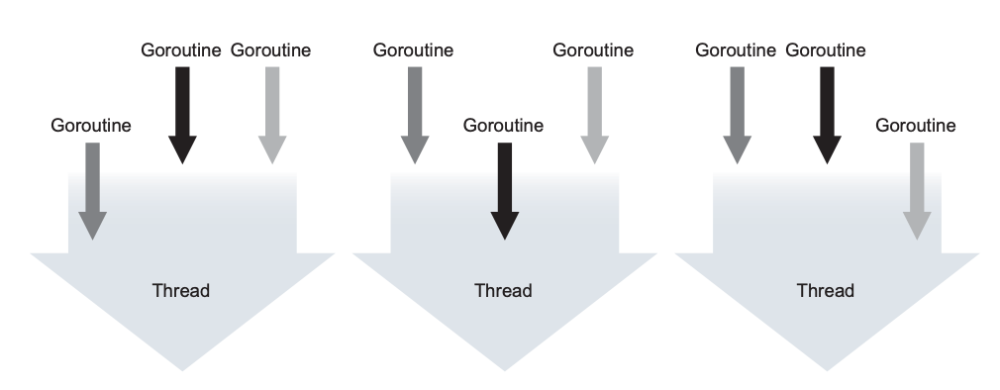
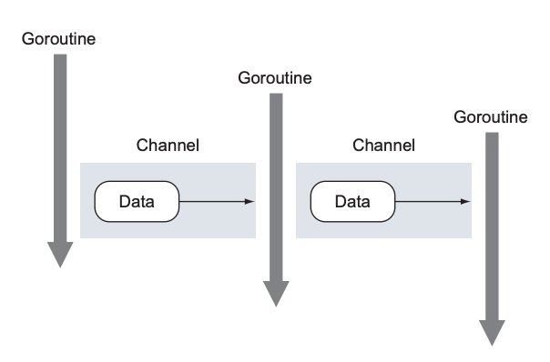
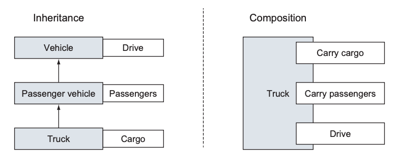

# 1강

[[toc]]

## 1. Go 언어로 최신 컴퓨팅 환경이 당면한 과제 해결하기
- Go는 개발 기간이 Ruby와 Python처럼 짧고 C나 C++처럼 수행속도가 빠르다.
- Go는 내장된 동시성 기능으로 별도의 스레드 라이브러리를 사용하지 않아도 시스템 자원을 효과적으로 활용이 가능
- 훌륭한 GC 지원

### 1-1. 개발 속도 
- C나 C++은 컴파일하면 엄청나게 오랜 시간이 걸린다.
- Go는 굉장히 똑똑한 컴파일러와 간결한 의존성 해석 알고리즘을 통해 빠른 속도를 제공한다.
- Go는 정적언어로 컴파일에서 실행전 문제를 대부분 잡아내 주기 때문에, 안정적이다

### 1-2. 동시성
#### 고루틴
- 다른 프로그래밍 언어에선 스레드를 사용해야 하는 일을, 고는 고루틴을 통해서 해결한다.
- Go는 고루틴을 이용한 동시성 기능을 자체적으로 지원하는 net/http 라이브러리를 사용한다.



- 이런식으로 하나의 스레드에서 여러개의 고루틴이 실행된다.

```go
func log(msg string) {
    ... 로그를 기록하는 코드를 여기에 작성
}

// 어플리케이션 코드에서 오류가 발견된 부분
go log("심각한 오류가 발생 했습니다")
```

- 이런식으로 go 키워드를 사용하면 log 함수가 고루틴으로 동작하도록 스케줄링이 가능하다.
- 즉 로깅이 처리되는 동안 어플리케이션의 나머지 코드는 계속 실행할 수 있고, 성능이 향상된다.

#### 채널
- 채널은 고루틴 간에 안전한 데이터 전송을 가능하게 하는 데이터 구조
- 채널을 잘 사용할 경우 공유 메모리 접근을 허용하는 프로그래밍 언어의 문제를 해결할 수 있다.
- 즉 두개가 동시에 돌아가서 데이터가 의도치 않게 변경되는 경우를 방지하기 위한 장치
- 채널은 어느 한 시점에 하나의 고루틴만이 데이터를 수정 할 수 있는 패턴을 제공한다.



- 채널을 이용하면 고루틴 간 데이터 교환을 안전하게 할 수 있음

### 1-3. Go의 타입 시스템
- Go는 계층구조가 없는 유연한 타입 시스템을 제공해, 리팩토링이 용이하다.
- 추상클래스나 인터페이스를 설계할 일도 없다
- 합성(composition)패턴을 이용한다.
- 인터페이스 선언도 따로 필요가 없다.

#### 간결한 타입
- int, string등의 내장 타입말고도 사용자 직접 정의가 가능하다.
- C의 구조체 느낌인듯
- Go는 자바처럼 여러개의 상속 구조를 만들어서 데이터를 정의하기보단, 큰타입에 임베드하여 상대적으로 작은 크기의 타입을 정의한다.



#### 작은 동작을 모델링하는 인터페이스
- 인터파에스는 타입의 동작을 표현하기 위해 사용
- 실제로 구현하고 있다고 선언할 필요는 없다. 단지 필요한 행위만 구현하면 땡 -> 덕 타이핑
- 자바는 사방팔방 선언하고 난리쳐야 되지만, Go의 인터페이스는 주로 하나의 동작만을 표현한다.
- io.Reader인터페이스가 대표적으로 많이 쓰게될 인터페이스인데, 이런식으로 되어있다.

```go
type Reader interface {
    Read(p []byte) (n int, err error)
}
```

- 딱 하나의 기능만 구현하면 된다. (진짜?..)

### 1-4. 메모리 관리
- 아주 좋은 GC를 제공한다.
- C나 C++ 같은 시스템 언어와 다르게, 직접 할당 해제하고 이럴 필요가 없다.

## 2. Hello, Go

```go
pacakge main // 패키지 단위로 관리

import "fmt" // 외부 코드 참조

func main() { // C와 마찬가지로 어플리케이션의 시작점은 main 함수
    fmt.Println("Hello, World!") 
}
```

## 3. 요약
- Go는 모던하고 빠르며 강력한 표준 라이브러리를 제공하는 프로그램 언어
- Go는 동시성 기능을 자체적으로 내장
- Go는 코드 재사용을 위한 빌딩 블록으로서 인터페이스를 활용