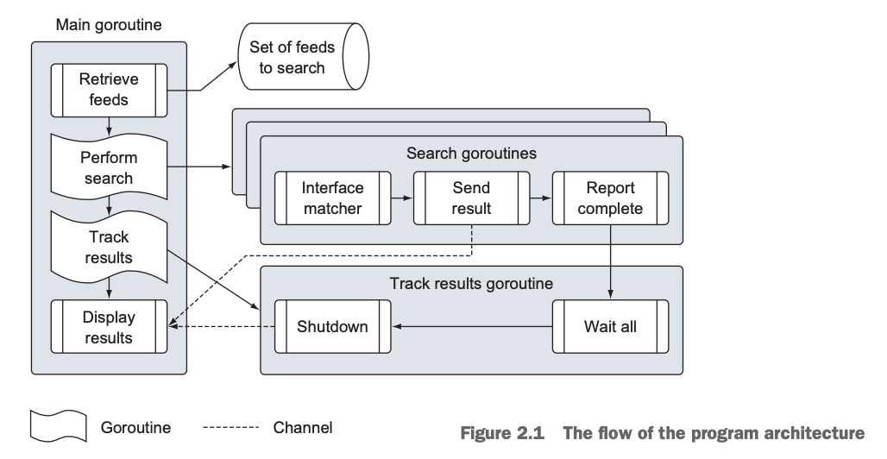

# 2강

[[toc]]

## 1. 프로그램 아키텍쳐


- 서로 다른 피드를 대상으로 검색을 수행하는 방법
- 프로그램은 각기 다른 고루틴에 의해 실행되는 여러 단계로 나누어진다.
- 주 고루틴에서 시작해 검색과 추적을 담당하는 고루틴의 코드를 살펴본 후 다시 주 고루틴의 코드로 돌아오는 순서로 실행

```
cd $GOPATH/src/github.com/goinaction/code/chapter2

- sample
    - data
        data.json -- 데이터 피드를 가지고 있는 파일
    - matchers
        rss.go -- RSS 피드 검색기를 구현
    - search
        default.go -- 데이터 검색을 위한 기본적인 검색기 코드
        feed.go -- JSON 데이터 파일을 읽기 위한 코드
        match.go -- 서로 다른 종류의 검색기를 지원하기 위한 인터페이스
        search.go -- 검색을 수행하는 주요 로직이 구현된 파일
    main.go -- 시작점
```

## 2. main 패키지
- 프로그램의 진입점 (main)

```go
package main

import (
	_ "github.com/gwegwe1234/go-in-action/chapter2/sample/matchers"
	"github.com/gwegwe1234/go-in-action/chapter2/sample/search"
	"log"
	"os"
)

func init()  {
	// 표준 출력으로 로그를 출력하도록 변경한다
	log.SetOutput(os.Stdout)
}

func main()  {
	// 지정된 검색어로 검색을 수행
	search.Run("Sherlock Holmes")
}
```

- mian 함수가 들어간 go 파일의 package는 main으로 선언해 준다
- go의 모든 파일은 패키지에 종속
- import는 특정 패키지를 가져오는것
- 같은 폴더에 저장된 모든 소스 파일은 같은 패키지 이름을 사용해야 하며, 폴더 이름과 동일한 패키지 이름을 사용하는 것이 좋다
- _를 사용해 빈 식별자를 사용할 수도 있다
- init 함수는 main보다 먼저 실행된다
- init 후 메인 실행. search 패키지에 있는 Run 함수를 실행한다

## 3. Search 패키지
- search 패키지는 프로그램을 위한 프레임워크와 비지니스 로직을 구현한 패키지
- 4개의 go 파일로 구성된다.

### 3-1. search.go
```go
package search

import (
	"log"
	"sync"
)

var matchers = make(map[string]Matcher)

func Run(searchTerm string)  {
	// 검색할 피드의 목록 조회
	feeds, err := RetrieveFeeds()
	if err != nil {
		log.Fatal(err)
	}

	// 버퍼가 없는 채널을 생성하여 화면에 표시할 검색 결과를 전달 받는다
	results := make(chan *Result)

	// 모든 피드를 처리할 때까지 기다릴 대기 그룹(Wait group)을 설정
	var waitGroup sync.WaitGroup

	// 개별 피드를 처리하는 동안 대기해야 함
	// 고루틴의 개수를 설정
	waitGroup.Add(len(feeds))

	// 각기 다른 종류의 피드를 처리할 고루틴을 실행
	for _, feed :=  range feeds {
		// 검색을 위해 검색기 조회
		matcher, exists := matchers[feed.Type]
		if !exists {
			matcher = matchers["default"]
		}

		// 검색을 실행하기 위해 고루틴을 실행
		go func(matcher Matcher, feed *Feed) {
			Match(matcher, feed, searchTerm, results)
			waitGroup.Done()
		}(matcher, feed)
	}

	// 모든 작업이 완료되었는지를 모니터링할 고루틴을 실행
	go func() {
		// 모든 자업이 처리될 때까지 기다린다
		waitGroup.Wait()

		// Display 함수에게 프로그램을 종류할 수 있음을 알리기 위해 채널을 닫는다.
		close(results)
	}()

	// 검색 결과 화면 표시
	Display(results)
}
```

```go
feeds, err := RetrieveFeeds()
```

- RetrieveFeeds는 같은 패키지 내에 선언되어 있는 함수이다.
- 동적 배열을 구현한 Slice를 리턴한다
- feeds, err 처럼 리턴값이 2개도 가능
- := 는 변수의 선언과 초기화를 동시에 가능하게 해주는 연산자

```go
// 버퍼가 없는 채널을 생성하여 화면에 표시할 검색 결과를 전달 받는다
	results := make(chan *Result)
```
- chan은 채널변수 -> 고루틴간의 데이터 전달

```go
	// 모든 피드를 처리할 때까지 기다릴 대기 그룹(Wait group)을 설정
	var waitGroup sync.WaitGroup

	// 개별 피드를 처리하는 동안 대기해야 함
	// 고루틴의 개수를 설정
	waitGroup.Add(len(feeds))
```
- WaitGroup을 사용하는 이유는 Go는 메인이 끝나버리면 고루틴도 다 끝나버려서 메인이 리턴되기 전에 모든 고루틴을 실행하기 위해 쓴다
- WaitGroup은 카운팅 세마포어여서 고루틴의 실행이 종료될 때마다 전체 개수를 하나씩 줄임

```go
// 각기 다른 종류의 피드를 처리할 고루틴을 실행
	for _, feed :=  range feeds {
		// 검색을 위해 검색기 조회
		matcher, exists := matchers[feed.Type]
		if !exists {
			matcher = matchers["default"]
		}

		// 검색을 실행하기 위해 고루틴을 실행
		go func(matcher Matcher, feed *Feed) {
			Match(matcher, feed, searchTerm, results)
			waitGroup.Done()
		}(matcher, feed)
	}
```

- 조회한 모든 피드에 대해서 for 루프를 실행하는 부분
- range 키워드를 사용하면 for 문을 쉽게 돌릴 수 있음
- _는 빈 식별자로 실제로 필요하지 않은 인덱스값을 적기 위해 사용
- map도 쓰는데, exists 로 bool값을 받아 값의 유무를 알 수 있다.
- waitGroup.Done()은 고루틴이 완료될때마다 값을 하나씩 감소되어, 다 끝나는걸 보장해준다.
- waitGroup은 실제로 go 루틴 익명함수 내부에서 선언된 적이 없는데, 가져다 쓰고있다. -> 클로저 지원
- 익명함수에서 matcher, feed 변수는 매개변수로 넘겨주는데, 이렇게 안하고 클로저로 쓰면 값이 변경돼 문제가 발생 할 수 있다

```go
// 모든 작업이 완료되었는지를 모니터링할 고루틴을 실행
	go func() {
		// 모든 자업이 처리될 때까지 기다린다
		waitGroup.Wait()

		// Display 함수에게 프로그램을 종료할 수 있음을 알리기 위해 채널을 닫는다.
		close(results)
	}()
```

- 위와 같이 모든 고루틴이 완료 될때까지 메인함수가 종료되지 말라고 Wait함수를 걸어준다

### 3-2. feed.go

```go
package search

import (
	"encoding/json"
	"os"
)

const dataFile = "data/data.json"

type Feed struct {
	Name string `json:"site"`
	URI string `json:"link"`
	Type string `json:"type"`
}

func RetrieveFeeds() ([]*Feed, error)  {
	// 파일을 연다
	file, err := os.Open(dataFile)
	if err != nil {
		return nil, err
	}

	// defer 함수를 이용해 이 함수가 리턴딜 때 앞서 열어둔 파일이 꼭 닫히도록 해준다
	defer file.Close()

	// 파일을 읽어 Feed 구조체의 포인터의 슬라이스로 변환
	var feeds []*Feed
	//feeds2 := new([]*Feed)
	err = json.NewDecoder(file).Decode(&feeds)

	return feeds, err
}
```

- encoding/json 의 json 표준 라이브러리를 사용한다. -> 인코딩, 디코딩 가능
- 가져올 json을 쓰기 위해선, 디코딩을 통해 구조체의 슬라이스로 변환해야 한다.
- 파일을 디코딩할 구조체로 Feed 구조체를 생성해준다.
- RetrieveFeeds 함수는 데이터의 파일을 읽어 각각의 JSON 문서를 디코딩해 Feed 구조체 타입값의 슬라이스를 리턴해 준다.
- 리턴값이 두개인경우, 즉 원하는값, error 형태로 많이 던져준다.
- defer는 어떠한 로직에서 panic이 발생했을 때, 무조건 실행되는 문구이다. 여기선 file.Close()
- Feed의 슬라이스 변수를 선언해 Decode에다가 넣어준다. 

```go
func (dec *Decoder) Decode(v interface{}) error {
	if dec.err != nil {
		return dec.err
    }
    ...
```

- Decode는 인터페이스형을 받는 구조라, 아무거나 넣어도 된다. 위의 형태는 리시버 형태

### 3-3. match.go/default.go
- match.go 파일에는 search 패키지의 Run 함수가 사용할 여러 종류의 검색기를 생성하기 위한 코드가 작성되어있다

```go
package search

// 검색 결과를 저장할 Result 구조체
type Result struct {
	Field string
	Content string
}

// Matcher 인터페이스는 새로운 검색 타입을 구현할 때 필요한 동작을 정의
type Matcher interface {
	Search(feed *Feed, searchTerm string) ([]*Result, error)
}
```

- 인터페이스의 동작은 인터페이스 타입 내부에 선언된 메소드에 의해 정의된다. -> 덕타이핑
- Go의 이름 규칙으로, 메소드가 하나면 er로 끝나는 이름으로 짓는게 좋다.
- 인터페이스를 구현하는 사용자 정의 타입의 경우, 이 타입은 인터페이스 타입에 선언된 모든 메소드를 구현해야 한다.

```go
package search

// 기본 검색기를 구현할 defaultMatcher 타입
type defaultMatcher struct {}

// init 함수에서는 기본 검색기를 프로그램에 등록한다
func init()  {
	var matcher defaultMatcher
	Register("default", matcher)
}

// Search 함수는 기본 검색기의 동작을 구현한다
func (m defaultMatcher) Search(feed *Feed, searchTerm string) ([]*Result, error)  {
	return nil, nil
}
```

- defaultMatcher는 빈 구조체인데, 이 타입의 값이 생성될 때 0바이트가 할당된다.
- 빈 구조체는 타입은 필요하지만 타입의 상태를 관리할 필요가 없는 경우에 유용하다
- 기본 검색기의 경우 그 어떤 상태도 관리할 필요가 없이 오직 인터페이스만 구현하면 됨
- Search 메소드는 defaultMatcher 타입에 대한 값 수신기 (value receiver)를 선언한다.
- func (m defaultMatcher) Search(..) 이런식으로 선언하면, DefaultMatcher(타입).Search 이런식으로 사용이 가능해진다.
- 리시버에는 포인터 참조를 넣건, 일반 값을 넣건 컴파일러가 알아서 수행한다.

```go
dm := new(defaultMatcher)
dm.Search(feed, "test")
```

- 이런식으로 객체지향적으로 리시버를 활요하면 좋다
- 리시버에서 만약 값 리시버가 아닌 포인터 리시버로 할 경우, 인터페이스 타입에서 메소드 호출을 할 때, 포인터 일때만 적용이 된다
- 즉 가능한 리시버 설정시에는 값 리시버로 설정하는게 좋다

```go
// defaultMatcher 타입의 포인터 수신기를 이용해 메소드 선언
func (m *defaultMatcher) Search(feed *Feed, searchTerm string)

// 인터페이스 타입값을 통해 메소드 호출
var dm defaultMatcher
var matcher Matcher = dm // 인터페이스 타입의 값을 대입
matcher.Search(feed, "test") // 포인터 리시버에다가 값을 넣으면 에러 발생
-- > 에러 발생

===============================================================

// defaultMatcher 타입의 값 수신기를 이용해 메소드 선언
func (m defaultMatcher) Search(feed *Feed, searchTerm string)

// 인터페이스 타입 값을 통해 메소드 호출
var dm defaultMatcher
var matcher matcher = &dm // 인터페이스 타입의 포인터를 대입 
matcher.Search(feed, "test") // 포인터에 의한 인터페이스 메소드 호출 
--> 에러 미발생
```

```go
package search

import "log"

// 검색 결과를 저장할 Result 구조체
type Result struct {
	Field string
	Content string
}

// Matcher 인터페이스는 새로운 검색 타입을 구현할 때 필요한 동작을 정의
type Matcher interface {
	Search(feed *Feed, searchTerm string) ([]*Result, error)
}

// Match 함수는 고루틴으로서 호출되며
// 개별 피드 타입에 대한 검색을 동시에 수행한다
func Match(matcher Matcher, feed *Feed, searchTerm string, results chan <- *Result) {
	// 지정된 검색기를 이용해 검색을 수행
	searchResults, err := matcher.Search(feed, searchTerm)
	if err != nil {
		log.Println(err)
		return
	}

	// 검색 결과를 채널에 기록한다
	for _, result := range searchResults {
		results <- result
	}
}

// Display 함수는 개별 고루틴이 전달한 검색결과를 콘솔창에 출력
func Display(results chan *Result)  {
	// 채널은 검색 결과가 기록될 때까지 접근이 차단된다.
	// 채널이 닫히면 for 루프가 종료된다
	for result := range results {
		log.Printf("%s: \n %s\n\n", result.Field, result.Content)
	}
}

func Register(feedType string, matcher Matcher)  {
	if _, exists := matchers[feedType]; exists {
		log.Fatalln(feedType, "검색기가 이미 등록되었습니다")
	}

	log.Println("등록 완료 : ", feedType, " 검색기")
	matchers[feedType] = matcher
}
```

- Match 함수는 Matcher 인터페이스를 구현하는 값이나 포인터에 의해 실제 검색을 수행하는 함수
- 정상적으로 매치 서칭이 완료되면, 채널에다가 값을 넘겨버린다.
- 이후에 Display에서 채널을 받게 되는데, 채널 결과가 전부 기록될 때까지 포문이 돌게 된다.

```go
for _, result := range searchResults {
		results <- result
	}
```

- 해당 for문은 무한루프처럼 보이지만, 실제로 search.go파일에서

```go
go func() {
		// 모든 자업이 처리될 때까지 기다린다
		waitGroup.Wait()

		// Display 함수에게 프로그램을 종류할 수 있음을 알리기 위해 채널을 닫는다.
		close(results)
	}()
```

- close(results)를 해줘서, 해당 채널이 닫히면, for 문이 끝나게 된다.
- Register 함수는 default.go 에서 init함수에서 쓰이는데, 특정 Matcher 타입을 등록하는 것이다.

## 4. RSS 검색기
- RSS 는 기본검색기와는 다르게 인터페이스 메소드인 Search 메소드 구현 과정이 다르다.

```go
package matchers

import (
	"encoding/xml"
	"errors"
	"fmt"
	"log"
	"net/http"
	"regexp"

	"github.com/gwegwe1234/go-in-action/chapter2/sample/search"
)

type (
	// item 구조체는 RSS 문서 내의 item 태그에
	// 정의된 필드들에 대응하는 필드들을 선언한다.
	item struct {
		XMLName     xml.Name `xml:"item"`
		PubDate     string   `xml:"pubDate"`
		Title       string   `xml:"title"`
		Description string   `xml:"description"`
		Link        string   `xml:"link"`
		GUID        string   `xml:"guid"`
		GeoRssPoint string   `xml:"georss:point"`
	}

	// image 구조체는 RSS 문서 내의 image 태그에
	// 정의된 필드들에 대응하는 필드들을 선언한다.
	image struct {
		XMLName xml.Name `xml:"image"`
		URL     string   `xml:"url"`
		Title   string   `xml:"title"`
		Link    string   `xml:"link"`
	}

	// channel 구조체는 RSS 문서 내의 channel 태그에
	// 정의된 필드들에 대응하는 필드들을 선언한다.
	channel struct {
		XMLName        xml.Name `xml:"channel"`
		Title          string   `xml:"title"`
		Description    string   `xml:"description"`
		Link           string   `xml:"link"`
		PubDate        string   `xml:"pubDate"`
		LastBuildDate  string   `xml:"lastBuildDate"`
		TTL            string   `xml:"ttl"`
		Language       string   `xml:"language"`
		ManagingEditor string   `xml:"managingEditor"`
		WebMaster      string   `xml:"webMaster"`
		Image          image    `xml:"image"`
		Item           []item   `xml:"item"`
	}

	// rssDocument 구조체는 RSS 문서에 정의된 필드들에 대응하는 필드들을 정의한다.
	rssDocument struct {
		XMLName xml.Name `xml:"rss"`
		Channel channel  `xml:"channel"`
	}
)

// Matcher 인터페이스를 구현하는 rssMatcher 타입을 선언한다.
type rssMatcher struct{}

// init 함수를 통해 프로그램에 검색기를 등록한다.
func init() {
	var matcher rssMatcher
	search.Register("rss", matcher)
}

// Search 함수는 지정된 문서에서 검색어를 검색한다.
func (m rssMatcher) Search(feed *search.Feed, searchTerm string) ([]*search.Result, error) {
	var results []*search.Result

	log.Printf("피드 종류[%s] 사이트[%s] 주소[%s]에서 검색을 수행합니다.\n", feed.Type, feed.Name, feed.URI)

	// 검색할 데이터를 조회한다.
	document, err := m.retrieve(feed)
	if err != nil {
		return nil, err
	}

	for _, channelItem := range document.Channel.Item {
		// 제목에서 검색어를 검색한다.
		matched, err := regexp.MatchString(searchTerm, channelItem.Title)
		if err != nil {
			return nil, err
		}

		// 검색어가 발견되면 결과에 저장한다.
		if matched {
			results = append(results, &search.Result{
				Field:   "Title",
				Content: channelItem.Title,
			})
		}

		// 상세 내용에서 검색어를 검색한다.
		matched, err = regexp.MatchString(searchTerm, channelItem.Description)
		if err != nil {
			return nil, err
		}

		// 검색어가 발견되면 결과에 저장한다.
		if matched {
			results = append(results, &search.Result{
				Field:   "Description",
				Content: channelItem.Description,
			})
		}
	}

	return results, nil
}

// HTTP Get 요청을 수행해서 RSS 피드를 요청한 후 결과를 디코딩한다.
func (m rssMatcher) retrieve(feed *search.Feed) (*rssDocument, error) {
	if feed.URI == "" {
		return nil, errors.New("검색할 RSS 피드가 정의되지 않았습니다.")
	}

	// 웹에서 RSS 문서를 조회한다.
	resp, err := http.Get(feed.URI)
	if err != nil {
		return nil, err
	}

	// 함수가 리턴될 때 응답 스트림을 닫는다.
	defer resp.Body.Close()

	// 상태 코드가 200인지를 검사해서
	// 올바른 응답을 수신했는지를 확인한다.
	if resp.StatusCode != 200 {
		return nil, fmt.Errorf("HTTP 응답 오류: %d\n", resp.StatusCode)
	}

	// RSS 피드 문서를 구조체 타입으로 디코드한다.
	// 호출 함수가 에러를 판단할 것이기 때문에 이 함수에서는 에러를 처리하지 않는다.
	var document rssDocument
	err = xml.NewDecoder(resp.Body).Decode(&document)
	return &document, err
}
```

- JSON 과 마찬가지로 RSS 문서를 디코딩하여 데이터 처리를 하기위한 구조체가 필요하다.
- rssMatcher 구조체를 선언한다 (Matcher 인터페이스 덕타이핑으로 구현)
- 리시버 형태의 Search 함수와 retrieve 구현. 기타 확인건은 소스 확인을 통해 확인

## 5. 요약
- 모든 코드 파일은 패키지에 속해야 하며, 패키지 이름은 코드 파일이 존재하는 폴더의 이름과 동일해야 한다
- Go는 변수를 선언하고 초기화하기 위한 여러 방법 제공. 변수의 값이 명시적으로 초기화가 안되면 기본값으로 세팅한다
- 포인터는 함수와 고루틴 간에 데이터를 공유하기 위한 방법을 제공
- 채널을 이용하여 고루틴을 실행함으로써 동시성과 동기화를 처리할 수 있다
- Go는 Go의 내장 데이터 구조체를 지원하기 위한 내장 함수를 제공
- 표준 라이브러리는 강력한 기능을 수행하는 여러 패키지를 제공
- Go의 인터페이스를 이용하면 범용 코드와 프레임워크 작성 가능