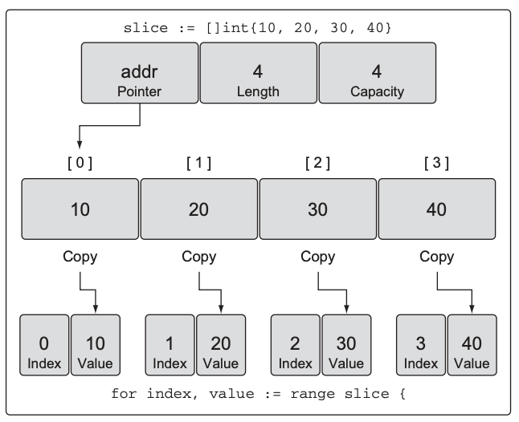

# 4강

[[toc]]

## 1. 배열의 내부 구조 및 원리
- 슬라이스와 맵은 기본적으로 배열을 기초로 구현된 데이터 구조이다.

### 1-1. 내부 구조
- Go의 배열은 동일한 타입의 원소가 연속된 블록에 저장되는 고정된 길이 데이터 타입
- 정수나 문자열같은 내장타입에 구조체 타입의 배열도 활용이 가능


- 배열 값 접근은 인덱스를 통해 가능하다.

### 1-2. 배열의 선언 및 초기화
- 배열을 선언할 땐 저장할 데이터의 타입과 저장할 원소의 개수를 지정하면 된다.

```go
var array [5]int
```

- 한번 데이터 타입이나 길이를 선언하면 변경이 불가능하다.
- 더많은 배열로 복사를 해야되면, 새로운 배열이 할당되고 복사되는 형태이다.
- Go에서 변수를 선언하면 이 변수들의 타입에 따라 적당한 제로 값으로 초기화된다.
- 정수 배열이면 0으로 초기화가 된다


- 배열의 선언과 동시에 초기화하는 방법은 배열 리터럴을 사용하면 된다.

```go
array2 := [5]int{1, 2, 3, 4, 5} 
```

- 갯수를 ...으로 선언하면 선언된 배열수에 맞춰 생성된다.

```go
array3 := [...]int{1, 2, 3, 4, 5}
```

- 배열의 길이를 선언하고, 그 중 일부만 선언하고 싶다면 아래와 같이 선언한다.

```go
array4 := [5]int{1: 10, 2: 20}
```

- 위의 배열은 아래 그림과 같이 초기화 된다.


### 1-3. 배열 활용하기
- 배열은 메모리에 순차적으로 위치하기 때문에 개별 원소 접근에 유리하다.
- 배열 개별 원소에 접근하기 위해선 []안에 인덱스 값을 넣어주면 된다.

```go
array5 := [5]int{10, 20, 30, 40, 50}

array5[2] = 25

결과 : [10 20 25 40 50]
```

- 배열에 포인터 사용도 가능하다.

```go
array6 := [5]*int{0: new(int), 1: new(int)}
    
*array6[0] = 10
*array6[1] = 20
```


- Go에서 배열은 값으로 취급 받아 연산자와 함께 사용이 가능하다.

```go
array7 := [5]string{"Red", "Blue", "Green", "Yellow", "Pink"}
var array8 [5]string
	
array8 = array7
```


- 다른 타입은 연산자 사용이 당연히 안된다.
- 포인터 배열을 복사도 가능하다.
- 복사하면 포인터가 가리키는 주소의 값이 아닌 포인터 값 자체가 복사된다.

```go
var array9 [3]*string

array10 := [3]*string{new(string), new(string), new(string)}

*array10[0] = "Red"
*array10[1] = "Blue"
*array10[2] = "Green"

array9 = array10

fmt.Println(*array9[0])
```


### 1-4. 다차원 배열
- 다차원도 가능하다

```go
var array [4][2]int
...
```

### 1-5. 함수에 배열 전달하기
- 엄청나게 큰 배열을 넘겨주는 형식이면, 매번 해당 배열이 새로 생성되어 메모리를 많이 먹는다.

```go
func main()  {
	var array [1e6]int
	foo(array)
	
}

func foo(array [1e6]int)  { // 매번 메모리 할당
	fmt.Println(array)
}
```

- 이런 문제를 해결하기 위해 포인터를 넘겨버리는 방법이 있다.

```go
func main()  {
	var array [1e6]int

	foo(&array)
}

func foo(array *[1e6]int)  {
	fmt.Println(array)
}
```

- 이러면 처음 할당된 8바이트의 메모리만 할당이 되지만, 문제는 주소값 참조라 값이 전부다 변경이 된다.

## 2. 슬라이스의 내부 구조 및 원리
- 슬라이스는 데이터 컬렉션을 처리할 수 있는 방법을 제공하는 데이터구조. 
- 슬라이스는 동적 배열의 개념으로 구현되었기 때문에 필요에 따라 컬렉션의 크기를 늘리거나 줄일 수 있다.
- 인덱싱, 반복에도 최적화 되어 있다.

### 2-1. 내부 구조
- 슬라이스는 배열을 추상화하여 조작하는 작은 객체
- 이 객체는 Go가 내부의 배열을 조작하는 데 필요한 메타데이터를 관리하는 세개의 필드로 구성되어 있다.


- 각각은 내부 배열에 대한 포인터, 슬라이스가 접근할 수 있는 요소의 개수, 최대 수용량이다.

### 4-2. 생성 및 초기화
#### make함수와 슬라이스 리터럴

```go
slice := make([]string, 5)
```

- 슬라이스 길이만 설정하면, 수용량도 동일해 진다.

```go
slice := make([]int, 3, 5)
```

- 이렇게 선언하면 크기는 5이다
- 길이보다 작은 슬라이스는 생성할 수 없다.

```go
slice := []string{"Red", "Blue", "Green", "Yellow", "Pink"}

slice := []int{10, 20, 30}
```

- 배열과의 차이점은 []안에 길이가 들어가는지 안들어가는지 이다.

#### nil 슬라이스와 빈 슬라이스
- nil 슬라이스는 초기화 코드를 선언하지 않으면 생성된다.

```go
var slice []int
```

- nil 슬라이스는 Go에서 슬라이스를 생성하는 가장 일반적인 방법이다.
- 슬라이스를 리턴하는 함수가 예외 상황이 발생하여 실제로 존재하지 않는 슬라이스를 리턴해야 할 때 유용하다.


- 또한 초기화를 통해 빈 슬라이스 생성이 가능하다.

```go
slice := make([]int, 0)

slice := []int {}
```


- 빈 슬라이스 내부 배열에 원소를 전혀 갖고 있지 않기 때문에 저장소가 할당되지 않는다. 

### 2-3. 슬라이스의 활용
#### 대입과 잘라내기
- 배열 표현식을 사용해 대입이 가능하다

```go
slice := []int{10, 20, 30, 40, 50}
slice[1] = 15

fmt.Println(slice)

결과 : [10 15 30 40 50]
```

- 슬라이스 일부를 잘라내 새로운 슬라이스 생성이 가능하다.

```go
newSlice := slice[1:3]

fmt.Println(newSlice)

결과 : [15 30]
```


- 슬라이스를 잘라내는 것도 결국 특정 위치를 참조하는 것 뿐이라, 한군대서 값이 바뀌면 전부다 바뀐다.

```go
slice := []int{10, 20, 30, 40, 50}

slice[1] = 15

newSlice := slice[1:3]
newSlice[1] = 35

fmt.Println(slice)
fmt.Println(newSlice)

결과 : 
[10 15 35 40 50]
[15 35]
```


#### 슬라이스의 크기를 확장하는 방법
- 슬라이스는 배열과는 다르게 원할 때 용량을 확장할 수 있다.
- append 함수를 사용하면 된다.

```go
slice := []int{10, 20, 30, 40, 50}

newSlice := slice[1:3]

newSlice = append(newSlice, 60)

fmt.Println(slice)
fmt.Println(newSlice)

결과 :
[10 20 30 60 50]
[20 30 60]
```

- 쪼갠거니 당연히 값이 바뀐다.


- 만약 슬라이스 내부 배열에 용량이 부족하면, append 함수는 새로운 내부 배열을 생성하고, 기존의 값들을 복사한 후 새로운 값을 추가한다.

```go
slice := []int{10, 20, 30, 40, 50}

newSlice := append(slice, 60)
fmt.Println(newSlice2)

결과 : [10 20 30 40 50 60]
```


- 용량이 늘어날 땐, 1000보다 작으면 2배씩 증가하고 1000보다 클땐 25퍼세트씩 늘어난다.

#### 슬라이스와 세 번째 인덱스
- 용량을 제한할 때 쓴다.

```go
source := []string{"Apple", "Orange", "Plum", "Banana", "Grape"}
```

- 위 슬라이스의 내부 구조는 다음과 같다


```go
slice := source[2:3:3]
```

- 이렇게 3개로 자르면, 길이와 용량은 다음과 같다

```go
slice[i:j:k] 를 실행할 경우
길이 : j - i
용량 : k - i
```


- 위의 그림처럼 구성된다.

```go
source := []string{"Apple", "Orange", "Plum", "Banana", "Grape"}

// 세 번째 원소를 잘라낸다. 이때 용량을 설정한다. 길이 및 용량이 1로 지정된다.
slice := source[2:3:3]

fmt.Println(slice)
	
// 슬라이스에 새로운 문자열을 추가한다
slice = append(slice, "Kiwi")

fmt.Println(slice)
fmt.Println(source)

결과 : 
[Plum]
[Plum Kiwi]
[Apple Orange Plum Banana Grape]
```

- 세번째 인덱스를 지정해줌으로써 기존 source 슬라이스에서 Banana 값은 변동이 없다.


- 슬라이스 두개를 ... 연사자를 이용해 합칠 수도 있다.

```go
s1 := []int{1, 2}
s2 := []int{3, 4}
s3 := append(s1, s2...)

[1, 2, 3, 4]
```
#### 슬라이스의 원소 반복하기
- range 키워드를 사용하자

```go
slice := []int{10, 20, 30, 40}

for i, value := range slice {
	fmt.Println(i, value)
}

결과 :
0 10
1 20
2 30
3 40
```

- range는 인덱스와 값 두개가 리턴된다.



- range는 참조 리턴이 아닌 값 복사본을 생성한다.

```go
for i, value := range slice {
	fmt.Printf("값 : %d 값의 주소 : %x 원소의 주소 : %x\n", value, &value, &slice[i])
}

결과 : 
값 : 10 값의 주소 : c0000b0020 원소의 주소 : c00009e020
값 : 20 값의 주소 : c0000b0020 원소의 주소 : c00009e028
값 : 30 값의 주소 : c0000b0020 원소의 주소 : c00009e030
값 : 40 값의 주소 : c0000b0020 원소의 주소 : c00009e038
```

- 위의 결과를 보면 값의 주소는 동일하다.
- 동일한 공간에 값만 넣는 형태인 것
- 인덱스가 필요없으면 _를 이용하자

```go
for _, value := range slice {
	fmt.Printf("값 : %d\n", value)
}
```

- 당연히 일반 for 문도 사용 가능하다.

```go
for i := 1 ; i < len(slice); i++ {
    ...
}
```

### 2-4. 다차원 슬라이스
- 슬라이스도 2차이상으로 설정이 가능하다.

```go
slice := [][]int{{10}, {100,200}}
```

### 2-5. 슬라이스를 함수에 전달하기
- 함수에 슬라이스를 전달하려면 그냥 슬라이스를 값으로 전달하기만 하면 된다.
- 슬라이스의 크기는 매우 작아서 복사하여 함수로 전달하는 비용이 크지 않다.

```go
func main()  {
	slice := make([]int, 1e6)
	slice = foo(slice)
}

func foo(slice []int) []int  {
	return slice
}
```

- 이렇게 foo에다가 슬라이스를 넣어봣자, 슬라이스 자체가 복사될 뿐, 데이터는 그대로 남아있다.
- 즉 용량이 거의 안먹는다는 소리


## 3. 맵의 내부 구조 및 원리
- 맵은 키/값의 쌍에 대한 정렬 없는 컬렉션이다.
- 맵은 키를 기준으로 값을 정한다.


### 3-1. 내부 구조
- 맵은 해쉬 테이블을 기반으로 구현되어 순서가 보장이 안된다.


### 3-2. 생성 및 초기화
- make함수를 사용해도 되고, 리터럴을 사용해도 된다.

```go
// string key , int value
dict := make(map[string]int)
	
//string key, string value
dict2 := map[string]string{"Red" : "red", "Orange" : "orange"}
```

- 키는 슬라이스, 함수, 슬라이스를 가진 구조체를 제외하곤 다 가능하다.

### 3-3. 맵 활용하기

```go
// 빈 맵 생성
colors := map[string]string{}
	
// 키, 밸류 설정해 값넣기
colors["Red"] = "red"
```

- nil 값을 가지는 맵 설정도 가능하다

```go
// 맵을 선언하기만 하면 nil 맵이 설정된다
var color map[string]string
```

- 키가 존재하는지 안하는지 확인이 중요하다.
- 맵을 조회하기 위해 존재 여부를 알려주는 bool값 플래그를 리턴해 준다.

```go
value, exists := colors["Blue"]

if exists {
	fmt.Println(value)
} else {
	fmt.Println("Key is not exist")
}
```

- 맵 안의 값을 삭제할 땐 delete 내장 함수를 쓴다.

```go
delete(colors, "Red")
```

### 3-4. 맵을 함수에 전달하기
- 슬라이스와 마찬가지로 맵 껍데기만 복사되서 값이 다같이 변경된다.

```go
func main()  {
	colors := map[string]string{
		"Red" : "red",
		"Yellow" : "yellow",
	}

	for _, value := range colors {
		fmt.Println("1:", value)
	}

	removeColor(colors)

	for _, value := range colors {
		fmt.Println("2:", value)
	}
}

func removeColor(colors map[string]string)  {
	delete(colors, "Red")
}

결과 :
1: red
1: yellow
2: yellow
```