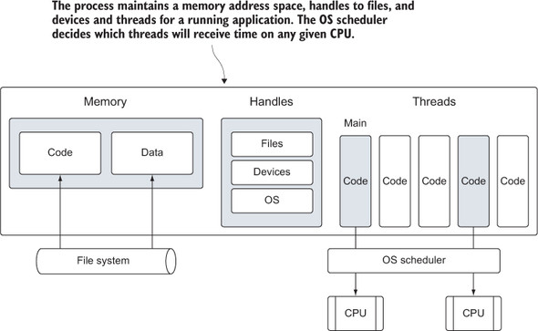
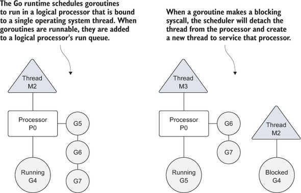
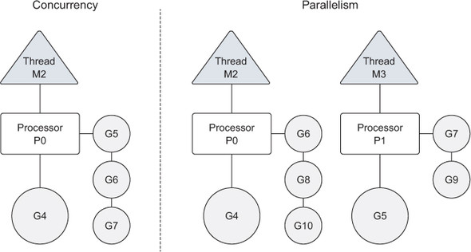
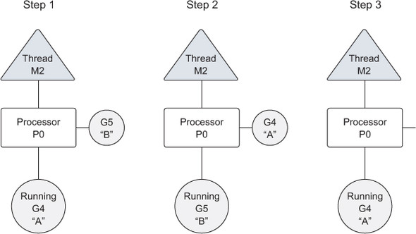
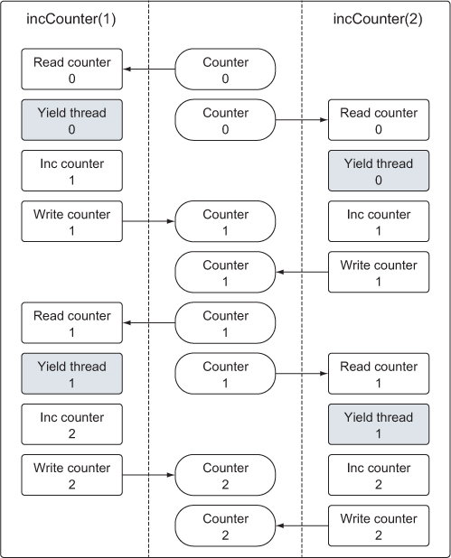
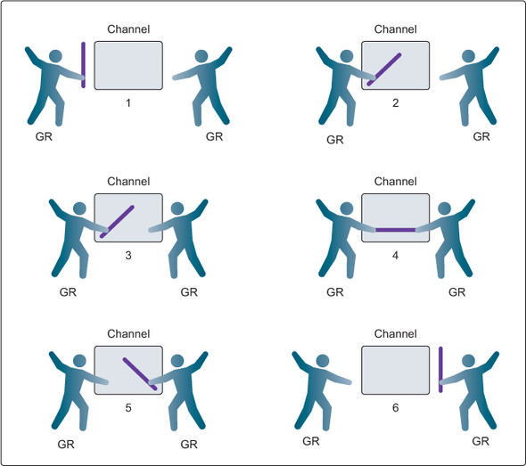
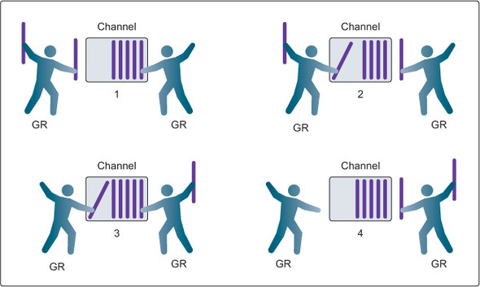

# 6강

[[toc]]

## 1. 동시성과 병렬성
- 특정 시스템이 실행되면, 프로세스가 시작된다.
- 프로세스는 어플리케이션이 실행되는 동안 사용하고 관리하는 모든 리소스를 가진 일종의 컨터이너



- 위의 그림은 어떤 프로세스에도 할당될 수 있는 공통의 자원을 가진 프로세스의 모습
- 메모리 주소공간, 파일 및 장치, 스레드에 대한 핸들 등 다양한 자원들이 포함되어있다.
- 최초로 실행된 스레드는 메인 스레드 라고 불린다.
- 메인스레드가 종료되면 해당 프로그램도 종료가 된다.
- Go에서는 논리 프로세서를 각 물리 프로세서에 할당하고, 논리 프로세서에서 고루틴을 동시적으로 돌린다.
- 수백 수천의 고루틴을 동시에 실행시켜 효율과 성능을 향상시킨다.



- 위의 그림을 보면 운영체제 스레드와 논리 프로세서, 그리고 지역 실행 큐(local run queue)의 관계를 알 수 있다.
- 고루틴이 생성되고 실행할 준비가 되면 스케줄러의 범용 실행 큐(global run queue)에 위치한다. 
- 그리고 논리 프로세서가 할당되어 해당 프로세서의 지역 실행 큐에 위치한다.
- 이후 논리 프로세서가 자신을 실행 할 때 까지 기다리게 된다.
- 중간에 고루틴이 실행을 중단해야되면, 논리프로세서로부터 스레드와 고루틴이 분리되고, 스레든느 시스템 콜이 리턴될 떄까지 기다린다.
- 그러면 논리 프로세서는 할당된 스레드가 없는 상태가 되어, 스케줄러가 새로운 스레드를 생성하여 논리 프로세서에 다시 연결해 지역 실행 큐에서 다른 고루틴을 선택해 돌린다.
- 반복

<hr />

- 병렬성은 여러개의 코드가 각기 다른 물리적인 프로세서에서 동시에 실행되는 것이다.
- 즉 한번에 여러개의 작업을 수행할 수 있다.
- 동시성은 조금 다른 개념으로, 한번에 여러 작업을 관리하는(managing) 작업이다.
- 보통 동시성이 병렬성보다 성능이 더 좋은데, 운영체제와 하드웨어에 가해지는 부담이 적어서 시스템이 일을 더 효율적으로 하기 때문
- 고루틴을 병렬적으로 실행하고 싶으면, 여러개의 논리프로세서에 고루틴을 골고루 분배해 고루틴이 별개의 스레드에서 실행되게 하는것
- 하지만 진정한 의미의 병렬은 여러개의 물리 멀티프로세서에서 프로그램을 실행해야 한다.



## 2. 고루틴
- 하나의 논리 프로세서에서 고루틴을 실행하는 예제 생성해보자

```go
package main

import (
	"fmt"
	"runtime"
	"sync"
)

func main()  {
	// 스케쥴러가 하나의 논리 프로세서를 할당
	runtime.GOMAXPROCS(1)

	// wg는 프로그램의 종료를 대기하기 위해 사용
	// 각각의 고루틴마다 하나씩, 총 두 개의 카운트를 추가한다.

	var wg sync.WaitGroup
	wg.Add(2)

	fmt.Println("고루틴을 실행합니다.")

	// 익명 함수를 선언하고 고루틴을 생성한다.
	go func() {
		// main 함수에게 종료를 알리기 위한 Done 함수 호출을 예약
		defer wg.Done()

		// 알파벳을 세번 출력
		for count := 0; count < 3; count++ {
			for char := 'a'; char < 'a'+26; char++ {
				fmt.Printf("%c ", char)
			}
		}
	}()

	fmt.Println()

	// 익명 함수를 선언하고 고루틴을 생성한다.
	go func() {
		defer wg.Done()

		for count := 0; count < 3; count++ {
			for char := 'A'; char < 'A'+26; char++ {
				fmt.Printf("%c ", char)
			}
		}
	}()

	// 고루틴이 종료 될 때까지 대기한다.
	wg.Wait()
	fmt.Println("대기중!!")
	fmt.Println("프로그램 종료!")
}
```

- runtime 패키지의 GOMAXPROC를 통해 논리프로세서 수를 설정해 준다.
- 두개의 고루틴은 하나의 논리 프로세서에서 동시적으로 실행된다.
- 고루틴이 완료되기 전에 메인함수가 끝나버릴 수 있으니, WaitGroup을 이용해 메인 함수 종료를 제어해준다.
- WaitGroup은 카운팅 세마포어를 이용해 실행 중인 고루틴의 기록을 관리한다.
- WaitGroup의 값이 0보다 큰 값이면 Wait 메소드의 실행이 블록된다.
- 명시적으로 2개의 waitgroup을 추가해줬고, 하나의 고루틴이 끝날떄마다 wg.Done을 해줘서 총 2번의 카운팅이 돼야 wg.Wait가 종료된다.
- 내부 스케줄러에 의해 독점을 막기위해 고루틴이 실행중에 멈추고 다른 고루틴이 실행 될 떄가 있다.



- 해당 그림을 확인해보기 위해 작업 시간이 오래걸리는 고루틴을 작성해보면

```go
package main

import (
	"fmt"
	"runtime"
	"sync"
)

var wg sync.WaitGroup

func main()  {
	runtime.GOMAXPROCS(1)

	wg.Add(2)

	fmt.Println("Start Goroutine!")

	go printPrime("A")
	go printPrime("B")

	wg.Wait()
	fmt.Println("Done")
}

func printPrime(prefix string)  {
	defer wg.Done()

	next:
		for outer := 2; outer < 100000; outer++ {
			for inner := 2; inner < outer; inner++ {
				if outer % inner == 0 {
					continue next
				}
			}
			fmt.Printf("%s:%d\n", prefix, outer)
		}

		fmt.Println("완료: ", prefix)

}
```

- 결과값이 AB왔다갔다 한다 (내컴에선 안됨.. 논리 프로세서를 여러개로 두면 왔다갔다함 병렬이라 그렇겠지만)
- 여러개의 프로세서로 병렬처리하려면

```go
runtime.GOMAXPROCS(runtime.NumCPU())
```

- 이렇게 해주면 된다.
- 무조건 프로세서를 늘려준다고 성능이 향상되는건 아니니 잘쓰도록 하자

## 3. 경쟁 상태
- 두 개 혹은 그 이상의 고루틴이 동기화 없이 동시에 공유된 자원에 접근하여 읽기 쓰기를 하면 경쟁상태에 놓인다.
- 경쟁상태는 동시성 프로그래밍에서 버그를 유발하고 찾기도 어렵다.
- 즉 읽기 및 쓰기 작업은 반드시 원자성을 가져야 한다.

```go
package main

import (
	"fmt"
	"runtime"
	"sync"
)

var (
	// 모든 고루틴이 값을 증가라혀고 시도하는 변수
	counter int

	wg sync.WaitGroup
)

func main()  {
	wg.Add(2)

	go incCounter(1)
	go incCounter(2)

	wg.Wait()

	fmt.Println("최종결과 : ", counter)
}

func incCounter(id int)  {
	defer wg.Done()

	for count := 0; count < 2; count++ {
		value := count

		// 스레드를 양보하여 큐로 돌아가도록 한다.
		runtime.Gosched()

		value++

		counter = value
	}
}

최종결과 : 2
```

- 예상 했던 결과는 4가 되어야 하는데 2가 나온다.



- 그림을 보면 두 개의 고루틴은 각각 다른 고루틴이 증가시킨 카운터 값을 덮어 쓴다.
- 예제는 값을 복사하고 보관하다가 다른 고루틴에게 실행을 양보한 이후에 값을 증가시킨다.
- 즉 다른 고루틴 입장에선 값이 증가된 상황을 알 지 못해 위와 같은 결과가 나온다.
- go에서는 이런 경쟁상태를 검사할 수 있는 도구를 제공한다.

```go
go build -race deadlock1

./deadlock1

==================
WARNING: DATA RACE
Write at 0x00000121e848 by goroutine 7:
  main.incCounter()
      /Users/ted/github/golang/src/github.com/gwegwe1234/go-in-action/chapter6/deadlock1.go:38 +0x74

Previous write at 0x00000121e848 by goroutine 6:
  main.incCounter()
      /Users/ted/github/golang/src/github.com/gwegwe1234/go-in-action/chapter6/deadlock1.go:38 +0x74

Goroutine 7 (running) created at:
  main.main()
      /Users/ted/github/golang/src/github.com/gwegwe1234/go-in-action/chapter6/deadlock1.go:20 +0x89

Goroutine 6 (finished) created at:
  main.main()
      /Users/ted/github/golang/src/github.com/gwegwe1234/go-in-action/chapter6/deadlock1.go:19 +0x68
==================
```

- 38, 38, 20 , 19 번째줄에서 경쟁상태가 있다는 식으로 알려준다.

## 4. 공유 자원 잠금
- atomic 패키지와 sync 패키지를 사용해 공유자원을 잠그고 컨트롤을 할 수가 있다.

### 4-1. 원자성 함수들
```go
package main

import (
	"fmt"
	"runtime"
	"sync"
	"sync/atomic"
)

var (
	counter int64

	wg sync.WaitGroup
)

func main()  {
	wg.Add(2)

	go incCounter(1)
	go incCounter(2)

	wg.Wait()

	fmt.Println("Result : ", counter)
}

func incCounter(id int)  {
	defer wg.Done()

	for count := 0; count < 2; count++ {
		atomic.AddInt64(&counter, 1)

		runtime.Gosched()
	}
}

Result :  4
```

- AddInt64를 사용하면 정수값을 더할 때 오직 한 개의 고루틴만 접근이 가능하도록 보장해준다.
- 고루틴이 원자성 함수를 호출하면 함수가 참조하는 변수에 대한 동기화가 자동적으로 수행된다.
- atomic 패키지의 LoadInt64와 StoreInt64 함수도 쓸만하다

```go
package main

import (
	"fmt"
	"sync/atomic"
	"time"
	"sync"
)

var (
	shutdown int64

	wg sync.WaitGroup
)

func main()  {
	wg.Add(2)

	go doWork("A")
	go doWork("B")

	// 고루틴이 작업할 시간을 1초 줌
	time.Sleep(1 * time.Second)

	// 종료 플래그 설정
	fmt.Println("프로그램 종료!")
	atomic.StoreInt64(&shutdown, 1)

	wg.Wait()
}

func doWork(name string)  {
	defer wg.Done()

	for {
		fmt.Printf("작업 진행중 : %s\n", name)
		time.Sleep(250 * time.Millisecond)

		// 종료 플래그 확인
		if atomic.LoadInt64(&shutdown) == 1 {
			fmt.Printf("작업을 종료합니다: %s\n", name)
			break
		}
	}
}

작업 진행중 : A
작업 진행중 : B
작업 진행중 : A
작업 진행중 : B
작업 진행중 : A
작업 진행중 : B
작업 진행중 : B
작업 진행중 : A
프로그램 종료!
작업을 종료합니다: A
작업을 종료합니다: B
```

- 고루틴 안의 for문이 atomic에 값이 저장도리 때까지 돌게된다.

### 4-2. 뮤텍스
- 뮤텍스를 통해 공유 자원에 대한 접근을 동기화할 수 있다.

```go
package main

import (
	"fmt"
	"runtime"
	"sync"
)

var (
	counter int
	wg sync.WaitGroup
	mutex sync.Mutex
)

func main()  {
	wg.Add(2)

	go incCounter(1)
	go incCounter(2)

	wg.Wait()
	fmt.Printf("Result : %d", counter)
}

func incCounter(id int)  {
	defer wg.Done()

	for count := 0; count < 2; count++ {
		//이 임계 지역에는 한번에 하나의 고루틴만 접근 가능
		mutex.Lock()
		{
			value := counter

			runtime.Gosched()

			value++

			counter = value
		}
		mutex.Unlock()
	}
}

Result : 4
```

- 값을 보호하고 싶은 전 후로 mutex.Lock() / mutex.Unlock()을 걸어준다.
- Unlock이 되기 전에 다른 고루틴은 임계 지점으로 들어갈 수가 없다.

## 5. 채널
- 필요한 공유 자원을 다른 고루틴에 보내거나 받아 고루틴 사이의 동기화를 지원해주는 *채널* 존재
- 채널 생성은 make 내장 함수를 사용한다.

```go
// 버퍼의 크기가 정해지지 않은 정수 채널
unbuffered := make(chan int)
	
// 버퍼의 크기가 정해진 문자열 채널
buffered := make(chan string, 10)
```

- 채널을 통해 값이나 포인터를 보내려면 다음과 같이 <- 연산자를 사용한다.

```go
buffered := make(chan string, 10)
	
buffered <- "Gopher"
```

- 값을 가져올 때도 <- 를 사용한다.

```go
value := <- buffered
```

- 버퍼가 없는 채널과 있는 채널은 조금 다르게 동작한다.

### 5-1. 버퍼가 없는 채널
- 채널을 사용 할 때, 채널에 값을 보내거나 받기 전에 값을 전달하는 고루틴과 전달받는 고루틴이 같은 시점에 채널을 사용할 준비가 되어야 한다.
- 만약 한쪽은 주고 한쪽은 받을 준비가 안되있으면, 고루틴은 대기작업에 들어가게 돼 고루틴들이 비정상 작동을 한다.



- 버퍼가 없는 채널을 사용 할 때 고루틴 사이의 동기화 과정이다.
- 3번처럼 둘다 손을 넣듯이 둘다 준비가 되어 있어야 한다.
- 고루틴의 값이 교환 될 때까지 고루틴들은 잠금 상태가 된다.

```go
package main

import (
	"fmt"
	"math/rand"
	"sync"
	"time"
)

var (
	wg sync.WaitGroup
)

func init()  {
	rand.Seed(time.Now().UnixNano())
}

func main()  {
	court := make(chan int)
	
	wg.Add(2)

	// 두명의 선수
	go player("Sunny", court)
	go player("Cindy", court)

	court <- 1

	wg.Wait()
}

func player(name string, court chan int)  {
	defer wg.Done()

	for {
		// 공이 되돌아 올 때까지 기다린다.
		ball, ok := <- court
		if !ok {
			// 채널이 닫혔으면 승리한 것으로 간주한다.
			fmt.Printf("%s 선수가 승리했습니다! \n", name)
			return
		}

		// 랜덤 값을 이용해 공을 받아치지 못했는지 확인
		n := rand.Intn(100)
		if n%13 == 0 {
			fmt.Printf("%s 선수가 공을 받아치지 못했습니다.\n", name)

			// 채널을 닫아 현재 선수가 패배했음을 알린다.
			close(court)
			return
		}

		// 선수가 공을 받아친 횟수를 출력하고 그 값을 증가시킨다.
		fmt.Printf("%s 선수가 %d 번째 공을 받아 쳤습니다. \n", name, ball)
		ball++

		// 공을 상대에게 보낸다.
		court <- ball
	}
}
```

- 두 고루틴 사이에 공을 쳐낸 횟수를 교환하기 위해 int 타입의 버퍼 크기가 정해지지 않은 채널을 생성한다.
- 실제로 player 함수내에서 court 값을 주고받으면서, 한쪽이 조건문에 걸려서 채널을 close 할때까지 핑퐁하게 된다.
- 한쪽이 닫으면 다른 고루틴은 ball, ok 쪽에서 ok가 false가 오므로, 고루틴이 정상적으로 종료가 된다.

```go
package main

import (
	"fmt"
	"sync"
	"time"
)

var wg sync.WaitGroup

func main()  {
	baton := make(chan int)

	wg.Add(1)

	go Runner(baton)

	// 경기 시작!
	baton <- 1

	wg.Wait()
}

func Runner(baton chan int)  {
	var newRunner int

	// 바통을 전달 받을 때 까지 기다린다.
	runner := <- baton

	// 트랙을 달린다.
	fmt.Printf("%d 번째 주자가 바통을 받아 달리기 시작합니다! \n", runner)

	// 새로운 주자가 교체 지점에서 대기
	if runner != 4 {
		newRunner = runner + 1
		fmt.Printf("%d 번째 주자가 대기합니다. \n", newRunner)
		go Runner(baton)
	}

	// 트랙을 달린다
	time.Sleep(100 * time.Millisecond)

	// 경기가 끝났는지 확인
	if runner == 4 {
		fmt.Printf("%d 번째 주자가 도착했습니다. 경기가 끝났습니다.", runner)
		wg.Done()
		return
	}

	// 다음 주자에게 바통을 넘긴다.
	fmt.Printf("%d 번째 주자가 %d 번째 주자에게 바통을 넘겨줍니다.\n", runner, newRunner)

	baton <- newRunner
}

1 번째 주자가 바통을 받아 달리기 시작합니다! 
2 번째 주자가 대기합니다. 
1 번째 주자가 2 번째 주자에게 바통을 넘겨줍니다.
2 번째 주자가 바통을 받아 달리기 시작합니다! 
3 번째 주자가 대기합니다. 
2 번째 주자가 3 번째 주자에게 바통을 넘겨줍니다.
3 번째 주자가 바통을 받아 달리기 시작합니다! 
4 번째 주자가 대기합니다. 
3 번째 주자가 4 번째 주자에게 바통을 넘겨줍니다.
4 번째 주자가 바통을 받아 달리기 시작합니다! 
4 번째 주자가 도착했습니다. 경기가 끝났습니다.
```

- Runner 클래스 중간에 go Runner는 채널값이 옮겨지기 전까진 대기한다.

### 5-2. 버퍼가 있는 채널
- 버퍼가 있는 채널은 고루틴이 값을 받아가기 전까지 채널에 보관할 수 있는 값의 개수를 지정할 수 있다.
- 이 채널을 이용해 보내고 받는 동작을 하면, 반드시 동시에 일어날 필요는 없다.
- 값을 받는 작업의 잠금 작업은 채널 내에 받아갈 값이 없을 때만 실행된다.
- 값을 보내는 작업의 잠금은 채널 내 버퍼가 가득 차서 더이상 값을 보관할 수 없을떄만 실행한다.
- 즉 버퍼가 없는 채널은 보내고 받는 동작이 반드시 동기적으로 작업하는 반면, 버퍼가 있는 채널은 보장할 수 없다.



```go
package main

import (
	"fmt"
	"math/rand"
	"sync"
	"time"
)

const (
	nuberGoroutines = 4
	taskLoad = 10
)

var wg sync.WaitGroup

func init()  {
	rand.Seed(time.Now().Unix())
}

func main()  {
	// 버퍼가 있는 채널 생성
	tasks := make(chan string, taskLoad)

	wg.Add(nuberGoroutines)

	// 작업을 처리할 고루틴을 실행한다.
	for gr := 1 ; gr <= nuberGoroutines; gr++ {
		go worker(tasks, gr)
	}

	// 실행할 작업을 추가한다.
	for post := 1; post <= taskLoad; post++ {
		tasks <- fmt.Sprintf("작업 : %d", post)
	}

	close(tasks)

	wg.Wait()
}

func worker(tasks chan string, worker int) {
	defer wg.Done()

	for {
		// 작업이 할당될 때까지 대기한다.
		task, ok := <- tasks

		if !ok {
			// 채널이 닫힌 경우
			fmt.Printf("작업자 : %d : 종료합니다. \n", worker)
			return
		}

		fmt.Printf("작업자 : %d : 작업시작 : %s\n", worker, task)

		sleep := rand.Intn(100)

		time.Sleep(time.Duration(sleep) * time.Millisecond)

		fmt.Printf("작업자 : %d : 작업 완료 : %s\n", worker, task)
	}
}
```

- 4개의 고루틴을 생성하고, 10개의 작업을 버퍼에 넣는다.
- 채널이 닫히더라도, 각 고루틴들은 더 이상 받을 값이 없을 때까지 채널에서 계속 값을 받는다.
- 즉 값의 유실을 막아주기 위해 버퍼 채널 내에 있는 값들은 무조건 보장해 주는것

## 6. 요약
- 동시성이란 고루틴을 독립적으로 실행하는 기능
- 함수는 go 키워드를 이용해 고루틴으로 동작
- 고루틴은 하나의 운영체제 스레드와 실행 큐를 가진 논리 프로세서의 범위 내에서 실행
- 경쟁 상태란 두 개 혹은 그 이상의 고루틴이 동일한 자원에 접근하려고 시도하는 현상
- 원자성 함수들과 뮤텍스는 경쟁 상태를 피해 공유되는 자원응ㄹ 보호할 방법을 제공
- 채널은 두 고루틴 사이의 공유 데이터를 본질적으로 안전하게 보호하는 방법을 제공
- 버퍼가 없는 채널은 데이터가 반드시 교환될 수 있도록 보장하고, 버퍼가 잇는 채널은 그렇지 않다.