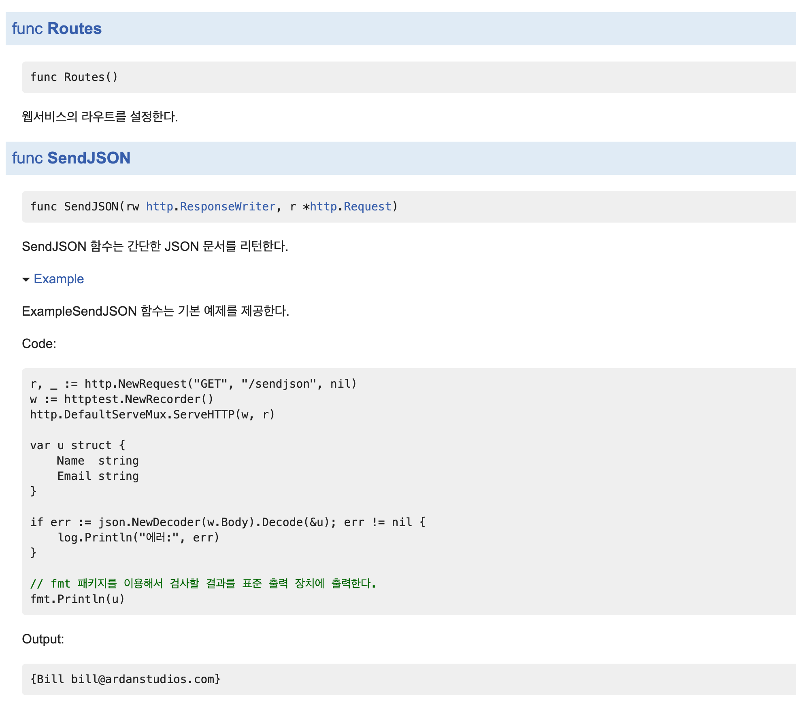

# 9강

[[toc]]

## 1. 단위 테스트
- Go에서는 단위 테스트를 작성하는 여러가지 방법이 있다.
    - *기본테스트*는 특정 코드에 단일 매개변수와 리턴 결과만을 테스트 한다.
    - *테이블테스트*는 여러 개의 매개변수와 리턴 결과의 조합을 테스트 한다.
    - mock 객체를 만들어 테스트하는 방법도 존재한다.
    - 웹 서비스 개발 시에 실제로 서비스를 실해앟지 않고 서비스에 웹 요청이 들어오는 테스트도 가능하다.

### 1-1. 기본 단위 테스트
```go
package chapter9

import (
	"net/http"
	"testing"
)

const checkMark = "\u2713"
const ballotX = "\u2717"

func TestDownload(t *testing.T)  {
	url := "http://www.goinggo.net/feeds/posts/default?alt=rss"
	statusCode := 200

	t.Log("콘텐츠 다운로드 기능 테스트 시작!")
	{
		t.Logf("\tUrl \"%s\" 호출 시 상태 코드가 \"%d\"인지 확인.", url, statusCode)
		{
			resp, err := http.Get(url)
			if err != nil {
				t.Fatal("\t\tHTTP GET 요청을 보냈는지 확인", ballotX, err)
			}
			t.Log("\t\tHTTP GET 요청을 보냈는지 확인", checkMark)

			defer resp.Body.Close()

			if resp.StatusCode == statusCode {
				t.Logf("\t\t상태코드가 \"%d\"인지 확인 %v %v", statusCode, ballotX, resp.StatusCode)
			}
		}
	}
}

go test -v
=== RUN   TestDownload
--- PASS: TestDownload (5.52s)
    basictest_test.go:15: 콘텐츠 다운로드 기능 테스트 시작!
    basictest_test.go:17:       Url "http://www.goinggo.net/feeds/posts/default?alt=rss" 호출 시 상태 코드가 "200"인지 확인.
    basictest_test.go:23:               HTTP GET 요청을 보냈는지 확인 ✓
    basictest_test.go:28:               상태코드가 "200"인지 확인 ✗ 200
PASS
ok      github.com/gwegwe1234/go-in-action/chapter9     5.537s

```

- 테스트를 실행 할 땐 go test -v 를 친다.
- 고에선 _test.go 라고 된 파일만 테스트 파일로 간주한다.
- testing 패키지는 테스트 프레임워크부터 테스트의 결과를 출력하고 보고하기 위한 모든 것을 제공하낟.
- 테스트 함수는 반드시 외부 공개(대문자로시작) 함수여야 한다.
- 각 테스트 함수는 해당 테스트가 어떤 이유에서 필요한지 서술해야한다.
- 그 다음엔 언제 어떻게 코드가 테스트가 될 것인지 서술해야 한다.
- 테스트가 성공했건 실패 했건 테스트의 결과가 어떤지 서술해주어야 한다.
- x나 checkbox 표시를 해주도록 하자.

### 1-2. 테이블 테스트
- 각기 다른 매개변수에 대해 각기 다른 결과를 리턴하는 코드를 테스트할 때는 테이블 테스트를 사용한다.

```go
// 테이블 테스트를 설명하기 위한 예제
package chapter9

import (
	"net/http"
	"testing"
)

const checkMark = "\u2713"
const ballotX = "\u2717"

// TestDownload 함수는 HTTP GET 함수를 이용해 콘텐츠를 다운로드하고
// 각기 다른 결과 상태를 확인한다.
func TestDownload(t *testing.T) {
	var urls = []struct {
		url        string
		statusCode int
	}{
		{
			"http://www.goinggo.net/feeds/posts/default?alt=rss",
			http.StatusOK,
		},
		{
			"http://rss.cnn.com/rss/cnn_topstbadurl.rss",
			http.StatusNotFound,
		},
	}

	t.Log("각각 다른 콘텐츠에 대한 다운로드를 확인한다.")
	{
		for _, u := range urls {
			t.Logf("\tURL \"%s\" 호출시 상태 코드가 \"%d\"인지 확인.",
				u.url, u.statusCode)
			{
				resp, err := http.Get(u.url)
				if err != nil {
					t.Fatal("\t\tHTTP GET 요청을 보냈는지 확인.",
						ballotX, err)
				}
				t.Log("\t\tHTTP GET 요청을 보냈는지 확인.",
					checkMark)

				defer resp.Body.Close()

				if resp.StatusCode == u.statusCode {
					t.Logf("\t\t상태 코드가 \"%d\" 인지 확인. %v",
						u.statusCode, checkMark)
				} else {
					t.Errorf("\t\t상태 코드가 \"%d\" 인지 확인. %v %v",
						u.statusCode, ballotX, resp.StatusCode)
				}
			}
		}
	}
}
```

- for loop 을 활용해 여러개의 테스트를 한번에 하고 있다.
- struct로 테이블을 구성해 테스트 하고있다.

### 1-3. 모의 호출
- 위의 테스트들은 성공적이긴 하지만, 인터넷 환경에 종속적인 문제점이 있다.
- mock을 생성해 인터넷에 접근이 안돼도 정상적으로 테스트가 되도록 해줘야 한다.
- http를 하기위한 모의 패키지로 httptest 패키지가 존재한다.

```go
// HTTP GET의 모의 호출을 사용하는 예제
// 책에서 사용한 예제와는 다소 다른 부분이 있다.
package listing12

import (
	"encoding/xml"
	"fmt"
	"net/http"
	"net/http/httptest"
	"testing"
)

const checkMark = "\u2713"
const ballotX = "\u2717"

// feed 변수에는 우리가 기대하는 모의 응답 데이터를 대입한다.
var feed = `<?xml version="1.0" encoding="UTF-8"?>
<rss>
<channel>
    <title>Going Go Programming</title>
    <description>Golang : https://github.com/goinggo</description>
    <link>http://www.goinggo.net/</link>
    <item>
        <pubDate>Sun, 15 Mar 2015 15:04:00 +0000</pubDate>
        <title>Object Oriented Programming Mechanics</title>
        <description>Go is an object oriented language.</description>
        <link>http://www.goinggo.net/2015/03/object-oriented</link>
    </item>
</channel>
</rss>`

// mockServer 함수는 GET 요청을 처리할 서버에 대한 포인터를 리턴한다.
func mockServer() *httptest.Server {
	f := func(w http.ResponseWriter, r *http.Request) {
		w.WriteHeader(200)
		w.Header().Set("Content-Type", "application/xml")
		fmt.Fprintln(w, feed)
	}

	return httptest.NewServer(http.HandlerFunc(f))
}

// TestDownload 함수는 HTTP GET 요청을 이용해 콘텐츠를 다운로드 한 후
// 해당 콘텐츠를 언마샬링 할 수 있는지 확인한다.
func TestDownload(t *testing.T) {
	statusCode := http.StatusOK

	server := mockServer()
	defer server.Close()

	t.Log("콘텐츠 다운로드 기능 테스트를 시작.")
	{
		t.Logf("\tURL \"%s\" 호출 시 상태 코드가 \"%d\"인지 확인.",
			server.URL, statusCode)
		{
			resp, err := http.Get(server.URL)
			if err != nil {
				t.Fatal("\t\tHTTP GET 요청을 보냈는지 확인.",
					ballotX, err)
			}
			t.Log("\t\tHTTP GET 요청을 보냈는지 확인.",
				checkMark)

			defer resp.Body.Close()

			if resp.StatusCode != statusCode {
				t.Fatalf("\t\t상태 코드가 \"%d\" 인지 확인. %v %v",
					statusCode, ballotX, resp.StatusCode)
			}
			t.Logf("\t\t상태 코드가 \"%d\" 인지 확인. %v",
				statusCode, checkMark)

			var d Document
			if err := xml.NewDecoder(resp.Body).Decode(&d); err != nil {
				t.Fatal("\t\t콘텐츠 언마샬링에 실패했습니다.",
					ballotX, err)
			}
			t.Log("\t\t콘텐츠 언마샬링이 성공했습니다.",
				checkMark)

			if len(d.Channel.Items) == 1 {
				t.Log("\t\t피드에 \"1\" 개의 아이템이 존재하는지 확인.",
					checkMark)
			} else {
				t.Error("\t\t피드에 \"1\" 개의 아이템이 존재하는지 확인.",
					ballotX, len(d.Channel.Items))
			}
		}
	}
}

// Item defines the fields associated with the item tag in
// the buoy RSS document.
type Item struct {
	XMLName     xml.Name `xml:"item"`
	Title       string   `xml:"title"`
	Description string   `xml:"description"`
	Link        string   `xml:"link"`
}

// Channel defines the fields associated with the channel tag in
// the buoy RSS document.
type Channel struct {
	XMLName     xml.Name `xml:"channel"`
	Title       string   `xml:"title"`
	Description string   `xml:"description"`
	Link        string   `xml:"link"`
	PubDate     string   `xml:"pubDate"`
	Items       []Item   `xml:"item"`
}

// Document defines the fields associated with the buoy RSS document.
type Document struct {
	XMLName xml.Name `xml:"rss"`
	Channel Channel  `xml:"channel"`
	URI     string
}
```

- mockServer 함수를 정의해 가짜 함수를 만들어줘서, 미리 feed에다가 예측값을 받아와준다.

### 1-4. 종단점 테스트
- endopoint 테스트가 필요할 때도 있다.

```go
// 간단한 웹서비스 예제
package main

import (
	"github.com/gwegwe1234/go-in-action/chapter9/endpoint/handler"
	"log"
	"net/http"
)

// 애플리케이션 진입점
func main() {
	handlers.Routes()

	log.Println("웹서비스 실행 중: 포트: 4000")
	http.ListenAndServe(":4000", nil)
}
```

```go
// 웹서비스의 종단점을 제공하는 패키지
package handlers

import (
	"encoding/json"
	"net/http"
)

// 웹서비스의 라우트를 설정한다.
func Routes() {
	http.HandleFunc("/sendjson", SendJSON)
}

// SendJSON 함수는 간단한 JSON 문서를 리턴한다.
func SendJSON(rw http.ResponseWriter, r *http.Request) {
	u := struct {
		Name  string
		Email string
	}{
		Name:  "Bill",
		Email: "bill@ardanstudios.com",
	}

	rw.Header().Set("Content-Type", "application/json")
	rw.WriteHeader(200)
	json.NewEncoder(rw).Encode(&u)
}
```

```go
// 종단점의 동작을 확인하기 위한
// 테스트 코드 예제
package handlers_test

import (
	"encoding/json"
	"net/http"
	"net/http/httptest"
	"testing"

	"github.com/webgenie/go-in-action/chapter9/listing17/handlers"
)

const checkMark = "\u2713"
const ballotX = "\u2717"

func init() {
	handlers.Routes()
}

// TestSendJSON 함수는 종단점에 대한 테스트를 수행한다.
func TestSendJSON(t *testing.T) {
	t.Log("SendJSON 종단점의 동작에 대한 테스트 시작.")
	{
		req, err := http.NewRequest("GET", "/sendjson", nil)
		if err != nil {
			t.Fatal("\t웹 요청을 보내는지 확인.",
				ballotX, err)
		}
		t.Log("\t웹 요청을 보내는지 확인.",
			checkMark)

		rw := httptest.NewRecorder()
		http.DefaultServeMux.ServeHTTP(rw, req)

		if rw.Code != 200 {
			t.Fatal("\t응답 코드가 \"200\"인지 확인.", ballotX, rw.Code)
		}
		t.Log("\t응답 코드가 \"200\"인지 확인.", checkMark)

		u := struct {
			Name  string
			Email string
		}{}

		if err := json.NewDecoder(rw.Body).Decode(&u); err != nil {
			t.Fatal("\t응답 데이터 디코딩 동작 확인.", ballotX)
		}
		t.Log("\t응답 데이터 디코딩 동작 확인.", checkMark)

		if u.Name == "Bill" {
			t.Log("\t응답 데이터의 이름 확인.", checkMark)
		} else {
			t.Error("\t응답 데이터의 이름 확인.", ballotX, u.Name)
		}

		if u.Email == "bill@ardanstudios.com" {
			t.Log("\t응답 데이터의 메일 주소 확인.", checkMark)
		} else {
			t.Error("\t응답 데이터의 메일 주소 확인.", ballotX, u.Email)
		}
	}
}

go test -v
=== RUN   TestSendJSON
--- PASS: TestSendJSON (0.00s)
    handler_test.go:23: SendJSON 종단점의 동작에 대한 테스트 시작.
    handler_test.go:30:         웹 요청을 보내는지 확인. ✓
    handler_test.go:39:         응답 코드가 "200"인지 확인. ✓
    handler_test.go:49:         응답 데이터 디코딩 동작 확인. ✓
    handler_test.go:52:         응답 데이터의 이름 확인. ✓
    handler_test.go:58:         응답 데이터의 메일 주소 확인. ✓
PASS
ok      github.com/gwegwe1234/go-in-action/chapter9/endpoint/handler    0.010s
```

## 2. 예제 코드
- godoc이 제공하는 또다른 기능은 예제 코드이다.
- 패키지에 대한 Go 문서를 생성할 때 예제 코드를 함께 생성할 수 있다.

```go
// 테스트 코드 작성법을 소개 하기 위한 예제 단위 테스트 코드
package handlers

import (
	"encoding/json"
	"fmt"
	"log"
	"net/http"
	"net/http/httptest"
)

// ExampleSendJSON 함수는 기본 예제를 제공한다.
func ExampleSendJSON() {
	r, _ := http.NewRequest("GET", "/sendjson", nil)
	w := httptest.NewRecorder()
	http.DefaultServeMux.ServeHTTP(w, r)

	var u struct {
		Name  string
		Email string
	}

	if err := json.NewDecoder(w.Body).Decode(&u); err != nil {
		log.Println("에러:", err)
	}

	// fmt 패키지를 이용해서 검사할 결과를 표준 출력 장치에 출력한다.
	fmt.Println(u)
	// Output:
	// {Bill bill@ardanstudios.com}
}
```

- 예제 코드는 함수나 메소드를 기반으로 생성된다.
- 이때 함수 이름은 Test로 시작하지 않고, Example로 시작된다.
- 예제코드의 이름은 항상 이미 존재하는 함수나 메소드를 기반으로 만들어야 한다.
- 위의 소스는 handlers 패키지가 공개하는 SendJSON을 위한 예제 코드이다.



- 위와 같이 godoc 로컬에 예제가 추가된다.
- 역시나 단위테스트 단위이기 때문에 아래와 같이 실행도 가능하다.

```go
go test -v -run="ExampleSendJSON"
=== RUN   ExampleSendJSON
--- PASS: ExampleSendJSON (0.00s)
PASS
ok      github.com/gwegwe1234/go-in-action/chapter9/endpoint/handler    0.011s
```

## 3. 벤치마킹
- 벤치마킹이란 코드의 성능을 테스트하는 것을 말한다.
- CPU나 메모리 이슈를 파악하기 위해 사용할 수 있다.

```go
// 정수를 문자열로 변환하는 가장 빠른 방법을 테스트하기 위해 벤치마킹을 활용하는 예제
// 첫 번째 방법은 fmt.Sprintf 함수를, 두 번째 방법은 strconv.FormatInt 함수를 테스트하며,
// 마지막으로는 strconv.Itoa 함수를 테스트한다.
package benchmarking

import (
	"fmt"
	"strconv"
	"testing"
)

// BenchmarkSprintf 함수는 fmt.Sprintf 함수의
// 성능을 테스트한다.
func BenchmarkSprintf(b *testing.B) {
	number := 10

	b.ResetTimer()

	for i := 0; i < b.N; i++ {
		fmt.Sprintf("%d", number)
	}
}

// BenchmarkFormat 함수는 strconv.FormatInt 함수의
// 성능을 테스트한다.
func BenchmarkFormat(b *testing.B) {
	number := int64(10)

	b.ResetTimer()

	for i := 0; i < b.N; i++ {
		strconv.FormatInt(number, 10)
	}
}

// BenchmarkItoa 함수는 strconv.Itoa 함수의
// 성능을 테스트한다.
func BenchmarkItoa(b *testing.B) {
	number := 10

	b.ResetTimer()

	for i := 0; i < b.N; i++ {
		strconv.Itoa(number)
	}
}
```

- 벤치 마킹을 실행할 땐 아래와 같은 명령어를 사용한다.

```go
go test -v -run="none" -bench="BenchmarkSprintf"

goos: darwin
goarch: amd64
pkg: github.com/gwegwe1234/go-in-action/chapter9/benchmarking
BenchmarkSprintf-16     20000000                65.5 ns/op
PASS
ok      github.com/gwegwe1234/go-in-action/chapter9/benchmarking        1.388s
```

- 20000000는 2천만번 테스트가 실행됐다는 의미이다.
- 오른쪽 65.5 ns 는 하나의 sprintf 함수를 호출할때 걸리는 시간이다.
- ok는 정상적으로 벤치마킹이 종료됐다는 걸 뜻한다.
- 전체 실행시가은 약 1.388초이다.
- 시간을 조정하고 싶으면 -benchtime 옵션을 주면 된다.

```go
go test -v -run="none" -bench="BenchmarkSprintf" -benchtime=3s

goos: darwin
goarch: amd64
pkg: github.com/gwegwe1234/go-in-action/chapter9/benchmarking
BenchmarkSprintf-16     100000000               65.9 ns/op
PASS
ok      github.com/gwegwe1234/go-in-action/chapter9/benchmarking        6.670s
```

- 모든 벤치마킹 함수를 실행하려면 다음과 같이 . 명령어를 쓴다.

```go
go test -v -run="none" -bench=. -benchtime=3s

goos: darwin
goarch: amd64
pkg: github.com/gwegwe1234/go-in-action/chapter9/benchmarking
BenchmarkSprintf-16     50000000                69.0 ns/op
BenchmarkFormat-16      2000000000               2.44 ns/op
BenchmarkItoa-16        2000000000               2.34 ns/op
PASS
ok      github.com/gwegwe1234/go-in-action/chapter9/benchmarking        13.572s
```

- 두번째와 세번째 함수가 첫번째보다 월등히 빠른걸 알 수 있다.
- 메모리 할당 횟수를 -benchmem 옵션을 통해 알 수있다.

```go
go test -v -run="none" -bench=. -benchtime=3s -benchmem

goos: darwin
goarch: amd64
pkg: github.com/gwegwe1234/go-in-action/chapter9/benchmarking
BenchmarkSprintf-16     50000000                65.9 ns/op            16 B/op          2 allocs/op
BenchmarkFormat-16      2000000000               2.31 ns/op            0 B/op          0 allocs/op
BenchmarkItoa-16        2000000000               2.29 ns/op            0 B/op          0 allocs/op
PASS
ok      github.com/gwegwe1234/go-in-action/chapter9/benchmarking        13.042s
```

## 4. 요약
- Go는 언어 차원에서 테스트를 지원하며, 테스트에 필요한 모든 도구들을 제공한다.
- go test 도구를 이용하면 단위 테스트 코드를 실행할 수 있다.
- 테스트 파일의 이름은 항상 _test.go로 끝나야 한다.
- 테이블 테스트는 하나의 테스트 함수로 여러 가지 테스트를 수행하기 위한 좋은 방법이다.
- 예제 코드는 테스트 및 패키지 문서화를 한 번에 수행할 수 있는 방법이다.
- 벤치마크는 코드의 성능을 측정하기 위한 메커니즘을 제공한다.