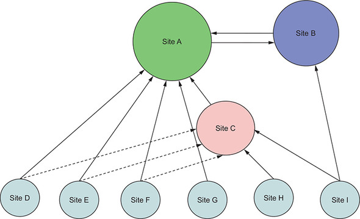
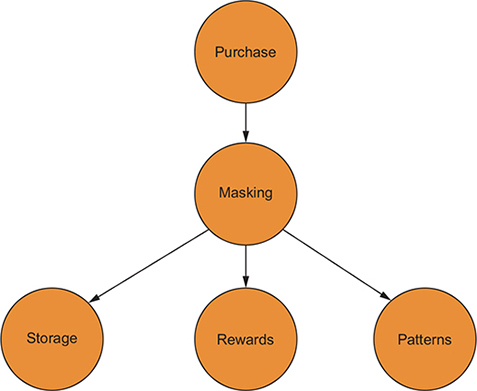
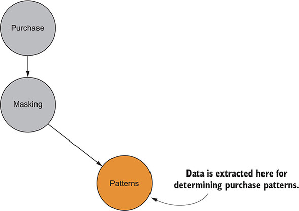
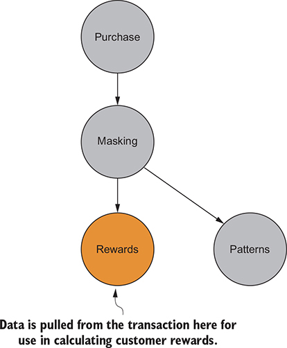
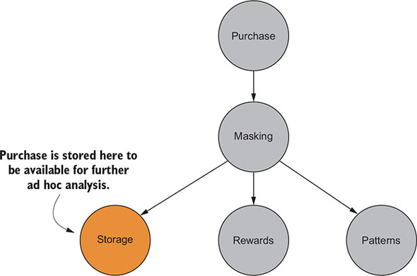
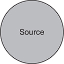
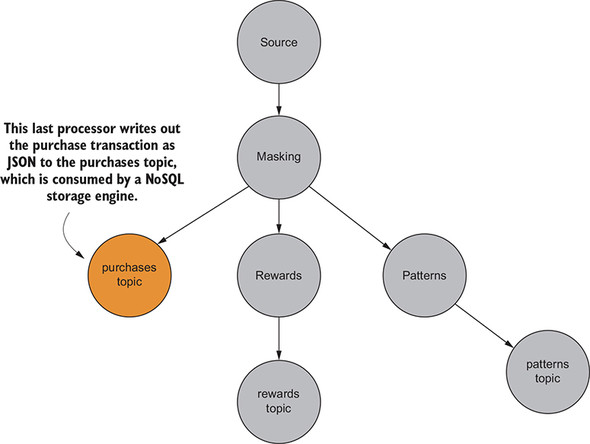

# 1장
[[toc]]

## 1. 빅 데이터로의 전환, 그로 인한 프로그래밍 환경의 변화
- 빅데이터 환경이 발전하면서 데이터를 분석하고 활용해야 하는 필요성이 높아졌다.
- 대량의 데이터를 벌크 처리(일괄 처리) 능력 뿐만 아니라 데이터를 실시간(stream 처리) 처리를 할 필요성이 많아졌다.
- 카프카 스트림즈는 이벤트별 레코드 처리를 수행할 수 있게 하는 라이브러리

:::tip
데이터가 도착하자마자 처리해야 할 필요성이 점점 더 명확해지면서, 마이크로 배치라는 새로운 전략이 개발됨
배치의 크기를 줄여 결과를 좀더 빠르게 생산할 순 있지만, 결국은 벌크처리라 진정한 이벤트별 처리를 제공한다곤 볼 수 없다.
:::

### 1-1. 빅 데이터의 기원
- 세르게이 브린과 래리 페이지 두 성님이 만든 구글로 부터 시작됐다고 보면 된다.
- 웹 페이지 순위를 매기는 새로운 방법인 페이지랭크 알고리즘을 개발했다.



- 사이트 A가 가장 중요하다. 사이트 A를 가장 많이 참조하고 있기 때문이다.
- 사이트 B는 약간 중요하다. 그리 많은 참조를 하지는 않지만, 중요한 사이트가 참조하고 있다.
- 사이트 C는 A나 B보다 덜 중요하다. 참조하는 사이트가 B보다는 많지만, 참조의 품질이 낮다.
- 아래쪽 D부터 I까지의 사이트에는 해당 사이트를 가리키는 참조가 없다. 따라서 중요도가 가장 낮다.

<hr/>

- 페이지 랭크 알고리즘은 혁신적이었지만, 실제로 적용시키기 위해선 혁신적인 접근 방법이 필요했다.
- 바로 맵 리듀스 라는 새로운 패러다임을 만들었다.

### 1-2. 맵리듀스의 중요 개념
- 구글이 맵리듀스를 개발 했을때, 새로운 개념은 아니었지만 많은 장비에 대규모로 적용하는 것이 특이했다.
- 맵리듀스의 핵심은 함수형 프로그래밍에 있다. 
- *맵 함수*는 원본값을 변경하지 않고 입력을 가져와 어떤 다른 값으로 매핑한다.

```java
Function<LocalDate, String> addDate = (date) -> "The Day of the week is " + date.getDayOfWeek();
```

- LocalDate 객체가 String 메세지로 매핑되는 반면, 원본 LocalDate는 변경되지 않는다.
- *리듀스 함수*는 여러 매개변수를 받아 하나 혹은 최소한 더 작은 값으로 줄인다.

```java
0 + 1 = 1 // 첫 번째 숫자에 시드값을 더한다.
1 + 2 = 3 // 첫 번째 단계의 결과를 가져와 목록의 두 번째 숫자를 더한다.
3 + 3 = 6 // 두 번째 단계의 합을 세 번째 숫자에 더한다.
```

- 숫자 집합에 리듀스를 실행하려면 먼저 초기 시작값을 제공해야 한다.
- 이 경우 0을 사용, 다음 단계는 목록의 첫 번째 숫자에 시드값을 추가하는 것이다.
- 그리고 첫번째 결과를 두 번째 숫자에 더한다.
- 이런식으로 함수는 마지막 값에 도달할 때 까지 이 과정을 반복해 하나의 숫자를 생성한다.
- 위처럼 리듀스 함수는 결과를 함께 축소해 더 작은 결과를 만드는데, 원본 숫자 목록은 변경하지 않는다.

```java
List<Integer> numbers = Arrays.asList(1, 2, 3);
int sum = numbers.reduce(0, (i, j) -> i + j);
```

- 이러한 맵 리듀스 개념중 핵심 개념 일부가 카프카 스트림즈에도 포함된다.

```
대규모 처리를 위해 클러스터에 데이터를 분산하는 방법

분산 데이터를 함께 그룹 짓기 위한 키/값 쌍과 파티션 사용

실패를 피하는 대신 복제를 사용해 실패를 수용
```

#### 대규모 처리를 위해 클러스터에 데이터 배포하기
- 한 대의 장비에 5TB의 데이터를 작업하기에는 감당하기 어려울 수 있지만, 데이터를 분리해서 여러대의 장비를 투입하면 조금더 쉬워진다.

| 머신수 | 서버당 데이터 처리량 |
| --- | --- |
| 10 | 500GB |
| 100 | 50GB |
| 1000 | 5GB |
| 5000 | 1GB |

- 처리할 양이 많으면 골아프지만, 서버당 처리량을 줄이고 머신수를 늘리면 효율적으로 쓸 수 있다.
- 1GB면 랩톱도 처리가 가능한 수준
- 이것이 맵리듀스를 이해하기 위한 첫 번째 핵심 개념이다.
- 부하를 서버 클러스터로 분산해 감당하기 힘든 양의 데이터를 관리 가능한 양으로 바꿀 수 있다.

#### 키/값 쌍과 파티션을 사용해 분산된 데이터 그룹 짓기
- 다수의 머신으로 데이터를 분산하면 처리 문제는 해결되지만, 다시 모으는 문제가 남아있다.
- 분산 데이터를 다시 그룹 짓기 위해, 데이터를 나눈 키/값 쌍의 키를 사용할 수 있다.
- 파티션이라는 용어는 그룹 짓는것을 의미하지만, 동일한 키로 그룹 짓는 것이 아니라 같은 해시 코드를 가진 키로 그룹 짓는 것을 의미한다.
- 키를 사용해 파티션으로 데이터를 나누기 위해 다음 수식 사용이 가능하다.

```java
int partition = key.hashCode() % numberOfPartitions;
```


- 파티션의 키를 기준으로 레코드를 그룹 짓는다.
- 레코드가 각기 다른 서버에서 시작되더라도 결국 적절한 파티션에서 만나게 된다.
- 모든 데이터는 키/값 쌍으로 저장된다. 키는 이벤트 이름이고, 값은 개별 선수에 대한 결과

#### 복제를 사용해 실패 수용하기
- 구글 맵리듀스의 주요 구성 요소는 구글 파일 시스템(GFS)
- 하둡 파일 시스템(HDFS)는 GFS의 오픈소스 구현체이다.
- 두 시스템은 오류를 방지하는 대신, 클러스터 전체에 데이터 블록을 복제해 오류를 수용한다. 
- 이런 이유로 디스크오류나 전체 서버 오류같은걸 걱정할 필요가 없다.

### 1-3. 배치 처리로는 충분하지 않다.
- 실제로 하둡을 쓰면 완벽하게 페이지 랭크를 구현할 수 없다.
- 배치성 프로그램으로, 바로바로 실시간성 데이터를 가져올 수가 없다는 문제가 생겼다.
- 이러한 문제해결을 위해 스트림 개념이 생성되었다.

## 2. 스트림 처리 소개
- 스트림 처리 : 데이터가 시스템에 도착하는 대로 처리하는 것으로 정의.
- 스트림 처리가 처리할 데이터를 수집하거나 저장할 필요 없이 무한한 데이터 스트림을 유입되는 대로 연속으로 계산해 처리할 수 있는 능력이라고 정의할 수 있다.
- 아래는 데이터의 흐름을 나타내며, 줄의 각 원은 특정 시점의 데이터를 나타낸다.
- 스트림 처리의 데이터가 제한되지 않아 데이터가 계속 흐르고 있다.


- 각 원은 특정 시점에서 발생하는 정보나 이벤트를 나타낸다.
- 이벤트 수는 제한이 없고, 왼쪽에서 오른쪽으로 계속 흐른다.

### 2-1. 스트림 처리를 사용해야 할 경우와 사용하지 말아야 할 경우
- 사용하면 좋은 예 : 신속하게 응답하거나 보고해야 하는 경우
    - 신용카드 사기 : 카드 주인이 도난을 인지하지 못할 수 있지만, 고정된 패턴에 따라 구매를 검토함으로써 도난당한 신용카드를 감지하고 소유자에게 알릴 수 있다.
    - 침입 탐지 : 위반이 발생한 후 어플리케이션 로그 파일을 분석하면, 향후 공격을 방지하거나 보안을 개선하는 데 도움이 될 수있지만, 실시간으로 동작을 모니터링 하는건 매우 중요하다.
    - 금융 업계 : 브로커와 소비자가 언제 판매하거나 구매할 것인지에 대해 효과적인 결정을 내리기 위해서는 시장 가격과 방향을 실시간으로 추적할 수 있는 능력이 핵심
    - 등등..
- 사용하기 안좋은 예 : 최신 데이터보단 과거 데이터가 필요한 경우
    - 경제 예측 : 주택 시장의 금리 동향과 같은 정확한 예측을 위해선 장기간 다양한 변수로 정보 수집이 필요하다.
    - 학교 교과 과정 변경 : 학교 행정 담당자는 1~2회의 시험이 치뤄진 후에나 커리큘럼 변경이 달성했는지 여부를 알 수 있다.
- 즉 데이터가 도착하자마자 즉시 보고해야 하는 경우는 스트림 처리가 좋다.

## 3. 구매 거래 처리
- 소매 판매 예제로 카프카 스트림즈를 사용하고 작성하는 어플리케이션 구현하는 예제로 만들어 보자
- ZMart 예제이다.

```
제인은 치약을 골라서 계산대로 지불하러 간다.
점원은 제인에게 지클럽의 회원인지 묻고, 
회원 카드를 스캔하면 제인의 회원 정보가 이제는 구매 거래의 일부가 된다.
총액을 계산할 때 제인은 계산원에게 직불카드를 건낸다.
계산원이 카드를 긁고 제인에게 영수증을 준다.
제인은 가게를 나와 이메일을 확인하고, 지마트로부터 다음 방문시에 사용할 수 있는
다양한 쿠폰과 감사 메세지가 있다.
```

### 3-1. 스트림 처리 옵션 따져보기
- 스트림 처리 계획이 성공하기 위한 네 가지 요구사항 정리
    - 프라이버시 : 고객의 신용카드 정보는 절대로 노출되면 안된다.
    - 고객 보상 : 고객의 지출 품목에 따라 포인트를 즉시 제공해줘야 한다. 즉 보상을 받자마자 고객에게 신속하게 통보가 필요하다.
    - 판매 데이터 : 지역별 구매 항목을 추적해 특정 지역에 인기 품목을 알아보고, 해당 지역 베스트 셀러 품목에 할인과 특가를 제공해 준다.
    - 스토리지 : 모든 구매 기록은 이력 및 즉석 분석을 위해 외부 스토리지 센터에 저장해야 한다.

### 3-2. 요구사항을 그래프로 분해


- 방향성 비순환 그래프(DAG) 로 빠르게 재구성 한 그래프
- 스트리밍 어플리케이션의 비지니스 요구사항은 방향성 비순환 그래프로 표현된다.
- 각 정점은 요구사항을 나타내며, 간선은 그래프를 통한 데이터 흐름을 나타낸다.
- 구매 트랜잭션을 요구사항 그래프에 매핑하는 방법을 결정해 보자

## 4. 구매 트랜잭션에 대한 관점 변경
- 구매를 단계별로 살펴보고, 상위 단계에서 위의 요구사항 그래프와 어떻게 관련되는지 본다.

### 4-1. 소스 노드
- 그래프의 소스노드는 어플리케이션이 구매 트랜잭션을 소비하는 곳이다.
- 이 노드는 그래프를 통해 흐르는 판매 트랜잭션 정보의 소스이다.


- 판매 트랜잭션 그래프의 시작. 이 노드는 그래프를 통해 전달되는 원시 판매 트랜잭션 정보의 소스다.

### 4-2. 신용카드 마스킹 노드
- 그래프 소스의 자식 노드는 신용카드 마스킹이 발생하는 곳
- 그래프에서 비즈니스 요구사항을 나타내는 첫 번째 정점 또는 노드.
- 소스 노드에서 원시 판매 데이터를 수신하는 유일한 노드이므로, 사실상 이 노드는 연결된 다른 모든 노드의 소스


- 위 노드는 신용카드 정보를 감추는 역할을 한다.

### 4-3. 패턴 노드
- 고객이 전국 어디에서 제품을 구매하는지 알아내기 위해 관련 정보를 추출한다.
- 데이터의 사본을 만드는 대신 패턴 노드는 구매할 항목, 날짜 및 우편번호를 검색하고 해당 필드를 포함하는 새 객체를 만든다.



### 4-4. 보상 노드
- 보상을 모으는 노드
- 지마트는 매장에서 이뤄진 구매에 대한 포인트를 고객에게 제공하는 고객 보상 프로그램이 있다.
- 소비한 달러 금액의 클라이언트 ID를 추출해 두 필드를 포함하는 새객체를 생성해 준다.



### 4-5. 스토리지 노드
- 추가 분석을 위해 구매 데이터를 NoSQL 데이터 저장소에 기록한다.



## 5. 처리 노드의 그래프인 카프카 스트림즈
- 카프카 스트림즈는 이벤트별로 레코드 처리를 수행할 수 있는 라이브러리
- 지마트의 목표는 대부분은 가능한 한 빨리 조치를 취하길 원한다.
- 전국에 여러 개의 지마트 지점이 있으므로 분석을 위해 모든 트랜잭션 기록을 데이터의 단을 흐름이나 스트림으로 이동하길 원한다.
- 이럴때 카프카 스트림즈를 쓰면 좋다.

<hr/>

- 카프카 스트림즈에서 처리 노드의 토폴로지를 정의한다.
- 하나 이상의 노드가 소스 카프카 토픽을 가지며, 자식 노드로 간주되는 노드를 추가 할 수 있다.
- 각 자식노드는 다른 자식 노드를 정의할 수 있다.
- 각 처리 노드는 할당된 작업을 수행한 다음 레코드를 각 자식 노드에 전달한다.
- 작업을 수행한 다음 모든 자식 노드로 데이터를 전달하는 이 과정을 모든 자식 노드가 해당 기능을 실행할 때까지 계속한다.
- 이런식으로 그래프를 따라가는 것이 카프카 스트림즈가 작동하는 방식이고, 이는 처리노드의 토폴로지 이다.
- 데이터는 언제나 부모 -> 자식으로 흐른다.

:::tip
토폴로지는 전체 시스템의 부분을 배열하고 서로 연결하는 방법이다. 카프카 스트림즈에 토폴로지가 있다고 할 때는 하나 이상의 프로세서를 실행해 데이터를 변환한다는 의미로 생각하면 된다.
:::

## 6. 카프카 스트림즈를 구매 거래 흐름에 적용하기
- 카프카 스트림즈 프로그램은 레코드를 소비할 때 원시 레코드를 Purchase 객체로 변환한다.
- Purchase 객체 
    - 지마트 고객 ID (회원카드에서 스캔)
    - 지출한 총 금액
    - 구입한 가게의 우편번호
    - 거래 날짜 및 시간
    - 직불카드 또는 신용카드 번호

### 6-1. 소스 정의하기
- 모든 카프카 스트림즈 프로그램의 첫 번째 단계는 스트림 소스를 설정하는 것이다.
- 소스는 다음 중 하나일 수 있다.
    - 하나의 토픽
    - 쉼표로 구분된 여러 토픽
    - 하나 이상의 토픽과 일치할 수 있는 정규 표현식
- 여기서는 transactions 라는 단일 토픽이다.



### 6-2. 첫 번째 프로세서 : 신용카드번호 마스킹
- 데이터에 작업할 프로세서를 만들어볼 수 있다.
- 첫 목표는 유입된 구매 레코드에 기록된 신용카드 번호를 가리는것
- 010-1234-5609 같은걸 xxx-xxxx-5609로 바꿔준다.
- KStream.mapValues 메소드는 이런 마스킹을 수행한다.
- ValueMapper에 의해 명시된 마스킹한 값을 가진 새 KStream 인스턴스를 반환한다.
- 이 특정 KStream 인스턴스는 앞으로 정의할 다른 모든 프로세서의 상위 프로세서가 된다.


#### 프로세서 토폴로지 생성하기
- 변환 메소드를 사용해 새 KStream 인스턴스를 만들 때마다 기본적으로 이미 생성된 다른 프로세서에 연결된 새 프로세서를 만든다.
- 프로세서를 구성함으로써 카프카 스트림즈를 사용해 복잡한 데이터 흐름을 명쾌하게 만든다.
- 새로운 KStream 인스턴스를 반환하는 메소드를 호출해도, 원본 인스턴스가 메세지를 소비하는 것은 멈추지 않는다.
- 변환 메소드는 새로운 프로세서를 생성하고, 기존 프로세서 토폴로지에 추가한다.
- 이 업데이트된 토폴로지는 다음 KStream 인스턴스를 ㅁ나들기 위한 매개변수로 사용되고, 생성 지점에서 메세지를 받기 시작한다.

### 6-3. 두 번째 프로세서: 구매 패턴
- 구매 패턴을 결정하는 데 필요한 정보를 캡쳐할 수 있다.
- 첫 번째 프로세서(KStream)에 자식 처리 노드를 추가한다.
- 첫 번째 프로세서는 신용카드 번호가 가려진 Purchase 객체를 생성한다.
- 구매 패턴 프로세서는 부모 노드로부터 Purchase 객체를 받아 새로운 PurchasePattern 객체에 매핑한다.
- 구매 패턴 프로세서는 새로운 PurchasePattern 객체를 받는 자식 프로세서 노드를 추가하고, 이를 patterns라는 카프카 토픽에 저장한다.
- PurchasPattern 객체는 토픽에 저장할 때 전송 가능한 데이터 형태로 변환한다.


### 6-4. 세 번째 프로세서: 고객 보상
- Purchase 객체를 받아 RewardAccumulator 객체 타입으로 매핑한다.
- 고객 보상 프로세서는 자식 처리 노드를 추가해 RewardAccumulator 객체를 카프카의 rewards 토픽에 저장한다.
- rewards 토픽에서 레코드를 읽어서 다른 어플리케이션은 지마트 고객을 위한 보상을 결정해 제인이 받은 것과 같은 이메일 생성이 가능하다.


### 6-5. 네 번째 프로세서: 구매 레코드 기록하기
- 마스킹 프로세서 노드의 세번째 자식노드로, 가려진 구매 기록 전체를 purchases 토픽에 저장한다.
- 이 토픽은 들어오는 레코드를 읽어 NoSQL 스토리지 어플리케이션에 제공하는데 사용한다.
- 이 레코드는 추후 분석에 사용한다.



- 위의 그림을 보면, 신용카드 번호를 숨기는 첫 프로세서는 3개의 다른 프로세서에 데이터를 제공한다.

## 요약
- 카프카 스트림즈는 강력하고 복잡한 스트림 처리를 위해 처리 노드를 조합한 그래프
- 배치 처리는 강력하지만 데이터 작업에 대한 실시간 요구를 만족시키기에는 충분하지 않다.
- 데이터, 키/값 쌍, 파티셔닝 및 데이터 복제를 분산하는 것은 분산 어플리케이션에서 매우 중요