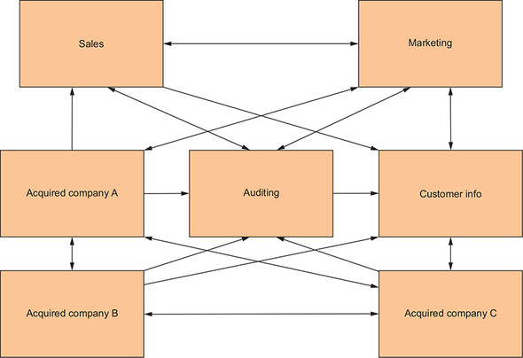
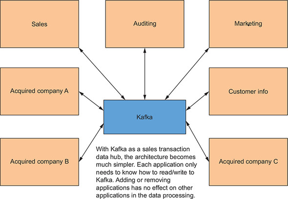
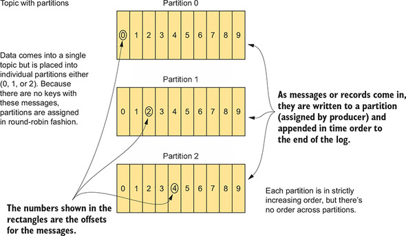
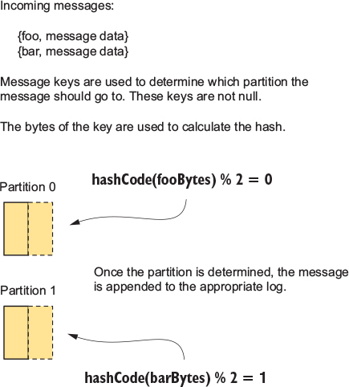
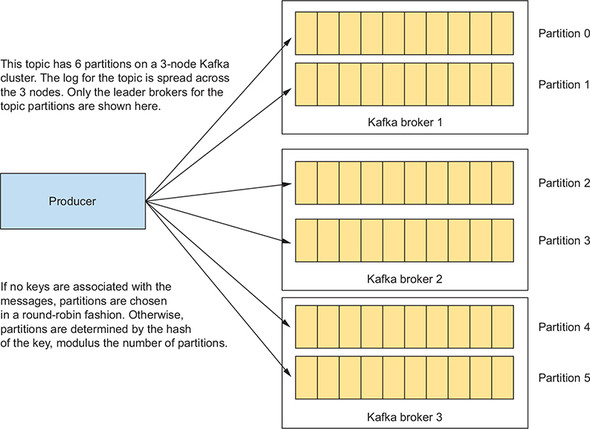
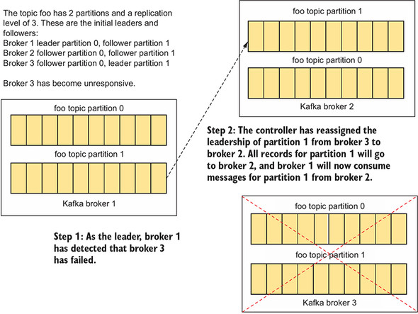
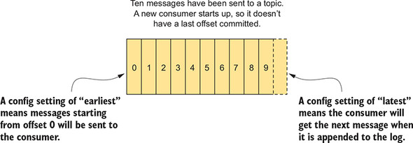

# 2강
[[toc]]

## 1. 데이터 문제
- 지마트 데이터 관리 솔루션에 있을 법한 다양한 요구사항을 고려해보자.
    - 중앙 저장소로 데이터를 신속하게 전송할 방법이 필요하다.
    - 서버가 자주 고장 나기 때문에 데이터를 복제할 수 있는 기능도 필요하므로, 피할 수 없는 오류로 인해 가동 중지 시간과 데이터 손실이 발생하지 않아야 한다.
    - 각기 다른 어플리케이션을 추적하지 않고도 많은 수의 데이터 컨슈머로 확장할 수 있는 잠재력이 필요하다. 조직의 모든 사용자가 데이터를 사용할 수 있도록 해야 하지만, 누가 데이터를 보았는지 또는 보지 않았는지 추적할 필요는 없다.

## 2. 카프카를 사용해 데이터 다루기
- 지마트가 6개월전에 데이터 현황을 파악하는 방법을 찾고 있었고, 처음에는 잘 동작했지만 아래와 같은 이유로 관리하기 힘들어 졌다.

### 2-1. 지마트의 오리지널 데이터 플랫폼
- 기존 데이터 플랫폼으로 정보의 각 소스마다 그 정보를 서로 주고받을 수 있을 정도의 아키텍쳐


- 기존 구조에선 크게 문제가 없지만, 여러 요소가 추가되다 보면 연결이 더 복잡해진다.
- 통신은 스파게티 더미마냥 복잡해진다.



- 3개 추가됐는데 거지같아졌다.

### 2-2. 카프카 판매 거래 데이터 허브
- 위의 문제를 해결하는 방법으로는 모든 거래 데이터를 수용하는 하나의 유입 프로세스를 만드는 것이다.
- 카프카는 fault-tolerant를 가진 pub/sub 시스템이다.
- 하나의 카프카 노드를 *브로커* 라고 부르고, 여러 개의 카프카 브로커 서버가 *클러스터*를 구성한다.
- 카프카는 *프로듀서*가 작성한 메세지를 토픽에 저장한다.
- *컨슈머*는 토픽을 구독하며, 구독한 토픽에 메세지가 있는지 확인하기 위해 카프카에 접속한다.



## 3. 카프카 아키텍쳐
### 3-1. 카프카는 메세지 브로커다
- 카프카는 메세지 프로커 역할을 한다.
- 브로커는 상호 간 유익한 교환이나 거래를 위해 각자 반드시 알 필요가 없는 두 부분을 묶는 중개자다.
- 프로듀서와 컨슈머가 추가되어 개별 부문이 카프카로 통신을 하고, 서로서로 직접 통신하진 않는다.


- 카프카는 토픽에 메세지를 저장하고 토픽에서 메세지를 검색한다.
- 메세지의 프로듀서와 컨슈머는 직접적인 연결이 없다.
- 카프카는 프로듀서나 컨슈머에 관한 어떤 상태도 유지하지 않고, 오로지 메세지 교환소로만 작동한다.
- 토픽의 내부 기술은 카프카가 들어오는 레코드를 기록한 파일인 로그
- 토픽에 들어오는 메세지의 부하를 관리하기 위해 카프카는 파티션을 사용한다.

### 3-2. 카프카는 로그다
- 카프카의 기본 메커니즘은 로그이다.
- 카프카의 맥락에서 로그는 "추가만 가능한 시간순으로 완전히 정렬된 레코드 시퀀스" 이다.


- 어플리케이션은 도착한 레코드를 로그 끝에 추가한다. 
- 각 레코드와 연관된 타임스탬프가 없을지라도 레코드는 시간에 따라 암묵적으로 정렬된다.
- 가장 빠른 레코드가 왼쪽에 있고 마지막으로 도착한 레코드가 오른쪽 끝에 있다.

<hr />

- 로그는 강력한 의미를 가진 단순한 데이터 추상화다.
- 시간순대로 레코드를 갖고있으면, 충돌을 해결하거나 다른 머신에 업데이트 적용등이 용이해 진다. -> 최신 레코드가 우선이다.
- 카프카의 토픽은 토픽 이름으로 분리된 로그다.
- 토픽은 라벨이 붙은 로그라고 할 수 있다.
- 로그파일만을 재생하면 되기 때문에, 로그가 머신 클러스터 간에 복제된 후 하나의 머신이 중지되면 해당 서버를 복구하는 것은 쉽다.
- 실패로부터 복구하는 기능은 정확하게 분산 커밋 로그의 역할이다.

### 3-3. 카프카에서 로그가 동작하는 방식
- 카프카를 설치할 때 설정 중 하나는 log.dir이며, 카프카가 로그 데이터를 저장하는 위치를 지정한다.
- 각 토픽은 지정된 로그 디렉토리 아래의 하위 디렉토리에 매핑된다.
- '파티션이름_파티션번호'의 형식으로 토픽 파티션 수만큼 하위 디렉토리가 있을것
- 각 디렉토리 안에는 들어오는 메세지가 추가되는 로그파일이 존재한다.
- 로그파일이 특정 크기에 도달하거나, 메세지 타임스탬프 간에 구성된 시간차이에 도달하면 로그 파일을 교체하고, 카프카는 들어오는 메세지를 새 로그에 추가한다.


- 토픽은 로그와 긴밀하게 연결된 개념이라고 보면 된다.
- 토픽은 로그라고 하거나 로그를 나타낸다고 말할 수 있다.
- 토픽 이름은 프로듀서를 통해 카프카에 보내진 메세지가 저장될 로그를 잘 처리할 수 있게 해준다.

### 3-4. 카프카와 파티션
- 파티션은 카프카 디자인에서 성능에 필수적이고, 같은 키를 가진 데이터가 동일한 컨슈머에게 순서대로 전송되도록 보장한다.



- 파티션을 가진 토픽 모습이다.
- 데이터는 단일 토픽으로 들어가지만, 개별 파티션 (0,1,2 중 하나)에 배치된다.
- 이 메세지에는 키가 없기 때문에, 라운드 로빈 방식으로 파티션이 할당 된다.
- 메세지나 레코드가 들어오면 파티션(프로듀서가 지정)에 기록되고, 시간 순서대로 로그의 끝에 추가된다.
- 직사각형에 표시된 숫자는 메세지에 대한 오프셋

<hr/>

- 토픽을 파티션으로 분할하면 기본적으로 병렬 스트림에서 토픽에 전달되는 데이터가 분할되는데, 이는 카프카가 엄청난 처리량을 달성하는 비결이다.
- 카프카는 들어오는 모든 메세지를 로그 끝에 추가해서, 엄격하게 시간 순서가 지정된다.
- 각 메세지에는 할당된 오프셋 번호가 있는데, 파티션 간의 메세지 순서는 보장되지 않지만 각 파티션 내의 메세지는 보장된다.
- 파티션 분할로 얻는 다른 이득은, 토픽의 메세지를 여러 머신에 분산해 용량문제에 있어서 제한이 덜하게 된다.

### 3-5. 키에 의한 그룹 데이터 분할
- 카프카는 키/값 쌍으로 데이터를 다룬다.
- 키가 만약 null이라면 카프카 프로듀서는 라운드 로빈 방식으로 선택된 파티션에 레코드를 쓴다.



- 키가 널이 아니면 다음과 같은 공식으로 키/값 쌍을 보낼 파티션을 선택한다.

```java
HashCode.(key) % num of partition
```

- 이런 방법을 사용하면, 동일한 키를 가진 레코드가 '항상' 동일한 파티션에 순서대로 전송된다.
- 만약 다른 방법이 필요하면, 사용자 정의 파티셔너를 정의해 줘야한다.

### 3-6. 사용자 정의 파티셔너 작성하기
- 특수한 경우엔, 사용자 파티셔너가 필요하다.
- 구매데이터가 카프카에 유입되고 있고, 키에 고객 ID와 거래 날짜라는 두 가지 값이 포함되어 있다고 가정한다.
- 고객 ID로 값을 그룹지어야 하므로, 고객 ID와 구매 날짜의 해시를 사용하면 정상적으로 작동하지 않는다.
- 이런 경우에 사용자 정의 파티셔너를 사용해야 한다.

```java
public class PurchaseKey {
    
    private String customerId;
    private Date transactionDate;

    public PurchaseKey(String customerId, Date transactionDate) {
        this.customerId = customerId;
        this.transactionDate = transactionDate;
    }

    public String getCustomerId() {
        return customerId;
    }

    public Date getTransactionDate() {
        return transactionDate;
    }
}
```

- 파티셔닝과 관련해 같은 고객 ID는 같은 파티션에 넣도록 해야 될 때가 있다.
- 기존 파티셔닝 방식으로 하면 같은 고객 ID를 가진 객체가 다른 파티션으로 갈 수가 있음
- 파티션을 결정할 때 고객 ID만을 사용하도록 커스터마이징 해주어야 한다.

```java
public class PurchaseKeyPartitioner extends DefaultPartitioner {
    
    @Override
    public int partition(String topic, Object key,
                         byte[] keyBytes, Object value,
                         byte[] valueBytes, Cluster cluster) {
        Object newKey = null;
        if(key != null) { // 키가 널이 아니면 사용자 아이디를 추출
            PurchaseKey purchaseKey = (PurchaseKey) key;
            newKey = purchaseKey.getCustomerId();
            keyBytes = ((String)newKey).getBytes(); // 새로운 값으로 키의 바이트를 설정
        }

        // 슈퍼 클래스에 위임하여 업데이트된 키로 파티션을 반환
        return super.partition(topic, newKey, keyBytes, value, valueBytes, cluster);
    }
}
```

- DefaultPartitioner 를 확장한다.
- 사용자 정의 파티셔너를 만들 때 키만 사용 가능한 것은 아니다.
- 값만을 사용하거나, 키+값으로 사용하는 것도 가능하다.

:::tip
카프카 API는 사용자 정의 파티셔너를 작성하는 데 사용할 수 있는 Partitioner 인터페이스를 제공한다.
:::

### 3-7. 사용자 정의 파티셔너 지정하기
- 사용자 정의 파티셔너를 만들었으므로, 기본 파티셔너 대신 해당 파티셔너를 사용하도록 등록해줘야 한다.
- 프로듀서를 설정할 때 파티셔너를 지정해 준다.

```java
partitioner.class=bbejeck_2.partitioner.PurchaseKeyPartitioner
```

- 프로듀서 인스턴스 별로 파티셔너를 설정할 수 있기 때문에 프로듀서마다 각기 다른 파티셔너를 자유롭게 사용할 수 있다.

:::warning
사용할 키를 선택할 때와 파티셔닝할 키/값 쌍의 부분을 선택할 때 주의해야 한다. 선택한 키가 모든 데이터에 대해 공평하게 분배를 하는지 확인이 필요하다. 그렇지 않으면 대부분의 데이터가 일부 파티션에만 위치하기 때문에 데이터가 특정 파티션에 몰리는 문제가 생길 수 잇다.
:::

### 3-8. 정확한 파티션 수 정하기
- 핵심 고려사항은 주어진 토픽에 들어오는 데이터의 양이다.
- 데이터가 많을수록 처리량을 높이기 위해, 더 많은 파티션이 필요하다.
- 안좋은 점으로는 파티션 수를 늘리면 TCP 연결 수와 열린 파일 핸들 수가 증가하게 된다.
- 또한 컨슈머가 유입 레코드를 처리하는 데 걸리는 시간도 처리량을 결정한다.
- 컨슈머가 대량의 데이터를 처리하는 경우에는 파티션을 추가하면 도움이 되지만, 궁극적으로 처리속도가 느려지면 성능이 저하된다.

### 3-9. 분산 로그
- 토픽이 분할되면 카프카는 하나의 머신에 모든 파티션을 할당하지 않는다.
- 카프카는 클러스터를 구성하는 여러 머신에 파티션을 분산시킨다.
- 카프카는 레코드를 로그에 추가하므로 카프카는 이러한 레코드를 파티션별로 여러 머신에 분산한다.



- 위의 예시에선 하나의 토픽과 널 키 사용을 가정했기 때문에, 프로듀서는 파티션을 라운드 로빈 방식으로 할당한다.
- 프로듀서는 첫 번째 메세지를 카프카 브로커 1의 파티션 0에 보내고, 두 번째 메세지는 카프카 브로커 1의 파티션 1에, 세 번째 메세지는 카프카 브로커 2의 파티션 2에 보낸다.
- 프로듀서가 여섯 번째 메세지를 보내면 카프카 브로커 3의 파티션 5로 가고, 다음 메세지는 다시 카프카 브로커 1의 파티션 0에 보낸다.
- 메세지 발행은 이런 방식으로 진행되고, 카프카 클러스터의 모든 노드에 메세지 트래픽을 분산한다.
- 서버가 내려가서 데이터 유실이 걱정 될 수 있지만, 카프카는 데이터 중복을 제공한다.
- 카프카에서 하나의 브로커에 저장하면 클러스터의 하나, 혹은 그 이상의 머신에 데이터를 복제한다.

### 3-10. 주키퍼: 리더, 팔로워, 복제
- 카프카는 리더와 팔로워 브로커라는 개념이 존재한다.
- 각 토픽 파티션별로 한 브로커가 다른 브로커(팔로워)의 리더로 선택된다.
- 리더의 주요 기능은 팔로워 브로커에 토픽 파티션의 복제를 할당한다.

### 3-11. 아파치 주키퍼
- 주키퍼를 사용해 카프카가 리더 브로커를 확보하고 토픽 복제를 추적할 수 있게 한다.

```
주키퍼는 구성 정보를 유지 관리하고 이름을 지정하며 분산 동기화를 제공하고
그룹 서비스를 제공하는 중앙 집중식 서비스. 이런 유형의 서비스는 분산된
어플리케이션에 의해 어떤 형태로든 사용된다.
```

### 3-12. 컨트롤러 선출
- 간단하게 주키퍼가 클러스터의 브로커 중 하나를 컨트롤러로 선택한다고만 이해하면 된다.

### 3-13. 복제
- 카프카는 클러스터의 브로커가 실패할 경우 데이터 가용성 보장을 위해 브로커 간에 레코드를 복제한다.
- 각 토픽별로, 혹은 클러스터의 모든 토픽에 대해 복제 수준을 설정 할 수 있다.


- 토픽 foo는 파티션 2개와 복제 수준 (replica) 3을 갖는다.
- 파티션 간의 점선은 해당 파티션의 리더를 가리킨다.
- 프로듀서는 파티션의 리더에 레코드를 작성하고 팔로워는 리더로부터 이 레코드를 읽는다.
- 그림에서 보면 브로커 1은 파티션 0의 리더이고, 브로커 3은 파티션 1의 리더이다.
- 브로커 2는 브로커 1의 파티션 0과, 브로커 3의 파티션 1에 대한 팔로워다. 
- 이런식으로 레플리카가 설정되면, 여기저기 나눠져서 팔로워를 하게된다.

### 3-14. 컨트롤러의 책임
- 컨트롤러 브로커는 토픽의 모든 파티션에 대한 리더/팔로워 관계를 설정한다.
- 카프카 노드가 죽거나주키퍼 하트 비트에 응답하지 않으면, 할당된 모든 파티션이 컨트롤러 브로커에 의해 재 할당된다.



- 주키퍼는 카프카 운영의 다음 측면에도 관여한다.
    - 클러스터 멤버쉽 : 클러스터에 가입하고 클러스터 멤버십을 유지 관리한다. 브로커를 사용할 수 없게 되면 주키퍼는 클러스터 멤버십에서 브로커를 제외한다.
    - 토픽 설정 : 클러스터의 토픽을 트랙킹한다. 브로커가 토픽의 리더인지, 토픽에 파티션이 몇 개인지, 토픽의 특정 설정이 업데이트 됐는지 확인한다.
    - 접근 제어 : 특정 토픽에 대해 누가 읽고 쓸 수 있는지 식별한다.

### 3-15. 로그 관리
- 오래된 데이터를 제거할 때 두가지 방식을 지원하는데, 로그삭제, 압축 두가지 방법이다.

### 3-16. 로그 삭제

- 로그를 세그먼트로 나우어 가장 오래된 세그먼트를 삭제한다.
- 새로운 로그가 도착하고, 타임스탬프가 해당 로그의 첫 번째 메세지의 타임스탬프와 log.roll.ms 설정 값을 더한 값보다 크다면, 로그를 분할하고 새로운 세그먼트를 새 활성 로그로 생성된다.
- 이전 활성 세그먼트는 여전히 컨슈머가 메세지를 검색하는데 사용한다.
- 로그 롤링을 하는데, 카프카 브로커를 설정할 때 지정할 수 있는 구성 설정이다.
- 두 가지 옵션이 존재한다.
    - log.roll.ms : 주 설정이지만 기본값은 없다.
    - log.roll.hours : 보조 설정이며 log.role.ms가 설정되지 않은 경우에만 사용한다. 기본값은 168시간이다.
- 시간이 지남에 따라 세그먼트 수는 계속 증가하고, 오래된 세그먼트는 수신 데이터를 위한 여유 공간을 확보하기 위해 삭제해야 한다.



- 세그먼트 삭제도 메세지의 타임스탬프를 기반으로 한다.
- 우선순위에 따라 세 가지 설정이 있는데, 앞부분이 뒷부분 설정 항목보다 우선된다.
    - log.retention.ms : 로그 파일을 밀리초 단위로 보관하는 기간
    - log.retention.minutes : 로그 파일을 분 단위로 보관하는 기간
    - log.retention.hours : 시간 단위의 로그 파일 보전 기간

### 3-17 로그 압축
- 동일한 키에 업데이트를 받게되는 경우가 있다.
- 키에 대해 값을 변경해주는데, 만약 크래시가 발생하는 경우에 삭제 정책을 적용해 값을 삭제하면 정상적인 값을 못가져 올 수도 있다.
- 키로 레코드를 업데이트 하는 것은 압축된 토픽(로그)이 제공하는 동작이다.
- 압축을 사용하면 세그먼트들을 삭제하는 대신, 좀 더 세밀한 접근 방식을 사용하고 로그에서 키별로 오래된 레코드를 삭제하낟.
- 즉 통째로 삭제가 아닌, 중복 키에대해 오래된걸 삭제하는 방식이다.


- 위의 방법으로 진행하면 주어진 키에 대한 마지막 레코드가 로그에 있음이 보장된다.
- 토픽에 대한 압축을 사용하려면 토픽을 생성할 때 log.cleanup.policy=compact 속성을 설정해 준다.

:::tip
cleanup.policy가 compact일 때 어떻게 로그에서 레코드를 제거할 수 있는지 궁금할 수 있다.
압축된 토픽에서 삭제는 주어진 키에 null값을 제공하고 삭제표시를 설정한다. null값을 가진 키는 동일한 키를 가진 
이전 레코드가 제거됐음을 보장하며, 일정 시간 후에는 삭제 표시된 레코드 자체가 제거된다.
:::

## 4. 프로듀서로 메세지 보내기

- 고객이 판매 거래를 완료하면 정보가 키/값 쌍으로 변환되어 프로듀서를 통해 카프카로 전송된다.
- 키는 고객 ID 123447777 이고 값은 "{\"item\":\"book\", \"price\":10.99}" 와 같은 JSON 형식이다.

```java
    Properties properties = new Properties();
    properties.put("bootstrap.servers", "localhost:9092");
    properties.put("key.serializer", "org.apache.kafka.common.serialization.Strin
        gSerializer");
        properties.put("value.serializer",
            "org.apache.kafka.common.serialization.StringSerializer");
    properties.put("acks", "1");
    properties.put("retries", "3");
    properties.put("compression.type", "snappy");
    properties.put("partitioner.class",
        PurchaseKeyPartitioner.class.getName());

    PurchaseKey key = new PurchaseKey("12334568", new Date());

    try (Producer<PurchaseKey, String> producer =
        new KafkaProducer<>(properties)) {
      ProducerRecord<PurchaseKey, String> record =
          new ProducerRecord<>("transactions", key, "{\"item\":\"book\",
              \"price\":10.99}");

      Callback callback = (metadata, exception) -> {
        if (exception != null) {
          System.out.println("Encountered exception "
              + exception);
        }
      };

      Future<RecordMetadata> sendFuture =
          producer.send(record, callback);
```

- 카프카 프로듀서는 thread-safe 하다.
- 카프카로의 모든 전송은 비동기식 이다.
- Producer.send는 프로듀서가 내부 버퍼에 레코드를 저장하면 즉시 반환한다.

:::tip
위 소스의 Producer.send 메소드는 Future 객체를 반환한다. Future 객체는 비동기 작업의 결과를 나타낸다. 더 중요한 점은 Future가 완료되기를 기다리는 대신 비동기 결과를 늦게 가져오는 옵션을 제공한다는 것이다.
:::

### 4-1. 프로듀서 속성
- 프로듀서 객체를 생성할 때 Properties 객체에 값들을 설정해 넣어준다.

| 용어 | 설명 |
| --- | --- |
|bootstrap server| bootstrap.servers는 쉼표로 구분된 호스트:포트 값의 리스트. 프로듀서는 클러스터의 모든 브로커를 사용하며, 이 리스트는 처음에 클러스터에 연결하는 용도로만 사용한다. |
| 직렬화 | key.serializer와 value.serializer는 키와 값을 바이트 배열로 변환하는 방법을 카프카에 알려준다. 내부적으로 카프카는 키와 값에 바이트 배열을 사용하기 때문에 카프카에 정확한 직렬화기를 제공해 전송하기 전에 객체를 바이트 배열로 변환해야 한다.|
| acks | acks는 레코드 전송이 완료됐다고 생각하기 전에 프로듀서가 브로커로부터 기다리는 확인수를 지정한다. acks에 유요한 값은 all, 0, 1 이다. all 은 브로카가 모든 팔로워가 레코드를 커밋할 때까지 대기한다. 1로 설정하면 브로커는 레코드를 로그에 기록하지만 팔로워의 레코드 커밋에 대한 확인 응답을 기다리지 않는다. 0 값은 프로듀서가 어떤 확인 응답도 기다리지 않음을 의미한다. |
| 재시도 | 배치 결과가 실패하는 경우 retries는 재전송 시도 횟수를 지정한다. 레코드 순서가 중요한 경우 max.in.flight.per.connection을 1로 설정해 실패한 레코드가 재전송 되기 전에 두 번째 배치가 성공적으로 보내지는 시나리오를 방지해야 한다. |
| 압축 타입 | compression.type은 적용할 압축 알고리즘이 있으면 지정한다. 설정하면 compression.type은 보내기 전에 배치를 압축하도록 프로듀서에 지시한다. 개별 레코드가 아닌 배치 단위로 압축|
| 파티셔너 클래스 | partitioner.class 는 Partitioner 인터페이스를 구현하는 클래스의 이름을 지정한다. partitioner.class 는 2.3.7절의 사용자 정의 파티셔너에 대한 설명과 관련있음.|

### 4-2. 파티션과 타임스탬프 지정
- 생성자를 오버로딩 해 설정이 가능하다.

```java
ProducerRecord(String topic, Integer partition, String key, String value)
ProducerRecord(String topic, Integer partition,
               Long timestamp, String key,
               String value)
```

### 4-3. 파티션 지정
- 특수한 경우에 파티션을 지정하도록 파티셔너를 커스텀 할 수 있다.

```java
AtomicInteger partitionIndex = new AtomicInteger(0);

int currentPartition = Math.abs(partitionIndex.getAndIncrement()) %
    numberPartitions;
ProducerRecord<String, String> record =
    new ProducerRecord<>("topic", currentPartition, "key", "value");
```

### 4-4. 카프카의 타임스탬프
- 생성자 오버로딩을 통해 타임스탬프 설정이 가능하다.

```java
ProducerRecord(String topic, Integer partition, Long timestamp, K key, V value);
```

- 타임스탬프를 설정하지 않으면 프로듀서가 레코드를 카프카 브로커에 보내기 전에 시간을 설정한다.
- 타임스탬프는 log.message.timestamp.type 브로커 설정의 영향도 받는다.

## 5. 컨슈머로 메세지 읽기
- KfakaConsumer는 카프카 메세지를 소비하는 데 사용할 클라이언트


### 5-1. 오프셋 관리
- KafkaConsumer는 주기적으로 카프카에서 소비되는 메세지의 오프셋을 커밋해 일부 상태를 관리한다.
- 오프셋은 메세지를 고유하게 식별하고 로그에서 메세지의 시작 위치를 나타낸다.
- 오프셋 커밋은 컨슈머에 있어서 두 가지 의미가 있다
    - 커밋한다는 것은 컨슈머가 메세지를 완전히 처리했음을 의미한다.
    - 커밋은 실패나 재시작 시 해당 컨슈머의 시작 지점도 나타낸다.
- 새로운 컨슈머 인스턴스가 있거나 오류가 발생했고 마지막으로 커밋한 오프셋을 사용할 수 없는 경우, 컨슈머가 시작하는 위치는 설정에 따라 달라진다.
    - auto.offset.reset="earliest" : 사용 가능한 가장 이른 오프셋부터 시작해 메세지를 가져온다.
    - auto.offset.reset="latest" : 가장 최신 오프셋에서 메세지를 읽어서 기본적으로 컨슈머가 클러스터에 합류한 지점부터 유입된 메세지만 소비한다.
    - auto.offset.reset="none" : 재설정 전략을 지정하지 않는다. 브로커가 컨슈머에게 예외를 발생시킨다.



### 5-2. 자동 오프셋 커밋
- 자동 오프셋 커밋 방식이 기본이며, enable.auto.commit 프로퍼티로 설정할 수 있다.
- 컨슈머 오프셋 커밋 주기를 지정하는 auto.commit.interval.ms 가 있다.

### 5-3. 수동 오프셋 커밋
- 수동 커밋된 오프셋에는 동기식 및 비동기식 두가지 유형이 존재한다.

```java
consumer.commitSync()
consumer.commitSync(Map<TopicPartition, OffsetAndMetadata>)
```

- 파라미터가 없는 commitSync는 마지막 검색에서 반환된 모든 오프셋이 성공할 때까지 블로킹한다.
- 완전 비동기인 commitAsync()도 존재한다.

### 5-4. 컨슈머 생성하기
- KafkaConsumer 객체에 Porperties를 넣으면 된다.
- 프로듀서와 비슷함

### 5-5. 컨슈머와 파티션
- 일반적으로 토픽의 각 파티션마다 하나씩 여러 컨슈머 인스턴스가 필요하다.
- 한 커슈머가 여러 파티션에서 읽도록 할 수 있지만, 파티션 수만큼 스레드 풀에 스레드가 잇는 컨슈머가 하나의 파티션에 배정되는 것은 일반적이지 않다.
- 결국 총 인스턴스의 스레드 수는 해당 토픽의 총 파티션수를 넘지 않아야 한다. (1:1이 맥시멈)
- 컨슈머가 실패하면 리더 브로커는 파티션을 다른 활성 컨슈머에게 할당한다.
- 리더 브로커는 동일한 group.id를 가진 사용 가능한 모든 컨슈머에게 토픽 파티션을 할당한다.
- group.id는 컨슈머를 컨슈머 그룹에 속하도록 식별하는 설정이다.
- 하나의 머신이 실패할 경우를 대비해, 컨슈머는 몇대의 머신에 분산하는 것이 좋다.

### 5-6. 리밸런싱
- 위에서 말한 컨슈머 실패시에, 새로운 파티션을 다른 컨슈머로 할당해 주는 것을 리밸런싱이라고 한다.

### 5-7. 더 세분화된 컨슈머 할당
- KfakaConsumer에는 특정 토픽과 파티션을 구독할 수 있는 메소드가 있다.

```java
TopicPartition fooTopicPartition_0 = new TopicPartition("foo", 0);
TopicPartition barTopicPartition_0 = new TopicPartition("bar", 0);

consumer.assign(Arrays.asList(fooTopicPartition_0, barTopicPartition_0));
```

- 이렇게 수동으로 설정했을 때의 트레이드 오프는 다음과 같다.
    - 동일한 그룹 ID를 가진 컨슈머라 하더라도 오류가 발생하면 토픽 파티션이 재할당 되지 않는다. 할당을 변경하려면 comsumer.assign을 다시 호출해야 한다.
    - 컨슈머에 지정된 그룹이 커밋에 사용되긴 하지만, 각 컨슈머가 독립적으로 작동하기 때문에 각 컨슈머에게 고유한 그룹 ID를 부여하는 것이 좋다.

### 5-8. 컨슈머 예제
```java
public void startConsuming() {
    executorService = Executors.newFixedThreadPool(numberPartitions);
    Properties properties = getConsumerProps();

    for (int i = 0; i < numberPartitions; i++) {
      Runnable consumerThread = getConsumerThread(properties); // 컨슈머 스레드 생성
      executorService.submit(consumerThread);
    }
}

private Runnable getConsumerThread(Properties properties) {
    return () -> {
      Consumer<String, String> consumer = null;
      try {
        consumer = new KafkaConsumer<>(properties);
        consumer.subscribe(Collections.singletonList("test-topic")); // 토픽 구독
        while (!doneConsuming) {
          ConsumerRecords<String, String> records = consumer.poll(5000); // 5초간 폴링
          for (ConsumerRecord<String, String> record : records) {
            String message = String
                .format("Consumed: key =%s value = %s with offset = %d partition = %d",
                    record.key(), record.value(),
                    record.offset(), record.partition());
            System.out.println(message);
          }

        }
      } catch (Exception e) {
        e.printStackTrace();
      } finally {
        if (consumer != null) {
          consumer.close();
        }
      }
    };
}
```

## 6. 카프카 설치 및 실행
### 6-1. 카프카 로컬 설정
- 로컬에서 실행한다면 간단하게 카프카는 9092를 사용하고, 주키퍼는 2181 포트를 사용한다.
- 로그는 /tmp/kafka-logs에 기록하고, 주키퍼는 로그 저장을 위해 /tmp/zookeper를 사용한다.

### 6-2. 카프카 실행하기
- 카프카를 시작하기 전에 주키퍼를 실행히야 한다.

```zsh
bin/zookeeper-server-start.sh config/zookeeper.properties
```


- 실행하면 위와 같이 뜨게 된다.
- 주키퍼가 정상적으로 뜨면 카프카를 띄워야 한다.

```zsh
bin/kafka-server-start.sh config/server.properties
```


- 카프카도 이렇게 뜬다. 엄청많이뜸

### 6-3. 첫 번째 메세지 보내기
- 카프카에서 토픽을 만들 땐 스크립트를 실행한다.
- 기본적으로 토픽은 자동 생성이라, 존재하지 않는 토픽으로 보내거나 읽으려고 하면 카프카 브로커가 server.properties의 기본 설정을 사용해 자동으로 생성한다.

#### 토픽 생성하기
- kafka-topics.sh 스크립트를 실행해야 한다. 

```zsh
bin/kafka-topics.sh --create --topic first-topic --replication-factor 1 --partitions 1 --zookeeper localhost:2181
```


- replication-factor : 리더 브로커가 클러스터에 분산하는 메세지의 복사본 수를 결정한다.
- partitions : 토픽이 사용할 파티션 수를 지정한다.

#### 메세지 보내기
- 프로듀서 클라이언트를 작성해야 하지만, 커맨드로 임시적으로 실행해보자

```zsh
bin/kafka-console-producer.sh --topic first-topic --broker-list localhost:9092
```


#### 메세지 읽기
- 마찬가지로 컨슈머 콘솔도 존재한다.

```zsh
bin/kafka-console-consumer.sh --topic first-topic --bootstrap-server localhost:9092 --from-beginning
```


- 프로듀서 콘솔로 보낸 메세지를 받은걸 확인할 수 있다.
- --from-beginning 매개변수는 해당 토픽에서 삭제되지 않은 메세지를 수신하도록 지정한다.

## 요약
- 카프카는 메세지를 수신해 컨슈머의 요청에 쉽고 빠르게 응답할 수 있는 방식으로 메세지를 저장하는 메세지 브로커. 메세지는 컨슈머로 전송 후에도 사라지지 않으며, 카프카의 메세지 보존은 메세지를 소비하는 시기와 빈도에 전적으로 의존한다.
- 카프카는 높은 처리량을 얻기 위해 파티션을 사용하고 같은 키를 사용해 메세지를 순서대로 그룹화하는 방법을 제공
- 프로듀서는 카프카에 메세지를 보내는데 사용
- 널 키는 라운드 로빈 파티션 할당을 의미한다. 그렇지 않으면 프로듀서는 파티션 할당을 위해 키의 해시와 파티션 수의 모듈러 값을 사용한다.
- 컨슈머는 카프카에서 온 메세지를 읽는데 사용한다.
- 컨슈머 그룹의 일원인 컨슈머는, 메세지를 고르게 분산하기 위해 토픽-파티션 할당을 받는다.
