# 3강
[[toc]]

## 1. 스트림 프로세서 API
- 카프카 스트림즈 DSL은 카프카 스트림즈 어플리케이션을 신속하게 만들수 있게 해주는 고수준 API.
- 고수준 API의 핵심은 키/값 쌍 레코드 스트림을 나타내는 KStream 객체.
- 카프카 스트림즈 DSL의 대부분의 메소드는 KStream 객체 레퍼런스를 반환해 플루언트 인터페이스 스타일의 프로그랭을 할 수 있다.
- KStream 메소드의 대부분은 단일 메소드 인터페이스로 구성된 타입을 허용해 자바 8 람다 표현식 사용이 가능.

## 2. 카프카 스트림즈를 위한 Hello World
- 새로운 프로그램, 들어오는 메세지를 가져와 대문자로 변환해 메세지를 읽는 사람들에게 외치는 장난감

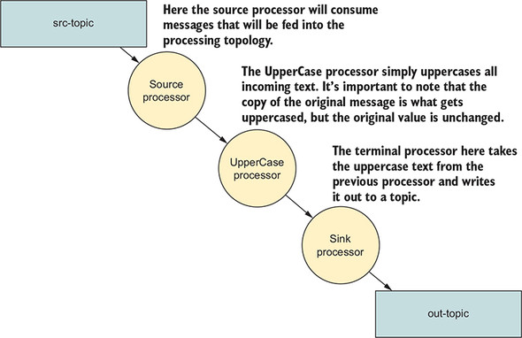

- 토폴로지는 소스 프로세서, 대문자 변경 프로세서, 싱크 프로세서로 나눠진다.

```java
1. 설정 항목을 정의한다.
2. 사용자 정의 또는 기정의된 Serde 인스턴스를 생성한다.
3. 프로세서 토폴로지를 만든다.
4. KStream으 생성하고 시작한다.
```

- 와 같은 순서로 진행된다.

### 2-1. Yelling App의 토폴로지 생성하기
- 카프카 스트림즈 어플리케이션을 만드는 첫 번째 단계는 소스 노드를 만드는 것
- 소스 노드는 어플리케이션을 통해 유입되는 레코드를 토픽에서 소비하는 역할을 한다.

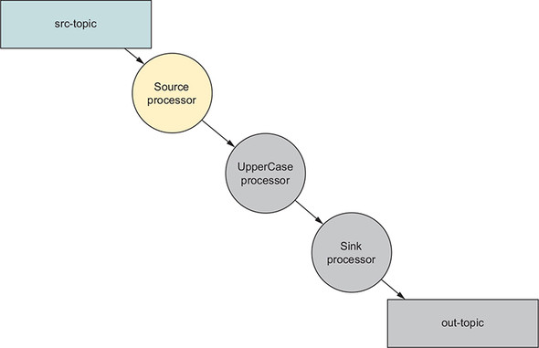

```java
KStream<String, String> simpleFirstStream = 
                builder.stream("src-topic", Consumed.with(stringSerde, stringSede));
```

- simpleFirstStream 이라는 KStream 인스턴스는 src-topic 토픽에 저장된 메세지를 소비하도록 설정된다.
- 토픽 이름 지정 외에도 카프카의 레코드를 역직렬화하기 위해 Serde 객체도 제공한다.
- 카프카 스트림즈에서 소스 노드를 만들 때마다 선택 매개변수로 Consumed 클래스를 사용할 것이다.
- 소스노드가 생겼으니, 데이터를 사용하려면 처리 노드를 연결해야 한다.

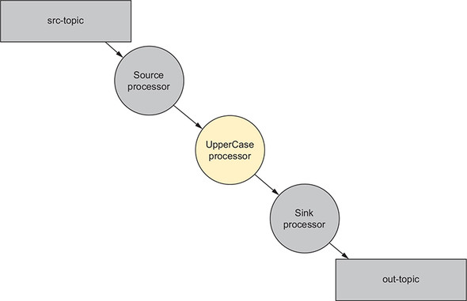

```java
KStream<String, String> upperCasedStream = 
                simpleFirstStream.mapValue(String::toUpperCase);
```

- KStream.mapValues 함수를 호출해서 노드의 입력값을 mapValues 호출을 통해 결괏값으로 만드는 새로운 처리 노드를 만든다.
- 중요한 포인트는 mapValues에서 제공된 ValueMapper가 원래 값을 수정하면 안 된다는 점이다.
- upperCasedStream 인스턴스는 simpleFirstStream.mapValues 호출에서 초깃값의 변환된 복사본을 받는다.
- 위의 경우엔 대문자 텍스트

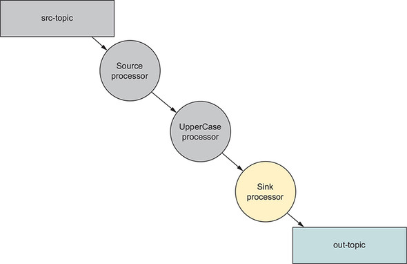

- 싱크 프로세서를 추가해준다.

```java
upperCasedStream.to("out-topic", Produced.with(stringSerde, stringSerde));
```

- KStream.to 메소드는 토폴로지에 싱크 처리 노드를 만든다.
- 싱크 프로세서는 레코드를 다시 카프카로 보내준다.
- 생성한 싱크노드는, upperCasedStream 프로세서에서 레코드를 가져와서 out-topic 토픽에 쓴다.

:::tip
항상 Consumed 또는 Produced 객체에 Serde 객체를 제공할 필요는 없다. 그렇지 않은 경우, 어플리케이션은 설정에 나열된 직렬화기/역질렬화기를 사용한다. 또한 Consumed와 Produced클래스를 사용해 키 또는 값에 대해서만 Serde를 지정할 수 있다.
:::

- 총 세줄의 코드로 토폴로지를 구성했는데, 좀더 깔끔하게 하면 플루언트 인터페이스 스타일의 프로그래밍을 사용할 수 있다.

```java
builder.stream("src-topic", Consumed.with(stringSerde, stringSerde))
    .mapValues(String:::toUpperCase)
    .to("out-topic", Produced.with(stringSerde, stringSerde));
```

### 2-2. 카프카 스트림즈 설정
- 몇가지 속성으로 특정 요구사항 조정이 가능하다.

```java
props.put(StreamsConfig.APPLICATION_ID_CONFIG, "yelling_app_id");
props.put(StreamsConfig.BOOTSTRAP_SERVERS_CONFIG, "localhost:9092");
```

- 두개의 설정은 기본값을 제공하지 않아, 필수값이다.
- StreamsConfig.APPLICATION_ID_CONFIG는 카프카 스트림즈 어플리케이션을 식별하며 전체 클러스터에 대해 고유한 값이어야 한다.
- StreamsConfig.BOOTSTRAP_SERVERS_CONFIG는 hostname:port 쌍으로 구성되고, 여러개가 구성될 수 있다. 이 설정은 카프카 스트림즈 어플리케이션에 카프카 클러스터 위치를 알려준다.

### 2-3. Serde 생성
- 카프카 스트림즈에서 Serde 클래스는 생성 메소드를 제공해 준다.

```java
Serde<String> stringSerde = Sedes.String();
```

- Serde 클래스를 사용해 직렬화/역직렬화에 필요한 Serde 인스턴스를 생성하고, 토폴로지에서 반복적인 사용을 위해 Serde를 참조하는 변수를 생성한다.
- Serde 클래스는 다음과 같은 기본 구현을 제공한다.
    - String
    - Byte array
    - Long
    - Integer
    - Double
- Serde 인터페이스 구현체는 직렬화기와 역직렬화기를 포함해, KStream 메소드에 Serde를 제공할 때마다 4개의 매개변수 (키 직렬화기, 값 직렬화기, 키 역직렬화기, 값 역직렬화기)를 지정하지 않아도 되서 유용하다.

<hr />

- 위의 소스의 전체 구성은 다음과 같다.

```java
public class KafkaStreamsYellingApp {

    public static void main(String[] args) {

        Properties props = new Properties();

        props.put(StreamsConfig.APPLICATION_ID_CONFIG, "yelling_app_id");
        props.put(StreamsConfig.BOOTSTRAP_SERVERS_CONFIG, "localhost:9092");

        StreamsConfig streamingConfig = new StreamsConfig(props); // Config 설정

        Serde<String> stringSerde = Serdes.String(); // Serde 생성

        StreamsBuilder builder = new StreamsBuilder(); 
        // 프로세서 토폴로지 구성을 위한 StreamsBuilder 생성

        KStream<String, String> simpleFirstStream = builder.stream("src-topic",
            Consumed.with(stringSerde, stringSerde)); // 소스 프로세서

        KStream<String, String> upperCasedStream =
            simpleFirstStream.mapValues(String::toUpperCase); // 처리 프로세서

        upperCasedStream.to("out-topic",
            Produced.with(stringSerde, stringSerde)); // 싱크프로세서

        KafkaStreams kafkaStreams = new KafkaStreams(builder.build(), streamsConfig);

        kafkaStreams.start(); // 카프카 스트림즈 쓰레드 시작
        Thread.sleep(35000);
        LOG.info("Shutting down the Yelling APP now");
        kafkaStreams.close();

    }
}
```

```java
1. StreamsConfig 인스턴스를 생성한다.
2. Serde 객체를 생성한다.
3. 처리 토폴로지를 구성한다.
4. 카프카 스트림즈 프로그램을 시작한다.
```

## 3. 사용자 데이터로 작업하기.
- 지마트 예제를 다시 가져온다.

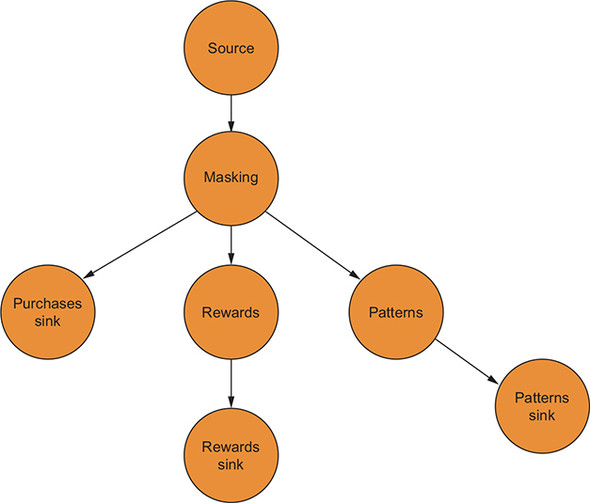

- 모든 기록은 보호된 신용카드 번호를 가져야 하며, 이 경우 처음 12자리를 마스킹 해야한다.
- 구매 패턴을 결정하려면 구입한 품목과 우편번호를 추출해야 한다. 이 데이터는 토픽에 기록할 것이다.
- 고객의 지마트 회원 번호와 지출한 금액을 캡처해 이 정보를 토픽에 기록해야 한다. 토픽의 컨슈머는 이 데이터를 사용해 보상을 결정한다.
- 전체 트랜잭션을 토픽에 기록해야 하며, 임의 분석을 위해 스토리지 엔진에서 사용한다.

### 3-1. 토폴로지 구성하기
#### 소스 노드 만들기
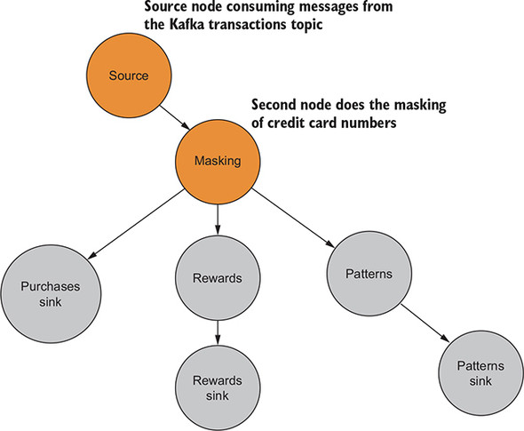

- 소스 프로세서를 만들고, 마스킹을 처리하는 토폴로지의 첫 프로세서를 만든다.

```java
KStream<String, Purcahse> purchaseKStrream = 
                        streamBuilder.stream("transactions", 
                        Consumed.with(stringSerde, purchaseSerde))
                        .mapValues(p -> Purchase.builder(p).maskCreditCard().build());
```

- String serde와 Purchase 객체를 사용하기 위한 사용자 정의 serde, 소스토픽 이름을 사용해 StreamsBuilder.stream 메소드를 호출한다.
- 첫 번째 프로세서를 실행하기 위해 mapValues에서 람다를 통해, 마킹된 크래딧 카드 정보를 가진 Purchase 객체를 만든다.

#### 함수형 프로그래밍에 대한 힌트
```java
1. 상태 수정을 피한다. 객체를 변경하거나, 업데이트 할 필요가 있을 경우
   해당 객체를 함수에 전달하고 복사 또는 완전히 새로운 인스턴스를 만들고 원하는 변경을 한다.
2. 여러 개의 작은 단일 용도의 함수를 함께 합성해 복잡한 작업을 구축하는 것이다.
```

#### 두 번째 프로세서 만들기
- 지역별 구매 패턴 결정을 위해 사용할 토픽에서 패턴 데이터를 추출하는 두 번째 프로세서를 만든다.
- 카프카 토픽에 패턴 데이터를 쓰는 싱크 노드도 추가한다.

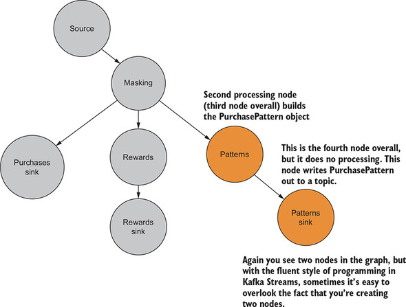

```java
KStream<String, PurchasePattern> patternKStream =
    purchaseKStream.mapValues(purchase ->
    PurchasePattern.builder(purchase).build());

patternKStream.to("patterns",
    Produced.with(stringSerde,purchasePatternSerde));
```

- 위에서 나온 purchaseKStream 객체를 사용해 구매 패턴을 결정해 patternKStream 프로세서를 만든다.
- 결과로 나오는 새로운 KStream은 patternKStream 이다.
- 이후에 patterns 토픽에 쓴다.
- 이전에 만든 Serde를 제공하기 위해 Produced 객체를 사용하는 점을 주의해 주면 된다.

#### 세 번째 프로세서 만들기
- 우수 고객 회원 추적을 위한 보상 노드를 만든다.

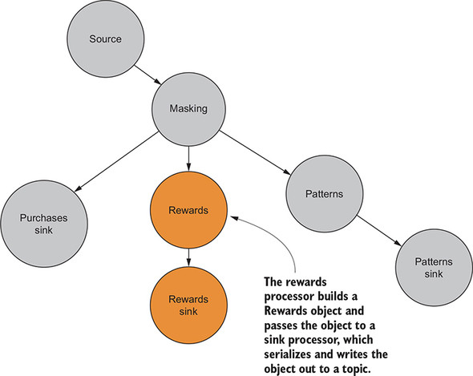

```java
KStream<String, RewardAccumulator> rewardsKStream =
    purchaseKStream.mapValues(purchase ->
    RewardAccumulator.builder(purchase).build());

rewardsKStream.to("rewards",
    Produced.with(stringSerde,rewardAccumulatorSerde));
```

- 위의 패턴 프로세서와 비슷하다.

#### 마지막 프로세서 만들기
- 처음 생성한 KStream 인 purchasedKStream을 가져와 싱크노드로 붙여 purchase 토픽에 기록한다.
- 해당 토픽은 NoSQL 저장소에 데이터를 공급해 즉시 분석을 수행하는데 사용한다.

```java
purchaseKStream.to("purchases", Produced.with(stringSerde, purchaseSerde));
```

<hr />
- 전체 소스 구조는 다음과 같다.

```java
public class ZMartKafkaStreamsApp {

    public static void main(String[] args) {
        // 설정 정보 등은 가독성을 위해 생략

        StreamsConfig streamsConfig = new StreamsConfig(getProperties());

        JsonSerializer<Purchase> purchaseJsonSerializer = new
            JsonSerializer<>();
        JsonDeserializer<Purchase> purchaseJsonDeserializer =
            new JsonDeserializer<>(Purchase.class);
        Serde<Purchase> purchaseSerde =
            Serdes.serdeFrom(purchaseJsonSerializer, purchaseJsonDeserializer);

        Serde<String> stringSerde = Serdes.String();

        StreamsBuilder streamsBuilder = new StreamsBuilder();

        KStream<String, Purchase> purchaseKStream =
            streamsBuilder.stream("transactions",
                Consumed.with(stringSerde, purchaseSerde))
                .mapValues(p -> Purchase.builder(p).maskCreditCard().build());

        KStream<String, PurchasePattern> patternKStream =
            purchaseKStream.mapValues(purchase ->
                PurchasePattern.builder(purchase).build());

        patternKStream.to("patterns",
            Produced.with(stringSerde, purchasePatternSerde));

        KStream<String, RewardAccumulator> rewardsKStream =
            purchaseKStream.mapValues(purchase ->
                RewardAccumulator.builder(purchase).build());

        rewardsKStream.to("rewards",
            Produced.with(stringSerde, rewardAccumulatorSerde));

        purchaseKStream.to("purchases",
            Produced.with(stringSerde, purchaseSerde));

        KafkaStreams kafkaStreams =
            new KafkaStreams(streamsBuilder.build(), streamsConfig);
        kafkaStreams.start();
    }
}
```

```java
1. StreamsConfig 인스턴스를 생성한다.
2. 하나 이상의 Serde 인스턴스를 작성한다.
3. 처리 토폴로지를 구성한다.
4. 모든 구성요소를 조립하고 카프카 스트림즈 프로그램을 시작한다.
```

### 3-2. 사용자 정의 Serde 생성하기
- 카프카는 데이터를 바이트 배열 형시으로 전송한다.
- 데이터 형식이 JSON 이기 때문에, 토픽에 데이터를 보낼 때 먼저 객체를 JSON으로 변환하고 바이트 배열로 변환하는 방법을 카프카에 알려주어야 한다.
- 반대로 소비한 바이트 배열을 JSON으로 변환한 다음 프로세서에서 사용할 객체 타입으로 변환하는 방법을 명시해야 한다.
- 즉 Serde는 데이터를 다른 형식으로 변환하기 위해 필요하다.
- Serde를 만들려면 Deserializer<T>와 Serializer<T> 인터페이스를 구현해야 한다.

```java
public class JsonSerializer<T> implements Serializer<T> {

    private Gson gson = new Gson();

    @Override
    public void configure(Map<String, ?> map, boolean b) {

    }

    @Override
    public byte[] serialize(String topic, T t) {
      return gson.toJson(t).getBytes(Charset.forName("UTF-8"));
    }

    @Override
    public void close() {

    }
}
```

- 직렬화의 경우 객체를 JSON으로 변환한 다음 문자열에서 바이트를 가져온다.

```java
public class JsonDeserializer<T> implements Deserializer<T> {

    private Gson gson = new Gson();
    private Class<T> deserializedClass;

    public JsonDeserializer(Class<T> deserializedClass) {
      this.deserializedClass = deserializedClass;
    }

    public JsonDeserializer() {
    }

    @Override
    @SuppressWarnings("unchecked")
    public void configure(Map<String, ?> map, boolean b) {
      if (deserializedClass == null) {
        deserializedClass = (Class<T>) map.get("serializedClass");
      }
    }

    @Override
    public T deserialize(String s, byte[] bytes) {
      if (bytes == null) {
        return null;
      }

      return gson.fromJson(new String(bytes), deserializedClass);

    }

    @Override
    public void close() {

    }
}
```

## 4. 대화형 개발
- Printed<K, V> 클래스의 인스턴스를 사용하는 KStream.print 메소드를 사용해서 콘솔에서 보는 거처럼 편하게 로그를 찍어 줄 수 있다.
- Printed.toSysOut() 과 Printed.toFile(filePath) 를 사용 할 수 있다.
- withLabel() 메소드를 연결해 인쇄 결과에 레이블을 지정할 수도 있다.
- toString을 사용하고 싶지 않거나, 카프카 스트림즈에서 레코드를 인쇄하는 방법을 사용자가 정의해서 하려면, Printed.withKeyValueMapper 메소드를 사용하면 된다.

```java
patternKStream.print(Printed.<String, PurchasePattern>toSysOut()
 .withLabel("patterns"));

rewardsKStream.print(Printed.<String, RewardAccumulator>toSysOut()
 .withLabel("rewards"));

purchaseKStream.print(Printed.<String, Purchase>toSysOut()
 .withLabel("purchases"));
```

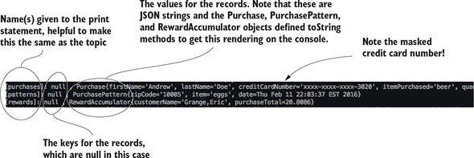

- print() 메소드는 터미널 노드를 생성해야 한다는 단점이 있다.
- 노드를 프로세서 체인에 끼워넣을 수가 없다는 소리
- ForeachAction인스턴스를 매개변수로 사용해 새 KStream 인스턴스를 반환하는 KStream.peek 메소드도 있다.

## 5. 다음 단계

### 5-1. 새로운 요구사항
- 동일한 소스 데이터를 쓰는 새로운 요구사항이 추가된다.
    - 특정 액수 미만의 구매는 걸러낼 필요가 있다. 상위 관리자는 소량의 구매품목은 관심이 없다.
    - 지마트가 확장되어 전자제품 체인과 인기 있는 커피 하우스 체인을 샀다. 새 상점에서 구입한 모든 항목은 구축한 스트리밍 어플리케이션을 통해 전달된다. 
    - 선택한 NoSQL 솔루션은 항목을 키/값 형식으로 저장한다. 카프카도 키/값 쌍을 사용하긴 하지만, 카프카 클러스터에 들어오는 레코드에는 키가 정의되어 있지 않다.
- KStream API 를 사용하여 요구사항 충족이 가능 하다.

#### 구매 필터링
- 최소 임곗값에 도달하지 못하는 구매는 걸러내야 한다.
- Kstream 인스턴스와 싱크 노드 사이에 필터 처리 노드를 삽입해 준다.

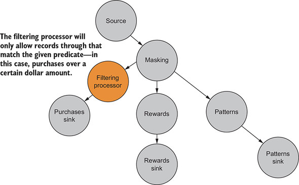

- Predicate<K,V> 인스턴스를 매개변수로 사용하는 KStream 메소드를 사용할 수 있다.

```java
KStream<Long, Purchase> filteredKStream =
   purchaseKStream((key, purchase) ->
   purchase.getPrice() > 5.00).selectKey(purchaseDateAsKey);
```

- 구매 날짜를 키로, 5달러 미만의 구매는 필터링을 해준다.

#### 스트림 나누기
- 구매 흐름을 다른 토픽에 쓸 수 있는 별도의 스트림으로 나누어야 한다.
- KStream.branch 메소드를 사용하면 된다.
- Kstream.branch는 임의의 수의 Predicate 인스턴스를 가져와서 KStream 인스턴스의 배열을 반환한다.
- 반환된 배열의 크기는 호출에 제공된 predicate의 수와 일치한다.
- 브랜치 프로세서는 주어진 predicate와 일치하지 않으면 레코드를 삭제한다.

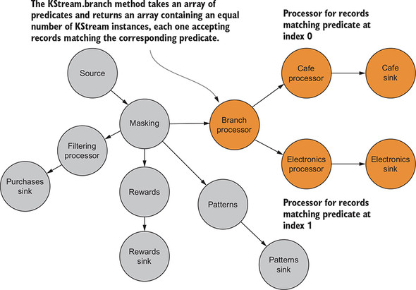

- 위의 그림에서 브랜치 프로세서는 스트림을 2개로 나눈다.
- 하나의 스트림은 카페로부터의 구매로 구성되고, 다른 스트림은 전자제품 상점에서의 구매를 포함한다.

```java
  Predicate<String, Purchase> isCoffee =
      (key, purchase) ->
          purchase.getDepartment().equalsIgnoreCase("coffee"); 
          // 자바 8 람다로 predicate 생성

  Predicate<String, Purchase> isElectronics =
      (key, purchase) ->
          purchase.getDepartment().equalsIgnoreCase("electronics");

  int coffee = 0;
  int electronics = 1;

  KStream<String, Purchase>[] kstreamByDept =
      purchaseKStream.branch(isCoffee, isElectronics); // 브랜치를 호춣해 2개의 스트림으로 나눈다.

  kstreamByDept[coffee].to( "coffee",
      Produced.with(stringSerde, purchaseSerde));
  kstreamByDept[electronics].to("electronics",
      Produced.with(stringSerde, purchaseSerde)); // 각 스트림의 결과를 토픽에 쓴다.
```

#### 키 생성하기
- 기본적으로 키를 설정하지 않으면, 카프카 스트림즈 어플리케이션에 흐르는 모든 레코드는 null 키가 있다.
- 키를 만들어야 하는 경우에 KStream.selectKey 메소드를 사용하면, 새로운 키와 동일한 값을 갖는 레코드를 만드는 KStream 인스턴스를 반환해 준다.

```java
  KeyValueMapper<String, Purchase, Long> purchaseDateAsKey =
      (key, purchase) -> purchase.getPurchaseDate().getTime(); 
      // KeyValueMapper는 구매 날짜를 추출하고 Long으로 변환한다.

  KStream<Long, Purchase> filteredKStream =
      purchaseKStream((key, purchase) ->
          purchase.getPrice() > 5.00).selectKey(purchaseDateAsKey);
          // 하나의 구문으로 구매를 필터링하고 키를 선택한다.

  filteredKStream.print(Printed.<Long, Purchase>
    toSysOut().withLabel("purchases"));
  filteredKStream.to("purchases",
      Produced.with(Serdes.Long(),purchaseSerde));
```

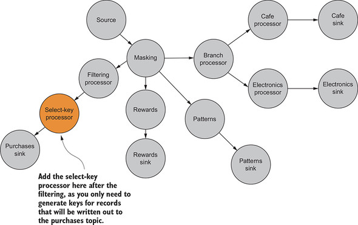

- purchases 토픽에 기록될 레코드의 키를 생성하기만 하면 되므로, 필터링 후에 키 선택 프로세서를 여기에 추가한다.

### 5-2. 카프카 외부에 레코드 기록하기
- 잘못된 사기정보 데이터를 토픽에 안넣고 싶어 할 경우의 예시이다.

#### Foreach 액션
- 단일직원 ID로 필터링하는 새로운 KStream을 만든다.
- 특정 직원 ID와 일치하는지 보는 predicate와 함께 KStream을 사용한다.
- 이 필터는 이전 필터와 완전히 분리하여 소스 KStream 인스턴스에 연결할 것이다.

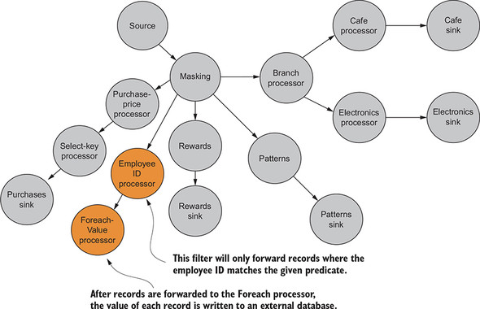

- Kstream.foreach 메소드를 사용한다.
- foreach 메소드는 ForeachAction<K, V> 인스턴스를 사용하며, 터미널 노드의 또다른 예이다.

```java
ForeachAction<String, Purchase> purchaseForeachAction = (key, purchase) ->
    SecurityDBService.saveRecord(purchase.getPurchaseDate(),
    purchase.getEmployeeId(), purchase.getItemPurchased());

purchaseKStream.filter((key, purchase) ->
    purchase.getEmployeeId()
    .equals("source code has 000000"))
    .foreach(purchaseForeachAction);
```

- ForeachAction은 자바 8 람다를 사용하고, 변수 purchaseForeachAction에 저장된다. 

## 요약
- KStream.mapValues 함수를 사용하면 들어오는 레코드값을 가능한 다른 타입의 새로운 값으로 매핑할 수 있다.
- predicate는 매개변수로 객체를 받아들이고 해당 객체가 주어진 조건과 일치하는지 여부에 따라 true 또는 false를 반환하는 구문이다. 
- KStream.branch 메소드는 레코드가 주어진 predicate와 일치할 때 레코드를 새로운 스트림으로 레코드를 분할하기 위해 predicate를 사용한다.
- KStream.selectKey 메소드를 사용하면 기존 키를 수정하거나 새 키를 생성할 수 있다.