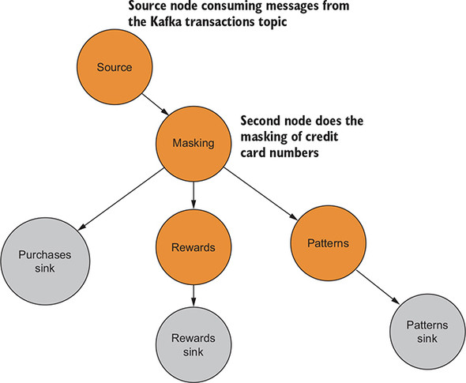
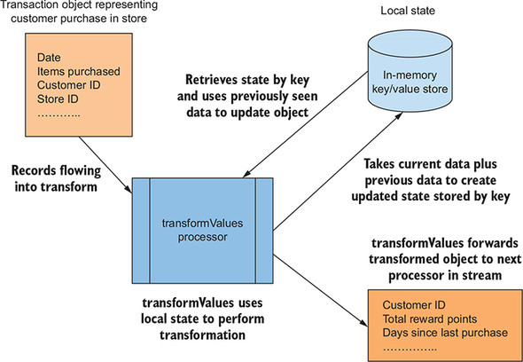
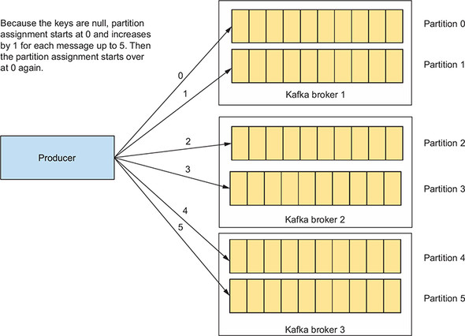
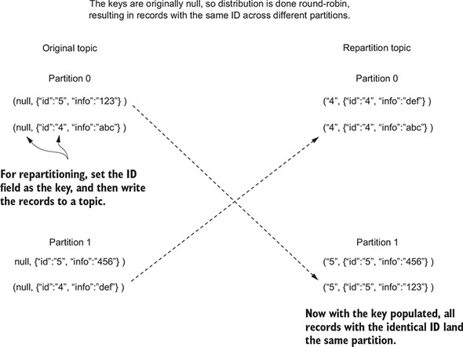
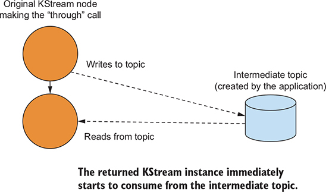
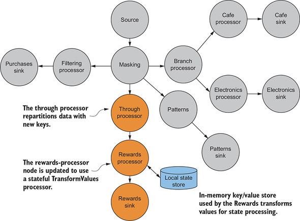
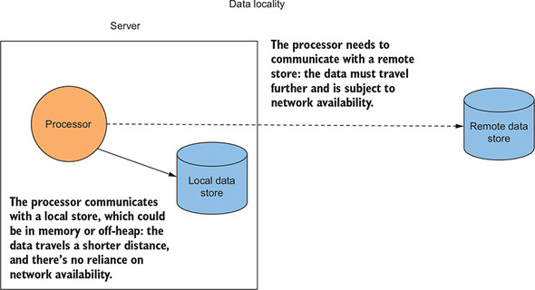

# 4강
[[toc]]

## 1. 이벤트

### 1-1. 스트림은 상태가 필요하다
- 스트림 처리에서 추가된 문맥은 상태(state) 라고 부른다.
- 상태와 스트림 처리의 개념이 서로 상충되는 것처럼 보일 수 있지만, 스트림 처리는 서로 관련이 없으며 발생했을 때 처리될 필요가 있는 개별 이벤트의 지속적인 흐름을 의미한다.
- 상태의 개념은 데이터베이스 테이블 같은 정적 리소스 이미지를 생각하면 된다.

## 2. 카프카 스트림즈에 상태를 가진 작업 적용하기
- 기존 구조는 다음과 같다.



- 위의 그림에서, 보상은 단일 트랜잭션에 대한 보상만 처리해서 결과를 전달해 준다.
- 프로세서에 상태를 추가한 경우 보상 포인트의 누적 수의 추적이 가능하다.
- transformValues를 사용해 상태가 없는 보상 프로세서를 상태가 있는 프로세서로 변환해 보면 된다.
- 컨슈머에게 더 많은 정보를 주기 위해, 총 보너스 포인트와 구매간 걸린 시간을 추적한다.

### 2-1. transformValues 프로세서
- 가장 기본적인 상태 유지 함수는 KStream.transformValues 이다.



- transformValues 프로세서는 로컬 상태에 저장된 정보를 사용하여 들어오는 레코드를 업데이트한다.
- 위의 경우 고객 ID는 주어진 레코드의 상태를 검색하고 저장하는 데 사용한다.
- 이 메소드는 의미상으론 KStream.mapValues()와 동일하지만, transformValues가 StateStore 인스턴스에 접근해 작업을 완료하는 차이접이 있다.

### 2-2. 고객 보상의 상태 유지
- 기존의 보상 프로세서는, KStream.mapValues() 메소드를 사용해 들어오는 Purchase 객체를 RewardAccumulator 객체로 매핑했다.
- RewardAccumulator 객체는 원래 트랜잭션의 고객 ID와 구매 총계라는 2개의 필드로 구성됐다.
- 요구사항이 변경 되었으니, 포인트는 지마트 보상 프로그램과 연관된다.

```java
public class RewardAccumulator {
    private String customerId; // 고객 ID
    private double puchaseTotal; // 총 구매 금액
    private int currentRewardPoints; // 현재 보상 포인트

    ...
}
```

- 어플리케이션이 보상 토픽에서 레코드를 읽으면 컨슈머 어플리케이션은 보상을 분배하기 위해 총 포인트가 임곗값을 초과하는지 여부만 확인해 주면 된다.
- 2개의 필드 totalRewardPoint와 daysFromLastPurchase를 추가해준다.

```java
public class RewardAccumulator {
    private String customerId; 
    private double puchaseTotal; 
    private int currentRewardPoints; 
    private int daysFromLastPurchase;
    private long totalRewardPoints; // 총점을 추적하기 위해 추가된 필드

    ...
}
```

- 토폴로지 전체 구조는 따로 바뀌지 않지만, KStream.mapValues() 메소드 대신 KStream.transformValues() 메소드를 사용한다.
- 두 가지 단계를 수행한다.
    - 값 변환기를 초기화 한다.
    - 상태를 사용해 Purchase객체를 RewardAccumulator로 매핑힌다.

### 2-3. 값 변환기 초기화
- 첫 번째 단계는 변환기의 init() 메소드에서 인스턴스 변수를 설정하거나 생성하는 것.
- init() 메소드에서 처리 토폴로지를 만들 때 생성된 상태 저장소를 찾는다.

```java
  private KeyValueStore<String, Integer> stateStore; // 인스턴스 변수

  private final String storeName;
  private ProcessorContext context;

  public void init(ProcessorContext context) {
    this.context = context;  // ProcessorContext에 로컬 참조 설정
    stateStore = (KeyValueStore)
        this.context.getStateStore(storeName); // storeName 변수로 StateStore 인스턴스를 찾음
  }
```

- 변환기 클래스에서 KeyValueStore 타입으로 형 변환한다.

### 2-4. 상태를 사용해 Purchase 객체를 RewardAccumulator에 매핑하기
- 프로세서를 초기화 했으므로 상태를 사용해 Purchase 객체를 변환할 수 있다.

```java
1. 고객 ID 별로 누적된 포인트가 있는지 확인한다.
2. 현재 거래에 대한 포인트를 합산하고 합계를 표시한다.
3. RewardAccumulator 의 보상 포인트를 새로운 총 보상 포인트로 설정한다.
4. 고객 ID 별로 새 총점을 로컬 상태 저장소에 저장한다.
```

```java
public RewardAccumulator transform(Purchase value) {
    RewardAccumulator rewardAccumulator =
        RewardAccumulator.builder(value).build(); // purchase에서 RewardAccumulator 객체 만들기
    Integer accumulatedSoFar =
        stateStore.get(rewardAccumulator.getCustomerId()); // 고객 ID로 최신 누적 보상 포인트 가져오기

    if (accumulatedSoFar != null) {
      rewardAccumulator.addRewardPoints(accumulatedSoFar); // 누적된 숫자가 있으면 현재 합계에 추가
    }
    stateStore.put(rewardAccumulator.getCustomerId(),
        rewardAccumulator.getTotalRewardPoints()); // 새로운 누적 포인트를 stateStore에 저장

    return rewardAccumulator;
}
```

- transform() 메소드에서 먼저 Purchase 객체를 RewardAccumulator 로 매핑한다.
- 이후에 변환 과정에서 상태가 들어가게 되는데, 키(고객ID)로 조회를 수행하고, 누적된 포인트에 현재 포인트를 추가해준다.
- 이후 추가된 총포인트를 상태 저장소에 저장해 준다.
- 이제 보상 프로세서를 업데이트 해줘야 하는데, 시작하기 전에 고객 ID로 모든 판매에 접근하고 있다는 사실을 고려해야 한다.
- 주어진 고객에 대한 판매별 정보를 수집한다는 것은 해당 고객에 대한 모든 트랜잭션이 동일한 파티션에 있음을 의미한다.
- 그런데 처음 카프카로 데이터가 들어갈 때 키가 없이 들어가, 라운드 로빈으로 데이터를 카프카로 할당해 줘서 꼬이는 문제가 발생 할 수 있다.



- 즉 토픽이 한개가 아니라면, 키가 채워지지 않은 레코드가 라운드 로빈으로 카프카에 할당이 되고, 주어진 고객에 대한 트랜잭션이 동일한 파티션에 들어가지 않음을 의미한다.
- 상태 저장소의 ID로 레코드를 조회해야 하기 때문에 동일한 파티션에 동일한 ID로 고객 거래를 배치해야 한다.
- 그렇지 않으면 여러 파티션에 동일한 ID를 가진 고객이 분산되므로 동일한 고객을 여러 상태 저장소에서 조회해야 한다.
- 헷갈리면 안되는게, 각 파티션에 자체 상태 저장소가 있는게 아니라 약간 각 파티션마다 저장소 할당영역이 있다고 생각하면 된다.
- 위의 문제를 해결하는 방법으로는, 고객 ID로 데이터를 다시 분할해 준다.

#### 데이터 리파티셔닝



- 레코드를 리파티셔닝하려면 먼저 원본 레코드의 키를 변경학거나 바꾼 다음 레코드를 새로운 토픽에 쓴다.
- 이후에 해당 레코드를 다시 소비해준다.
- 리파티셔닝의 결과로 해당 레코드가 원래 있던 곳과 다른 파티션애서 올 수도 있다.

#### 카프카 스트림즈의 리파티셔닝



- 카프카 스트림즈에서 리파티셔닝은 KStream.through()를 사용해 쉽게 수행할 수 있다.
- KStream.through()는 중간 토픽을 생성하고 현재 KSteam 인스턴스는 해당 토픽에 레코드를 기록한다. 
- 새로운 KStream 인스턴스는 해당 소스에 대해 동일한 중간 토픽을 사용해 through() 메소드 호출로 반환된다.
- 중간 토픽을 사용하기 위해 내부적으로 싱크 노드와 소스노드를 만든다.
- 싱크노드는 기존 KStream 인스턴스가 호출하는 자식 프로세서이고, 새로운 KStream 인스턴스는 레코드의 소스로 새로운 소스 노드를 사용한다.

```java
RewardStreamPartitioner streamPartitioner = 
                new RewardStreamPartitioner(); // StreamPartitioner를 구현한 인스턴스 초기화

KStream<String, Purchase> transByCustomerStream = 
                purchaseKStream.through("customer_transactions",
                                        Produced.with(stringSerde,
                                                      purchaseSerde,
                                                      streamPartitioner)) // KStream.through로 KStream을 생성
```

#### StreamPartitioner 사용하기
- 일반적으로 파티션 할당은 객체의 해시값을 구해 파티션 수로 모듈러 연산을 한다.
- 위의 경우는 Purchase 객체에 있는 고객 ID를 이용해 특정 고객의 모든 데이터가 동일한 상태저장소에 저장되어야 한다.

```java
public class RewardsStreamPartitioner implements
      StreamPartitioner<String, Purchase> {

    @Override
    public Integer partition(String key,
        Purchase value,
        int numPartitions) {
      return value.getCustomerId().hashCode() % numPartitions;
      // 고객 ID로 파티션을 결정해 준다.
    }
}
```

:::warning
이러한 간단한 데모를 보고 리파티셔닝을 남용하면 안된다. 리파티셔닝이 가끔 팔요하긴 하지만, 데이터가 중복되거나 프로세싱 오버헤드가 발생한다. 가능하면 mapValues(), transformValues(), 또는 flatMapValues()의 사용을 권장한다. map(), transform(), flatMap()은 자동으로 리파티셔닝을 유발할 수 있기 때문이다.
:::

### 2-5. 보상 프로세서 업데이트
- 위처럼 작업을 하고나면, 구매 객체를 고객 ID별로 분할된 토픽에 기록하는 새로운 처리노드를 생성한다.
- 이 새로운 토픽은 곧 업데이트 되는 보상 프로세서의 소스가 된다.
- 이제 동일한 아이디를 가진 고객은 같은 상태 저장소를 사용하게 된다.



- KStream.through()를 통해 생성된 새로운 Stream 인스턴스를 사용해 다음 코드로 보상 프로세서를 업데이트하고 상태를 가진 변환 접근법을 사용한다.
- 즉 순서대로 보면, 마스킹 후에 들어오는 데이터를 쓰루 프로세서를 통해 리파티셔닝을 해서 같은 고객은 같은 파티션으로 모아주고, 보상 프로세서에서 이전 포인트 정보를 알기위해 로컬 스테이트를 추가해 준다.

```java
KStream<String, RewardAccumulator> statefulRewardAccumulator =
    transByCustomerStream.transformValues(() ->
    new PurchaseRewardTransformer(rewardsStateStoreName),
                                        rewardsStateStoreName); // 상태를 가진 변환 사용
statefulRewardAccumulator.to("rewards",
                              Produced.with(stringSerde,
                                       rewardAccumulatorSerde)); // 결과를 토픽에 기록
```

- KStream.transformValues()를 사용해 상태가 없는 노드에 상태를 가진 프로세싱을 추가해 준다.

## 3. 조회와 이전에 본 데이터에 상태 저장소 사용하기
### 3-1. 데이터 지역성
- 키 조회는 일반적으로 매우 빠르지만 원격 저장소를 사용하면 규모가 커지면 병목 현상이 발생해 대기시간이 길어진다.



- 위의 그림에서 외부 저장소와 네트워크 통신을 하는 것 보다, 로컬에서 데이터를 가져오기 위한 호출이 훨씬 더 빠르다.
- 스트리밍 데이터는 수백만, 수억 개의 레코드를 처리하기 때문에 네트워크 지연이 발생할 가능성이 있으면 문제가 심해질 수 있다.
- 어플리케이션의 각 서버나 노드는 개별 데이터 저장소가 있어야 한다.

### 3-2. 실패 복구와 내결함성
- 
