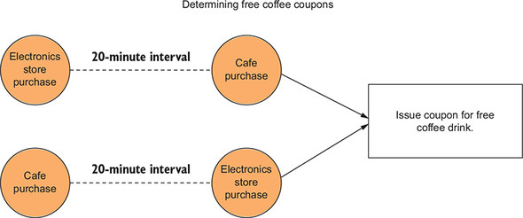

# 4강
[[toc]]

## 1. 이벤트

### 1-1. 스트림은 상태가 필요하다
- 스트림 처리에서 추가된 문맥은 상태(state) 라고 부른다.
- 상태와 스트림 처리의 개념이 서로 상충되는 것처럼 보일 수 있지만, 스트림 처리는 서로 관련이 없으며 발생했을 때 처리될 필요가 있는 개별 이벤트의 지속적인 흐름을 의미한다.
- 상태의 개념은 데이터베이스 테이블 같은 정적 리소스 이미지를 생각하면 된다.

## 2. 카프카 스트림즈에 상태를 가진 작업 적용하기
- 기존 구조는 다음과 같다.


- 위의 그림에서, 보상은 단일 트랜잭션에 대한 보상만 처리해서 결과를 전달해 준다.
- 프로세서에 상태를 추가한 경우 보상 포인트의 누적 수의 추적이 가능하다.
- transformValues를 사용해 상태가 없는 보상 프로세서를 상태가 있는 프로세서로 변환해 보면 된다.
- 컨슈머에게 더 많은 정보를 주기 위해, 총 보너스 포인트와 구매간 걸린 시간을 추적한다.

### 2-1. transformValues 프로세서
- 가장 기본적인 상태 유지 함수는 KStream.transformValues 이다.


- transformValues 프로세서는 로컬 상태에 저장된 정보를 사용하여 들어오는 레코드를 업데이트한다.
- 위의 경우 고객 ID는 주어진 레코드의 상태를 검색하고 저장하는 데 사용한다.
- 이 메소드는 의미상으론 KStream.mapValues()와 동일하지만, transformValues가 StateStore 인스턴스에 접근해 작업을 완료하는 차이접이 있다.

### 2-2. 고객 보상의 상태 유지
- 기존의 보상 프로세서는, KStream.mapValues() 메소드를 사용해 들어오는 Purchase 객체를 RewardAccumulator 객체로 매핑했다.
- RewardAccumulator 객체는 원래 트랜잭션의 고객 ID와 구매 총계라는 2개의 필드로 구성됐다.
- 요구사항이 변경 되었으니, 포인트는 지마트 보상 프로그램과 연관된다.

```java
public class RewardAccumulator {
    private String customerId; // 고객 ID
    private double puchaseTotal; // 총 구매 금액
    private int currentRewardPoints; // 현재 보상 포인트

    ...
}
```

- 어플리케이션이 보상 토픽에서 레코드를 읽으면 컨슈머 어플리케이션은 보상을 분배하기 위해 총 포인트가 임곗값을 초과하는지 여부만 확인해 주면 된다.
- 2개의 필드 totalRewardPoint와 daysFromLastPurchase를 추가해준다.

```java
public class RewardAccumulator {
    private String customerId; 
    private double puchaseTotal; 
    private int currentRewardPoints; 
    private int daysFromLastPurchase;
    private long totalRewardPoints; // 총점을 추적하기 위해 추가된 필드

    ...
}
```

- 토폴로지 전체 구조는 따로 바뀌지 않지만, KStream.mapValues() 메소드 대신 KStream.transformValues() 메소드를 사용한다.
- 두 가지 단계를 수행한다.
    - 값 변환기를 초기화 한다.
    - 상태를 사용해 Purchase객체를 RewardAccumulator로 매핑힌다.

### 2-3. 값 변환기 초기화
- 첫 번째 단계는 변환기의 init() 메소드에서 인스턴스 변수를 설정하거나 생성하는 것.
- init() 메소드에서 처리 토폴로지를 만들 때 생성된 상태 저장소를 찾는다.

```java
  private KeyValueStore<String, Integer> stateStore; // 인스턴스 변수

  private final String storeName;
  private ProcessorContext context;

  public void init(ProcessorContext context) {
    this.context = context;  // ProcessorContext에 로컬 참조 설정
    stateStore = (KeyValueStore)
        this.context.getStateStore(storeName); // storeName 변수로 StateStore 인스턴스를 찾음
  }
```

- 변환기 클래스에서 KeyValueStore 타입으로 형 변환한다.

### 2-4. 상태를 사용해 Purchase 객체를 RewardAccumulator에 매핑하기
- 프로세서를 초기화 했으므로 상태를 사용해 Purchase 객체를 변환할 수 있다.

```java
1. 고객 ID 별로 누적된 포인트가 있는지 확인한다.
2. 현재 거래에 대한 포인트를 합산하고 합계를 표시한다.
3. RewardAccumulator 의 보상 포인트를 새로운 총 보상 포인트로 설정한다.
4. 고객 ID 별로 새 총점을 로컬 상태 저장소에 저장한다.
```

```java
public RewardAccumulator transform(Purchase value) {
    RewardAccumulator rewardAccumulator =
        RewardAccumulator.builder(value).build(); // purchase에서 RewardAccumulator 객체 만들기
    Integer accumulatedSoFar =
        stateStore.get(rewardAccumulator.getCustomerId()); // 고객 ID로 최신 누적 보상 포인트 가져오기

    if (accumulatedSoFar != null) {
      rewardAccumulator.addRewardPoints(accumulatedSoFar); // 누적된 숫자가 있으면 현재 합계에 추가
    }
    stateStore.put(rewardAccumulator.getCustomerId(),
        rewardAccumulator.getTotalRewardPoints()); // 새로운 누적 포인트를 stateStore에 저장

    return rewardAccumulator;
}
```

- transform() 메소드에서 먼저 Purchase 객체를 RewardAccumulator 로 매핑한다.
- 이후에 변환 과정에서 상태가 들어가게 되는데, 키(고객ID)로 조회를 수행하고, 누적된 포인트에 현재 포인트를 추가해준다.
- 이후 추가된 총포인트를 상태 저장소에 저장해 준다.
- 이제 보상 프로세서를 업데이트 해줘야 하는데, 시작하기 전에 고객 ID로 모든 판매에 접근하고 있다는 사실을 고려해야 한다.
- 주어진 고객에 대한 판매별 정보를 수집한다는 것은 해당 고객에 대한 모든 트랜잭션이 동일한 파티션에 있음을 의미한다.
- 그런데 처음 카프카로 데이터가 들어갈 때 키가 없이 들어가, 라운드 로빈으로 데이터를 카프카로 할당해 줘서 꼬이는 문제가 발생 할 수 있다.


- 즉 토픽이 한개가 아니라면, 키가 채워지지 않은 레코드가 라운드 로빈으로 카프카에 할당이 되고, 주어진 고객에 대한 트랜잭션이 동일한 파티션에 들어가지 않음을 의미한다.
- 상태 저장소의 ID로 레코드를 조회해야 하기 때문에 동일한 파티션에 동일한 ID로 고객 거래를 배치해야 한다.
- 그렇지 않으면 여러 파티션에 동일한 ID를 가진 고객이 분산되므로 동일한 고객을 여러 상태 저장소에서 조회해야 한다.
- 헷갈리면 안되는게, 각 파티션에 자체 상태 저장소가 있는게 아니라 약간 각 파티션마다 저장소 할당영역이 있다고 생각하면 된다.
- 위의 문제를 해결하는 방법으로는, 고객 ID로 데이터를 다시 분할해 준다.

#### 데이터 리파티셔닝


- 레코드를 리파티셔닝하려면 먼저 원본 레코드의 키를 변경학거나 바꾼 다음 레코드를 새로운 토픽에 쓴다.
- 이후에 해당 레코드를 다시 소비해준다.
- 리파티셔닝의 결과로 해당 레코드가 원래 있던 곳과 다른 파티션애서 올 수도 있다.

#### 카프카 스트림즈의 리파티셔닝


- 카프카 스트림즈에서 리파티셔닝은 KStream.through()를 사용해 쉽게 수행할 수 있다.
- KStream.through()는 중간 토픽을 생성하고 현재 KSteam 인스턴스는 해당 토픽에 레코드를 기록한다. 
- 새로운 KStream 인스턴스는 해당 소스에 대해 동일한 중간 토픽을 사용해 through() 메소드 호출로 반환된다.
- 중간 토픽을 사용하기 위해 내부적으로 싱크 노드와 소스노드를 만든다.
- 싱크노드는 기존 KStream 인스턴스가 호출하는 자식 프로세서이고, 새로운 KStream 인스턴스는 레코드의 소스로 새로운 소스 노드를 사용한다.

```java
RewardStreamPartitioner streamPartitioner = 
                new RewardStreamPartitioner(); // StreamPartitioner를 구현한 인스턴스 초기화

KStream<String, Purchase> transByCustomerStream = 
                purchaseKStream.through("customer_transactions",
                                        Produced.with(stringSerde,
                                                      purchaseSerde,
                                                      streamPartitioner)) // KStream.through로 KStream을 생성
```

#### StreamPartitioner 사용하기
- 일반적으로 파티션 할당은 객체의 해시값을 구해 파티션 수로 모듈러 연산을 한다.
- 위의 경우는 Purchase 객체에 있는 고객 ID를 이용해 특정 고객의 모든 데이터가 동일한 상태저장소에 저장되어야 한다.

```java
public class RewardsStreamPartitioner implements
      StreamPartitioner<String, Purchase> {

    @Override
    public Integer partition(String key,
        Purchase value,
        int numPartitions) {
      return value.getCustomerId().hashCode() % numPartitions;
      // 고객 ID로 파티션을 결정해 준다.
    }
}
```

:::warning
이러한 간단한 데모를 보고 리파티셔닝을 남용하면 안된다. 리파티셔닝이 가끔 팔요하긴 하지만, 데이터가 중복되거나 프로세싱 오버헤드가 발생한다. 가능하면 mapValues(), transformValues(), 또는 flatMapValues()의 사용을 권장한다. map(), transform(), flatMap()은 자동으로 리파티셔닝을 유발할 수 있기 때문이다.
:::

### 2-5. 보상 프로세서 업데이트
- 위처럼 작업을 하고나면, 구매 객체를 고객 ID별로 분할된 토픽에 기록하는 새로운 처리노드를 생성한다.
- 이 새로운 토픽은 곧 업데이트 되는 보상 프로세서의 소스가 된다.
- 이제 동일한 아이디를 가진 고객은 같은 상태 저장소를 사용하게 된다.


- KStream.through()를 통해 생성된 새로운 Stream 인스턴스를 사용해 다음 코드로 보상 프로세서를 업데이트하고 상태를 가진 변환 접근법을 사용한다.
- 즉 순서대로 보면, 마스킹 후에 들어오는 데이터를 쓰루 프로세서를 통해 리파티셔닝을 해서 같은 고객은 같은 파티션으로 모아주고, 보상 프로세서에서 이전 포인트 정보를 알기위해 로컬 스테이트를 추가해 준다.

```java
KStream<String, RewardAccumulator> statefulRewardAccumulator =
    transByCustomerStream.transformValues(() ->
    new PurchaseRewardTransformer(rewardsStateStoreName),
                                        rewardsStateStoreName); // 상태를 가진 변환 사용
statefulRewardAccumulator.to("rewards",
                              Produced.with(stringSerde,
                                       rewardAccumulatorSerde)); // 결과를 토픽에 기록
```

- KStream.transformValues()를 사용해 상태가 없는 노드에 상태를 가진 프로세싱을 추가해 준다.

## 3. 조회와 이전에 본 데이터에 상태 저장소 사용하기
### 3-1. 데이터 지역성
- 키 조회는 일반적으로 매우 빠르지만 원격 저장소를 사용하면 규모가 커지면 병목 현상이 발생해 대기시간이 길어진다.


- 위의 그림에서 외부 저장소와 네트워크 통신을 하는 것 보다, 로컬에서 데이터를 가져오기 위한 호출이 훨씬 더 빠르다.
- 스트리밍 데이터는 수백만, 수억 개의 레코드를 처리하기 때문에 네트워크 지연이 발생할 가능성이 있으면 문제가 심해질 수 있다.
- 어플리케이션의 각 서버나 노드는 개별 데이터 저장소가 있어야 한다.

### 3-2. 실패 복구와 내결함성
- 분산 어플리케이션의 경우 장애는 불가피하다. 
- 실패를 예방하기보단 실패나 재시작에서조차 신속하게 복구하는 데 중점을 둔다.


- 위의 그림을 보면 각 프로세서에는 로컬 데이터 저장소가 있으며, 변경 로그 토픽은 상태 저장소를 백업하는 데 사용한다.

### 3-3. 카프카 스트림즈에서 상태 저장소 사용하기
- 상태 저장소를 추가하는 것은 Stores 클래스에서 정적 팩토리 메소드 중 하나를 사용해 StoreSupplier 인스턴스를 생성하는 작업
- 상태 저장소를 사용자 정의하기 위한 두 가지 추가적인 클래스가 존재하는데, Materialized와 StoreBuilder 클래스이다.

```java
String rewardStateStoreName = "rewardsPointsStore";
KeyValueBytesStoreSupplier storeSupplier = 
    Stores.inMemoryKeyValueStore(rewardsStateStroeName); // StateStore 공급자를 생성한다.

StoreBuilder<KeyValueStore<String, Integer>> storeBuilder = 
    Stores.keyValueStoreBuilder(storeSupplier, Serdes.String(), Serdes.Integer());
    // StoreBuilder를 생성하고 키와 값의 타입 명시

builder.addStateStore(storeBuilder); // 상태 저장소를 토폴로지에 추가한다. 
```

- 먼저 인메모리 키/값 저장소를 제공하는 StoreSupplier를 생성한다.
- StoreBuilder를 생성하기 위한 매개변수로 StoreSupplier를 제공하고, 키 / 값 타입을 명시한다.
- StoreBuilder를 StreamBuilder에 제공해 토폴로지에 StateStore를 추가한다.
- rewardsPointStoreName 이라는 이름을 사용해 프로세서에서 상태를 사용할 수 있다.

### 3-4. 추가적인 키/값 저장소 공급자
- Stores.inMemoryKeyValueStore 말고도 저장소 공급자를 추가할 수 있는 정적 메소드가 있다.
- Stores.persistentKeyValueStore
- Stores.persistentWindowStore
- Stores.lruMap
- Stores.persistentSessionStore
- 모든 영구 StateStore 인스턴스가 록스DB를 사용해 로컬 스토리지를 제공한다.

### 3-5. 상태 저장소의 내결함성
- 모든 StateStoreSupplier 타입은 기본적으로 로깅이 활성화되어 있다.
- 이 문맥에서 로깅은 저장소의 값을 백업하고 내결함성을 제공하기 위한 변경로그로 사용되는 카프카 토픽을 의미
- 예를 들어, 카프카 스트림즈를 실행하는 머신이 실패했다고 가정하면, 서버를 복구하고 카프카 스트림즈 어플리케이션을 다시 시작하면 해당 인스턴스의 상태 저장소가 원래 내용으로 복원된다.

### 3-6. 변경로그 토픽 설정하기
- 상태 저장소에 대한 변경로그는 withLoggingEnabled(Map<String, String> config) 메소드를 통해 설정한다.
- 맵 안에서 토픽에 대한 가능한 모든 설정 매개변수를 사용할 수 있다.
- 상태 저장소에 대한 변경로그의 설정은 매우 중요하므로, 잘 알아 두어야 한다.
- 하지만 카프카 스트림즈가 병경로그 토픽을 자동으로 생성해 주기때문에, 변경로그 토픽을 생성할 필요는 전혀없다.

<hr />

- 카프카 토픽을 사용하면 로그 세그먼트의 데이터 보존에 대한 기본 설정은 일주일이고 크기는 무제한이다.
- 기본 클린업 정책은 delete
- 변경로그 토픽이 10GB의 보존 크기와 2일간의 보존 기간을 갖도록 수정을 하는 코드는 다음과 같다.

```java
Map<String, String> changeLogConfigs = new HashMap<>();
changeLogConfigs.put("retention.ms","172800000" );
changeLogConfigs.put("retention.bytes", "10000000000");

// StoreBuilder 를 사용할 때
storeBuilder.withLoggingEnabled(changeLogConfigs);

// Materialized 를 사용할 때
Materialized.as(Stores.inMemoryKeyValueStore("foo")
                      .withLoggingEnabled(changeLogConfigs));
```

- 클린업 정책을 compact로 바꾸고 싶다면 설정을 해주면 된다.

```java
Map<String, String> changeLogConfigs = new HashMap<>();
changeLogConfigs.put("retention.ms","172800000" );
changeLogConfigs.put("retention.bytes", "10000000000");
changeLogConfigs.put("cleanup.policy", "compact,delete");
```

## 4. 추가적인 통찰을 위해 스트림 조인하기
- 새로운 이벤트를 만들기 위해 동일한 키를 이용해 스트림 2개에서 각기 다른 이벤트를 가져와 결합을 할 수 있다.
- 이전에 했던 카페와 전자제품 프로세서 브랜치로 나눈 그림이다.


- 여기에 추가적인 기능을 넣어서, 커피를 사고 전자제품 상점에서 구매한 고객을 확인해 20분 내에 구매를 했으면, 두 번째 거래 직후 쿠폰을 지급하려고 한다.



- 이러한 쿠폰 발행을 하고 발행 시기를 결정하기 위해선 전자제품 상점의 판매와 카페의 판매를 조인해야 한다.

### 4-1. 데이터 설정


- 이전에 설정했던 분기 코드를 다시 사용한다.

```java
Predicate<String, Purchase> coffeePurchase = (key, purchase) ->
    purchase.getDepartment().equalsIgnoreCase("coffee");

Predicate<String, Purchase> electronicPurchase = (key, purchase) ->
    purchase.getDepartment().equalsIgnoreCase("electronics");

final int COFFEE_PURCHASE = 0;
final int ELECTRONICS_PURCHASE = 1;

KStream<String, Purchase>[] branchedTransactions =
    transactionStream.branch(coffeePurchase, electronicPurchase);
```

### 4-2. 조인을 수행하기 위해 고객 ID를 포함한 키 생성하기
- 키를 생성하려면 스트림의 구매 데이터에서 고객 ID를 선택한다.
- 원본 KStream 인스턴스(transactionStream)를 업데이트하고 해당 노드와 분기 노드사이에 다른 처리노드를 생성해야 한다.

```java
KStream<String, Purchase>[] branchesStream = 
    transactionStream.selectKey((k,v) -> 
    v.getCustomerId()).branch(coffePurchase, electronicPurchase); // selectKey 처리 노드 삽입.
```


- 리파티셔닝을 따로 해주지 않았는데, 카프카 스트림즈에서 새로운 키를 생성하게 하는 메소드(selectKey, map, transform)를 호출할 때마다 내부 bool플래그가 true로 설정된다.
- 새로운 KStream 인스턴스가 리파티셔닝이 필요하다는 사실을 알려주고, 이 부울 플래그를 사용해 조인, 리듀스 또는 집계 연산을 수행하면 자동으로 리파티셔닝을 처리한다.
- branch로 분기작업을 진행해도 각 KStream에도 리파티셔닝 플래그가 마찬가지로 설정된다.

### 4-3. 조인 구성하기
- 분기된 스트림 2개를 가져와서 KStream.join() 메소드로 조인한다.


- 조인 프로세서는 상태 저장소 2개를 사용해 다른 스트림의 레코드와 일치하는 항목을 검색한다.

#### 구매 레코드 조인하기
- 조인된 레코드를 만들려면 ValueJoiner<V1, V2, R> 의 인스턴스를 생성해야 한다.
- ValueJoiner는 동일한 타입이거나 아닐 수도 있는 객체 2개를 사용하며, 타입이 다를 수 있는 단일 객체를 반환한다.

```java
public class PurchaseJoiner
      implements ValueJoiner<Purchase, Purchase, CorrelatedPurchase> {

    @Override
    public CorrelatedPurchase apply(Purchase purchase, Purchase otherPurchase) {
      CorrelatedPurchase.Builder builder =
          CorrelatedPurchase.newBuilder();

      Date purchaseDate =
          purchase != null ? purchase.getPurchaseDate() : null;

      Double price = purchase != null ? purchase.getPrice() : 0.0;
      String itemPurchased =
          purchase != null ? purchase.getItemPurchased() : null;

      Date otherPurchaseDate =
          otherPurchase != null ? otherPurchase.getPurchaseDate() : null;

      Double otherPrice =
          otherPurchase != null ? otherPurchase.getPrice() : 0.0;

      String otherItemPurchased =
          otherPurchase != null ? otherPurchase.getItemPurchased() : null;

      List<String> purchasedItems = new ArrayList<>();

      if (itemPurchased != null) {
        purchasedItems.add(itemPurchased);
      }

      if (otherItemPurchased != null) {
        purchasedItems.add(otherItemPurchased);
      }

      String customerId =
          purchase != null ? purchase.getCustomerId() : null;

      String otherCustomerId =
          otherPurchase != null ? otherPurchase.getCustomerId() : null;

      builder.withCustomerId(customerId != null ? customerId : otherCustome
          rId)
          .withFirstPurchaseDate(purchaseDate)
          .withSecondPurchaseDate(otherPurchaseDate)
          .withItemsPurchased(purchasedItems)
          .withTotalAmount(price + otherPrice);

      return builder.build();
    }
}
```

- 새로운 CorrelatedPurchase 빌더를 만들어서, 각각의 Purchase 객체 정보를 가져와 빌더로 합쳐서 조인시킨다.

#### 조인 구현하기

```java
  KStream<String, Purchase> coffeeStream =
      branchesStream[COFFEE_PURCHASE];  // 분기된 스트림 호출
  KStream<String, Purchase> electronicsStream =
      branchesStream[ELECTRONICS_PURCHASE];

  ValueJoiner<Purchase, Purchase, CorrelatedPurchase> purchaseJoiner =
      new PurchaseJoiner();

  JoinWindows twentyMinuteWindow = JoinWindows.of(60 * 1000 * 20);

  KStream<String, CorrelatedPurchase> joinedKStream =
      coffeeStream.join(electronicsStream,
          purchaseJoiner,
          twentyMinuteWindow,
          Joined.with(stringSerde,
              purchaseSerde,
              purchaseSerde));   // 조인 구성

  joinedKStream.print("joinedStream");
```

- KStream.join 메소드에 4개의 매개변수를 제공한다.
    - electronicsStream : 조인할 전자 구매 스트림
    - purchaseJoiner : ValueJoiner<V1, V2, R> 인터페이스의 구현.
    - twentyMinuteWindow : JoinWindows 인스턴스. JoinWindows.of 메소드는 조인에 포함될 두 값 사이의 최대 시간 차이를 지정한다.
    - Joined 인스턴스 : 조인을 수행하기 위한 선택적 매개변수 제공. 
- 구매가 20분이내에 이뤄져야 하는 상황인데, 순서를 따로 정하려면 2개의 추가 메소드 설정이 필요하다.
    - JoinWindows.after : streamA.join(streamB, ..., twentyMinuteWindow.after(5000), ...) -> streamB 가 A의 5초뒤까지 타임스탬프가 찍혀야 된다고 설정해주는 것
    - JoinWIndows.befeor : 반대로 A 스트림이 B 5초 이전에 타임스탬프가 찍혀야 한다

#### 코파티셔닝
- 카프카 스트림즈에서 조인을 수행하려면 모든 조인 참가자가 코파티셔닝되어 있음을 보장해야 한다.
- 같은 수의 참가자가 있고 같은 타입의 키가 있음을 말한다.

### 4-4. 그 밖의 조인 옵션
#### 외부 조인
- 외부 조인은 항상 레코드를 출력하며, 전달된 조인 레코드는 조인에서 명시한 두 이벤트 모두가 포함되지 않을 수 있다.

```java
coffeeStream.outerJoin(electronicsStream, ...)
```


#### 왼쪽 외부 조인
- 흔히 아는 left outer join.

```java
coffeeStream.leftJoin(electronicsStream, ...)
```


## 5. 카프카 스트림즈의 타임 스탬프
- 타임스탬프는 카프카 스트림즈 기능의 핵심 영역에서 다음과 같은 역할 담당
    - 스트림 조인
    - 변경로그 업데이트(KTable API)
    - Processor.punctuate() 메소드가 언제 작동할지 결정
- 스트림 처리에서 타임스탬프를 3가지 범주로 나눌 수 있다.
    - 이벤트 시간 : 이벤트가 발생했을 때 설정한 타임스탬프. 예제에선 ProducerRecord를 생성할 때 타임스탬프
    - 인제스트 시간 : 데이터가 처음 데이터 처리 파이프라인에 들어갈 때 설정되는 타임스탬프. 카프카 브로커가 설정한 타임스탬프라고 보면됨
    - 처리 시간 : 데이터나 이벤트 레코드가 처음 처리 파이프라인을 통과하기 시작할 때 설정된 타임스탬프


:::tip
클라이언트와 브로커가 동일한 시간대가 아닐 수 있으므로, 타임스탬프를 사용하는 경우 UTC 표준 시간대 등으로 표준화 하는것이 안전하다.
:::

- 타임스탬프 처리 시맨틱의 세 가지 경우를 고려해보자
    - 실제 이벤트나 메세지 객체에 포함된 타임스탬프 (이벤트 시간 시맨틱)
    - ProducerRecord(이벤트 시간 시맨틱)를 생성할 때 레코드 메타데이터에 설정된 타임 스팀프 사용
    - 카프카 스트림즈 어플리케이션이 레코드를 인제스트할 때 현재 타임스탬프(현재 로컬시간)를 사용(처리 시간 시맨틱)
- 이벤트 시간 시맨틱은 ProducerRecord에 의해 메타데이터에 배치된 타임스탬프를 사용하는 것으로 충분하지만, 다른 요구가 생길 경우가 있을 수 있다.
    - 메세지 객체에 타임스탬프가 기록된 이벤트로 카프카에 메세지를 보내고 있다. 카프카 프로듀서가 이러한 이벤트 객체를 사용할 수 있게 되는 데 약간의 시간이 소요되므로 메세지 객체에 내장된 타임스탬프만 고려해야 할 수 있다.
    - 카프카 스트림즈 어플리케이션이 레코드의 타임스탬프를 사용하는 대신 레코드를 소비하는 시간을 고려하고 싶다.
- 위에처럼 다양한 처리 시맨틱을 가능하게 하기 위해 하나의 abstract 구현과 네 가지 구현체가 잇는 TimestampExtractor 인터페이스를 제공한다.

### 5-1. 제공된 TimestampExtractor 구현
- 제공된 TimestampExtractor는 거의 모든 부분은 메세지 메타데이터에 있는 프로듀서나 브로커가 설정한 타임스탬프를 다룬다.
- 그러므로 이벤트 시간 처리 시맨틱 (프로듀서가 설정한 타임스탬프) 이나 로그 추가 시간 처리 시맨틱 (브로커가 설정한 타임 스탬프) 을 사용할 수 있다.
- 아래는 ConsumerRecord 객체에서 타임스탬프를 가져오는 그림이다.


- ExtractRecordMetadataTimestamp는 ConsumerRecord에서 메타 데이터 타임 스탬프를 추출하는 기능을 제공하는 추상 클래스
- ExtractRecordMetadataTimestamp를 확장한 클래스의 목록은 다음과 같다
    - FailOnInvalidTimestamp : 유효하지 않은 타임스탬프 예외 발생
    - LogAndSkipOnInvalidTimestamp : 유효하지 않은 타임스탬프 예외 발생하고, 레코드가 삭제된다는 경고 메세지 남김
    - UsePreviousTimeOnInvalidTimestamp : 유효하지 않은 타임스탬프의 경우 마지막으로 추출한 유효한 타임스탬프를 반환

### 5-2. WallclockTimestampExtractor
- WallclockTimestampExtractor는 처리 시간 시맨틱을 제공하고, 타임스탬프를 추출하진 않지만 System.currentTimeMills() 메소드를 호출해 밀리초 단위의 시간을 반환한다.

### 5-3. 사용자 정의 TimestampExtractor


- 사용자 정의 TimestampExtractor는 ConsumerRecord 객체에서 타임스탬프를 뽑아내는 위치를 안다.
- 사용자 정의 TimestampExtractor는 ConsumerRecord 객체에 포함된 값을 기반으로 타임스탬프를 제공한다.
- 이 타임스탬프는 기존 값이거나, 값 객체에 포함된 속성에서 계산된 타임스탬프

```java
public class TransactionTimestampExtractor implements TimestampExtractor {

    @Override
    public long extract(ConsumerRecord<Object, Object> record,
        long previousTimestamp) {
      Purchase purchaseTransaction = (Purchase) record.value(); // 카프카에 보내진 키/값 쌍에서 Purchase 객체를 찾는다.
      return purchaseTransaction.getPurchaseDate().getTime(); // 구매 시점에 기록된 타임스탬프 반환
    }
}
```

### 5-4. TimestampExtractor 명시하기
- 어플리케이션에 어떠한 TimestampExtractor를 사용할 지 알려주어야 한다.
- 첫 번째 방법은 카프카 스트림즈 어플리케이션을 설정할 때 속성에 전역 타임스탬프 추출기를 넣어주는 방법이다.

```java
props.put(StreamsConfig.DEFAULT_TIMESTAMP_EXTRACTOR_CLASS_CONFIG,
    TransactionTimestampExtractor.class);
```

- 두 번째 방법은 Consumed 객체를 통해 TimestampExtractor 인스턴스를 제공해준다.

```java
Consumed.with(Serdes.String(), purchaseSerde)
         .withTimestampExtractor(new TransactionTimestampExtractor()))
```

- 두 번째 방법은 입력 소스마다 원하는 TimestampExtractor를 설정해 줄 수있다.

## 요약
- 스트림 처리는 상태가 필요하다. 때로는 이벤트가 독자적으로 진행될 수 있지만, 보통 좋은 결정을 내리기 위해서는 추가 정보가 필요하다.
- 카프카 스트림즈는 조인을 포함해 상태 변환에 유용한 추상화를 제공
- 카프카 스트림즈의 상태 저장소는 데이터 지역성과 내결함성 같은 스트림 처리에 필요한 상태 유형을 제공
- 타임스탬프는 카프카 스트림즈에서 데이터 흐름을 제어. 타임스탬프 소스의 선택은 신중하게 고려