# 5강

[[toc]]

## 1. 스트림과 테이블의 관계
### 1-1. 레코드스트림
- 일련의 주가 업데이트를 본다고 가정하자.

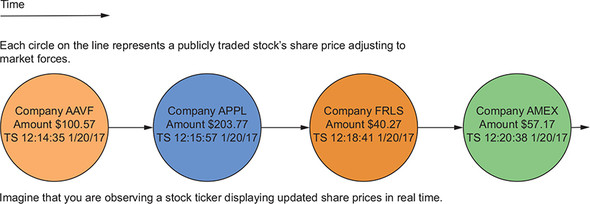

- 각각의 주가 시세는 개별 이벤트이고 서로 관련이 없다.
- 같은 회사의 시세 정보가 다수 차지하더라도, 한 번에 하나씩만 보고 있다. 
- 이 이벤트 뷰는 KStream이 작동하는 방식인 레코드의 스트림이다.
- 이제 이 개념이 데이터베이스 테이블과 관련지어보면 아래와 같이 나온다.

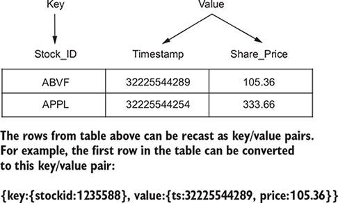

- 표에서 행은 키/값 쌍으로 재구성 할 수 있다.
- 이제 이 레코드 스트림과 표를 같이 표현해보자.
- 각 레코드는 독립적으로 있기 때문에 테이블에 삽입하는 것으로 스트림을 표현해 준다.

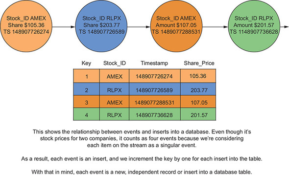
- 테이블 삽입과 이벤트 스트림을 같은 색상으로 함께 볼 수 있다는 것인데, 이벤트를 처리하는 스트림 사용에 대해 더 깊이 이해할 수 있다.

### 1-2. 레코드 및 변경로그 업데이트
- 여기에 동일한 고객 거래 스트림을 가져와 보자.
- 다만, 이제는 시간 흐름에 따른 활동을 추적한다.
- 고객 ID 키를 추가한다면 구매 이벤트는 각기 다른 이벤트와 연관시킬 수 있고, 이벤트 스트림과는 다른 업데이트 스트림을 갖게 된다.
- 이 스트림을 로그처럼 간주한다면, 이 이벤트 스트림은 변경로그 같은 업데이트 스트림으로 취급할 수 있다.

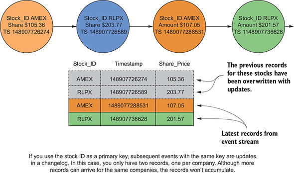

- Stock_ID를 프라이머리 키로 사용한다면, 이후 이벤트는 같은 키로 변경로그를 업데이트한다.
- 이러한 경우, 한 회사마다 1개, 즉 레코드 2개만 남게 된다.
- 같은 회사에서 더 많은 레코드가 유입될 수 잇지만, 레코드에 누적되지는 않는다.
- 즉 이벤트는 4번 발생했지만, 변경 로그는 2개만 남게 된다.

<hr/>

- 여기서 업데이트 스트림과 데이터베이스 테이블 사이의 관계를 알 수 있다.
- 로그와 변경로그 둘 다 파일의 긑에 추가된 유입 레코드를 의미한다.
- 로그의 경우 모든 레코드를 볼 수 있지만, 변경로그의 경우 주어진 어던 키에 대한 최신 레코드만 유지한다.

:::tip
로그와 변경로그에서 레코드는 입력되는 파일의 끝에 추가된다. 로그에서는 모든 로그가 필요하고, 변경로그에서는 각 키에 대한 최신 레코드만 필요하다는 점이 다르다.
:::

- 키별로 최신 레코드를 유지하는 동안 로그를 줄이기 위해 로그 압축을 사용하면 된다.

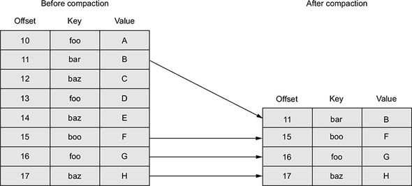

### 1-3. 이벤트 스트림과 업데이트 스트림 비교

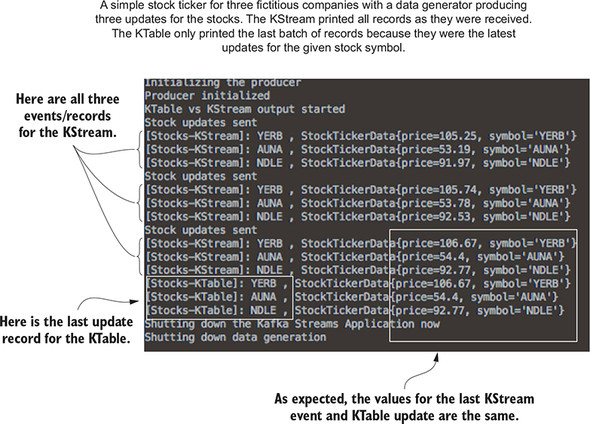

- 위의 예시를 보면, KStream은 총 9번의 레코드를 출력하지만, KTable은 이전 레코드를 덮어써서 3건의 레코드만 출력한다.
- 당연히 마지막 업데이트 값은 KStream이나 KTable이나 동일하다.

:::tip
위의 예시를 보면, KTable 에서 업데이트가 작동하는 방식을 보여준다. 암묵적으로 추정했던 방식이 명로해 졌다. KTable을 사용하면 키/값 쌍에 있는 키를 레코드에 넣어야한다. KTable이 작동하기 위해서는 이 키가 필수이다.
:::

```java
// 주식 알림 프로그램 소스
KTable<String, StockTickerData> stockTickerTable = 
    builder.table(STOCK_TICKER_TABLE_TOPIC); // KTable 인스턴스 생성
KStream<String, StockTickerData> stockTickerStream = 
    builder.stream(STOCK_TICKER_STREAM_TOPIC); // KStream 인스턴스 생성

stockTickerTable.toStream()
    .print(Printed.<String, StockTickerData>toSysOut())
    .withLable("Stocks-KTable"); // KTable이 콘솔에 결과출력

stockTickerStream
    .print(Printed.<String, StockTickerData>toSysOut())
    .withLable("Stocks-KStream"); // KStream이 콘솔에 결과 출력
```

## 2. 레코드 업데이트와 KTable 구성
- KTable의 기능을 이해하기 위해 두 가지 질문을 해보자
    - 레코드를 어디에 저장하는가?
    - KTable은 레코드를 내보내는 결정을 어떻게 하는가?
- 위 질문에 대한 답은 aggregation과 reducing 작업을 할 때 필요하다.
- 첫 질문에 대한 답을 위해 KTable을 생성하는 다음 줄을 봐보자

```java
builder.table(STOCK_TICKER_TABLE_TOPIC);
```

- 이 단순한 한줄에서 StreamBuilder는 KTable 인스턴스를 만들고 동시에 그 내부에 스트림 상태를 추적하는 상태 저장소를 만들어 업데이트 스트림을 만든다.
- 이 방식으로 생성된 상태 저장소는 내부적인 이름을 갖기 때문에 대화형 쿼리에서는 사용할 수 없다.
- 첫 질문에 대한 답은 KTable은 카프카 스트림즈와 통합된 로컬 상태 저장소를 저장 공간으로 사용한다는 것이다.(Rocks DB)

<hr />

- 두 번째 질문인 KTable이 업데이트를 다운스트림 프로세서로 내보내는 시점에 관한 질문을 봐보자.
- 이 질문을 해결하기 위해선 다음과 같은 부분이 고려되어야 한다.
    - 어플리케이션에 유입되는 레코드 수, 높은 데이터 유입률은 업데이트된 레코드를 내보내는 비율을 높일 수 있다.
    - 데이터에 구별되는 키가 얼마나 많은가? 구별되는 키 개수가 많다면 다운스트림에 더 많은 업데이트를 보내게 된다.
    - cache.max.bytes.buffering과 commit.interval.ms 구성 매개변수

### 2-1. 캐시 버퍼 크기 설정하기
- KTable 캐시는 같은 키가 있는 레코드의 중복을 의미한다.
- 이러한 중복 제거는 처리할 데이터의 총량을 줄이기 위해 모든 업데이트 대신 가장 최근 업데이트만 자식 노드에 제공한다.
- 이렇게 가장 최신 데이터만 저장히기 때믄에, 영구 상태 저장소를 사용할 때 성능이 매우 좋아진다.

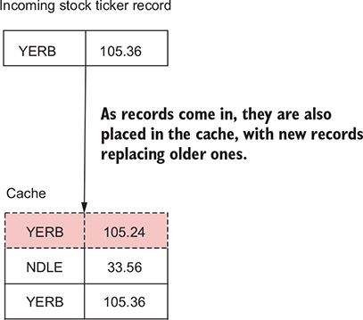

- KTable 캐시는 같은 키가 있는 레코드 업데이트의 중복을 제거해, 토폴로지에 있는 KTable의 자식 노드에 연속적인 업데이트가 흐르는걸 방지한다.

### 2-2. 커밋 주기 설정하기
- commit.interval.ms 매개변수를 통해 프로세서의 상태를 얼마나 자주 저장할지 결정한다.
- 프로세서 상태를 커밋할 때, 캐시를 강제로 비우고 중복 제거된 마지막 업데이트 레코드를 다운스트림에 전송한다.

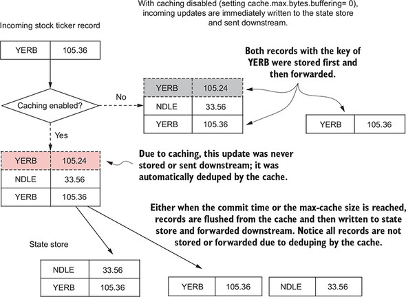

- 레코드를 다운스트림으로 보내는 방법은 2가지가 있다.
- 커밋하거나 캐시가 최대 크기가 도달하면 레코드를 다운스트림으로 전달한다.
- 캐시를 비활성화하면 중복된 키를 포함한 모든 레코드를 다운스트림에 전송한다.
- KTable을 쓸거면 캐시를 활성화 하는게 좋다.

## 3. 집계와 윈도 작업
### 3-1. 업계별 거래량 집계
- 스트리밍 데이터를 다루다 보면 집계와 그룹화는 필수
- 예제는 데이 트레이더 역할을 맡아서 선택한 산업 목록 전체에 걸쳐 회사의 거래량을 추적한다.

```java
1. 원시 주식 거래 정보가 입력된 토픽으로부터 소스를 만든다. StockTransaction 객체를
ShareVolume 객체에 매핑해야 한다. StockTransaction 객체는 거래와 관련된 메타데이터를 갖고 있지만, 
거래와관련된 거래량(ShareVolume)만 필요하다.

2. 종목 코드로 ShareVolume 그룹을 만든다. 이 코드로 그룹을 만들면, 전체 주식 거래량에서 그룹별 거래량으로
데이터를 줄일 수 있다. 여기서 KStream.groupBy를 호출하면, KGroupedStream 인스턴스를 반환하는데, 
KGroupedStream.reduce를 호출하면 KTable 인스턴스를 얻게 된다.
```

:::tip
KGroupedStream은 KStream.groupBy나 KStream.groupByKey를 사용하면 반환되는 인스턴스로, 키별로 그룹화한 이벤트 스트림의 중간 표현일 뿐, 직접 작업하기 위한 것은 아니다. 대신 KGroupedStream은 집계 작업을 수행하기 위해 필요하며 항상 KTable이 된다.
:::

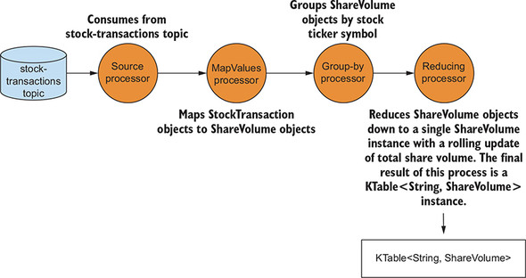

```java
KTable<String, ShareVolume> shareVolume = 
    builder.stream(STOCK_TRANSACTIONS_TOPIC, Consumed.with(stringSerde, 
    stockTransactionSerde).withOffsetResetPolicy(EARLIEST))
    // StockTransaction 객체를 SHareVolume 객체로 매핑
    .mapValues(st -> ShareVolume.newBuilder(st).build()) 
    // 주식 종목 코드에 따른 ShareVolume 객체 그룹화
    .groupBy((k, v) -> v.getSymbol(), Serialized.with(stringSerde, shareVolumeSerde))
    // 거래량 롤링 집계하기 위한 ShareVolume 객체 리듀스
    .reduce(ShareVolume::reduce);
```

:::tip
GroupBy와 GroupByKey는 둘다 KGroupedStream을 반환하지만, GroupByKey는 KStream이 이미 null 이 아닌 키를 갖고 잇을 경우에 사용하고, GroupBy 메소드는 그룹화를 위한 키가 변경될 수 있다고 가정한다.
GroupByKey는 리파티셔닝 필요 플래그가 설정되지 않고, GroupBy는 호출하면 조인 집계 등이 자동으로 리파티셔닝 된다.
:::

- ShareVolume의 sum() 메소드를 살펴보자

```java
public static ShareVolume sum(ShareVolume csv1, ShareVolume csv2) {
    Builder builder = newBuilder(csv1);
    builder.shares = csv1.shares + csv2.shares;
    return builder.build();
}
```

- ShareVolue.sum()은 전체 거래량 집계를 제공하고, 전체 프로세싱 체인의 결과는 KTable<String, ShareVolume> 객체이다.
- ShareVolume 객체가 들어오면 연관된 KTable은 가장 최근 업데이트를 유지한다.

:::tip
집계 대신 리듀스를 사요앟는 이유는, 리듀스 작업은 같은 유형의 객체를 반환하지만, 집계는 다른 유형의 객체를 반환할 수 있기 때문이다.
:::

- 이제 이 KTable을 가져와서 상위 5개 집계(점유율에 의한)의 요약을 수행하는데 사용해 본다.

```java
1. 산업별로 ShareVolume 객체를 그룹화하는 또 다른 groupBy 작업을 수행하자.

2. ShareVolume 객체를 추가하자. 이때 집계 객체는 고정 크기의 우선순위 큐다. 고정 크기 큐는
거래량에 의한 상위 5개 회사만 유지한다.

3. 이 큐를 문자열로 매핑하고, 거래량에 따른 산업별 상위 5개 주식만 결과에 포함한다.

4. 문자열 결과를 토픽에 쓴다.
```

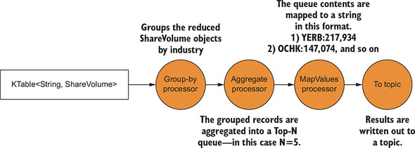

- 위의 토폴로지는 산업별로 그룹화하고, 상위 5개만 집계해서 큐에 있는 상위 5개를 문자열로 매핑한 다음, 싱크 프로세서에서 토픽에 문자를 쓴다.

```java
Comparator<ShareVolume> comparator =
 (sv1, sv2) -> sv2.getShares() - sv1.getShares()

FixedSizePriorityQueue<ShareVolume> fixedQueue =
 new FixedSizePriorityQueue<>(comparator, 5);

shareVolume.groupBy((k, v) -> KeyValue.pair(v.getIndustry(), v),
 Serialized.with(stringSerde, shareVolumeSerde)) // 산업별 그룹화하고 필요한 serdes를 제공
  .aggregate(() -> fixedQueue,
            (k, v, agg) -> agg.add(v), // 집계의 메소드가 새 업데이트를 추가
            (k, v, agg) -> agg.remove(v), // 집계의 remove 메소드가 기존 업데이트를 제거
            Materialized.with(stringSerde, fixedSizePriorityQueueSerde))
  .mapValues(valueMapper) // ValueMapper 인스턴스는 집계를 리포팅에 사용되는 문자열로 변환
  .toStream().peek((k, v) ->
 LOG.info("Stock volume by industry {} {}", k, v))
  .to("stock-volume-by-company", Produced.with(stringSerde, stringSerde));
```

- 집계는 KTable 과 마찬가지로 같은 키로 업데이트된 레코드를 유일하게 만들어 준다.
- 같은 키가 있는 가장 최근 레코드를 집계한다.
- 레코드가 도착하면 이 레코드를 FixedSizePriorityQueue에 add 메소드로 추가하지만, 같은 키의 다른 레코드가 있다면 remove 메소드로 기존 레코드를 제거한다.
- 위의 예제를 보면 로컬 상태 저장소가 중요한지 알 수 있다. (로컬 상태는 이미 봤던 레코드를 추적 할 수 있게 한다.)
- 리듀스나 집계 연산을 실행할 때마다, 상태 저장소의 이름이 필요하다.
- 리듀스와 집계 연산은 KTable 인스턴스를 반환하고, 이 KTable은 기존 결과를 새 결과로 교체하기 위해 상태 저장소를 사용한다.
- 계속 본 것처럼 모든 업데이트가 다운스트림에 전달되는 것은 아니며, 집계 연산이 요약 정보를 모은다는 사실이 중요하다.
- 로컬 상태를 사용하지 않는다면, KTable은 모든 집계와 리듀스 결과를 전달 할 수밖에 없다.

### 3-2. 윈도 연산
- 어떠한 경우에는 주어진 시간 범위에 대해서만 작업을 수행할 필요도 있다.

#### 고객별 주식 거래량 집계
- 예제는 소수 거래자의 주식 거래를 추적해 볼 것이다.
- 추적을 위한 절차는 다음과 같다.

```java
1. 주식 거래 토픽을 읽어서 스트림을 만든다.

2. 고객 ID와 주식 종목 코드별 유입 레코드를 그룹화한다. groupBy 호출은 KGroupedStream 인스턴스를 반환
한다.

3. 윈도 스트림을 반환하기 위해 KGroupedStream.windowedBy 메소드를 사용하면, 특정 유형의 윈도 집계를
수행할 수 있다. 제공한 윈도 타입에 따라 TimeWindowedKStream 또는 SessionWindowedKStream을 반환
받을 것이다.

4. 집계 연산을 위해 계산을 수행한다. 윈도 스트림은 레코드를 이 계산에 포함할 것인지를 결정한다.

5. 이 결과를 특정 토픽에 쓰거나, 개발 중에는 콘솔에 결과를 출력한다.
```

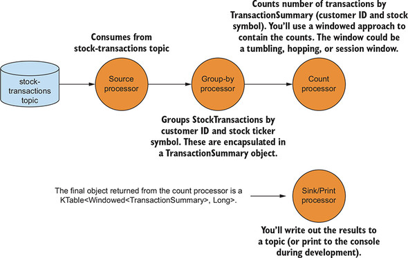

#### 윈도 유형
- 카프카 스트림즈에선 3가지 유형의 윈도를 사용할 수 있다.
    - 세션 윈도
    - 텀블링 윈도
    - 슬라이딩 또는 호핑 윈도

#### 세션 윈도
- 시간에 엄격하게 제한받지 않고 사용자 활동과 관련이 이싿.
- 비활성화 기간으로 세션 윈도를 설명한다.

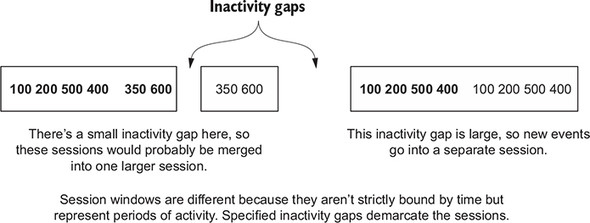

- 더 작은 세션은 비활성 구간이 짧기 때문에 왼쪽에 있는 세션에 병합될 것이다. 
- 오른쪽에 있는 세션은 넓은 비활성 간격이 있으서 새로운 새션으로 분할 될 거싱다.

#### 주식 거래 추적을 위한 세션 윈도 사용

```java
Serde<String> stringSerde = Serdes.String();
Serde<StockTransaction> transactionSerde =
 StreamsSerdes.StockTransactionSerde();

Serde<TransactionSummary> transactionKeySerde =
 StreamsSerdes.TransactionSummarySerde();


long twentySeconds = 1000 * 20;
long fifteenMinutes = 1000 * 60 * 15;
KTable<Windowed<TransactionSummary>, Long>
    customerTransactionCounts = // groupBy와 count 호출로 생성된 KTable
    builder.stream(STOCK_TRANSACTIONS_TOPIC, Consumed.with(stringSerde,
    transactionSerde)
    .withOffsetResetPolicy(LATEST))
    .groupBy((noKey, transaction) ->
    TransactionSummary.from(transaction), // TransactionSummary 객체에 저장된 고객 ID와 주식 종목으로 레코드를 그룹화
    Serialized.with(transactionKeySerde, transactionSerde))
    .windowedBy(SessionWindows.with(twentySeconds).
    until(fifteenMinutes)).count(); // 비활성 시간 20초, 유지시간 15분의 SessionWindow로 그룹을 윈도 처리한 다음, count()와 같은 집계를 수행


customerTransactionCounts.toStream()
    .print(Printed.<Windowed<TransactionSummary>, Long>toSysOut()
    .withLabel("Customer Transaction Counts"));
```

- groupBy 연산을 할 때마다 일반적으로 일종의 집계 작업(집계, 리듀스, 카운트)을 수행한다.
- 이전 결과가 계속 축적되는 누적 집계를 수행하거나 지정된 시간 윈도 동안 레코드를 병합하는 윈도 집계를 수행할 수 있다.

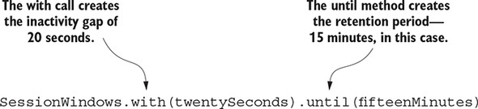

- windowedBy(SessionWindows.with(twentySeconds).until(fifteenMinutes))를 호출해 비활성 간격은 20초이고 유지 기간은 15분인 세션 윈도를 만든다.
- 20초의 비활성 시간은 현재 세션이 종료되거나 현재(활성) 세션 내의 시작 시간부터 20초 내에 도달하는 레코드를 어플리케이션이 포함한다는 뜻이다.
- 만약 들어오는 레코드가 비활성화 간격을 넘어선다면, 이 어플리케이션은 새 세션을 만든다.
- 세셔의 비활성화 기간 밖에 있더라도 병합이 가능한 경우라면 늦게 도착한 데이터도 병합을 허용한다.

| 도착순서 | 키 | 타임스탬프 |
| --- | --- | --- |
| 1 | {123-345-654,FFBE} | 00:00:00 |
| 2 | {123-345-654,FFBE} | 00:00:15 |
| 3 | {123-345-654,FFBE} | 00:00:50 |
| 4 | {123-345-654,FFBE} | 00:00:05 |

- 레코드가 들어올 때, 같은 키가 있는 기존 세션이면서 '현재 타임스탬프 - 비활성 간격' 보다 작은 종료 시간을 갖고, '현재 타임스탬프 + 비활성 간격' 보다 더 큰 시작 시간을 갖는 세션을 찾는다.

```java
1. 레코드 1은 첫 레코드이며, 시작과 끝 시간은 00:00:00 이다.

2. 레코드 2가 도착하면 가장 이른 종료 시간 23:59:55와 가장 늦은 시작 시간 00:00:35를 가진 시간을 
찾는다. 레코드 1을 찾았기 때문에 세션 1과 2는 병합한다. 세션 1 시작 시간(가장 이른 시간)과 세션 2 종료
시간 (최근)을 유지하므로, 하나의 세션은 00:00:00으로 시작해서 00:00:15로 끝난다.

3. 레코드 3이 도착하면, 00:00:30부터 00:01:10 사이으 ㅣ세션을 찾아봐도 해당하는 세션이 없다.
123-345-654 키로 두 번째 세션을 추가하는데, FFBE는 00:00:50에 끝난다.

4. 레코드 4가 도착하면 23:59:45와 00:00:25 사이의 세션을 검색한다. 이번에는 세션 1과 2 둘 다 
찾는다. 시작 시간이 00:00:00이고 종료 시간이 00:00:!5인 3개의 세션 모두 한 세션으로 병합된다.
```

- 세션은 고정 크기 윈도가 아니다. 오히려 세션의 크기는 주어진 시간 프레임 내의 총 활성화 시간에 의해 결정된다.
- 데이터에 있어서 타임스탬프는 이벤트가 기존 세션에 맞는지 또는 비활성화 간격으로 나뉘는지 결정한다.

#### 텀블링 윈도
- 고정 또는 텀블링 윈도는 지정한 기간 내의 이벤트를 추적한다.
- 특정 회사의 전체 주식 거래를 20초마다 추적해야 하고, 그 시간 동안 모든 이베트를 수집한다고 하자.
- 20초가 경과하면 윈도는 다음 20초 감시주기로 '텀블링'한다.

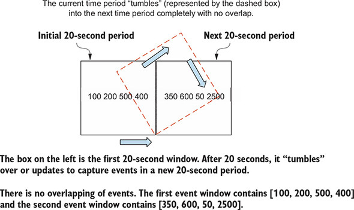

- 이 윈도는 최근 20초 동안 들어온 개별 이벤트가 포함됐다. 새 윈도는 지정한 시간 후에 생성됐다.
- 지정된 기간 후에 텀블링 윈도는 초기화된다.

```java
KTable<Windowed<TransactionSummary>, Long> customerTransactionCounts =
    builder.stream(STOCK_TRANSACTIONS_TOPIC, Consumed.with(stringSerde,
                                                            transactionSerde)
    .withOffsetResetPolicy(LATEST))
        .groupBy((noKey, transaction) -> TransactionSummary.from(transaction),
    Serialized.with(transactionKeySerde, transactionSerde))
    .windowedBy(TimeWindows.of(twentySeconds)).count();
```

- TimeWindows.of 를 호출하면 텀블링 윈도를 사용할 수 있다.

#### 슬라이딩 또는 호핑 윈도
- 텀블링 윈도와의 차이는 최근 이벤트를 처리할 새 윈도를 시작하기 전에 그 윈도 전체 시간을 기다리지 않는다.
- 슬라이딩 윈도는 전체 윈도 유지 기간보다는 더 짧은 간격 동안 기다린 후 새 연산을 수행한다.

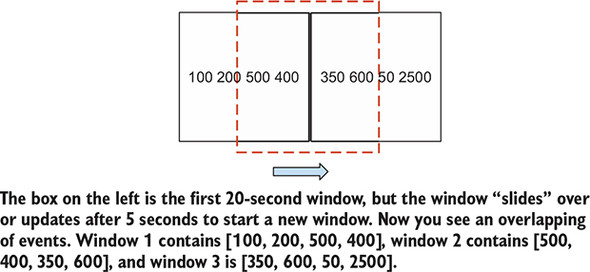

- 왼쪽 박스는 첫 20초 윈도인데, 이 윈도는 새 윈도를 시작하기 위해 5초 뒤에 슬라이드하거나 업데이트 한다.
- 여기서는 겹쳐지는 이벤트를 보게 된다.
- 윈도 1은 [100, 200, 500, 400] 윈도 2는 [500, 400, 350, 600] 윈도 3은 [350,600,50,2500] 이다.

```java
KTable<Windowed<TransactionSummary>, Long> customerTransactionCounts =
    builder.stream(STOCK_TRANSACTIONS_TOPIC, Consumed.with(stringSerde,
    transactionSerde)
    .withOffsetResetPolicy(LATEST))
    .groupBy((noKey, transaction) -> TransactionSummary.from(transaction),
    Serialized.with(transactionKeySerde, transactionSerde))
    .windowedBy(TimeWindows.of(twentySeconds)
     .advanceBy(fiveSeconds).until(fifteenMinutes)).count(); // 5초마다 이동하는 20초 간격의 호핑 윈도 사용
```
 
- advanceBy() 메소드로 텀블링 윈도를 호핑 윈도로 변환할 수 있다.

```java
1. 세션 윈도는 시간에 의해 고정되지 않고, 사용자 활동으로 유도된다.

2. 텀플링 윈도는 지정된 시간 프레임 내에서 이벤트의 상황을 보게 한다.

3. 호핑 윈도는 고정 길이이지만, 자주 업데이트되며, 개별 윈도에 겹치는 레코드가 들어 있을 수 있다.
```

### 3-3. KStream과 KTable 조인하기
- 주식 거래 카운트를 가져와서 관련 산업 분야의 금융 뉴스와 조인해 보자

```java
1. 주식 거래 카운트 KTable을 키가 주식 종목인 산업별 카운트로 변경한 KStream에 변환해 넣는다.

2. 금융 관련 토픽 뉴스를 읽어 KTable을 만든다. 새 KTable은 산업별로 분류될 것이다.

3. 이 뉴스 업데이트를 산업별 주식 거래 카운트와 조인한다.
```

#### KTable을 KStream으로 변환하기

```java
1. KTable.toStream() 메소드를 호출한다.

2. 키를 산업명으로 바꾸기 위해 KStream.map 호출을 이용하고 윈도 인스턴스로부터 TransactionSummary
객체를 추출한다.
```

```java
// KTable을 KStream으로 변환하기
KStream<String, TransactionSummary> countStream = 
    customerTransactionCounts.toStream().map((window, count) -> { // toStream 후 바로 map 호출
        TransactionSummary transactionSummary = window.key();
        String newKey = transactionSummary.getIndustry(); // 키를 주식 구매의 산업 분야로 설정
        transactionSummary.setSummaryCount(count);
        return KeyValue.pair(newKey, transactionSummary); // KStream을 위한 새 KeyValue 쌍 반환
    });
```

#### 금융 뉴스 KTable 만들기

```java
KTable<String, String> financialNews = 
    builder.table("financial-news", Consumed.with(EARLIEST)); // EARLIEST 속성을 사용해 financial-news 토픽으로 KTable 만듬
```

#### 뉴스 업데이트를 트랜잭션 카운트와 조인하기
- 조인은 다음과 같이 진행한다.

```java
ValueJoiner<TransactionSummary, String, String> valueJoiner =
    (txnct, news) ->
    String.format("%d shares purchased %s related news [%s]",
    txnct.getSummaryCount(), txnct.getStockTicker(), news);
    // ValueJoiner는 조인 결과로부터 값을 결합한다.

    KStream<String,String> joined =
    countStream.leftJoin(financialNews, valueJoiner,
    Joined.with(stringSerde, transactionKeySerde, stringSerde));
    // countStream KStream과 금융 뉴스 KTable 조인

    joined.print(Printed.<String, String>toSysOut()
        .withLabel("Transactions and News");
```

### 3-4. GlobalKTable
- 조인을 할 경우에, 키를 새 타입이나 값으로 매핑할 때 스트림 리파티셔닝이 필요하다.

#### 리파티셔닝 비용
- 리파티셔닝은 오버헤드가 있고, 다른 토픽에 중복 데이터를 저장하는 중간 토픽을 만들어 다른 토픽에서 읽어서 쓰기 때문에 지연 시간을 증가시킨다.

#### 더 작은 데이터 집합과 조인하기
- 어떤 경우 조인하려는 룩업 데이터는 비교적 작아서 이 조회 데이터 전체 사본을 개별 노드의 로컬에 배치할 수 있다.
- 조회 데이터가 상당히 작을 경우 카프카 스트림즈는 GlobalKTable을 사용할 수 있다.
- 어플리케이션이 모든 데이터를 각 노드에 동이하게 복제하기 때문에 GlobalKTable은 모두 같은 데이터를 갖는다.
- 전체 데이터가 개별 노드에 있기 때문에 이벤트 스트림은 모든 파티션에 데이터를 공급하기 위해 조회할 데이터 키로 파티셔닝할 필요가 없다.
- 또한 GlobalKTable은 키없는 조인이 가능하다.

#### GlobalKTable로 KStream 조인하기
- countStream을 사용해 두 GlobalKTable과 조인하는 예시

```java
// 세션 윈도를 사용한 주식 거래 집계
KStream<String, TransactionSummary> countStream =
    builder.stream( STOCK_TRANSACTIONS_TOPIC,
        Consumed.with(stringSerde, transactionSerde)
    .withOffsetResetPolicy(LATEST))
        .groupBy((noKey, transaction) ->
    TransactionSummary.from(transaction),
    Serialized.with(transactionSummarySerde, transactionSerde))
        .windowedBy(SessionWindows.with(twentySeconds)).count()
        .toStream().map(transactionMapper);
```

- 두 개의 GlobalKTable을 정의한다.

```java
GlobalKTable<String, String> publicCompanies =
    builder.globalTable(COMPANIES.topicName());

GlobalKTable<String, String> clients =
    builder.globalTable(CLIENTS.topicName());
```

```java
countStream.leftJoin(publicCompanies, (key, txn) ->
    txn.getStockTicker(),TransactionSummary::withCompanyName) // 주식 종목 코드를 키로 하는 publicCompanies와 leftJoin을 설정하고, 회사 이름이 추가된 transactionSummary 반환
            .leftJoin(clients, (key, txn) ->
    txn.getCustomerId(), TransactionSummary::withCustomerName) // 고객 ID를 키로 하는 clients 테이블과 leftJoin을 설정하고, 고객 이름이 추가된 transactionSummary 반환 
            .print(Printed.<String, TransactionSummary>toSysOut()
    .withLabel("Resolved Transaction Summaries"));
```
- 위의 조인을 실행하면

```java
{customerId='074-09-3705', stockTicker='GUTM'}, 17
{customerId='037-34-5184', stockTicker='CORK'}, 16
```

- 이랬던 결과가

```java
{customer='Barney, Smith' company="Exxon", transactions= 17}
```

- 이렇게 보기 좋게 나온다.

<hr />

- 카프카 스트림즈의 조인은 다음과 같다

| 왼쪽 조인 | 내부 조인 | 외부 조인 |
| --- | --- | --- |
| KStream - KStream | KStream - KStream | KStream - KStream |
| KStream - KTable | KStream - KTable | N/A |
| KTable - KTable | KTable - KTable | KTable - KTable |
| KStream - GlobalKTable | KStream - GlobalKTable | N/A |

### 3-5. 쿼리 가능 상태
- 토픽에서 데이터를 읽는 것은 구체화된 뷰(materialized view)의 한 형태로 생각해 볼 수 있다.
- 카프카 스트림즈는 상태 저장소로부터 대화형 쿼리도 제공하는데, 이러한 구체화된 뷰에서 직접 데이터를 읽는 기능을 제공한다.
- 상태 저장소는 읽기 전용이므로, 읽기 전용 쿼리를 만들면 어플리케이션이 데이터를 연속적으로 처리하는 동안 상태 불일치 발생은 걱정할 필요가 없다.
- 상태 저장소를 쿼리 가능하게 만드는 것은 상당히 중요하다. 
- 카프카 컨슈머에서 데이터를 소비하지 않고도 대시보드 어플리케이션을 만들 수 있다.
- 데이터를 다시 쓰지도 않아서 효율성도 증가한다.
    - 이 데이터는 로컬에 있기 때문에 매우 빠르게 접근할 수 있다.
    - 외부 저장소로 복사하지 않으므로 데이터 중복을 피할 수 있다.
- 상태 저장소에 직접 쿼리한다는 것은 코드양을 줄이고(컨슈머가 필요 없음) 필요한 소프트웨어 개수를 줄인다는 (결과를 저장할 디비가 필요 없음) 의미가 된다.

## 요약
- KStream은 데이터베이스에 삽입하는 것과 비슷한 이벤트 스트림을 나타낸다. KTable은 업데이트 스트림이고 데이터베이스에 변경하는 것과 비슷하다. KTable 크기는 계속 증가하지 않으며, 기존 레코드는 새 레코드로 교체된다.
- KTable은 집계 작업이 필요하다.
- 윈도 연산으로 시간 버킷에 데이터를 집계해서 넣을 수 있다.
- GlobalKTable은 파티션에 대한 고려 없이 어플리케이션 전체에 걸쳐 조회 데이터를 제공한다.
- KStream, KTable, GLobalTable과 서로서로 조인 할 수 있다.