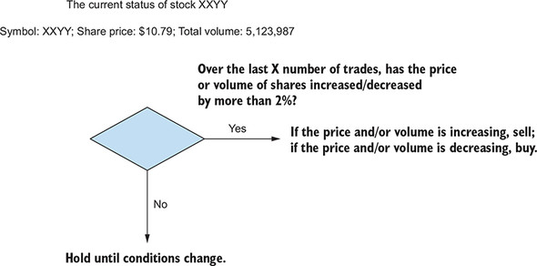
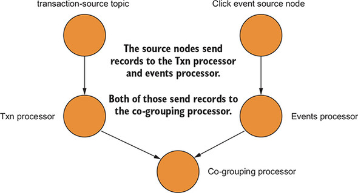

# 6강

[[toc]]

## 1. 더 높은 수준의 추상화와 더 많은 제어 사이의 트레이드 오프
- 아래와 같은 상황을 다루기 위해 프로세서 API의 사용 방법을 배운다.
    - 일정한 간격(레코드 타임스탬프나 벽 시간)으로 액션을 스케줄링
    - 레코드가 다운스트림에 전송될 때 완벽하게 제어
    - 특정 자식 노드에 레코드 전달
    - 카프카 스트림즈 API에 없는 기능 구현

## 2. 토폴로지를 만들기 위해 소스, 프로세서, 싱크와 함께 작업하기
- 맥주를 파는 회사에서 주문이 국내인지, 해외인지 판단해서 처리해야하는 토폴로지가 있다.


- 위의 예시로 프로세서 API를 사용해 유연하게 하위노드를 선택하는지 확인을 해본다.

### 2-1. 소스 노드 추가
```java
topology.addSource(LATEST, // 사용할 오프셋 리셋을 지정
                  purchaseSourceNodeName, // 노드 이름 지정
                  new UsePreviousTimeOnInvalidTimestamp(), // TimestampExtractor 명시
                  stringDeserializer, // 키 역직렬화기 지정
                  beerPurchaseDeserializer, // 값 역직렬화기 지정
                  Topics.POPS_HOPS_PURCHASES.topicName()) // 데이터를 소비할 토픽 이름 지정
```

- Topology.addSource() 메소드에는 DSL에서 사용하지 않았던 몇몇 매개변수가 존재한다.
- 소스 노드 이름을 지정해 명시하고, 노드 이름은 자식노드를 부모 노드에 묶기 위해 사용한다.
- TimestampExtractor를 지정해주어야 한다.
- 특이한 점으로 키,값 역직렬화기를 설정해 주느데, DSL과는 달리 소스 노드를 만들때는 역 직렬화기를, 싱크 노드를 만들때는 직렬화기를 사용해야 한다.

### 2-2. 프로세서 노드 추가
```java
BeerPurchaseProcessor beerProcessor =
 new BeerPurchaseProcessor(domesticSalesSink, internationalSalesSink);

topology.addSource(LATEST,
                  purchaseSourceNodeName,
                  new UsePreviousTimeOnInvalidTimestamp(),
                  stringDeserializer,
                  beerPurchaseDeserializer,
                  Topics.POPS_HOPS_PURCHASES.topicName())
       .addProcessor(purchaseProcessor, // 프로세서 노드 이름
                     () -> beerProcessor, // 위에서 정의한 프로세서를 추가
                     purchaseSourceNodeName); // 부모 노드 또는 복수의 부모 노드 이름을 지정
```

- 위의 토폴로지를 구축하기 위해 플루언트 인터페이스 패턴을 사용한다.
- KStream나 KTable 인스턴스를 반환하는 KStream 메소드의 카프카 스트림즈 API와는 다르게, 프로세서 API에서 토폴로지에 대한 각각의 호출은 같은 토폴로지 인스턴스를 반환한다.
- 두 번째 매개변수는 ProcessorSupplier 인터페이스의 인스턴스이다.
- 세 번째 매개변수는 purchaseSourceNodeName인데, addProcessor() 메소드는 addSource() 메소드의 두 번째 매개변수와 같다.
- 이렇게 부모-자식 관계를 설정한다.


- 위의 예제에서 만든 BeerPurchaseProcessor은 2개의 역할을 담당한다.
    - 해외 판매 총액을 유로화에서 달러화로 변환한다.
    - 국내 또는 해외의 판매 원가 기준으로 적절한 싱크 노드에 레코드를 전달한다.
- 이런 모든 작업은 process()에서 처리한다.

```java
1. 통화 유형을 확인한다. 달러화가 아니라면 달러화로 환산한다.
2. 국내 판매가 아니라면 업데이트된 레코드를 해외 판매 토픽에 전달한다.
3. 그렇지 않다면, 이 레코드를 국내 판매 토픽에 바로 전달한다.
```

```java
public class BeerPurchaseProcessor extends
 AbstractProcessor<String, BeerPurchase> {

    private String domesticSalesNode;
    private String internationalSalesNode;

    public BeerPurchaseProcessor(String domesticSalesNode,
                                 String internationalSalesNode) {
        this.domesticSalesNode = domesticSalesNode;
        this.internationalSalesNode = internationalSalesNode; // 레코드가 전달될 각 노드 이름을 설정
    }

    @Override
    public void process(String key, BeerPurchase beerPurchase) { // 실제 액션이 실행될 process() 메소드

        Currency transactionCurrency = beerPurchase.getCurrency();

        if (transactionCurrency != DOLLARS) {
            BeerPurchase dollarBeerPurchase;
            BeerPurchase.Builder builder =
                BeerPurchase.newBuilder(beerPurchase);
            double internationalSaleAmount = beerPurchase.getTotalSale();
            String pattern = "###.##";
            DecimalFormat decimalFormat = new DecimalFormat(pattern);
            builder.currency(DOLLARS);
            builder.totalSale(Double.parseDouble(decimalFormat
                .format(transactionCurrency
                .convertToDollars(internationalSaleAmount)))); // 해외 판매액을 달러화로 환산
            dollarBeerPurchase = builder.build();
            context().forward(key, dollarBeerPurchase, internationalSalesNode); 
            // context() 메소드가 반환하는 ProcessorContext를 사용해 레코드를 international 자식 노드에 전달
        } else {
            context().forward(key, beerPurchase, domesticSalesNode); // 국내 판매 레코드를 domestic 자식 노드로 전달
        }

    }
}
```

- 위의 예제는 Processor 인터페이스 메소드를 오버로드한 클래스인 AbstractProcessor를 process() 메소드만 제외하고 상속한다.
- Processor.process()는 토폴로지를 통해 흐르는 레코드에 대한 액션을 수행하는 메소드다.

:::tip
Processor 인터페이스는 init(), process(), punctuate(), close() 메소드를 제공한다. 이 Processor는 스트리밍 어플리케이션에서 레코드로 작업하는 어플리케이션 로직의 핵심이다.
:::

- context() 메소드는 특정 자식 노드에 레코드를 전달하는 기능이 있다.

### 2-3. 싱크 노드 추가


```java
topology.addSource(LATEST,
                  purchaseSourceNodeName,
                  new UsePreviousTimeOnInvalidTimestamp(),
                  stringDeserializer,
                  beerPurchaseDeserializer,
                  Topics.POPS_HOPS_PURCHASES.topicName())
       .addProcessor(purchaseProcessor,
                     () -> beerProcessor,
                     purchaseSourceNodeName)

       .addSink(internationalSalesSink, // 싱크 이름
                "international-sales", // 이 싱크가 제공하는 토픽
                stringSerializer,      // 키에 대한 직렬화기
                beerPurchaseSerializer, // 값에 대한 직렬화기
                purchaseProcessor) // 이 싱크의 부모 노드

       .addSink(domesticSalesSink, 
                "domestic-sales",
                stringSerializer,
                beerPurchaseSerializer,
                purchaseProcessor);
```

- 두 개의 싱크노드를 추가해 주었다.
- 두 개의 싱크노드를 추가하면, 부모노드는 무조건 동일하다.

## 3. 주식 분석 프로세서로 프로세서 API 자세히 살펴보기
- 데이 트레이딩을 살펴본다.
- 데이 트레이더로서 최적의 매매 시점을 선택할 목적으로 주가가 어떻게 변하는지 분석하기를 원한다.
- 즉, 시장 변동을 이용해 단가 수익을 만드는 것이 주목적

```java
1. 이 주식의 현재 가치 조회
2. 주식 가치가 상승, 하강 추세인지 표시
3. 지금까지 총 주식 거래량과 상승, 하강 추세 여부 포함
4. 추세 변동이 2%인 주식만 레코드를 다운스트림에 전송
5. 계산하기 전에 주식의 최소 샘플 20개를 수집
```



### 3-1. 주식 성과 프로세서 어플리케이션

```java
Topology topology = new Topology();
 String stocksStateStore = "stock-performance-store";
 double differentialThreshold = 0.02;

KeyValueBytesStoreSupplier storeSupplier =
 Stores.inMemoryKeyValueStore(stocksStateStore); // 인메모리 키/값 상태 저장소 생성
StoreBuilder<KeyValueStore<String, StockPerformance>> storeBuilder
 = Stores.keyValueStoreBuilder(storeSupplier, Serdes.String(), stockPerformanceSerde);
    // 토폴로지에 추가할 StoreBuilder 생성

  topology.addSource("stocks-source",
                    stringDeserializer,
                    stockTransactionDeserializer,
                    "stock-transactions")
          .addProcessor("stocks-processor",
                        () -> new StockPerformanceProcessor(
                        stocksStateStore, differentialThreshold), "stocks-source")
          .addStateStore(storeBuilder,"stocks-processor") // 프로세서에 상태 저장소 추가
          .addSink("stocks-sink",
                   "stock-performance",
                   stringSerializer,
                   stockPerformanceSerializer,
                   "stocks-processor");
```

- 이전 예제와 다르게 상태저장소를 사용해야하고, 레코드를 받을 때마다 넘겨주는게 아닌, 전송할 레코드의 스케쥴링이 필요해 init() 메소드 설정이 필요하다.

```java
@Override
public void init(ProcessorContext processorContext) {
  super.init(processorContext); // AbstractProcessor 슈퍼 클래스를 통해 ProcessorContext 초기화
  keyValueStore = (KeyValueStore) context().getStateStore(stateStoreName); // 토폴로지 구축 시 생성된 상태 저장소 조회
  StockPerformancePunctuator punctuator =
    new StockPerformancePunctuator(differentialThreshold,
                                context(),
                                keyValueStore); // 스케줄링된 프로세싱을 처리하기 위한 Punctuator 초기화
  context().schedule(10000, PunctuationType.WALL_CLOCK_TIME, punctuator); 
  // 10초마다 Punctuator.punctuate()를 호출하도록 스케줄링
}
```

- Punctuator는 예약한 프로세서 로직을 실행을 처리하는 콜백 인터페이스이다.
- 위의 예시는 WALL_CLOCK_TIME에 기반해서 호출하도록 명시해 준다.

#### 펑추에이션 시맨틱
- STREAM_TIME 스케줄을 결정하는 방식은 다음과 같다.

```java
1. StreamTask는 가장 작은 타임스탬프를 PartitionGroup에서 가져온다. 이 PartitionGroup은
주어진 StreamThread를 위한 파티션의 집합이고, 이 그룹의 모든 파티션은 타임스탬프 정보를 갖고있다.

2. 레코드를 처리하는 동안, 이 StreamThread는 StreamTask 객체를 반복하고 각 태스크는 펑추에이션을
사용할 수 있는 개별 프로세서를 위해 punctuate 메소드를 호출한다. 개별 주식의 성과를 조사하기 전에 최소
20건의 거래를 수집한다.

3. 최근 실행한 puctuate() 메소드의 타임스탬프(쓰케줄 시간을 더한 타임스탬프)가 PartitionGroup에서 
가져온 타임스탬프보다 작거나 같다면, 카프카 스트림즈는 프로세서의 punctuate() 메소드를 호출한다.
```

- 여기에서 핵심은 어플리케이션이 TimestampExtractor를 통해 타임스탬프를 증가시킨다는 것인데, 그래서 일정 주기로 데이터가 도달만 한다면 일관되게 punctuate()를 호출한다.
- PunctuationType.WALL_CLOCK_TIME에서 Punctuator.punctuate 실행은 벽 시간을 사용하기 때문에 더욱더 예측이 가능하다.


- 어떠한 방법을 사용할 건지는 전적으로 요구사항에 달려 있다.
- 정기적으로 수행되는 활동이 필요하다면 데이터 흐름에 무관하게 시스템 시간을 사용하는것이 좋다.
- 유입 데이터에서만 연산을 처리하고 실행 중 지연 시간을 허용할 수 있다면 스트림 시간 시맨틱이 좋다.

### 3-2. process() 메소드
- process() 메소드는 주식 성과를 평가하는 모든 계산을 처리할 것이다.

```java
1. 레코드가 주식 종목 코드에 관한 StockPerformance 객체와 관련이 있는지 상태 저장소를 확인한다.

2. 이 저장소에 StockPerformance 객체가 없다면 생성한다. 그런 다음, StockPerformance 
인스턴스는 주식 가겨과 거래량을 추가하고 계산을 업데이트한다.

3. 20회 이상 거래가 있는 주식은 계산을 시작한다.
```


```java
@Override
public void process(String symbol, StockTransaction transaction) {
    StockPerformance stockPerformance = keyValueStore.get(symbol);

    if (stockPerformance == null) {
    stockPerformance = new StockPerformance();
    }

    stockPerformance.updatePriceStats(transaction.getSharePrice()); // 가격 통계 업데이트
    stockPerformance.updateVolumeStats(transaction.getShares()); // 주식 거래량 통계 업데이트
    stockPerformance.setLastUpdateSent(Instant.now()); // 최근 업데이트한 타임스탬프 설정

    keyValueStore.put(symbol, stockPerformance); // 상태저장소에 저장
}
```

- 최종 결과는 상태 저장소에 저장하고 전달할 레코드는 Punctuator.punctuate 메소드에 남긴다.

### 3-3. 펑추에이터 실행

```java
@Override
public void punctuate(long timestamp) {
  KeyValueIterator<String, StockPerformance> performanceIterator =
    keyValueStore.all();

  while (performanceIterator.hasNext()) {
        KeyValue<String, StockPerformance> keyValue =
        performanceIterator.next();
        String key = keyValue.key;
        StockPerformance stockPerformance = keyValue.value;

        if (stockPerformance != null) {
            if (stockPerformance.priceDifferential() >= differentialThreshold ||
                stockPerformance.volumeDifferential() >= differentialThreshold) {
                context.forward(key, stockPerformance); // 임곗값에 도달했거나 초과했다면, 이 레코드를 전달.
            }
        }
    }
}
```

- Punctuator.punctuate 메소드에 있는 절차는 단순하다.
- 상태 저장소에 있는 키/값 쌍을 반복 조회해서, 이 값이 미리 정의해둔 임곗값을 넘어가면 이 레코드를 다운스트림에 전달한다.
- 기억해야할 개념은, 커밋이나 캐시 플러시의 조합을 사용해 레코드를 전달하기 전에 레코드 전달 시기를 사전에 정의할 수 있다는 점이다.
- 이 코드를 10초마다 실행한다고 해도 레코드를 내보낼 수 있다고 보장하지 않는다.
- 또한 punctuate와 process 메소드가 동시에 실행은 불가능하다.

## 4. 코그룹 프로세서
- 조인을 하면, 스트림 A에서 스트림 B로의 레코드 매핑은 암묵적인 1:1 매핑이다.


- 이제는 1:1 조인 대신 공통 키로 조인한 2개의 데이터 컬렉션인 데이터의 코그룹으로 비슷한 유형의 분석을 할고 한다.
- 주식 종목 코드를 클릭하는 이벤트와, 사용자의 주식 구매 사이의 연관관계를 분석하려고 한다.


- N초마다 주어진 회사에 대해 클릭 이벤트와 주식 거래 내역의 스냅샷을 결헙하는 것이 목적이지만, 두 스트림에 레코드가 도착하기를 기다리지는 않는다.
- 지정된 시간이 지나면 종목 코드에 대해 클릭 이벤트와 주식 거래 내역을 co-grouping(공틍 그룹화) 해야한다. 
- 
### 4-1. 코그룹 프로세서 작성

```java
1. 토픽 2개(주식 거래 내역, 이벤트)를 정의한다.

2. 토픽에서 레코드를 소비하는 프로세서 2개를 추가한다.

3. 2개의 선행 프로세서를 집계하고 고통 그룹 역할을 하는 세 번째 프로세서를 추가한다.

4. 두 이벤트 상태를 유지하는 집계 프로세서에 상태 저장소를 추가한다.

5. 결과를 기록하는 싱크 노드를 추가한다.
```

#### 소스 노드 정의

```java
topology.addSource("Txn-Source",
                  stringDeserializer,
                  stockTransactionDeserializer,
                  "stock-transactions")
       .addSource("Events-Source",
                  stringDeserializer,
                  clickEventDeserializer,
                  "eventsㅏ")
```


#### 프로세서 노드 추가

```java
.addProcessor("Txn-Processor",
              StockTransactionProcessor::new,
              "Txn-Source")

.addProcessor("Events-Processor",
              ClickEventProcessor::new,
              "Events-Source")

.addProcessor("CoGrouping-Processor",
              CogroupingProcessor::new,
              "Txn-Processor",
              "Events-Processor") //  두 프로세서의 자식 노드에 있는 CogroupingProcessor 추가
```



```java
public class StockTransactionProcessor extends
 AbstractProcessor<String, StockTransaction> {

    @Override
    @SuppressWarnings("unchecked")
    public void init(ProcessorContext context) {
        super.init(context);
    }

    @Override
    public void process(String key, StockTransaction value) {
        if (key != null) {
            Tuple<ClickEvent, StockTransaction> tuple =
                Tuple.of(null, value); // StockTransaction이 있는 객체 집게를 생성
            context().forward(key, tuple); // 튜플을 CogroupingProcessor에 전달
        }
    }
}


public class ClickEventProcessor extends
 AbstractProcessor<String, ClickEvent> {

    @Override
    @SuppressWarnings("unchecked")
    public void init(ProcessorContext context) {
        super.init(context);

    }

    @Override
    public void process(String key, ClickEvent clickEvent) {
        if (key != null) {
            Tuple<ClickEvent, StockTransaction> tuple =
                Tuple.of(clickEvent, null); // 초기 애그리게이터 객체에 ClickEvent 추가
            context().forward(key, tuple);
        }
    }
}
```

- 코 그루핑 프로세서를 정의해 준다.

```java
public class CogroupingProcessor extends
 AbstractProcessor<String, Tuple<ClickEvent,StockTransaction>> {

    private KeyValueStore<String,
        Tuple<List<ClickEvent>,List<StockTransaction>>> tupleStore;
    public static final  String TUPLE_STORE_NAME = "tupleCoGroupStore";

    @Override
    @SuppressWarnings("unchecked")
    public void init(ProcessorContext context) {
        super.init(context);
        tupleStore = (KeyValueStore)
            context().getStateStore(TUPLE_STORE_NAME);
        CogroupingPunctuator punctuator =
            new CogroupingPunctuator(tupleStore, context());
        context().schedule(15000L, STREAM_TIME, punctuator);

    }
}
```

- init() 메소드는 클래스 설정의 세부사항을 처리한다.
- CogroupingProcessor가 process() 메소드에서 주 태스크 중 하나를 수행하는 소스이다.

```java
@Override
    public void process(String key,
 Tuple<ClickEvent, StockTransaction> value) {

        Tuple<List<ClickEvent>, List<StockTransaction>> cogroupedTuple
            = tupleStore.get(key);
        if (cogroupedTuple == null) {
             cogroupedTuple =
            Tuple.of(new ArrayList<>(), new ArrayList<>());
        }

        if (value._1 != null) {
            cogroupedTuple._1.add(value._1);
        }

        if (value._2 != null) {
            cogroupedTuple._2.add(value._2);
        }

        tupleStore.put(key, cogroupedTuple);
    }
}
```

- 전체 코그룹에서 들어오는 부분 집계를 처리할 때, 첫 단꼐는 상태저장소에 이미 인스턴스가 있는지 확인한다.
- 없다면 빈 clickEvent와 StockTransaction 컬렉션을 가진 Tuple을 생성한다.
- 들어오는 부분집계를 확인해서 ClickEvent나 StockTransaction 둘 중 하나가 있다면 이를 전체 집계에 추가한다.
- process() 메소드에서 마지막 단계는 Tuple을 상태 저장소에 다시 넣고 전체 집계를 업데이트 하는 것이다.
- 아래는 펑츄에이션이 처리되는 방식이다.

```java
  @Override
  public void punctuate(long timestamp) {
    KeyValueIterator<String, Tuple<List<ClickEvent>,
    List<StockTransaction>>> iterator = tupleStore.all(); // 상태저장소에서 코그룹 이터레이터를 얻는다.

    while (iterator.hasNext()) {
      KeyValue<String, Tuple<List<ClickEvent>, List<StockTransaction>>>
        cogrouping = iterator.next(); // 다음 코그룹 조회

      if (cogrouping.value != null &&
         (!cogrouping.value._1.isEmpty() ||
         !cogrouping.value._2.isEmpty())) {
          List<ClickEvent> clickEvents =
            new ArrayList<>(cogrouping.value._1); // 코그룹 컬렉션의 방어적 복사본을 만든다.
          List<StockTransaction> stockTransactions =
            new ArrayList<>(cogrouping.value._2);

          context.forward(cogrouping.key,
            Tuple.of(clickEvents, stockTransactions)); // 키와 집게된 코그룹을 전달한다.
          cogrouped.value._1.clear();
          cogrouped.value._2.clear();
          tupleStore.put(cogrouped.key, cogrouped.value); // 정리한 튜플을 상태 저장소에 다시 넣는다.
      }
    }
    iterator.close();
}
```

- 각 punctuate 호출 중에 KeyValueIterator에 저장된 모든 레코드를 검색하고, 이터레이터에 포함된 개별 코그룹 결과를 추출하기 시작한다.
- 그런 다음 이 컬렉션의 방어적 복사본을 만들고 새 코그룹 Tuple을 만들어 다운스트림에 전달한다.
- 이후에 현재 코그룹 결과는 삭제하고 상태 저장소에 이 튜플을 다시 저장하고 도착하는 다음 레코드를 기다린다.

#### 상태 저장소 추가
- 카프카 스트리밍 어플리케이션에서 집계를 수행하려면 상태가 있어야 한다.
- CogroupingProcessor가 정상적으로 기능하기 위해선 상태 저장소를 추가해야 한다.


```java
 Map<String, String> changeLogConfigs = new HashMap<>();
 changeLogConfigs.put("retention.ms","120000" );
 changeLogConfigs.put("cleanup.policy", "compact,delete");

 KeyValueBytesStoreSupplier storeSupplier =
 Stores.persistentKeyValueStore(TUPLE_STORE_NAME); // 영구 저장소(록스 DB)를 위한 저장소 서플라이어를 생성한다.
        StoreBuilder<KeyValueStore<String,
 Tuple<List<ClickEvent>, List<StockTransaction>>>> storeBuilder = // 저장소 빌더를 생성한다.
                Stores.keyValueStoreBuilder(storeSupplier,
                        Serdes.String(),
                        eventPerformanceTuple)
 .withLoggingEnabled(changeLogConfigs); // 저장소 빌더에 변경로그 구성을 추가한다.

.addStateStore(storeBuilder, "CoGrouping-Processor"); // 저장소에 접근할 프로세서 이름으로 토폴로지에 저장소를 추가한다.
```

#### 싱크 노드 추가

- 코그룹 토폴로지를 사용하려면, 데이터를 토픽에 써야 한다.


```java
.addSink("Tuple-Sink",
         "cogrouped-results",
          stringSerializer,
          tupleSerializer,
          "CoGrouping-Processor");

 topology.addProcessor("Print",
                       new KStreamPrinter("Co-Grouping"),
                       "CoGrouping-Processor");
```

### 5. 프로세서 API와 카프카 스트림즈 API 통합하기
- KStream 방식을 더 선호할 수 있지만, 저수준 제어를 위해 KStream 어플리케이션에 프로세서 API를 적용시킬 수 있다.
- 카프카 스트림즈 API는 프로세서 API를 사용해 작성한 기능(KStream.process, KStream.transform, KStream.transformValues)을 결합할 수 있는 세 가지 방법을 제공한다.

## 요약
- 프로세서 API는 더 많은 코드 비용으로 더 높은 유연성을 제공한다.
- 프로세서 API가 카프카 스트림즈 API보다 더 상세하지만, 여전히 카프카 스트림즈 API가 사용하기 쉽고, 카프카 스트림즈 API 자체가 내부적으로는 프로세서 API를 사용한다.
- 사용할 API를 결정해야 할 때, 카프카 스트림즈 API를 사용하고 필요할 때 저수준 메소드 통합을 고려해 볼 수 있다.