# 7강

[[toc]]

## 1. 기본적인 카프카 모니터링
### 1-1. 컨슈머와 프로듀서 성능 측정
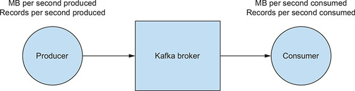

- 프로듀서와 컨슈머의 성능은 처리량과 관련이 있다.
- 프로듀서의 경우 얼마나 빠르게 브로커로 메세지를 보내느냐가 가장 중요하다.
- 컨슈머의 경우 브로커에서 얼마나 빠르게 메세지를 읽을 수 있느냐가 성능에 영향을 준다.
- 그러나 컨슈머 성능을 측정하는 또 다른 방법으로 컨슈머 지연이 있다.

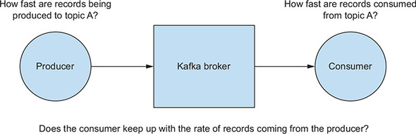

- 프로듀서가 브로커에 기록하는 속도와 컨슈머가 메세지를 읽는 속도 차이를 컨슈머지연이라 부른다.

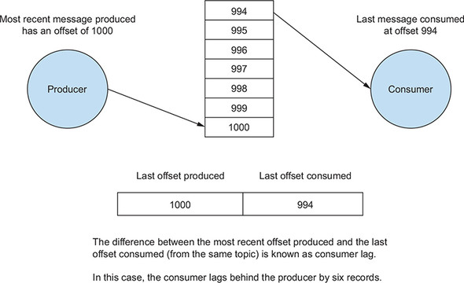

- 컨슈머 지연은 프로듀서가 쓴 오프셋과 컨슈머가 커밋한 오프셋 차이

### 1-2. 컨슈머 지연 확인하기
- kafka-consumer-groups.sh 을 사용해 확인해 본다.

```zsh
bin/kafka-consumer-groups.sh --bootstrap-server localhost:9092 --list
```

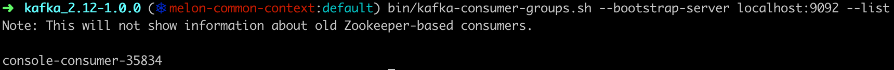

- 컨슈머 그룹 이름을 선택해 다음 명령어를 실행해 준다.

```zsh
bin/kafka-consumer-groups.sh --bootstrap-server localhost:9092 --group console-consumer-35834 --describe
```

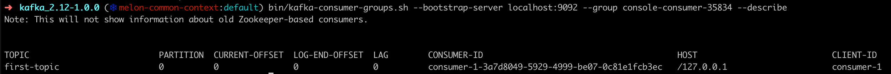

- 이런식으로 컨슈머 지연이 몇건 인지 알 수 있다.
- 컨슈머 지연이 많아지면 결과적으로 성능에 문제가 생길 수 있다.
- 이런 문제를 해결하기 위해선 파티션 수를 늘려 토픽에서 소비하는 작업에 스레드 수를 늘릴 수 있다.
- 또는 메세지를 읽은 후 처리가 너무 무거울 수도 있다.
- 메세지를 소비한 후에 비동기 큐에 전달해 다른 스레드가 메세지를 처리하게 할 수도 있다.

### 1-3. 프로듀서와 컨슈머 가로채기
#### 컨슈머 인터셉터
- 컨슈머 인터셉터는 가로채기를 위해 두 가지 접근점을 제공한다.
- 첫번째는 ConsumerInterceptor.onConsume()인데, 브로커에서 조회한 시점과 Consumer.poll() 메소드가 메시지를 반환하기 전에 ConsumerRecords에서 읽는다. 

```java
ConsumerRecords<String, String> poll(long timeout) {
   ConsumerRecords<String, String> consumerRecords =
 ...consuming records // 브로커에서 새 레코드를 가져온다.
   return interceptors.onConsume(consumerRecords); // 인터셉터 체인을 통해 레코드를 실행하고 결과 반환
```

- 인터셉터는 Consumer.poll() 메소드 내에서 브로커에서 반환된 ConsumerRecords를 수락하고 KafkaConsumer가 폴링 메소드에서 레코드를 반환하기 전에 필터링 또는 수정을 포함한 모든 작업을 수행할 기회를 갖는다.
- ConsumerInterceptor는 ConsumerConfig.INTERCEPTOR_CLASSES_CONFIG를 통해 하나 이상의 ConsumerInterceptor 구현자 클래스(implements class)의 컬렉션으로 지정된다.
- ConsumerInterceptor는 ConsumerRecords 인스턴스를 받은 후 반환한다.
- 다중 인터셉터가 있는 경우, 하나의 인터셉터에서 반환된 ConsumerRecords는 체인의 다음 인터셉터에 대한 입력 매개변수로 사용된다.
- 따라서 하나의 인터셉터에 의해 만들어진 모든 수정사항은 인터셉터 체인의 다음 인터셉터로 전달된다.
- 인터셉터는 인터셉터 체인의 이전 인터셉터에 의해 수정된 ConsumerRecords가 에러가 나면 내용이 꼬일 수 있어서, 이전 ConsumerRecords에 의존하지 않는것이 좋다.

<hr />

- 두 번째 가로채기 지점은 ConsumerInterceptor.onCommit() 메소드이다.
- 컨슈머가 브로커에게 오프셋을 커밋하면 브로커는 토픽, 파티션 및 커밋된 오프셋과 관련된 메타데이터 (시간 등)와 함께 정보가 포함된 Map<TopicPartition, OffsetAndMetadata>를 반환한다.
- 커밋 정보는 추적 용도로 쓰기 좋다.
- 아래는 로깅 목적으로 사용되는 간단한 ConsumerInterceptor의 예이다.

```java
public class StockTransactionConsumerInterceptor implements
 ConsumerInterceptor<Object, Object> {

    // 잡다한 정보 상세내역 생략
    private static final Logger LOG =
    LoggerFactory.getLogger(StockTransactionConsumerInterceptor.class);

    public StockTransactionConsumerInterceptor() {
        LOG.info("StockTransactionConsumerInterceptor 생성");
    }

    @Override // 1번 방법
    public ConsumerRecords<Object, Object>
        onConsume(ConsumerRecords<Object, Object> consumerRecords) {
        LOG.info("ConsumerRecords {} 인터셉터됨",
                 buildMessage(consumerRecords.iterator())); // 레코드가 처리되기 전에 컨슈머 레코드와 메타데이터를 로깅
        return consumerRecords;
    }

    @Override // 2번 방법
    public void onCommit(Map<TopicPartition, OffsetAndMetadata> map) {
         LOG.info("Commit information {}",  map); // 카프카 스트림즈 컨슈머가 브로커에 오프셋을 커밋할 때 커밋 정보를 로깅한다.
    }
```

#### 프로듀서 인터셉터
- ProducerInterceptor도 비슷하게 작동한다.
- ProducerInterceptor.onSend() 및 ProducerInterceptor.onAcknowledgement()의 두가지 접근 지점이 있다.
- onSend 메소드를 사용하면 인터셉터가 ProducerRecord를 변형하는 것을 포함해 어떠한 작업이든 수행할 수 있다.
- 체인상에 있는 각 프로듀서 인터셉터는 이전 인터셉터에서 반환된 객체를 받는다.
- 브로커가 레코드를 확인하면 ProducerInterceptor.onAcknowledgement() 메소드가 호출된다.
- 레코드 전송이 실패하면 그 시점에서도 onAcknowledgement가 호출된다.

```java
public class ZMartProducerInterceptor implements
 ProducerInterceptor<Object, Object> {
    // some details left out for clarity
    private static final Logger LOG =
    LoggerFactory.getLogger(ZMartProducerInterceptor.class);

    @Override
    public ProducerRecord<Object, Object> onSend(ProducerRecord<Object,
    Object> record) {
        LOG.info("ProducerRecord being sent out {} ", record); // 메세지를 브로커에 전송하기 바로 전에 로깅
        return record;
    }

    @Override
    public void onAcknowledgement(RecordMetadata metadata,Exception exception) {
        if (exception != null) {
            LOG.warn("Exception encountered producing record {}",
        exception); // 브로커 수신 확인 또는 생산 단계 동안 브로커 측에서 오류가 발생했는지 로깅
        } else {
            LOG.info("record has been acknowledged {} ", metadata);
        }
    }
```

- ProducerInterceptor는 ProducerConfig.INTERCEPTOR_CLASSES_CONFIG에 지정하고, 하나 이상의 ProducerInterceptor 구현자 클래스의 컬렉션으로 설정한다.

## 2. 어플리케이션 메트릭
- 3장에서 사용한 고급 지마트 어플리케이션에서 작성한 어플리케이션 예시를 사용한다.

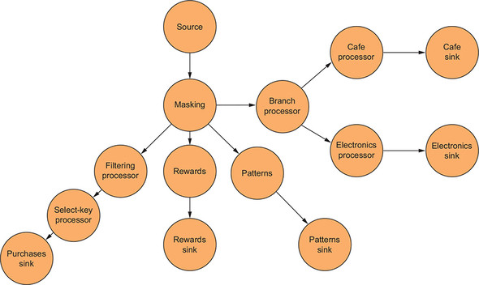

- 메트릭 카테고리를 살펴본다.

```java
스레드 메트릭
    - 평균 커밋, 폴링, 처리, 작업시간
    - 초당 생성한 태스크 수, 초당 종료된 태스크 수

태스크 메트릭
    - 초당 평균 커밋 횟수
    - 평균 커밋 시간

프로세서 노드 메트릭
    - 평균 및 최대 처리 시간
    - 초당 평균 처리 작업 수
    - 포워드 레이트

상태 저장소 메트릭
    - put, get, flush 작업의 평균 실행 시간
    - put, get, flush 작업의 초당 평균 실행 횟수
```

- 좀더 자세한 메트릭은 confluent에서 확인 필요

### 2-1. 메트릭 구성
- 카프카 스트림즈는 이미 성능 메트릭을 수집하는 메커니즘을 제공한다.
- 대부분의 경우 일부 설정값만 제공하면 된다.
- 메트릭 수집에는 성능 비용이 발생하기 때문에 INFO와 DEBUG의 두 가지 레벨이 있다.

| 메트릭 카테고리 | DEBUG | INFO |
| --- | --- | --- |
| 스레드 | O | O |
| 태스크 | O | |
| 프로세서 노드 | O | |
| 상태 저장소 | O | |
| 레코드 캐시 | O | |

```java
private static Properties getProperties() {
    Properties props = new Properties();
    props.put(StreamsConfig.CLIENT_ID_CONFIG, "metrics-client-id");
    props.put(ConsumerConfig.GROUP_ID_CONFIG, "metrics-group-id");
    props.put(StreamsConfig.APPLICATION_ID_CONFIG, "metrics-app-id");
    props.put(StreamsConfig.METRICS_RECORDING_LEVEL_CONFIG, "DEBUG"); 
    // 이 메트릭을 DEBUG 레벨로 기록하도록 설정
    props.put(StreamsConfig.BOOTSTRAP_SERVERS_CONFIG, "localhost:9092");
    return props;
}
```

### 2-2. 수집한 메트릭 확인 방법
- JMX를 기본 지공해준다.

### 2-3. JMX 사용
- JConsole을 사용하면 설치 없이 바로 사용이 가능하다.

#### JConsole 시작하기
- JConsole은 JDK와 함께 제공되서 따로 설치할 필요가 없다.
- JConsole을 시작하려면 명령 프롬프트에서 jconsole을 실행하면 된다.

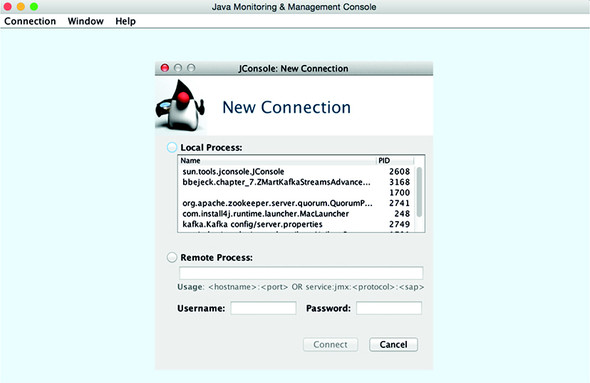

#### 실행 중인 프로그램 모니터링 시작하기
- JConsole GUI의 중앙을 보면 새 연결 대화상자가 표시된다.

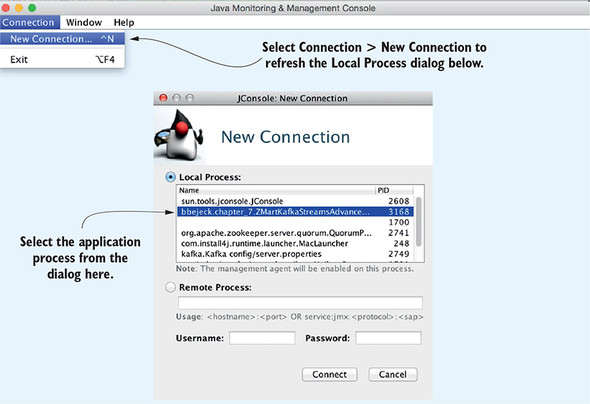

- 로컬에선 ssl 무시를 선택한다.

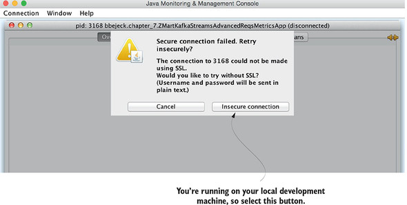

#### 정보 조회
- 연결을 하게 되면 그림과 같은 GUI 화면이 나타난다. 
- JConsole은 실행 중인 어플리케이션 내부를 들여다볼 수 있는 몇 가지 편리한 옵션을 제공한다.

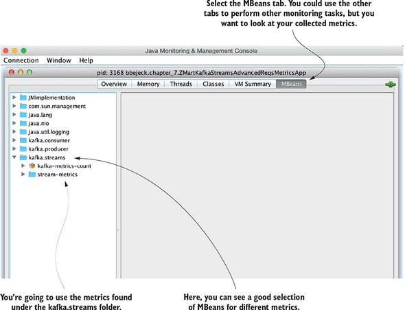

### 2-4. 메트릭 조회
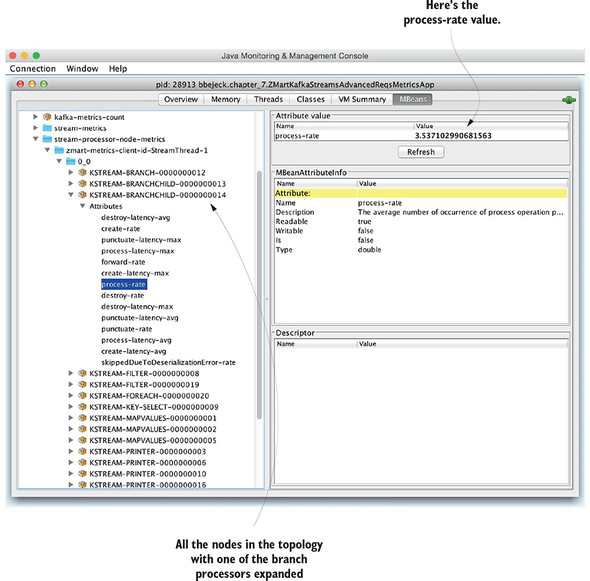

- 위의 그림은 밀리초당 처리되는 평균 레코드 수를 알려주는 process-rate 메트릭을 보여준다.
- JConsole에서 프로듀서 및 컨슈머 메트릭스도 볼 수 있다.

## 3. 추가적인 카프카 스트림즈 디버깅 기술
### 3-1. 어플리케이션 쿠조 조회
- 어플리케이션이 실행된 후 디버깅을 해야하는 상황이 발생할 수 있다.
- Topology.describe() 메소드는 어플리케이션 구조에 관한 일반적인 정보를 제공한다.

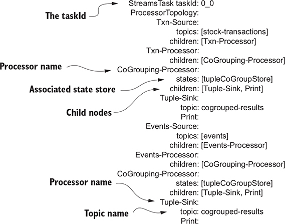

- 위와같이 보기 좋게 잘 출력해 준다.

### 3-2. 다양한 어플리케이션 상태 알림 받기
- 태스크를 할당하거나 재분배하는 절차를 리밸런싱이라고 한다.
- 리밸런싱 한다는것은 카프카 스트림즈가 자동으로 스케일을 올리고 내릴 수 있음을 의미한다.
- 기존 어플리케이션이 이미 실행 중일 때 새 어플리케이션 인스턴스를 추가하면 리밸런싱 프로세스가 워크로드를 재분배 한다.

### 3-3. StateListener 사용
- 카프카 스트림즈 어플리케이션은 언제든 여섯 가지 상태 중 하나가 될 수 있다.

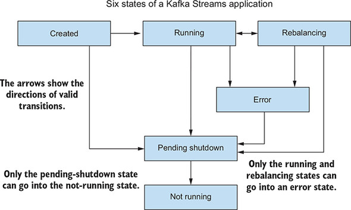

- 이러한 상태 변경을 캡처하려면 KafakaStreams.setStateListener 메소드를 사용한다.

```java
KafkaStreams.StateListener stateListener = (newState, oldState) -> {
        if (newState == KafkaStreams.State.RUNNING &&
                oldState == KafkaStreams.State.REBALANCING) { // REBALANCING에서 RUNNING으로 상태 전환 확인
        LOG.info("Application has gone from REBALANCING to RUNNING ");
        LOG.info("Topology Layout {}",
        streamsBuilder.build().describe());
    }
};
```

- 어플리케이션이 리밸런싱 상태가 될 때 어떤 신호를 보이는지 예제를 확인 할 수 있다.

```java
KafkaStreams.StateListener stateListener = (newState, oldState) -> {
  if (newState == KafkaStreams.State.RUNNING &&
        oldState == KafkaStreams.State.REBALANCING) {
      LOG.info("Application has gone from REBALANCING to RUNNING ");
      LOG.info("Topology Layout {}", streamsBuilder.build().describe());
  }

  if (newState == KafkaStreams.State.REBALANCING) {
      LOG.info("Application is entering REBALANCING phase"); // 리밸런싱 단계에 들어갈 때 액션을 추가해 준다.
  }
};
```

- 위의 내용의 핵심은 카프카 스트림즈 어플리케이션의 현재 상태에 연결해 블랙박스 작업을 줄이는대 있다.

### 3-4. 상태 리스토어 리스너
- 카프카 스트림즈는 실패할 경우에 대비해 상태 저장소를 백업하는 것이 중요하다.
- 카프카 스트림즈에서는 상태 저장소의 백업으로 변경로그(changelog) 토픽을 사용한다.

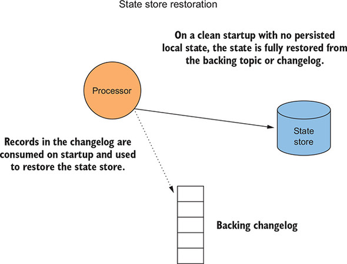

- 변경로그는 변경이 발생한 상태 저장소의 업데이트를 기록한다.
- 카프카 스트림즈 어플리케이션이 실패하거나 재시작할 때, 상태 저장소는 로컬 상태 파일에서 복구할 수 있다.
- 하지만 만약 메소스같은 스테이트리스 환경에서 카프카 스트림즈가 완전히 맛이가거나 로컬 디스크 파일이 삭제되면, 변경로그로부터 상태 저장소를 완전히 복구해야 할 수도 있다.
- 위의 그림에서 처럼 변경로그에 있는 레코드는 시작시에 소비되고, 상태 저장소를 복구하는데 사용한다.
- 상태 저장소는 백업 토픽이나 변경로그에서 완전히 복원된다.
- StateListener와 매우 흡사한 StateRestoreListener 인터페이스는 어플리케이션 내부에서 일어나는 일들에 대한 알림을 허용한다.
- StateRestoreListener에는 onRestoreStart, onBatchRestored, onRestoreEnd 세가지 메소드를 지원한다.
- KafkaStreams.setGlobalRestoreListener 메소드는 사용할 글로벌 리스토어 리스너를 지정하는데 사용된다.

```java
public class LoggingStateRestoreListener implements StateRestoreListener {

    private static final Logger LOG = LoggerFactory.getLogger(LoggingStateRestoreListener.class);
    private final Map<TopicPartition, Long> totalToRestore = new ConcurrentHashMap<>();
    // 복원 진행을 추적하기 위해 ConcurrentHashMap 인스턴스를 만든다.
    private final Map<TopicPartition, Long> restoredSoFar = new ConcurrentHashMap<>();


    @Override
    public void onRestoreStart(TopicPartition topicPartition, String store, long start, long end) {
        long toRestore = end - start;
        totalToRestore.put(topicPartition, toRestore); // 복원할 주어진 TopicPartition의 총량을 저장
        LOG.info("복구 시작 대상 저장소 {} 토픽 파티션 {} 복원할 총 레코드수 {}", store, topicPartition, toRestore);
    }
}
```

- 복원을 추적하기 위해 2개의 CuoncurrentHashMap 인스턴스를 작성한다.
- onRestoreStart 메소드에서 복원해야 하는 총 레코드 수를 저장하고 복원 시작 상태를 기록한다.
- 복원된 각 배치를 처리하는 코드는 다음과 같다.

```java
@Override
public void onBatchRestored(TopicPartition topicPartition, String store, long start, long batchCompleted) {
   NumberFormat formatter = new DecimalFormat("#.##");

   long currentProgress = batchCompleted +
        restoredSoFar.getOrDefault(topicPartition, 0L); // 복원된 전체 레코드 개수 계산
   double percentComplete = (double) currentProgress / totalToRestore.get(topicPartition); // 복원이 완료된 백분율을 결정

   LOG.info("Completed {} for {}% of total restoration for {} on {}",
                batchCompleted,
                formatter.format(percentComplete * 100.00),
                store, topicPartition);
   restoredSoFar.put(topicPartition, currentProgress); // 지금까지 복원된 레코드 개수 저장
}
```

- 복원 프로세스에서는 내부 컨슈머를 사용해 변경로그 토픽을 읽기 때문에 어플리케이션이 각 consumer.poll() 메소드 호출에서 레코드를 일괄적으로 복원한다.
- 따라서 모든 배치의 최대 크기는 max.poll.records. 설정과 동일하다.
- 복원 프로세스가 최근 배치 상태 저장소에 로드한 후에 onBatchRestored 메소드가 호출된다.
- 먼저 누적된 복원 횟수에 현재 배치 크기를 추가한다.
- 그런 다음 완료된 복원이 백분율을 계산하고 결과를 기록한다.
- 마지막으로 이전에 계산된 새로운 총 레코드 수를 저장한다.

<hr />

- 마지막 단계는 복원 프로세스가 완료될 때다.

```java
@Override
public void onRestoreEnd(TopicPartition topicPartition, String store, long totalRestored) {
    LOG.info("Restoration completed for {} on topic-partition {}", store, topicPartition);
    restoredSoFar.put(topicPartition, 0L); // TopicPartition 복원의 진행을 추적한다.
}
```

- 어플리케이션이 복구 프로세스를 완료하면 복원된 마지막 리스너를 총 레코드 수와 함께 호출한다.
- 이 예에서는 완료 상태를 기록하고 전체 복원 횟수 맵을 0으로 업데이트 한다.
- 이제 아래처럼 어플리케이션의 LoggingStaterResotreListener를 사용할 수 있다.

```java
kafkaStreams.setGlobalStateRestoreListener(new LoggingStateRestoreListener());
```

### 3-5. uncaught 예외 핸들러

- 예상치 못한 상황이 발생했을 때 알림을 받고 정리할 수 있는 기회를 주는게 좋다.
- 카프카 스트림즈는 이러한 예기치 못한 오류를 처리하기 위해 KafakStreams.setUncaughtExceptionHandler를 제공한다.

```java
kafkaStreams.setUncaughtExceptionHandler((thread, exception) -> {
            CONSOLE_LOG.info("Thread [" + thread + "]
            encountered [" + exception.getMessage() +"]");
          });
```

## 요약
- 카프카 스트림즈를 모니터링하려면 카프카 브로커도 살펴봐야 한다.
- 어플리케이션의 성능이 어떻게 되는지 보고 싶다면 메트릭 리포팅을 수시로 활성화 해야 한다.
- 내부를 살펴볼 필요가 있으며 가끔 jstack(스레드 덤프)과 jmap/jhat(힙 덤프) 같은 자바에 포함된 명령줄 도구를 사용해 좀 더 저수준에서 어플리케이션 동작을 이해해야 한다.