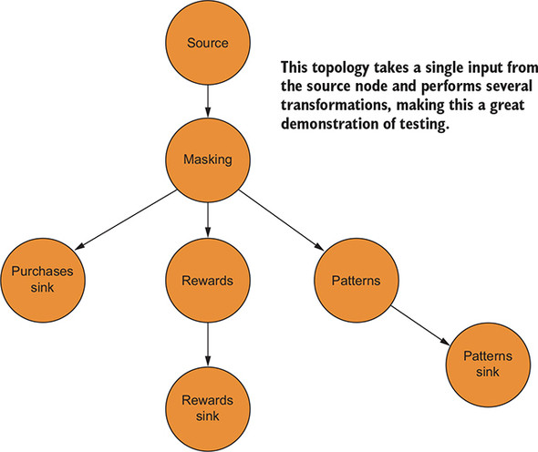
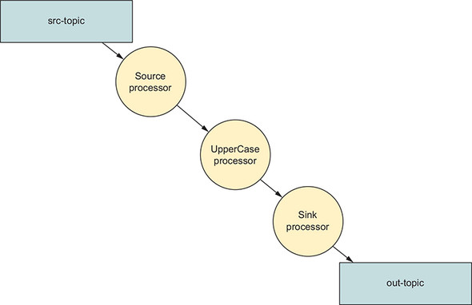

# 8강

[[toc]]

## 1. 토폴로지 테스트
- 3장에서 구현한 토폴로지



- 처리 로직은 매우 간단하지만 구조에서 볼 수 있듯이 여러 노드가 있다.
- 위의 토폴로지는 하나의 입력을 받아 여러 변환을 수행한다.
- 이렇게 하면 단일 구매 값만 제공하면 테스트가 다소 쉬워지고 모든 적절한 변환이 수행됐는지 확인할 수 있다.

:::tip
대부분의 경우 별도의 클래스에 로직을 추가하여 토폴로지와는 별도로 비즈니스 로직을 단위테스트 할 수 있다. 지마트 토폴로지의 경우 로직 대부분은 단순하며 자바 8 람다 식으로 표현되므로 이 경우에는 토폴로지 흐름을 테스트할 것이다.
:::

- 반복 가능한 독립 실행 테스트를 하기 위해선, *ProcessorTopologyTestDriver*를 사용하면 테스트 실행을 위해 카프카 없이도 그런 테스트를 작성이 가능하다.
- 즉 실시간 카프카 인스턴스를 따로 띄울 필요 없이, 토폴로지를 테스트하는 기능이 가능해서 단위 테스트를 더욱 빠르고 가볍게 만들어준다.

```xml
테스트 수행을 위해서는 메이븐 디펜던시 추가가 필요하다.

<dependency>
   <groupId>org.apache.kafka</groupId>
   <artifactId>kafka-streams</artifactId>
   <version>1.0.0</version>
   <scope>test</scope>
   <classifier>test</classifier>
</dependency>

<dependency>
   <groupId>org.apache.kafka</groupId>
   <artifactId>kafka-clients</artifactId>
   <version>1.0.0</version>
   <scope>test</scope>
   <classifier>test</classifier>
</dependency>
```

:::tip
카프카 및 카프카 스트림즈 테스트 코드를 사용해 프로젝트를 직접 작성하는 경우, 샘플코드와 함께 제공되는 모든 종속성을 사용하는 것이 좋다.
:::

### 1-1. 테스트 만들기
- 표준 JUnit 테스트를 사용할 수 있고 테스트를 실행하기 전에 셋업 작업을 할 것이다.

```java
@Before
public  void setUp() {

    // props 생략
    StreamsConfig streamsConfig = new StreamsConfig(props);
    Topology topology = ZMartTopology.build(); // 지마트 토폴로지 리팩토링 : 이제 이 메소드를 호출해 토폴로지를 얻을 수 있다.

    topologyTestDriver =
        new ProcessorTopologyTestDriver(streamsConfig, topology); //ProcessorTopologyTestDriver 생성
}
```

- 테스트 소스를 작성해 준다.

```java
@Test
public void testZMartTopology() {
    // serde creation left out for clarity

    Purchase purchase = DataGenerator.generatePurchase(); // 테스트 객체를 생성

    topologyTestDriver.process("transactions", // 토폴로지에 초기 레코드 전송
                            null,
                            purchase,
                            stringSerde.serializer(),
                            purchaseSerde.serializer());

    ProducerRecord<String, Purchase> record =
        topologyTestDriver.readOutput("purchases", // purchase 토픽에서 레코드를 읽는다.
                                        stringSerde.deserializer(),
                                        purchaseSerde.deserializer());

    Purchase expectedPurchase =
        Purchase.builder(purchase).maskCreditCard().build(); // 테스트 객체를 기대하는 형식으로 변환한다.
        assertThat(record.value(), equalTo(expectedPurchase));
}
```

- 위의 예제는 topologyTestDriver.process로 시작하고, 레코드가 전체 토폴로지의 소스이기 때문에 레코드를 트랜잭션 토픽에 제공한다.
- 토폴로지 로딩을 완료하면 올바른 액션이 수행됐는지 확인할 수 있다.
- topologyTestDriver.readOutput 매소드를 사용하면, 토폴로지에 정의된 싱크 노드 중 하나를 사용해 구매 토픽에서 레코드를 읽는다.
- 이제 예상 레코드를 만들어 레코드의 값과 기대 값을 비교해 같은지 확인해 준다.
- 나머지 싱크 노드에 대한 테스트 케이스도 만들어 준다.

```java
@Test
public void testZMartTopology() {

 // continuing test from the previous section

    RewardAccumulator expectedRewardAccumulator =
        RewardAccumulator.builder(expectedPurchase).build();

    ProducerRecord<String, RewardAccumulator> accumulatorProducerRecord =
        topologyTestDriver.readOutput("rewards",
                                stringSerde.deserializer(),
                                rewardAccumulatorSerde.deserializer());

    assertThat(accumulatorProducerRecord.value(),
    equalTo(expectedRewardAccumulator));

    /////

    PurchasePattern expectedPurchasePattern =
        PurchasePattern.builder(expectedPurchase).build();

    ProducerRecord<String, PurchasePattern> purchasePatternProducerRecord =
        topologyTestDriver.readOutput("patterns",
                                    stringSerde.deserializer(),
                                    purchasePatternSerde.deserializer());

    assertThat(purchasePatternProducerRecord.value(),
    equalTo(expectedPurchasePattern));
}
```

- 위와 같은 테스트 코드는 카프카를 실행하는 오버헤드 없이 전체 토폴로지를 통해 레코드를 반복적으로 테스트가 가능하다.

### 1-2. 토폴로지에서 상태 저장소 테스트
- 메소드 호출에서 반환된 토폴로지를 가져오는 StockPerformaceStreamsANdProcessorApplication 클래스를 리팩토링 해준다.
- [링크](https://github.com/gwegwe1234/kafka-streams-in-action/blob/master/src/main/java/bbejeck/chapter_8/StockPerformanceStreamsProcessorTopology.java)

```java
StockTransaction stockTransaction =
    DataGenerator.generateStockTransaction(); // 테스트 레코드를 생성한다.

topologyTestDriver.process("stock-transactions", // 테스트 드라이버로 레코드를 처리한다.
                stockTransaction.getSymbol(),
                stockTransaction,
                stringSerde.serializer(),
                stockTransactionSerde.serializer());

KeyValueStore<String, StockPerformance> store =
    topologyTestDriver.getKeyValueStore("stock-performance-store"); // 테스트 토폴로지로부터 상태 저장소를 조회한다.

assertThat(store.get(stockTransaction.getSymbol()), notNullValue());
```

- 브로커 없이 테스트를 하더라도, 레코드 직렬화 및 역직렬화하는 것을 포함한 모든 부분을 실행하는 토폴로지의 완전한 테스트가 되어야 한다.

### 1-3. 프로세서와 트랜스포머 테스트
- Processor나 Transformer에 대한 단위테스트를 작성하기 위해선 ProcessorContext에 의존해야 한다.
- 실제 ProcessorContext 객체를 만들고 싶지 않다면, 모의 객체를 만드는 방법이 있다.
- 방법은 두 가지이다.
    - Mockito같은 모의 객체 프레임워크를 사용해 테스트에서 모의 객체를 생성하는 것
    - ProcessorTopologyTestDriver 와 동일한 테스트 라이브러리에 있느 MockProcessorContext 객체를 사용하는 것

```java
// 모의 객체를 통한 init 메소드 테스트
private ProcessorContext processorContext = mock(ProcessorContext.class); // Mockito로 ProcessorContext를 모킹

private MockKeyValueStore<String, Tuple<List<ClickEvent>, List<StockTransaction>>> keyValueStore 
    = new MockKeyValueStore<>(); // KeyValueStore 모의 객체

private CogroupingMethodHandleProcessor processor = new CogroupingMethodHandleProcessor(); // 테스트할 클래스

@Test
@DisplayName("Processor should initialize correctly")
public void testInitializeCorrectly() {
    processor.init(processorContext);
    verify(processorContext).schedule(eq(15000L), eq(STREAM_TIME), isA(Punctuator.class));
    verify(processorContext).getStateStore(TUPLE_STORE_NAME);
}
```

- 레코드가 예상대로 전달되었는지 검증하기 위한 punctuate 메소드를 테스트한다.

```java
@Test
@DisplayName("Punctuate should forward records")
public void testPunctuateProcess(){
    when(processorContext.getStateStore(TUPLE_STORE_NAME)).thenReturn(keyValueStore);
        
    processor.init(processorContext);
    processor.process("ABC", Tuple.of(clickEvent, null));
    processor.process("ABC", Tuple.of(null, transaction));

    Tuple<List<ClickEvent>,List<StockTransaction>> tuple = keyValueStore.innerStore().get("ABC");
    List<ClickEvent> clickEvents = new ArrayList<>(tuple._1);
    List<StockTransaction> stockTransactions = new ArrayList<>(tuple._2);

    processor.cogroup(124722348947L);

    verify(processorContext).forward("ABC", Tuple.of(clickEvents, stockTransactions));

    assertThat(tuple._1.size(), equalTo(0));
    assertThat(tuple._2.size(), equalTo(0));
}
```

- 좀더 복잡한 테스트로, 모의 동작과 실제 동작을 혼합해 사용했다.
- 첫 행은 ProcessorContext.getStateStore 메소드가 호출될 때, KeyValueStore 스텁 객체를 반환하기 위해 ProcessorContext에 대한 모의 동작을 지정한다.
- 두 번째로는 미리 준비된 응답으로 기댓값을 설정하는 대신 테스트 중에 KeyValueStore에 지정된 값을 검증하기를 원한다.
- 다음으로는 processor.init 으로 시작해 일반적인 단계를 통해 프로세서를 실행한다.
- 네 번째는 작동하는 KeyValueStore를 갖는 것이 중요하다.
- 이제 process()를 통해 저장소에 있는 내용을 조회한다.
- 이후에 punctuate를 실행한다.

## 2. 통합 테스트
- 단위 테스트는 트정 부분의 유효성을 검사하는데 좋지만, 모든 종단간 테스트를 할 때는 통합 테스트가 필요하다.
- Yelling App 의 토폴로지를 가져와 본다.



- yelling app을 업데이트 한다.

```java
streamsBuilder.<String,String>stream(Pattern.compile("yell.*"))
                 .mapValues(String::toUpperCase)
                 .to(OUT_TOPIC);
```

- 카프카 브로커 수준에서 토픽을 추가하기 때문에, 단위테스트가 어렵다.
- 이럴 경우 단위 테스트를 위해서 사용이 가능한게 embedded 카프카 클러스터이다.

### 2-1. 통합 테스트 구축
- scala-library, kafka-test, kafka 의존성을 메이븐에 추가해 준다.

#### 내장 카프카 클러스터 추가
```java
private static final int NUM_BROKERS = 1; // 브로커 갯수 정의

@ClassRule
public static final EmbeddedKafkaCluster EMBEDDED_KAFKA
    = new EmbeddedKafkaCluster(NUM_BORKERS);
```

#### 토픽 만들기

```java
@BeforeClass
public static void setUpAll() throws Exception {
    EMBEDDED_KAFKA.createTopic(YELL_A_TOPIC); // 소스 토픽 생성
    EMBEDDED_KAFKA.createTopic(OUT_TOPIC); // 출력 토픽 생성
}
```

- 테스트용 토픽을 작성하는 것은 모든 테스트에 대해 한 번만 수행하면 되므로 어떤 테스트를 수행하기 전에 필요한 토픽을 작성하는 @BeforeClass 어노테이션을 사용할 수 있다.

#### 토폴로지 테스트
```java
1. 카프카 스트림즈 어플리케이션을 시작한다.
2. 소스 토픽에 레코드를 쓰고 정확한 결과인지 검증 한다.
3. 패턴과 일치하는 새 토픽을 만든다.
4. 추가적인 레코드를 새로 생성된 토픽에 쓰고 정확한 결과인지 검증한다.
```

- 통합 테스트 소스를 작성해 보자

```java
// some setup code left out for clarity

kafkaStreams = new KafkaStreams(streamsBuilder.build(), streamsConfig);
kafkaStreams.start(); // 카프카 스트림즈 어플리케이션 시작

List<String> valuesToSendList =
    Arrays.asList("this", "should", "yell", "at", "you"); // 전송할 값 목록 지정
List<String> expectedValuesList =
    valuesToSendList.stream()
                    .map(String::toUpperCase)
                    .collect(Collectors.toList()); // 기댓값 목록을 만든다.

IntegrationTestUtils.produceValuesSynchronously(YELL_A_TOPIC,
                                                 valuesToSendList,
                                                  producerConfig,
                                                  mockTime);
int expectedNumberOfRecords = 5;

List<String> actualValues =
    IntegrationTestUtils.waitUntilMinValuesRecordsReceived(
    consumerConfig, OUT_TOPIC, expectedNumberOfRecords); // 카프카에서 레코드를 소비한다.

assertThat(actualValues, equalTo(expectedValuesList));
```

- 어플리케이션을 시작하고 값의 첫 번째 집합을 검증하는 코드이다.

#### 테스트에서 레코드 생산과 소비
- IntegrationTestUtils.produceValuesSynchronously는 null키를 사용해 컬렉션의 각 항목에 대해 ProducerRecord를 만든다.
- IntegrationTestUtils.waitUntilMinValuesRecordsReceived는 토픽에서 예상되는 레코드 수를 소비하도록 시도한다.
- 키밸류로 작업이 필요한 경우 IntegrationTestUtils.waitUntilMinKeyValuesRecordsReceived를 쓴다.

#### 동적으로 토픽 추가하기
```java
EMBEDDED_KAFKA.createTopic(YELL_B_TOPIC); // 새 토픽 생성

valuesToSendList = Arrays.asList("yell", "at", "you", "too"); // 전송할 값 목록

expectedValuesList = valuesToSendList.stream() // 기대값 생성
                                     .map(String::toUpperCase)
                                     .collect(Collectors.toList());

IntegrationTestUtils.produceValuesSynchronously(YELL_B_TOPIC, // 스트리밍 어플리케이션의 소스 토픽에 값 생성
                                                valuesToSendList,
                                                producerConfig,
                                                mockTime);
expectedNumberOfRecords = 4;
List<String> actualValues =
    IntegrationTestUtils.waitUntilMinValuesRecordsReceived(
    consumerConfig, OUT_TOPIC, expectedNumberOfRecords); // 스트리밍 어플리케이션의 결과 소비

assertThat(actualValues, equalTo(expectedValuesList));
```

- 스트리밍 어플리케이션의 소스 노드에 대한 패턴과 일치하는 새 토픽을 만든다.
- 그런 다음 새 토픽에 데이터를 채우고 스트리밍 어플리케이션의 싱크 노드 토픽에서 레코드를 소비하는 것과 동일한 단계를 수행한다.

## 요약
- 카프카 스트림즈 어플리케이션과 완전히 독립적인 독립 실행 클래스에서 비즈니스 로직을 유지하려고 노력하자. 그러면 단위 테스트가 쉬워진다.
- 토폴로지를 종단 간 테스트하기 위해 ProcessorTopoloyTestDriver를 사용해 하나 이상의 테스트를 수행하는 것은 유용하다. 이 테스트 유형은 브로커를 사용하지 않으므로 빠르고, 종단 간 테스트 결과를 확인할 수 있다.
- 개별 Processor 또는 Transformer 인스턴스를 테스트 할 때 카프카 스트림즈 API에서 일부 클래스의 동작을 확인해야 하는 경우에만 모의 객체 프레임워크를 사용하자.
- EmbeddedKafkaCluster와의 통합 테스트는 실행 중인 카프카 브로커에서만 확인 가능한 상호작용이 있는 경우에만 사용하는 것이 좋다.