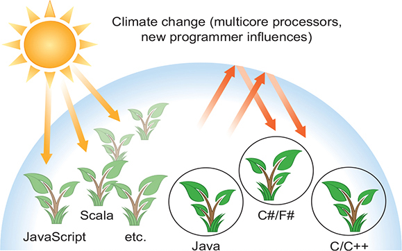
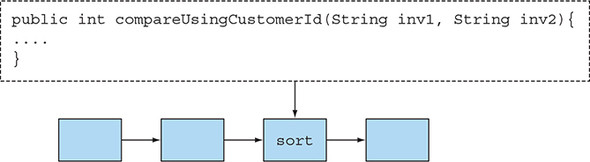
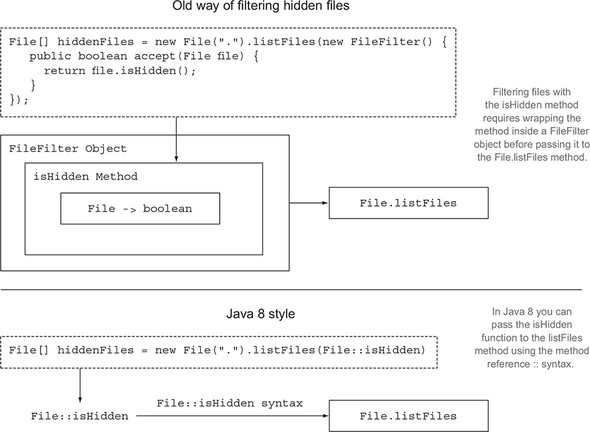
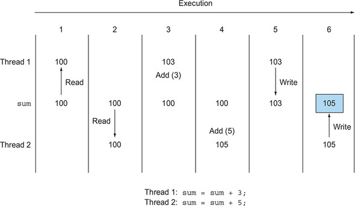
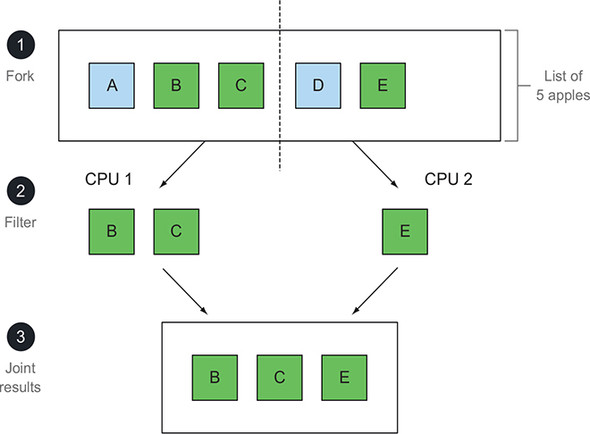

# 1강

[[toc]]

## 1. 역사의 흐름은 무엇인가?
- 자바 8은 아주 많이 혁신적으로 변화가 있었다. 
- 사과 목록을 무게순으로 정렬하는 고전적인 코드이다.

```java
Collections.sort(inventory, new Comparator<Apple>) {
    public int compare(Apple a1, Apple a2) {
        return a1.getWeight().compareTo(a2.getWeight());
    }
}
```

- 자바 8 을 이용하면 다음과 같이 구현할 수 있다.

```java
inventory.sort(comparing(Apple::getWeight));
```

- 하드웨어의 진화로 자바 8에 영향을 미쳤다.
- 기존에는 싱글 코어를 사용해 자바를 돌렸는데, 여러 코어를 사용하기 위해서는 스레드 코딩을 해야했다.
- 스레드 코딩은 복잡하고 어려워서 활용하기가 어려웠다.
- 자바 8은 이러한 문제 없이 병렬 코딩을 좀더 쉽고 단순하게 할 수 있는 방법을 제공해 준다.
- 리액티브 프로그래밍이라는 병렬 실행 기법을 지원한다.

<hr />

- 자바 8에서 제공하는 새로운 기술은 다음고 같다.
    - 스트림 API
    - 메소드에 코드를 전달하는 기법
    - 인터페이스의 디폴트 메소드
- 스트림을 이용하면 에러를 자주일으키며 멀티코어 CPU를 이용하는 것보다 비용이 훨씬 비싼 synchronized를 사용하지 않아도 된다.
- 자바 8 기법은 함수형 프로그래밍에서 위력을 발휘한다.

## 2. 왜 아직도 자바는 변화하는가?
- 프로그램 언어는 계속해서 쏟아지고 생태계와 비슷한 모양새가 나타난다.

### 2-1. 프로그래밍 언어 생태계에서 자바의 위치
- 자바는 많이들 쓰이고 괜찮은 언어였다.
- 그런데 빅데이터 바람이 불고 멀티코어 컴퓨터나 컴퓨팅 클러스터를 이용해서 처리할게 많아지면서, 기존 기능으론 대응이 어려워 졌다.



- 이러한 문제들을 해결하기 위해서 자바는 계속해서 진화해왔고, 자바 8에는 이런 요구들을 맞추기 위한 기능들이 추가되었다.

### 2-2. 스트림 처리
- 스트림이란 한 번에 한 개씩 만들어지는 연속적인 데이터 항목들의 모임
- 이론적으로 프로그램은 입력 스트림에서 데이터를 한 개씩 읽어 들이며 마찬가지로 출력 스트림으로 데이터를 한 개씩 기록한다.

```sh
cat file1 file2  |  tr "[A-Z]"  "[a-z]"  |  sort  |  tail -3
```


- 위의 스트림을 자동차 생산공장 라인과 같이 생각하면 쉬움
- 하나가 끝나면 넘겨주고 넘겨주고
- 자바 8에는 java.util.stream 패키지에 스트림 API가 추가되었다.
- 스트림 API가 조립 라인처럼 어떤 항목을 연속으로 제공하는 어떤 기능이라고 단순하게 생각하면 된다.
- 스트림 API의 핵심은 기존에는 한 번에 한 항목을 처리했지만 이제 자바 8에서는 작업을 고수준으로 추상화해서 일련의 스트림으로 만들어 처리할 수 있다.
- 스트림 파이프라인을 이용하면 입력 부분을 여러 CPU로 할당할 수 있어, 스레드를 안쓰고도 병렬작업이 가능하다.

### 2-3. 동적 파라미터화로 메소드에 코드 전달하기
- 코드 일부를 API로 전달하는 기능이 추가됐다.



- compareUsingCustomerId 메소드를 sort의 인수로 전달
- [동작 파라미터화](https://hyunto.github.io/2018/12/03/Java8-Behavior-Parameterization/) 라고 부른다.

### 2-4. 병렬성과 공유 가변 데이터
- 스트림 메소드로 전달하는 코드는 다른 코드와 동시에 실행하더라도 안전하게 실행될 수 있어야 한다.
- 다른 코드가 접근을 못하게 하려면, 공유된 가변 데이터(shared mutable data)에 접근하지 않아야 한다.
- 이러한 함수를 순수(pure)함수, 부작용 없는 함수(side-effect-free), 상태없는 함수(stateless) 라고 부른다.
- 자바 8 스트림을 이용하면 기존의 자바 스레드 API보다 쉽게 병렬성 활용이 가능하다.

### 2-5. 자바가 진화해야 하는 이유
- 언어는 하드웨어나 프로그래머 기대의 변화에 부응하는 방향으로 변화해야 한다.

## 3. 자바 함수
- 자바 8에서는 함수를 값처럼 취급한다.
- 프로그래밍 언어의 핵심은 값을 바꾸는 것
- 실제로 값은 일급값이고, 객체나 메소드는 이급 값이다.
- 여기서 메소드를 일급값으로 취급해주면, 런타임에 메소드를 전달 해 유용하게 쓰일 수 있다.
- 즉 메소드를 값으로 전달할 수 있다.

### 3-1. 메소드와 람다를 일급 시민으로
- 메소드를 값으로 취급할 수 있는 기능은 스트림 같은 자바 8 기능의 토대를 제공했다.

<hr />
- 첫 번째로 메소드 참조 라는 새로운 자바 8의 기능이 있다.

```java
File[] hiddenFiles = new File(".").listFiles(new FileFilter() {
    public boolean accept(File file) {
        return file.isHidden();
    }
});
```

- 위의 소스에서 FileFilter 객체 내부에 위치한 isHidden의 결과를 File.listFiles 메소드로 전달하는 방법으로 숨겨진 파일을 필터링할 수 있다.
- 결과는 잘 나오겠지만, 소스자체가 한눈에 들어오지 않는 단점이 있다.
- 자바 8은 다음과 같이 바꿔준다.

```java
File[] hiddenFiles = new File(".").listFiles(File::isHidden);
```

- 이미 isHidden이라는 ㄱ한수는 준비되어 있으므로, 자바 8의 메소드 참조 :: (이 메소드를 값으로 사용하라는 의미)를  이용해서 listFiles에 직접 전달할 수 있다.
- 기존에 new 키워드를 통한 객체 참조를 이용해 객체를 주고받은 것처럼, 자바 8에서는 :: 키워드를 이용해 메소드 참조를 만들어 전달 할 수 있다.

#### 람다 : 익명함수
- 자바 8에서는 람다(익명함수)를 포함하여 함수도 값으로 취급할 수 있다.
- 예를 들어 (int x) -> x+1, 즉 'x라는 인수로 호출하면 x+1을 반환' 하는 동작을 수행하도록 코드를 구현할 수 있다.
- MyMathUtils라는 클래스를 만든 다음에 클래스 내부에 add1이라는 메소드를 정의해서 Utils::add1을 만들수 있으므로 굳이 왜 이따구로 만들어야 되는지 의아할 수 있다.
- 직접 메소드를 만들어 정의할 수 있기도 하지만, 이용할 수 있는 편리한 클래스나 메소드가 없을 때 새로운 람다 문법을 이용하면 좀 더 간결하게 코드 구현이 가능하다.



### 3-2. 코드 넘겨주기 : 예제

- 사과를 녹색 사과를 필터링해주도록 하는 소스를 짜보자

```java
public static List<Apple> filterGreenApples(List<Apple> inventory) {
    List<Apple> result = new ArrayList<>();
    for (Apple apple: inventory){
        if (GREEN.equals(apple.getColor())) { // 녹색 사과만 필터링
            result.add(apple);
        }
    }
    return result;
}
```

- 여기에 무게로 필터링을 하는 기능을 넣는 소스를 짜보자

```java
public static List<Apple> filterHeavyApples(List<Apple> inventory) {
    List<Apple> result = new ArrayList<>();
    for (Apple apple: inventory){
        if (apple.getWeight() > 150) { // 이부분 빼고 다 복붙임
            result.add(apple);
        }
    }
    return result;
}
```

- 이런 중복을 줄이기 위해 코드를 인수로 넘겨줄 수 있는 자바8의 기능을 이용해 보자

```java
public static boolean isGreenApple(Apple apple) {
    return GREEN.equals(apple.getColor());
}
public static boolean isHeavyApple(Apple apple) {
    return apple.getWeight() > 150;
}
public interface Predicate<T>{
    boolean test(T t);
}
static List<Apple> filterApples(List<Apple> inventory,
                                Predicate<Apple> p) {
    List<Apple> result = new ArrayList<>();
    for (Apple apple: inventory){
        if (p.test(apple)) {
            result.add(apple);
        }
    }
    return result;
}
```

- 이제 이런식으로 메소드 호출이 가능하다.

```java
filterApples(inventory, Apple::isGreenApple);

filterApples(inventory, Apple::isHeavyApple);
```

- 자세한건 2,3장에서 설명

:::tip
predicate란?

Apple::isGreeanApple 메소드를 filterApples로 넘겨주었다. 인수로 값을 받아 true 나 false를 반환하는 함수를 predicate라고 부른다.
:::

### 3-3. 메소드 전달에서 람다로
- 메소드를 값으로 전달하는 것은 유용한 기능이지만, 한 두번 쓸 메소드를 매번 정의하는건 귀찮다.
- 이런걸 해결하기위해 람다를 쓴다.

```java
filterApples(inventory, (Apple a) -> GREEN.equals(a.getColor()));

filterApples(inventory, (Apple a) -> a.getWeight() > 150 );

filterApples(inventory, (Apple a) -> a.getWeight() < 80 ||
                                     RED.equals(a.getColor()) );
```

- 이런식으로 구현하면 메소드 구현이 따로 필요 없어진다.
- 하지만 람다가 너무 길어지면 오히려 헷갈려지니, 메소드를 구현해서 쓰는게 더 낫다.

## 4. 스트림
- 거의 모든 자바 어플리케이션은 컬렉션을 만들고 활용한다.
- 하지만 컬렉션으로 모든 문제가 해결되진 않는다.
- 예를 들어 리스트에서 고가의 트랜잭션만 필터링한 다음에 통화로 결과를 그룹화 해야한다고 가정한다.

```java
Map<Currency, List<Transaction>> transactionsByCurrencies =
    new HashMap<>();
for (Transaction transaction : transactions) {
    if(transaction.getPrice() > 1000){
        Currency currency = transaction.getCurrency();
        List<Transaction> transactionsForCurrency =
            transactionsByCurrencies.get(currency);
        if (transactionsForCurrency == null) {
            transactionsForCurrency = new ArrayList<>();
            transactionsByCurrencies.put(currency,
                                         transactionsForCurrency);
        }
        transactionsForCurrency.add(transaction);
    }
}
```

- 위의 에제에선 코드량이 엄청 많고, 중복도 엄청많다.
- 스트림 API를 이용하면 다음처럼 구현할 수 있다.

```java
import static java.util.stream.Collectors.groupingBy;
Map<Currency, List<Transaction>> transactionsByCurrencies =
    transactions.stream()
                .filter((Transaction t) -> t.getPrice() > 1000) // 고가의 트랜잭션 필터링
                .collect(groupingBy(Transaction::getCurrency)); // 통화로 그룹화함
```

- 컬렉션에서는 반복 과정을 직접 처리해야 했다.
- 즉 for-each 루프를 이용해서 각 요소를 바복하면서 작업을 수행했다.
- 이런 방식의 반복을 외부 반복이라고 한다.
- 스트림 API를 이용하면 루프를 신경쓸 필요 없이, 라이브러리 내부에서 모든 데이터가 처리된다.
- 이런걸 내부 반복이라고 한다.

### 4-1. 멀티스레딩은 어렵다.
- 에전 버전의 자바는 멀티스레딩 코드를 구현해 병렬성을 작성하는데, 이거 자체가 매우 어렵다.
- 스레드를 잘 제어하지 못하면 원치 않는 방식으로 데이터가 바뀔 수 있다.



- 자바 8은 스트림 API로 컬렉션을 처리하면서 발생하는 모호함과 반복적인 코드 문제, 그리고 멀티코어 활용 어려움의 문제가 해결된다.
- 반복적인 기능인 필터링 / 데이터 추출 / 데이트 그룹화 하는 등의 기능등을 스트림에서 구현을 했다.



- 두 CPU를 가진 환경에서 리스트를 필터링할 때 한 CPU는 리스트의 앞부분을 처리하고, 다른 CPU는 리스트의 뒷 부분을 처리하도록 요청할 수 있따.
- 이런 과정을 포킹 단계 라고 한다.
- filter를 두 개의 CPU로 포킹한 다음에 결과를 합침

<hr />

- 컬렉션은 어떻게 데이터를 저장하고 접근할지에 중점을 두는 반면 스트림은 데이터에 어떤 계산ㅇ늘 할 것인지 묘사하는 것에 중점을 둔다.
- 스트림은 스트림 내의 요소를 쉽게 병렬로 처리할 수 있는 환경을 제공한다는 것이 핵심이다.
- 특이한 방법으로, 컬렉션을 필터링하는 가장 빠른 방법은 컬렉션을 스트림으로 바꾸고, 병렬로 처리한 다음에, 리스트로 다시 복원시킨다.
- 즉 스트림과 람다 표현식을 이용하면 병렬성을 공짜로 얻을 수 있고, 리스트에서 무거운 사과를 순차적으로 또는 병렬로 필터링이 가능하다.

```java
// 순차 처리 방식의 코드
import static java.util.stream.Collectors.toList;
List<Apple> heavyApples =
    inventory.stream().filter((Apple a) -> a.getWeight() > 150)
                      .collect(toList());

// 병렬 처리 방식의 코드
import static java.util.stream.Collectors.toList;
List<Apple> heavyApples =
    inventory.parallelStream().filter((Apple a) -> a.getWeight() > 150)
                              .collect(toList());
```

## 5. 디폴트 메소드와 자바 모듈
- 외부에서 만들어진 컴포넌트를 이용해 시스템을 구축하는 경향이 있다.
- 이럴 때 패키지의 인터페이스가 바뀌면, 인터페이스를 구현하는 모든 클래스의 구현을 바꿔야 되는 문제가 있다.
- 이럴 때 자바 9의 모듈 시스템은 모듈을 정의하는 문법을 제공하므로 이를 이용해 패키지 모음을 포함하는 모듈을 정의할 수 있다.
- 이러한 모듈로 인해 컴포넌트 구조를 적용할 수 있고, 문서화와 모듈 확인 작업이 용이해 졌다.
- 자바 8 은 인터페이스를 쉽게 바꿀 수 있도록 디폴트 메소드를 지원한다.
- 즉 인터페이스에서 디폴트 메소드를 구현해 놓으면, 굳이 해당 인터페이스를 구현하는 클래스에서 전부다 수정할 필요가 없다.
- 참고 : https://programmers.co.kr/learn/courses/5/lessons/241

## 6. 함수형 프로그래밍에서 가져온 다른 유용한 아이디어
- 자바 8에서는 NullPointer 예외를 피할 수 있도록 도와주는 Optional<T> 클래스를 제공한다.
- Optional<T>는 값을 갖거나 갖지 않을 수 있는 컨테이너 객체이다.

<hr />

- 구조적 패턴 매칭 기법도 추가되었다.

```java
f(0) = 1
f(n) = n*f(n-1) 그렇지 않으면
```

- 위의 함수는 if-then-else , switch를 사용했을 것이다.
- 완벽하게 패턴매칭을 지원하진 않지만, 추가할 예정이다.
- match 함수라고 보면될듯

## 7. 마치며
- 언어는 생태계마냥 계속 발전해야 된다.
- 자바 8은 프로그램을 더 효과적이고 간결하게 구현할 수 있는 새로운 개념과 기능을 제공한다.
- 기존의 자바 프로그래밍으로는 멀티코어 프로세서를 온전히 활용하기 어렵다.
- 함수는 일급값이다. 메소드를 어떻게 함수형값으로 넘겨주는지, 람다를 어떻게 구현하는지 알아두자.
- 자바 8의 스트림 개념중 일부는 컬렉션에서 가져왔다.
- 기존 자바 기능으로는 대규모 컴포넌트 기반 프로그래밍, 그리고 진화하는 시스템의 인터페이스를 적절하게 대응하기 어려웠다. 자바 9에선 이런점을 보완하기 위해 default 메소드를 추가했다.
- 함수형 프로그래밍에서 null 처리 방법과 패턴 매칭 활용 등 흥미로운 기능들이 추가되었다.