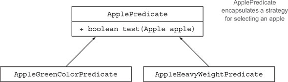
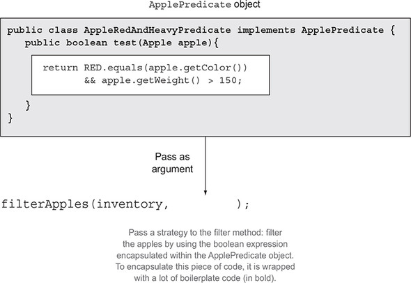
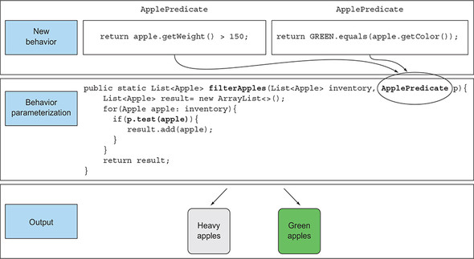
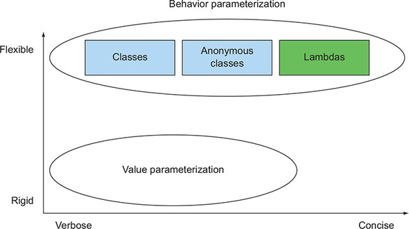

# 2강
[[toc]]

- 동작 파라미터화 : 아직은 어떻게 실행할 것인지 결정하지 않은 코드블럭

## 1. 변화하는 요구사항에 대응하기
### 1-1. 첫 번째 시도 : 녹색 사과 필터링
- 사과 색을 정의하는 Color num이 존재한다고 가정한다.

```java
enum Color { RED, GREEN }
```

```java
public static List<Apple> filterGreenApples(List<Apple> inventory) {
    List<Apple> result = new ArrayList<>();
    for(Apple apple: inventory){
        if( GREEN.equals(apple.getColor() ) {
            result.add(apple);
        }
    }
    return result;
}
```

- 위의 예시에서 녹색 말고 빨간색 사과를 필터링하고 싶어지면 복붙을 해야하는 문제가 발생한다.

```
거의 비슷한 코드가 반복 존재한다면 그 코드를 추상화한다.
```

### 1-2. 두 번째 시도 : 색을 파라미터화
- 색을 파라미터화 하면 좀더 유연한 구조가 된다.

```java
public static List<Apple> filterApplesByColor(List<Apple> inventory,
Color color) {
    List<Apple> result = new ArrayList<>();
    for (Apple apple: inventory) {
        if ( apple.getColor().equals(color) ) {
            result.add(apple);
        }
    }
    return result;
}
```

- 이제 이 메소드를 다음과 같이 호출할 수 있다.

```java
List<Apple> greenApples = filterApplesByColor(inventory, GREEN);
List<Apple> redApples = filterApplesByColor(inventory, RED);
...
```

- 여기서 새로운 요구사항인 무게 조건이 추가되버리면 무게 파라미터로 메소드를 만든다.

```java
public static List<Apple> filterApplesByWeight(List<Apple> inventory,
int weight) {
    List<Apple> result = new ArrayList<>();
    For (Apple apple: inventory){
        if ( apple.getWeight() > weight ) {
            result.add(apple);
        }
    }
    return result;
}
```

- 위 코드는 나름대로 깔끔하지만, 색으로 필터링 하는 로직과 거의 동일한 중복 문제가 발생한다.

### 1-3. 세 번째 시도 : 가능한 모든 속성으로 필터링
- 아주 좋지않지만, 모든 속성을 메소드 파라미터로 추가한 코드 이다.

```java
public static List<Apple> filterApples(List<Apple> inventory, Color color,
                                       int weight, boolean flag) {
    List<Apple> result = new ArrayList<>();
    for (Apple apple: inventory) {
        if ( (flag && apple.getColor().equals(color)) ||
             (!flag && apple.getWeight() > weight) ){
            result.add(apple);
        }
    }
    return result;
}
```

- 이건 아래와 같이 사용할 수 있다.

```java
List<Apple> greenApples = filterApples(inventory, GREEN, 0, true);
List<Apple> heavyApples = filterApples(inventory, null, 150, false);
...
```

- 정말 개 구린 형태이다.
- true, false가 뭔지 알기도 어렵고, 요구사항이 바뀌면 유연한 대응이 어렵고, 그지같이 덕지덕지 추가해야 된다.
- 지금까지는 문자열, 정수, 불리언 등의 값으로 filterApples 메소드를 파라미터화 했다.
- 문제가 잘 정의되어 있을 경우엔 위의 방법이 잘 동작하지만, 범용적인 작동은 어렵다.
- 동작 파라미터화를 이용해 유연한 구조로 만들어 본다.

## 2. 동작 파라미터화
- 선택 조건을 사과의 어떤 속성에 기초해서 불리언값을 반환(예를들어 사과가 녹색인가? 150g 이상인가? 등) 하는 방법이 있다.
- 참 또는 거짓을 반환하는 함수를 프레디케이트라고 한다.
- 선택 조건을 결정하는 인터페이스를 정의해 본다.

```java
public interface ApplePredicate{
    boolean test (Apple apple);
}
```

- 이제 이 인터페이스를 구현해 준다.

```java
public class AppleHeavyWeightPredicate implements ApplePredicate {
    public boolean test(Apple apple) {
        return apple.getWeight() > 150;
    }
}

public class AppleGreenColorPredicate implements ApplePredicate {
    public boolean test(Apple apple) {
        return GREEN.equals(apple.getColor());
    }
}
```



- 위 조건에 따라 filter 메소드가 다르게 동작하게 된다.
- 이런 패턴을 [strategy design pattern](https://gwegwe1234.github.io/study-collection/book/JPIE/06.html#q2-%EC%8A%A4%ED%8A%B8%EB%A0%88%ED%8B%B0%EC%A7%80-%ED%8C%A8%ED%84%B4%EC%9D%98-%EC%98%88%EB%A5%BC-%EB%B3%B4%EC%97%AC%EC%A4%84-%EC%88%98-%EC%9E%88%EB%8A%94%EA%B0%80) 이라고 부른다.
- 전략 디자인 패턴은 각 알고리즘을 캡슐화하는 알고리즘 패밀리를 정의해둔 다음에 런타임에 알고리즘을 선택하는 기법이다.
- 위의 예시에서는 ApplePredicate가 알고리즘 패밀리고 AppleHeavyWeightPredicate와 AppleGreenColorPredicate가 전략이다.

<hr />

- 이제 여기서 ApplePredicate는 어떻게 다양한 동작 수행이 가능할까?
- filterApples에서 ApplePredicate 객체를 받아 애플의 조건을 검사하도록 메소드를 수정해야 한다.
- 이런식으로 *동작 파라미터화*, 즉 메소드가 다양한 동작(또는 전략)을 받아서 내부적으로 다양한 동작을 수행할 수 있다.

### 2-1. 네 번째 시도 : 추상적 조건으로 필터링

```java
public static List<Apple> filterApples(List<Apple> inventory,
                                       ApplePredicate p) { // ApplePredicate 를 받는다.
    List<Apple> result = new ArrayList<>();
    for(Apple apple: inventory) {
        if(p.test(apple)) { // 프레디케이트 객체로 사과 검사 조건을 캡슐화 한다.
            result.add(apple);
        }
    }
    return result;
}
```

#### 코드/동작 전달하기
- 이제 코드가 좀더 많이 유연해 졌고, 다양한 ApplePredicate를 만들어서 filterApples 메소드로 전달이 가능하다.
- 만약 빨간 150그람 이상의 사과를 얻고 싶으면 해당 소스를 만들어 주면 된다.

```java
public class AppleRedAndHeavyPredicate implements ApplePredicate {
        public boolean test(Apple apple){
                return RED.equals(apple.getColor())
                       && apple.getWeight() > 150;
        }
}

List<Apple> redAndHeavyApples =
    filterApples(inventory, new AppleRedAndHeavyPredicate());
```

- filterApples 메소드의 동작을 파라미터화 시켰다.



- 위의 그림처럼 가장 중요한 구현은 test 메소드다.
- 아쉽게도 메소드는 객체만 인수로 받으므로 test 메소드를 ApplePredicate 객체로 감싸서 전달해 주어야 한다.
- test 메소드를 구현하는 객체를 이용해 불리언 표현식 등을 전할할 수 있으므로 이는 '코드를 전달' 할 수 있는것이나 다름이 없다.

#### 한 개의 파라미터, 다양한 동작
- 컬렉션 탐색 로직과 각 항목에 적용할 동작을 분리할 수 있다는 것이 동작 파리미터화의 강점이다.



## 3. 복잡한 과정 간소화

```java
public class AppleHeavyWeightPredicate implements ApplePredicate {
    public boolean test(Apple apple) {
        return apple.getWeight() > 150;
    }
}
public class AppleGreenColorPredicate implements ApplePredicate {
    public boolean test(Apple apple) {
        return GREEN.equals(apple.getColor());
    }
}
public class FilteringApples {
    public static void main(String...args) {
        List<Apple> inventory = Arrays.asList(new Apple(80, GREEN),
                                              new Apple(155, GREEN),
                                              new Apple(120, RED));
        List<Apple> heavyApples =
            filterApples(inventory, new AppleHeavyWeightPredicate());
        List<Apple> greenApples =
            filterApples(inventory, new AppleGreenColorPredicate());
    }
    public static List<Apple> filterApples(List<Apple> inventory,
                                           ApplePredicate p) {
        List<Apple> result = new ArrayList<>();
        for (Apple apple : inventory) {
            if (p.test(apple)){
                result.add(apple);
            }
        }
        return result;
    }
}
```

- 위의 소스를 보면 로직과관련 없는 코드가 많이 추가되었다.
- 자바는 클래스의 선언과 인스턴스화를 동시에 수행할 수 있도록 익명 클래스라는 기법을 제공한다.

### 3-1. 익명 클래스
- 익명 클래스는 자바의 지역 클래스(블록 내부에 선언된 클래스)
- 클래스 선언과 인스턴스화를 동시에 할 수 있다.

### 3-2. 다섯 번째 시도 : 익명 클래스 사용
- 익명클래스를 이용해 ApplePredicate를 구현하는 객체를 만드는 방법이다.

```java
List<Apple> redApples = filterApples(inventory, new ApplePredicate() {
    public boolean test(Apple apple){
        return RED.equals(apple.getColor());
    }
});
```

- GUI 어플리케이션에서 이벤트 핸들러 객체를 구현할 때 많이 쓴다.

```java
button.setOnAction(new EventHandler<ActionEvent>() {
    public void handle(ActionEvent event) {
        System.out.println("Whoooo a click!!");
    }
});
```

- 위 2개의 소스를 보면 여전히 더러운 모습이다.
- 코드의 장황함은 아주 나쁜 특성이다.
- 유지보수에 오래걸리고 읽는것도 어렵다.
- 동작 파라미터화를 사용해서 좀더 간단하게 짤 수 있도록 하자

### 3-3. 여섯 번째 시도 : 람다 표현식 사용
- 위 예제코드를 좀더 간단하게 람다로 표현해 보자

```java
List<Apple> result = filterApples(inventory, (Apple apple) -> RED.equals(apple.getColor()));
```



### 3-4. 일곱 번째 시도 : 리스트 형식으로 추상화
```java
public interface Predicate<T> {
    boolean test(T t);
}
public static <T> List<T> filter(List<T> list, Predicate<T> p) {
    List<T> result = new ArrayList<>();
    for(T e: list) {
        if(p.test(e)) {
            result.add(e);
        }
    }
    return result;
}
```

- 이렇게 하면 바나나, 오렌지, 정수, 문자열 등의 리스트에 필터 메소드를 사용할 수 있다.

```java
List<Apple> redApples =
  filter(inventory, (Apple apple) -> RED.equals(apple.getColor()));
List<Integer> evenNumbers =
  filter(numbers, (Integer i) -> i % 2 == 0);
```

## 4. 실전 예제

### 4-1. Comparator로 정렬하기
- 다음과 같은 인터페이스를 갖는 java.util.Comparator 객체를 이용해 sort의 동작을 파라미터화 할 수 있다.

```java
// java.util.Comparator
public interface Comparator<T> {
    int compare(T o1, T o2);
}
```

- Comparator을 구현해서 sort 메소드의 동작을 다양화할 수 있다.

```java
inventory.sort(new Comparator<Apple>() {
    public int compare(Apple a1, Apple a2) {
        return a1.getWeight().compareTo(a2.getWeight());
    }
});
```

- 요구사항이 바뀌면 새로운 요구사항에 맞는 Comparator을 만들어서 sort 메소드에 전달 할 수 있다.
- 실제 정렬 세부사항은 추상화되어 있으므로 신경 쓸 필요가 없다.
- 람다를 이용하면 좀더 깔끔해진다.

```java
inventory.sort(
  (Apple a1, Apple a2) -> a1.getWeight().compareTo(a2.getWeight()));
```

### 4-2. Runnable로 코드 블록 실행하기
- 자바에서는 Runnable 인터페이스를 이용해서 실행할 코드 블록을 지정할 수 있다. 
- 아래 코드에서 볼 수 있는 것처럼 코드 블록을 실행한 결과는 void 이다.

```java
// java.lang.Runnable
public interface Runnable {
    void run();
}
```

```java
Thread t = new Thread(new Runnable() {
    public void run() {
        System.out.println("Hello world");
    }
});
```

- 보통 예전엔 스레드 코딩을 이런식으로 했는데

```java
Thread t = new Thread(() -> System.out.println("Hello world"));
```

### 4-3. GUI 이벤트 처리하기

```java
// java.util.concurrent.Callable
public interface Callable<V> {
    V call();
}
```

```java
ExecutorService executorService = Executors.newCachedThreadPool();
Future<String> threadName = executorService.submit(new Callable<String>() {
    @Override
    public String call() throws Exception {
        return Thread.currentThread().getName();
    }
});
```

- 이런걸

```java
Future<String> threadName = executorService.submit(
                     () -> Thread.currentThread().getName());
```

### 4-4. GUI 이벤트 처리하기
```java
Button button = new Button("Send");
button.setOnAction(new EventHandler<ActionEvent>() {
    public void handle(ActionEvent event) {
        label.setText("Sent!!");
    }
});
```

- EventHandler는 setOnAction 메소드의 동작을 파라미터화 한다.

```java
button.setOnAction((ActionEvent event) -> label.setText("Sent!!"));
```

## 5. 마치며
- 동작 파라미터화에서는 메소드 내부적으로 다양한 동작을 수행할 수 있도록 코드를 메소드인수로 전달한다.
- 동작 파라미터화를 이용하면 변화하는 요구사항에 더 잘 대응할 수 있는 코드를 구현할 수 잇으며 나중에 엔지니어링 비용을 줄일 수 있다.
- 코드 전달 기법을 이용하면 동작을 메소드의 인수로 전달할 수 있다. 하지만 자바 8 이전에는 코드를 지저분하게 구현해야 했다면, 이젠 람다로 좀더 쉽게 클래스 구현없이 만들 수 있다.