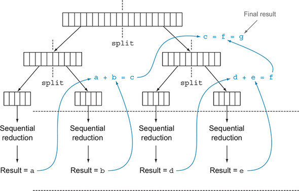
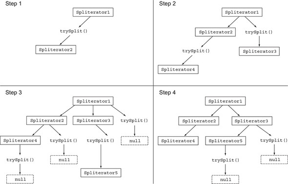

# 7강

[[toc]]

## 1. 병렬 스트림
- 스트림 인터페이스를 이용하면 간단하게 요소를 병렬로 처리가 가능하다.
- 컬렉션에 parallelStream을 호출하면 병렬 스트림이 생성된다.
- 병렬 스트림이란 각각의 스레드에서 처리할 수 있도록 스트림 요소를 여러 청크로 분할한 스트림
- 즉 멀티코어에서 각각의 프로세서가 청크를 담당해 처리하도록 해준다.

```java
// stream 방식 두 수의 합
public static long sequentialSum(long n) {
    return Stream.iterate(1L, i -> i + 1)
        .limit(n)
        .reduce(0L, Long::sum);
}
  
// 기존 자바 방식 두 수의 합
public static long iterativeSum(long n) {
    long result = 0;
    for (long i = 1L; i <= n; i++) {
      result += i;
    }
    
    return result;
}
```

- 여기서 n이 커질 경우, 병렬로 처리하는게 효율이 좋은데 기존 자바 방식은 고민할게 많지만, 스트림은 간단하다.

### 1-1. 순차 스트림을 병렬 스트림으로 변환하기
- 순차 스트림에 parallel 메소드를 호출하면 기존의 함수형 리듀싱 연산이 병렬로 처리된다.

```java
// 병렬 스트림 방식
public static long parallelSum(long n) {
    return Stream.iterate(1L, i -> i + 1)
        .limit(n)
        .parallel()
        .reduce(0L, Long::sum);
}
```

- 스트림이 여러 청크로 분할되어 계산을 한다.


- 반대 개념으로 sequential을 호출해 병렬을 순차 스트림으로 변경할 수 있다.

```java
stream.parallel().filter(...).sequential().map(...).parellel()...
```

:::tip
스트림의 parallel 메소드에서 병렬로 작업을 수행하는 스레드는 내부적으로 ForkJoinPool을 사용한다. ForkJoinPool은 기본적으로 프로세서수에 상응하는 스레드를 갖는다.
:::

### 1-2. 스트림 성능 측정
- JMH를 사용해 측정한다.
- 예제 프로그램은 .. 플레인 자바 프로젝트라 생략한다.

```xml
<dependency>
  <groupId>org.openjdk.jmh</groupId>
  <artifactId>jmh-core</artifactId>
  <version>1.17.4</version>
</dependency>
<dependency>
  <groupId>org.openjdk.jmh</groupId>
  <artifactId>jmh-generator-annprocess</artifactId>
  <version>1.17.4</version>
</dependency>
```

- build 플러그인 설정도 해준다.

```xml
<build>
    <plugin>
      <groupId>org.apache.maven.plugins</groupId>
      <artifactId>maven-shade-plugin</artifactId>
      <executions>
        <execution>
          <phase>package</phase>
          <goals><goal>shade</goal></goals>
          <configuration>
            <finalName>benchmarks</finalName>
            <transformers>
              <transformer implementation="org.apache.maven.plugins.shade.
                                     resource.ManifestResourceTransformer">
                <mainClass>org.openjdk.jmh.Main</mainClass>
              </transformer>
            </transformers>
          </configuration>
        </execution>
      </executions>
    </plugin>
  </plugins>
</build>
```

```java
@BenchmarkMode(Mode.AverageTime)  // 벤치마크 대상 메소드를 실행하는 데 걸리는 평균 시간 측정
@OutputTimeUnit(TimeUnit.MILLISECONDS) // 벤치마크 결과를 밀리초 단위로 롤백
@Fork(2, jvmArgs={"-Xms4G", "-Xmx4G"}) // 4Gb의 힙 공간을 제공한 환경에서 두번 실행해서 테스트 신뢰성 확보
public class ParallelStreamBenchmark {
    private static final long N= 10_000_000L;

    @Benchmark // 벤치마크 대상 메소드
    public long sequentialSum() {
        return Stream.iterate(1L, i -> i + 1).limit(N)
                     .reduce( 0L, Long::sum);
    }

    @TearDown(Level.Invocation) // 매 번 벤치마크 실행 후 GC 동작 시도
    public void tearDown() {
        System.gc();
    }
}
```

- 결과는 다음과 같다.

```
Benchmark                                Mode  Cnt    Score    Error  Units
ParallelStreamBenchmark.sequentialSum    avgt   40  121.843 ±  3.062  ms/op

Benchmark                                Mode  Cnt    Score    Error  Units
ParallelStreamBenchmark.iterativeSum     avgt   40    3.278 ±  0.192  ms/op

Benchmark                                Mode  Cnt    Score    Error  Units
ParallelStreamBenchmark.parallelSum      avgt   40  604.059 ± 55.288  ms/op
```

- 전통적인 for loop이 박싱 언박싱이 필요가 없어서 4배 (40배같은데..) 빠르다.
- 병렬로 하면 쿼드코어 일 때도 순차적인 스트림 보다도 5배나 느리다.
- 이유는 다음과 같다

```java
1. 반복 결과로 박싱된 객체가 만들어지므로 숫자를 더하려면 언박싱을 해야 한다.

2. 반복 작업은 병렬로 수행할 수 있는 독립 단위로 나누기가 어렵다.
```

- 2번이 문제인데, 실제로 병렬로 수행할 수 있는 스트림 모델이 있어야 병렬 스트림을 제대로 테스트 해볼 수 있다.
- iterate 자체가 본질적으로 순차 수행이어서 병렬에 적합하지가 않다.


- 리듀싱 연산이 제대로 수행되지 않는데, 리듀싱 과정을 시작하는 시점에 전체 숫자 리스트가 준비되지 않았으므로 스트림을 병렬로 처리할 수 있도록 청크로 분할할 수 없다.
- 스트림이 병렬로 처리되도록 지시했고 각각의 합계가 다른 스레드에서 수해되었지만, 순차 처리랑 다를바가 없어 결국 스레드를 나누고 할당하는 오버헤드만 증가해 효율이 떨어졌다.
- 병렬을 잘못쓰면 이렇게 망하는 경우가 있으니 잘 이해하고 써야 한다.

#### 더 특화된 메소드 사용
- 좀더 효율적으로 합계 연산을 병렬로 처리하려면 LongStream.rangeClosed라는 메소드를 사용해야 한다.
    - LongStream.rangeClosed는 기본형 long을 직접 사용하므로 박싱과 언박싱 오버헤드가 사라진다.
    - LongStream.rangeClosed는 쉽게 청크로 분할할 수 있는 숫자 범위를 생산한다. 예를 들어 1-20 범위의 숫자를 각각 1-5, 6-10, 11-15, 16-20 범위의 숫자로 분할할 수 있다.
- 언박싱에 소비되는 오버헤드를 측정해 보자

```java
@Benchmark
public long rangedSum() {
    return LongStream.rangeClosed(1, N)
                     .reduce(0L, Long::sum);
}
```

- 결과

```
Benchmark                                Mode  Cnt    Score    Error  Units
ParallelStreamBenchmark.rangedSum        avgt   40    5.315 ±  0.285  ms/op
```

- iterate 팩토리 메소드로 생성한 순차보다 훨씬 더 빠르다.
- 특화되지 않은 스트림을 처리할 때는 오토박싱, 언박싱 등의 오버헤들르 수반해 느려진다.
- 새로운 버전에 병렬을 적용해 보자

```java
@Benchmark
public long parallelRangedSum() {
    return LongStream.rangeClosed(1, N)
                     .parallel()
                     .reduce(0L, Long::sum);
}
```

- 결과

```
Benchmark                                  Mode  Cnt  Score    Error  Units
ParallelStreamBenchmark.parallelRangedSum  avgt   40  2.677 ±  0.214  ms/op
```

- 순차 실행보다 빨라진다.

### 1-3. 병렬 스트림의 올바른 사용법
- 병렬 스트림을 잘못 사용하면서 발생하는 많은 문제는 공유된 상태를 바꾸는 알고리즘을 사용하기 때문에 일어난다.
- 다음은 n까지의 자연수를 더하면서 공유된 누적자를 바꾸는 프로그램을 구현한 코드

```java
public long sideEffectSum(long n) {
    Accumulator accumulator = new Accumulator();
    LongStream.rangeClosed(1, n).forEach(accumulator::add);
    return accumulator.total;
}

public class Accumulator {
    public long total = 0;
    public void add(long value) {
      total += value;
    }
}
```

- 위의 코드는 본질적으로 순차 실행할 수 있도록 구현되어 있으므로 병렬로 실행하면 참사가 일어난다.
- 특히 total에 접근할 때마다 데이터 레이스 문제가 발생한다. (공유데이터 문제)
- 결국 병렬로 만들면 망하는 코드가 된다.

```java
public long sideEffectParallelSum(long n) {
    Accumulator accumulator = new Accumulator();
    LongStream.rangeClosed(1, n).parallel().forEach(accumulator::add);
    return accumulator.total;
}
```

- 실행 결과를 출력해보면

```
Result: 5959989000692
Result: 7425264100768
Result: 6827235020033
Result: 7192970417739
Result: 6714157975331
Result: 7497810541907
Result: 6435348440385
Result: 6999349840672
Result: 7435914379978
Result: 7715125932481
SideEffect parallel sum done in: 49 msecs
```

- 느린건 둘째치고 값부터 제대로 안나온다.
- 여러 스레드에서 동시에 공유값, total에 접근하다 보니 문제가 발생한다.

### 1-4. 병렬 스트림 효과적으로 사용하기
- 적절한 벤치마크로 성능 측정 후에 병렬을 사용하자
- 박싱을 주의하자. 방식을 피하도록 특화 스트림인 IntStream, LongStream 등을 잘 활용하자
- limit 이나 findFirst처럼 요소의 순서에 의존하는 연산은 순차 스트림이 병렬 스트림보다 빠르다.
- 스트림에서 수행하는 전체 파이프라인 연산 비용을 고려해야 한다.
- 소량의 데이터에선 병렬이 후지므로 쓰지 말자
- 스트림을 구성하는 자료구조가 적절한지 확인을 해야한다.
- 최종 연산의 병합과정 비용을 잘 살펴봐야 한다.

| 소스 | 분해성 |
| --- | --- |
| ArrayList | 굿 |
| LinkedList | 뱃 |
| IntStream.range | 굿 |
| Stream.iterate | 뱃 |
| HashSet | 굿 |
| TreeSet | 굿 |

## 2. 포크 / 조인 프레임워크
- 포크 / 조인 프레임워크는 병렬화 할 수 있는 작업을 재귀적으로 작은 작업으로 분할한 다음에 서브태스크 각각의 결과를 합쳐서 전체 결과를 마들도록 설계되었다.

### 2-1. RecursiveTask 활용
- 스레드 풀을 이용하려면 RecursiveTask<R> 의 서브클래스를 생성해야 한다.
- RecursiveTask를 정의하려면 추상메소드 compute를 구현해야 한다.

```java
protected abstract R compute();
```

- compute 메소드는 태스크를 서브태스크로 분할하는 로직과 더 이상 분할할 수 없을 때 개별 서브태스크의 결과를 생산할 알고리즘을 정의한다.
- 따라서 대부분의 compute 메소드 구현은 다음과 같은 형식을 유지한다.

```java
if (태스크가 충분히 작거나 더 이상 분할할 수 없으면) {
    순차적으로 태스크 계산
} else {
    태스크를 두 서브태스크로 분할
    태스크가 다시 서브태스크로 분할되도록 이 메소드를 재귀적으로 호출함
    모든 서브태스크의 연산이 완료될 때까지 기다림
    각 서브태스크의 결과를 합침
}
```

- divide & conquer 알고리즘의 병렬화 버전이다.


```java
package chap7;

import java.time.LocalDateTime;
import java.util.concurrent.RecursiveTask;

public class ForkJoinSumCalculator extends RecursiveTask<Long> {

  private final long[] numbers;
  private final int start;
  private final int end;
  private static final long THRESHOLD = 10_000; // 이 값 이하의 서브태스크는 분리 불가능

  public ForkJoinSumCalculator(long[] numbers) {
    this(numbers, 0, numbers.length);
  }

  private ForkJoinSumCalculator(long[] numbers, int start, int end) {
    this.numbers = numbers;
    this.start = start;
    this.end = end;
  }

  @Override
  protected Long compute() {
    int length = end - start;
    if (length <= THRESHOLD) {
      return computeSequentially();
    }

    ForkJoinSumCalculator leftTask = new ForkJoinSumCalculator(numbers, start, start + length / 2);
    leftTask.fork();

    ForkJoinSumCalculator rightTask = new ForkJoinSumCalculator(numbers, start + length / 2, end);
    rightTask.fork();

    Long rightResult = rightTask.compute();
    Long leftResult = leftTask.join(); // 첫 번째 서브태스크의결과를 읽거나 아직 결과가 없으면 기다린다.

    return leftResult + rightResult;
  }

  private long computeSequentially() {
    long sum = 0;
    for (int i = 0; i < end; i++) {
      sum += numbers[i];
    }

    return sum;
  }
}
```

- 실제 실행 시에 생성자에 원하는 수의 배열을 넘겨줄 수 있다.

```java
public static void main(String[] args) {
    long[] numbers = LongStream.rangeClosed(1, 100L).toArray();
    ForkJoinSumCalculator task = new ForkJoinSumCalculator(numbers);
    System.out.println( new ForkJoinPool().invoke(task));
}
```

- ForkJoinPool에서 실행되는 마지막 invoke 메소드의 반환값은 ForkJoinSumCalculator에서 정의한 태스크의 결과가 된다.

#### ForkJoinSumCaclulator 실행
- ForkJoinSumCaclulator를 ForkJoinPool로 전달하면 풀의 스레드가 ForkJoinSumCaclulator의 compute 메소드를 실행하면서 작업을 수행한다.
- 이후에 Divide & Conquer 로직처럼 분해했다가 다시 합치면서 병렬 계산을 수행한다.



### 2-2. 포크 / 조인 프레임워크를 제대로 사용하는 방법

```java
1. join 메소드를 태스크에 호출하면 태스크가 생산하는 결과가 준비될 때까지 호출자를 블록시킨다.
따라서 두 서브태스크가 모두 시작된 다음에 join을 호출해야 한다.

2. RecursiveTask 내에서는 ForkJoinPool의 invoke 메소드를 사용하지 말아야 한다.
compute나 fork 메소드를 사용하고, 실제로 병렬 계산을 시작할 때만 invoke를 사용한다.

3. 서브트스크에 fork 메소드를 호출해서 ForkJoinPool의 일정을 조절할 수 잇다.
한쪽은 fork, 한쪽은 compute 를 호출하는게 효율적이다.

4. 포크 / 조인 프레임워크를 이용하는 병렬 계산은 디버깅하기 어렵다.

5. 포크 / 조인 프레임워크를 사용하는게 순차 처리보다 무조건 빠른건 아니다.
```

### 2-3. 작업 훔치기
- ForkJoinPool의 모든 스레드를 거의 공정하게 분할한다.
- 각각의 스레드는 자신에게 할당된 태스크를 포함하는 이중 연결 리스트를 참조하면서 작업이 끝날 때마다 큐의 헤드에서 다른 태스크를 가져와서 작업을 처리한다.
- 이때 한 스레드는 다른 스레드보다 자신에게 할당된 태스크를 더 빨리 처리 할 수 있다.
- 이러면 끝난놈은 쉬는게 아니라 다른 스레드 큐의 꼬리에서 작업을 훔쳐온다.
- 계속 안놀고 훔쳐온다.


## 3. Spliterator 인터페이스
- Spliterator란 분할할 수 있는 반복자 라는 뜻
- Spliterator는 병렬작업에 특화되어 있다.

```java
public interface Spliterator<T> {
    boolean tryAdvance(Consumer<? super T> action);
    Spliterator<T> trySplit();
    long estimateSize();
    int characteristics();
}
```

### 3-1. 분할 과정
- 스트림을 여러 스트림으로 분할하는 과정은 재귀적으로 일어난다.



- trySplit호출 시 null을 반환할 때까지 과정을 반복한다.

#### Spliterator 특성
- Spliterator는 characteristics라는 추상 메소드도 정의한다.
- Characteristics 메소드는 Spliterator 자체의 특성 집합을 포함하는 int를 반환한다.

| 특성 | 의미 |
| --- | --- |
| ORDERED | 리스트처럼 요소에 정해진 순서가 있으므로 Spliterator는 요소를 탐색하고 분할 할 때 이 순서에 유의해야 한다. |
| DISTICT | x, y 두 요소를 방문했을 때 x.equals(y)는 항상 false를 반환한다. |
| SORTED | 탐색된 요소는 미리 정의된 정렬 순서를 따른다. |
| SIZED | 크기가 알려진 소스로 Spliterator를 생성했으므로 estimatedSize()는 정확한 값을 반환한다. |
| NON-NULL | 탐색하는 모든 요소는 null이 아니다. |
| IMMUTABLE | 이 Spliterator의 소스는 불변이다. 즉 요소를 탐색하는 동안 요소를 추가하거나, 삭제하거나, 고칠 수 없다. |
| CONCURRENT | 동기화 없이 Spliterator의 소스를 여러 스레드에서 동시에 고칠 수 있다. |
| SUBSIZED | 이 Spliterator 그리고 분할되는 모든 Spliterator는 SIZED 특성을 갖는다. |


### 3-2. 커스텀 Spliterator 구현하기

```java
public static int countWordsIteratively(String s) {
    int counter = 0;
    boolean lastSpace = true;

    for(char c : s.toCharArray()) {
      if (Character.isWhitespace(c)) {
        lastSpace = true;
      } else {
        if (lastSpace) counter++;
        lastSpace = false;
      }
    }

    return counter;
}
```

- 잘 작동한다.
- 이걸 함수형을 이용해 수정해 보자

#### 함수형으로 단어 수를 세는 메소드 재구현하기
- String을 스트림으로 변환해야 하는데, 기본형이 없으니 Stream<Character> 를 쓰자.

```java
Stream<Character> stream = IntStream.range(0, SENTENCE.length())
                                    .mapToObj(SENTENCE::charAt);
```

```java
public class WordCounter {

  private final int counter;
  private final boolean lastSpace;

  public WordCounter(int counter, boolean lastSpace) {
    this.counter = counter;
    this.lastSpace = lastSpace;
  }

  public WordCounter accumulate(Character c) {
    if (Character.isWhitespace(c)) {
      return lastSpace ?
          this :
          new WordCounter(counter, true);
    } else {
      return lastSpace ?
          new WordCounter(counter + 1, false) :
          this;
    }
  }

  public WordCounter combine(WordCounter wordCounter) {
    return new WordCounter(counter + wordCounter.counter,
        wordCounter.lastSpace);
  }

  public int getCounter() {
    return counter;
  }
}
```

- accumulate 메소드는 WordCounter의 상태를 어떻게 바꿀 것인지, 또는 엄밀히 WordCounter는 불변 클래스이므로 새로운 WordCounter클래스를 어떤 상태로 생성할 것인지 정의한다.
- 아래는 accumulate에서 새로운 문자를 탐색했을 때 WordCounter의 상태 변이를 보여준다.


- combine 메소드는 문자열 서브 스트림을 처리한 WordCounter의 결과를 합친다.
- 즉 combine은 WordCounter의 내부 counter 값을 서로 합친다.
- 이제 이거로 문자스트림의 리듀싱 연산을 구현해 볼 수 있다.

```java
private static int countWords(Stream<Character> stream) {
    WordCounter wordCounter = stream.reduce(new WordCounter(0, true),
        WordCounter::accumulate, WordCounter::combine);

    return wordCounter.getCounter();
}
```

#### WordCounter 병렬로 수행하기 
- 이걸 병렬로 해보자

```java
System.out.println(countWords(stream.parallel()));
```

- 11이 나와야 되는데 37이 나온다.
- 순차 스트림을 병렬 스트림으로 바꿀 때 스트림 분할 위치에 따라 잘못된 결과가 나올 수 있다.
- 이걸 해결하기 위해선 문자열을 임의의 위치에서 분할하지 말고 단어가 끝나는 위치에서만 분할하는 방법으로 해결할 수 있다.
- 요럴때 필요한게 Spliterator

```java
package chap7;

import java.util.Spliterator;
import java.util.function.Consumer;

public class WordCounterSpliterator implements Spliterator<Character> {

  private final String string;
  private int currentChar = 0;

  private WordCounterSpliterator(String string) {
    this.string = string;
  }

  @Override
  public boolean tryAdvance(Consumer<? super Character> action) {
    action.accept(string.charAt(currentChar++)); // 현재 문자를 소비한다.
    return currentChar < string.length(); // 소비할 문자가 남아있으면 true를 반환
  }

  @Override
  public Spliterator<Character> trySplit() {
    int currentSize = string.length() - currentChar;
    if (currentSize < 10) {
      return null;
    }

    for (int splitPos = currentSize / 2 + currentChar; splitPos < string.length(); splitPos++) {
      if(Character.isWhitespace(string.charAt(splitPos))) {
        Spliterator<Character> spliterator =
            new WordCounterSpliterator(string.substring(currentChar, splitPos));
        currentChar = splitPos;
        return spliterator;
      }
    }
    
    return null;
  }

  @Override
  public long estimateSize() {
    return string.length() - currentChar;
  }

  @Override
  public int characteristics() {
    return ORDERED + SIZED + SUBSIZED + NONNULL + IMMUTABLE;
  }
}
```

#### WordCounterSpliterator 활용
- 이제 병렬로 문자 카운팅이 가능해 진다.

```java
Spliterator<Character> spliterator = new WordCounterSpliterator(SENTENCE);
Stream<Character> parallelStream = StreamSupport.stream(spliterator, true);

int parallelWordCount = countWords(parallelStream);

System.out.println(parallelWordCount);
```

- 결과 잘 나옴

## 4. 마치며
- 내부 반복을 이용하면 명시적으로 다른 스레드를 사용하지 않고도 스트림을 병렬로 처리할 수 있다.
- 간단하게 스트림을 병렬로 처리할 수 있지만, 항상 병렬이 빠른게 아니므로 성능을 직접 측정해 보아야 한다.
- 병렬 스트림으로 데이터 집합을 병렬 실행할 때 특히 처리해야 할 데이터가 아주 많거나 각 요소를 처리하는 데 오랜 시간이 걸릴 때 성능을 높일 수 있다.
- 가능하면 기본형 특화 스트림을 사용하는 등 올바른 자료구조 선택이 어떤 연산을 병렬로 처리하는 것보다 성능적으로 더 큰 영향을 미칠 수 있다.
- 포크/조인 프레임워크에서는 병렬화할 수 있는 태스크를 작은 태스크로 분할한 다음에 분할된 태스크를 각각의 스레드로 실행하며 서브태스크 각각의 결과를 합쳐서 최종 결과를 생산한다.
- Spliterator는 탐색하려는 데이터를 포함하는 스트림을 어떻게 병렬화 할 것인지 정의한다.