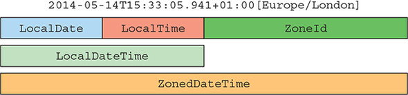

# 12강

[[toc]]

## 1. LocalDate, LocalTime, Instant, Duration, Period 클래스
### 1-1. LocalDate와 LocalTime 사용

- LocalDate는 시간을 제외한 날짜를 표현하는 불변 객체.
- 어떤 시간대 정보도 포함하지 않는다.

```java
LocalDate date = LocalDate.of(2020, 3, 28);
int year = date.getYear();
Month month = date.getMonth();
int day = date.getDayOfMonth();
DayOfWeek dow = date.getDayOfWeek();
int len = date.lengthOfMonth();
boolean leap = date.isLeapYear();

-- 결과
2020
MARCH
28
SATURDAY
31
true
```

- TemporalField, ChronoField 를 사용해 정보를 얻을 수 있다.

```java
int year2 = date.get(ChronoField.YEAR);
int moth2 = date.get(ChronoField.MONTH_OF_YEAR);
int day2 = date.get(ChronoField.DAY_OF_MONTH);

-- 결과
2020
3
28
```

- 내장 메소드 getYear(), getMonthValue(), getDayOfMonth를 사용해 가독성을 높일 수 있다.

<hr />

- 마찬가지로 15:18:20 같은 시간은 LocalTime 클래스로 표현할 수 있다.

```java
LocalTime time = LocalTime.of(15, 23, 30);
int hour = time.getHour();
int minute = time.getMinute();
int second = time.getSecond();

-- 결과
15
23
30
```

- 날짜와 시간 문자열로 인스턴스를 만들 수 있다.

```java
LocalDate date = LocalDate.parse("2017-09-21");
LocalTime time = LocalTime.parse("13:45:67");
```

### 1-2. 날짜와 시간 조합
- LocalDateTime = LocalDate + LocalTime

```java
LocalDateTime dt1 = LocalDateTime.of(2020, Month.MARCH, 28, 15, 27, 4);
LocalDateTime dt2 = LocalDateTime.of(date, time);
LocalDateTime dt3 = date.atTime(13, 45, 50);
LocalDateTime dt4 = date.atTime(time);
LocalDateTime dt5 = time.atDate(date);
```

- LocalDateTime 에서 LocalDate, LocalTime 으로의 변환이 가능하다.

```java
LocalDate date1 = dt1.toLocalDate();
LocalTime time1 = dt1.toLocalTime();
```

### 1-3. Instant 클래스 : 기계의 날짜와 시간
- 기계의 입장에선 인간처럼 년,월,일,시,분,초 이런 형식 보단 연속된 시간에서 특정 지점을 하나의 수로 표현하는 것이 가장 자연스러운 시간 표현 방법이다.
- Instant 클래스에서 이런 작업을 해주는데, 유닉스 에포크 시간(1970/1/1 0시 0분 0초 UTC) 을 기준으로 특정 지점까지의 시간을 초로 표현한다.
- Instant는 사람이 볼 수 있는 now를 제공하지만, 사람이 읽을 수 있는 세세한 단위 시간 정보는 제공하지 않는다.

```java
System.out.println(Instant.now());
-> 2020-03-28T06:35:42.091Z

int instantDay = Instant.now().get(ChronoField.DAY_OF_MONTH);
->
Exception in thread "main" java.time.temporal.UnsupportedTemporalTypeException: Unsupported field: DayOfMonth
	at java.time.Instant.get(Instant.java:566)
	at chap12.MainLogic.main(MainLogic.java:50)
```

### 1-4. Duration과 Period 정의
- 위의 모든 클래스는 Temporal 인터페이스를 구현하는데, Temporal 인터페이스는 특정 시간을 모델링하는 객체의 값을 어떻게 읽고 조작할지 정의한다.
- 이번엔 두 시간 객체 사이의 지속시간 duration을 만들어 본다.
- Duration 클래스의 정적 팩토리 메소드 between으로 두 시간 객체 사이의 지속시간을 만들 수 있다.

```java
Duration d1 = Duration.between(time, time2);
Duration d2 = Duration.between(dt1, dt2);
System.out.println(d1);
System.out.println(d2);

PT5M5S
PT-3M-34S
```

- Duration 클래스는 초와 나노초로 시간 단위를 표현하므로 between 메소드에 LocalDate를 전달할 수 없다.
- 년,월,일로 시간을 표현할 땐 Period 클래스를 사용한다.

```java
Period tenDays = Period.between(LocalDate.of(2019, 9, 11)
        , LocalDate.of(2019, 9, 21));
System.out.println(tenDays);

P10D
```

- Duration과 Period는 자신의 신스턴스를 만들 수 있도록 팩토리 메소드를 제공한다.

```java
Duration threeMinutes = Duration.ofMinutes(3);
Duration threeMinutes = Duration.of(3, ChronoUnit.MINUTES);
Period tenDays = Period.ofDays(10);
Period threeWeeks = Period.ofWeeks(3);
Period twoYearsSixMonthsOneDay = Period.of(2, 6, 1);
```

- 위의 모든 클래스 메소드는 불변 객체이다.

## 2. 날짜 조정, 파싱, 포매팅

- withAttribute 메소드로 기존의 LocalDate를 바꾼 버전을 직접 만들 수 있다.
- 아래의 코드들은 바뀐 속성을 포함하는 새로운 객체를 반환하는 메소드다, 즉 모든 메소드는 기존 객체를 바꾸진 않는다.

```java
LocalDate date1 = LocalDate.of(2020, 3, 28);
LocalDate date2 = date1.withYear(2021);
LocalDate date3 = date2.withDayOfMonth(30);
LocalDate date4 = date3.with(ChronoField.MONTH_OF_YEAR, 4);

2020-03-28
2021-03-28
2021-03-30
2021-04-30
```

- 마지막처럼 첫 번째 인수로 TempralField를 갖는 메소드를 사용하면 좀 더 범용적으로 메소드를 활용할 수 있다.
- with는 get과 쌍을 이루는데, 이들 두 메소드는 날짜와 시간 API의 모든 클래스가 구현하는 Temporal 인터페이스에 정의되어 있다.
- 선언형으로 LocalDate를 사용하는 방법도 있다.

```java
LocalDate date5 = date1.plusWeeks(1);
LocalDate date6 = date2.minusYears(10);
LocalDate date7 = date3.plus(6, ChronoUnit.MONTHS);

2020-04-04
2011-03-28
2021-09-30
```

### 2-1. TemporalAdjusters 사용하기
- TemporalAdjusters를 사용해 좀 더 정교한 날짜 조정 기능도 사용 가능하다.

```java
LocalDate date8 = date1.with(TemporalAdjusters.nextOrSame(DayOfWeek.SUNDAY));
LocalDate date9 = date1.with(TemporalAdjusters.lastDayOfMonth());
```

- 기존에 있는 기능들을 쓰면 편하게 구현이 가능하고, 없는 기능은 Temporaladjuster를 구현해서 새로 만들면 된다.

```java
@FunctionalInterface
public interface TemporalAdjuster {
    Temporal adjustInto(Temporal temporal);
}
```

- TemporalAdjuster 인터페이스 구현은 Temporal 객체를 어떻게 다른 Temporal 객체로 변환할 지 정의한다.

```java
// 구현 예제
public class NextWorkingDay implements TemporalAdjuster {
    @Override
    public Temporal adjustInto(Temporal temporal) {
        DayOfWeek dow =
                DayOfWeek.of(temporal.get(ChronoField.DAY_OF_WEEK));
        int dayToAdd = 1;
        if (dow == DayOfWeek.FRIDAY) dayToAdd = 3;
        else if (dow == DayOfWeek.SATURDAY) dayToAdd = 2;
        return temporal.plus(dayToAdd, ChronoUnit.DAYS);
    }
}
```

### 2-2. 날짜와 시간 객체 출력과 파싱
- 날짜와 시간 관련 작업에서 포매팅과 파싱은 떨어질 수 없는 관계이다.
- java.time.format이 추가됨.

```java
LocalDate date = LocalDate.of(2014, 3, 18);
String s1 = date.format(DateTimeFormatter.BASIC_ISO_DATE);
String s2 = date.format(DateTimeFormatter.ISO_LOCAL_DATE);

20140318
2014-03-18
```

- 반대로 날짜나 시간을 표현하는 문자열을 파싱해서 날짜 객체를 다시 만들 수 있다.
- parse 를 사용한다.

```java
LocalDate date1 = LocalDate.parse("20140318",
                                 DateTimeFormatter.BASIC_ISO_DATE);
LocalDate date2 = LocalDate.parse("2014-03-18",
                                 DateTimeFormatter.ISO_LOCAL_DATE);
```

- 기존의 DateFormat과는 달리, DateTimeFormatter는 스레드 세이프하다.
- 다음과 같은 특정 패턴으로 포매터를 만들 수 있는 정적 팩토리 메소드도 제공한다.

```java
DateTimeFormatter formatter = DateTimeFormatter.ofPattern("dd/MM/yyyy");
LocalDate date1 = LocalDate.of(2014, 3, 18);
String formattedDate = date1.format(formatter);
LocalDate date2 = LocalDate.parse(formattedDate, formatter);
```

- ofPattern 메서드도 Locale로 포매터를 만들 수 있도록 오버로드된 메소드를 제공한다.

```java
DateTimeFormatter italianFormatter =
               DateTimeFormatter.ofPattern("d. MMMM yyyy", Locale.ITALIAN);
LocalDate date1 = LocalDate.of(2014, 3, 18);
String formattedDate = date.format(italianFormatter); // 18. marzo 2014
LocalDate date2 = LocalDate.parse(formattedDate, italianFormatter);
```

- DateTimeFromatterBuilder를 제공해준다.

```java
DateTimeFormatter italianFormatter = new DateTimeFormatterBuilder()
        .appendText(ChronoField.DAY_OF_MONTH)
        .appendLiteral(". ")
        .appendText(ChronoField.MONTH_OF_YEAR)
        .appendLiteral(" ")
        .appendText(ChronoField.YEAR)
        .parseCaseInsensitive()
        .toFormatter(Locale.ITALIAN);
```

## 3. 다양한 시간대와 캘린더 활용 방법
- TimeZone을 대체한 ZoneId 클래스를 사용한다.

### 3-1. 시간대 사용하기
- ZoneRules 클래스에는 40개정도의 시간대가 존재한다.
- getRules()를 이용해 규정 획득이 가능하다.

```java
ZoneId romeZone = ZoneId.of("Europe/Rome");
```

- 기존의 TimeZone 객체를 ZoneId 객체로 변환이 가능하다.

```java
ZoneId zoneId = TimeZone.getDefault().toZoneId();
```

- ZoneId를 얻은 후에는, LocalDate, LocalDateTime, Instant를 이용해서 ZonedDateTime 인스턴스로 변환이 가능하다.

```java
LocalDate date = LocalDate.of(2014, Month.MARCH, 18);
ZonedDateTime zdt1 = date.atStartOfDay(romeZone);
LocalDateTime dateTime = LocalDateTime.of(2014, Month.MARCH, 18, 13, 45);
ZonedDateTime zdt2 = dateTime.atZone(romeZone);
Instant instant = Instant.now();
ZonedDateTime zdt3 = instant.atZone(romeZone);
```

- ZonedDateTime의 개념은 다음 그림으로 보면 쉽다.



- LocalDateTime을 Instant로 바꿀 수 있다. (책에서 빠짐)

```java
LocalDateTime dateTime = LocalDateTime.of(2014, Month.MARCH, 18, 13, 45);
Instant instantFromDateTime = dateTime.toInstant(romeZone);
```

- ZoneId를 이용해서 LocalDateTime을 Instant로 바꾸는 방법도 있다.

```java
Instant instant = Instant.now();
LocalDateTime timeFromInstant = LocalDateTime.ofInstant(instant, romeZone);
```

### 3-2. UTC/Greenwich 기준의 고정 오프셋
- ZoneId의 서브클래스 ZoneOffset 클래스로 런던의 그리니치 0도 자오선과 시간값의 차이를 표현할 수 있다.

```java
ZoneOffset newYorkOffset = ZoneOffset.of("-05:00");
```

- 하지만 위의 방식은 서머타임을 처리할 수 없어 권장하지 않는다.

```java
LocalDateTime dateTime = LocalDateTime.of(2014, Month.MARCH, 18, 13, 45);
OffsetDateTime dateTimeInNewYork = OffsetDateTime.of(date, newYorkOffset);
```

### 3-3. 대안 캘린더 시스템 사용하기

- 자바 8은 추가로 ThaiBuddhistDate, MinguoDate, JapaneseDate, HijrahDate 4개의 캘린더 클래스를 제공해준다.
- 그닥 쓸모는... 필요할 때 찾아보자

## 4. 마치며
- 자바 8 이전에서 제공하는 java.util.Date 클래스와 관련 클래스에서는 여러 불일치점들과 가변성, 어설픈 오프셋, 기본값, 잘못된 이름 결정 등의 설계 결함이 존재했다.
- 새로운 날짜와 시간 API에서 날짜와 시간 객체는 모두 불변이다.
- 새로운 API는 각각 사람과 기계가 편리하게 날짜와 시간 정보를 관리할 수 있도록 두 가지 표현 방식을 제공한다.
- 날짜와 시간 객체를 절대적인 방법과 상대적인 방법으로 처리할 수 있으며, 기존 인스턴스를 변환하지 않도록 처리 결과로 새로운 인스턴스가 생성된다.
- TemporalAdjuster를 이용하여 단순한 값을 바꾸는 것 이상의 복잡한 동작을 수행할 수 있으며, 자신만의 커스텀 날짜 변환 기능을 정의할 수 있다.
- 날짜와 시간 객체를 특정 포맷으로 출력하고 파싱하는 포매터를 정의할 수 있다. 패턴을 이용하거나 프로그램으로 포매터를 만들 수 있으며 포매터는 스레드 안정성을 보장한다.
- 특정 지역/장소에 상대적인 시간대 또는 UTC/GMT 기준의 오프셋을 이용해서 시간대를 정의할 수 있으며, 이 시간대를 날짜와 시간 객체에 적용해서 지역화 할 수 있다.
- ISO-8601 표준 시스템을 준수하지 않는 캘린더 시스템도 사용할 수 있다.