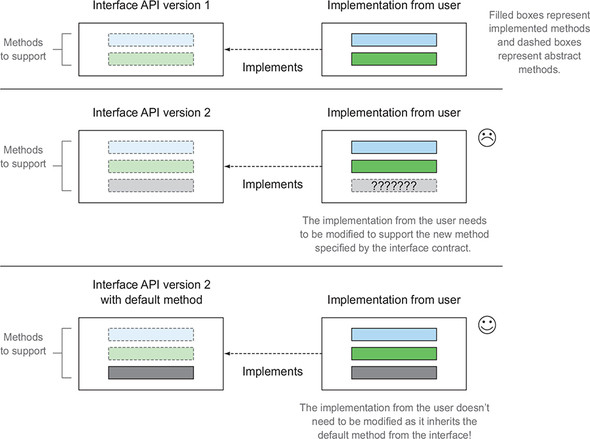
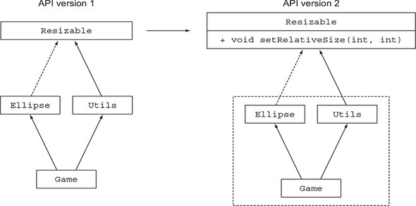
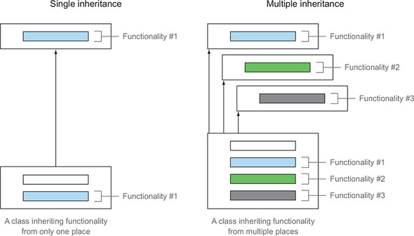
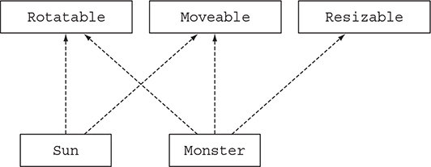
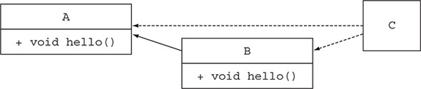
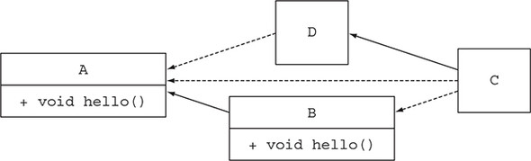
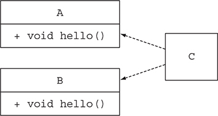
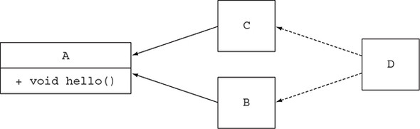

# 13강

[[toc]]

- 기존 인터페이스에 새로운 메소드가 추가가 되면, 해당 인터페이스를 사용하는 모든 곳에서 소스를 수정해줘야 한다.
- 이러한 문제를 해결하기 위해 나온게 디폴트 메소드

```java
default void sort(Comparator<? super E> c) {
    Collections.sort(this, c);
}
```

- 대표적인게 sort와 stream 같은 것
- 결국 이렇게 쓰면 인터페이스나 추상클래스나 다른점이 없어보이지만, 차이점은 존재한다. (후술)
- 인터페이스 디폴트 메소드 구현의 그림은 다음과 같다.



## 1. 변화하는 API
- 특정 라이브러리에 기능을 4개를 넣고나서, 추후에 기능을 추가해버리면, 해당 인터페이스를 구현한 모든 클래스들의 수정이 필요한 문제가 발생한다.
- 이런 문제의 해결이 필요하다.

### 1-1. API 버전 1
- Resizable 인터페이스를 구현해 본다.

```java
public interface Resizable extends Drawable {
    int getWidth();
    int getHeight();
    void setWidth();
    void setHeight();
    void setAbsoluteSize(int width, int height);
}
```

#### 사용자 구현
- 특정 사용자가 위의 라이브러리를 사용하게 되면 다음과 같이 사용한다.

```java
public class Ellipse implements Reiszable {
    ...
}
```

- 이제 이 사용자는 Resizable을 구현한 Ellipse를 사용해 게임을 만든다.

```java
public class Game {
    public static void main(String ...args) {
        List<Resizable> resizableShapes = Arrays.asList(new Square(), new Rectangle(), new Ellipse());
        Utils.paint(resizableShapes);
    }
}

public class Utils {
    public static void paint(List<Resizable> l) {
        l.forEach(r -> {
            r.setAbsoluteSize(42,42);
            r.draw();
        })
    }
}
```

### 1-2. API 버전 2
- 이러고나서 몇 개월 뒤에 Resizable을 구현하는 Square와 Rectangle 구현을 개선하는 요청을 받는다.
- 아래의 그림처럼 2버전을 만든다.



```java
public interface Resizable extends Drawable {
    int getWidth();
    int getHeight();
    void setWidth();
    void setHeight();
    void setAbsoluteSize(int width, int height);
    void setRelativeSize(int wFactor, int hFactor); // 새로추가
}
```

#### 사용자가 겪는 문제
- Resizable을 위에처럼 고쳐버리면, 
    - Resizable을 구현하는 모든 클래스는 setRelativeSize를 구현해야한다.
    - Ellipse를 포함하는 전체 어플리케이션을 재빌드 할 때 컴파일 에러가 발생한다.
- 이런식으로 공개된 API를 고치면 기존 버전과의 호환성이 문제가 된다.
- 이런 문제를 해결하는게 디폴트 메소드이다.

## 2. 디폴트 메소드란 무엇인가?
- 디폴트 메소드는 인터페이스에 구현되며, default라는 키워드로 시작하고, 다른 기본 메소드처럼 바디를 포함한다.

```java
public interface Sized {
    int size();
    default boolean isEmpty() {
        return size() == 0;
    }
}
```

- 이제 Sized를 구현하는 모든 클래스는 isEmpty()의 구현도 상속 받는다.
- 즉, 인터페이스에 디폴트 메소드를 추가하면 소스 호환성이 유지된다.
- 이제 위에 API예제로 돌아가서 setRelativeSize를 디폴트 메소드로 준다.

```java
default void setRelativeSize(int wFactor, int hFactor) {
    setAbsoluteSize(...);
}
```

- 다중상속이 되는건지, 디폴트 메소드를 오버라이딩 할 경우의 문제같은 경우는 뒤에서 정리해줌

:::tip
추상 클래스와 자바 8의 인터페이스

추상 클래스와 인터페이스는 뭐가 다를까? 둘 다 추상메서드와 바디를 포함하는 메서드를 정의할 수 있다.

첫째, 클래스는 하나의 추상 클래스만 상송받을 수 있지만 인터페이스를 여러 개 구현할 수 있다.

둘째, 추상 클래스는 인스턴스 변수(필드)로 공통 상태를 가질 수 있다. 하지만 인터페이스는 인스턴스 변수를 가질 수 없다.
:::

## 3. 디폴트 메소드 활용 패턴
### 3-1. 선택형 메소드
- 특정 인터페이스를 구현하는 클래스에서 메소드의 내용이 비어있는 경우가 많다. 
- 예를들어 Iterator의 remove 메소드는 많이 사용하지 않아, 빈 구현으로 놔두는 경우가 많았다.
- 이런 경우 디폴트 메소드를 사용하면 remove 같은 메소드를 굳이 빈 구현으로 놔둘 필요가 없어진다.
- 자바 8은 다음과 같은 remove 디폴트 메소드를 제공한다.

```java
interface Iterator<T> {
    boolean hasNext();
    T next();
    default void remove() {
        throw new UnsupportedOperationException();
    }
}
```

- 기본 구현이 제공되므로 Iterator를 구현하는 클래스들은 굳이 빈 remove 메소드를 구현할 필요가 없다.

### 3-2. 동작 다중 상속
- 디폴트 메소드를 사용하면 기존에는 불가능 했던 동작 다중 상속이 가능하다.



- 자바는 상속은 하나만 되지만 인터페이스 구현은 여러개가 가능하다.

```java
public class ArrayList<E> extends AbstractList<E>
    implements List<E>, RandomAccess, Cloneable,
               Serializable {
}
```

#### 다중 상속 형식
- 여기서 ArrayList는 한 개의 클래스를 상속받고, 여섯 개의 인터페이스를 구현한다.
- 결과적으로는 ArrayList는 AbstractList, RandomAccess, Cloneable, Serializable, Iterable, Collection의 서브 혀식이 된다.
- 따라서 디폴트 메소드를 사용하지 않아도 다중 상속을 활용할 수 있다.
- 자바 8에서는 인터페이스가 구현을 포함할 수 있으므로 클래스는 여러 인터페이스에서 동작을 상속받을 수 있다.

#### 기능이 중복되지 않는 최소의 인터페이스
- 구현할 게임에서 어떤 모양은 회전할 수 없지만 크기는 조절할 수 있고, 어떤 모양은 회전할 수 있지만 크기를 조절할 수 없다.
- 이런경우 최대한 기존 코드를 재사용해서 이 기능을 구현해보자

```java
public interface Rotatable {
    void setRotationAngle(int angleInDegrees);
    int getRotationAngle();
    default void rotateBy(int angleInDegrees){
        setRotationAngle((getRotationAngle () + angleInDegrees) % 360);
    }
}
```

- 위 인터페이스를 구현하는 클래스는 setRotationAngle과 setRotationAngle은 구현해야 하지만, rotateBy는 디폴트메소드가 있으므로 구현할 필요가 없다.
- 마찬가지로 Moveable과 Resizable을 구현한다.

```java
public interface Moveable {
    int getX();
    int getY();
    void setX(int x);
    void setY(int y);
    default void moveHorizontally(int distance){
        setX(getX() + distance);
    }
    default void moveVertically(int distance){
        setY(getY() + distance);
    }
}

public interface Resizable {
    int getWidth();
    int getHeight();
    void setWidth(int width);
    void setHeight(int height);
    void setAbsoluteSize(int width, int height);
    default void setRelativeSize(int wFactor, int hFactor){
        setAbsoluteSize(getWidth() / wFactor, getHeight() / hFactor);
    }
}
```

#### 인터페이스 조합
- 이제 이 인터페이스들을 조합해서 게임에 필요한 다양한 클래스를 구현할 수 있다.
- 예를 들어 움직일 수 있고, 회전할 수 있고, 크기를 조절할 수 있는 괴물을 구현할 수 있다.

```java
public class Monster implements Rotatable, Moveable, Resizable {
...
}
```

- 이제 저 몬스터 클래스는 rotateBy, moveHorizontally, moveVertically, setRelativeSize 구현을 상속받는다.
- 상속받은 메소드를 직접 호출이 가능하다.

```java
Monster m = new Monster();
m.rotateBy(180);
m.moveVertically(10);
```

- 이번엔 움직일 수 있고 회전도 되지만, 크기는 조절이 안되는 sun 클래스를 구현해 본다.
- 굳이 코드를 복붙할 필요 없이, 디폴트 메소드가 있으니까 재사용이 가능하다.

```java
public class Sun implements Moveable, Rotatable {
...
}
```

- UML로 보면 다음과 같다.



- 디폴트 메소드의 장점은, 만약 디폴트 메소드부분의 수정이 필요한경우에 해당 부분만 수정하면 구현을 하는 모든 클래스에서 자동 반영이 되는 점이 있다.

## 4. 해석 규칙
- 여러개의 인터페이스를 구현하는데, 똑같은 이름의 디폴트 메소드가 존재할 수 있다.
- 이런 상황에서는 어떤 인터페이스의 디폴트 메소드를 사용해야 할까?
- 아래는 그런 상황을 의도적으로 만든 코드이다.

```java
public interface A {
    default void hello() {
        System.out.println("Hello from A");
    }
}
public interface B extends A {
    default void hello() {
        System.out.println("Hello from B");
    }
}
public class C implements B, A {
    public static void main(String... args) {
        new C().hello(); // 뭐 호출하는지 모름
    }
}
```

### 4-1. 알아야 할 세 가지 해결 규칙
- 다른 클래스나 인터페이스로부터 같은 시그니처를 갖는 메소드를 상속받을 때는 세 가지 규칙을 따라야 한다.

```java
1. 클래스가 항상 이긴다. 클래스나 슈퍼클래스에서 정의한 메소드가 디폴트 메소드보다 우선권을 갖는다.

2. 1번 규칙 이외의 상황에서는 서브 인터페이스가 이긴다. 상속 관계를 갖는 인터페이스에서 같은 시그니처를 갖는 메소들르 정의할 때는 서브 인터페이스가 이긴다. 즉 B가 A를 상속받는다면, B가 A를 이긴다.

3. 여전히 디폴트 메소드의 우선순위가 결정되지 않았다면 여러 인터페이스를 상속받는 클래스가 명시적으로 디폴트 메소드를 오버라이드하고 호출해야 한다.
```

### 4-2. 디폴트 메소드를 제공하는 서브 인터페이스가 이긴다.


- 위의 그림에선 B가 A를 상속 받았으므로 컴파일러는 B의 hello를 선택한다.



```java
public class D implements A{ }
public class C extends D implements B, A {
    public static void main(String... args) {
        new C().hello();
    }
}
```

- 위의 그림에선 1번 규칙으로 메소드 구현이 이기므로 D를 찾는데, 따로 오버라이드를 하지 않고 A를 구현만 해놨다.
- 따라서 D는 인터페이스 A의 디폴트 메소드 구현을 상속바든다.
- 2번 규칙에서 클래스나 슈퍼클래스에 메소드 정의가 없으면 디폴트 메소드를 정의하는 서브 인터페이스가 선택되므로, A를 상속받는 B의 hello가 출력된다.

### 4-3. 충돌 그리고 명시적인 문제 해결
- 이번엔 충돌 상황이다.

```java
public interface A {
    default void hello() {
        System.out.println("Hello from A");
    }
}
public interface B {
    default void hello() {
        System.out.println("Hello from B");
    }
}
public class C implements B, A { }
```



- 두 인터페이스간에 상속 관계가 없어서 어떤 메소드를 호출해야 할 지 몰라 에러가 발생한다.

#### 충돌 해결
- 이런식으로 둘다 선택할 수 없으면 사용자가 C에서 직접 메소드를 명시적으로 선택해 줘야한다.
- super 키워드를 사용한다.

```java
public class C implements B, A {
    void hello(){
        B.super.hello();
    }
}
```

### 4-4. 다이아몬드 문제
- 마지막 시나리오는 다음과 같다.

```java
public interface A{
    default void hello(){
        System.out.println("Hello from A");
    }
}
public interface B extends A { }
public interface C extends A { }
public class D implements B, C {
    public static void main(String... args) {
        new D().hello();
    }
}
```



- 이런 모양을 다이아몬드 문제라고 부른다.
- 위에선 실제로 A만 구현되었으므로 출력은 Hello from A가 된다.
- 만약 B에도 디폴트메소드 hello가 구현되어있으면 어떻게 될까?
- 2번 규칙으로 B의 hello가 호출된다.
- B와 C 들다 디폴트 메소드가 구현되어있으면, 3번규칙으로 직접 선택해 주어야 한다.
- 만약 C에 추상 메소드가 있으면?

```java
public interface C extends A {
    void hello();
}
```

- C는 A를 상속받으므로, C의 추상메소드가 1순위가 되어서 에러가 발생한다.
- 즉 직접 선택해 주어야 한다.

## 5. 마치며
- 자바 8의 인터페이스는 구현 코드를 포함하는 디폴트 메소드, 정적 메소드를 정의할 수 있다.
- 디폴트 메소드의 정의는 default 키워드로 시작하며 일반 클래스 메소드처럼 바디를 갖는다.
- 선택형 메소드와 동작 다중 상속에도 디폴트 메소드를 사용할 수 있다.
- 클래스가 같은 시그니처를 갖는 여러 디폴트 메소드를 상속하면서 생기는 충돌 문제를 해결하는 규칙이 있다.
- 클래스나 슈퍼클래스에 정의된 메소드가 다른 디폴트 메소드 정의보다 우선한다. 이 외의 상황에서는 서브인터페이스에서 제공하는 디폴트 메소드가 선택된다.
- 두 메소드의 시그니처가 같고, 상속관계로도 충돌 문제를 해결할 수 없을 때는 디폴트 메소드를 사용하는 클래스에서 메소드를 오버라이드해서 어떤 디폴트 메소드를 호출할지 명시적으로 결정해야 한다.