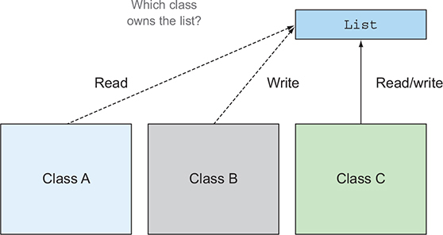
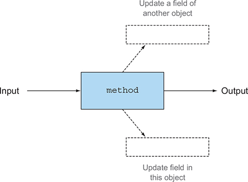
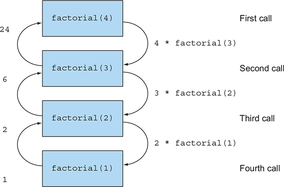

# 18강

[[toc]]

## 1. 시스템 구현과 유지보수
- 프로그래머가 유지보수중 코드 디버깅 문제를 가장 많이 겪게 된다.
- 함수형 프로그래밍이 제공하는 부작용 없음(no-side-effect)과 불변성(immutability)이라는 개념은 이 문제를 해결하는데 도움을 준다.

### 1-1. 공유된 가변 데이터
- 변수가 예상하지 못한 값을 갖는 이유는 결국 우리가 유지보수하는 시스템의 여러 메소드에서 공유된 가변 데이터 구조를 읽고 갱신하기 때문이다.
- 예를들어 특정 리스트를 여기저기서 참조하면, 리스트의 소유자는 어느 클래스일까?
- 하나가 갱신하게되면? 모두가 바뀌는 불행한 일이 생긴다.
- 이런식으로 공유 가변데이터 구조를 사용하면 프로그램 전체에서 데이터 갱신 사실을 추적하기가 매우 어려워진다.



- 이런식으로 예상하지 못하게 자료구조의 값이 바뀔 일이 없으면 아주 편리할 것이다.
- 자신을 포함한 클래스의 상태 그리고 다른 객체의 상태를 바꾸지 않으며 return문을 통해서만 자신의 결과를 반환하는 메소드를 순수메소드 또는 부작용 없는 메소드라고 부른다.
- 구체적으로 부작용은, 함수 내에 포함되지 못한 기능을 말한다.
    - 자료구조를 고치거나 필드에 값을 할당(sertter 메소드 같은 생성자 이외의 초기화 동작)
    - 예외 발생
    - 파일에 쓰기 등의 I/O 동작 수행
- 불변 객체를 이용해 부작용을 없애 버릴 수도 있다. (final 말하는듯)

### 1-2. 선언형 프로그래밍
- 프로그램으로 시스템을 구현하는 방식은 크게 두가지가 있다.
    - `어떻게`에 집주하는 프로그래밍 -> 고전의 객체지향 프로그래밍에서 이용
    - 할당,조건문,분기문,루프 등 명령어가 컴퓨터의 저수준 언어와 비슷하다.

```java
Transaction mostExpensive = transactions.get(0);
if(mostExpensive == null)
    throw new IllegalArgumentException("Empty list of transactions");
for(Transaction t: transactions.subList(1, transactions.size())){
    if(t.getValue() > mostExpensive.getValue()){
        mostExpensive = t;
    }
}
```

- 두번째 방법은
    - `무엇을`에 집중하는 방식
    - 4,5장에서 배운 스트림 API를 사용해 질의를 만든다.

```java
Optional<Transaction> mostExpensive =
    transactions.stream()
                .max(comparing(Transaction::getValue));
```

- 질의문 구현 방법은 라이브러리가 정하게 되는데, 이러한 구현 방식을 `내부 반복`이라고 한다.
- 위에서 `무엇을`로 접근하는 방식을 선언형 프로그래밍이라고 부른다. (책 번역 오류... 미친듯)
- 선언형 프로그래밍은 우리가 원하는 것이 무엇이고 시스템이 어떻게 그 목표를 달성할 것인지 등의 규칙을 정한다.
- 문제 자체가 코드로 명확하게 드러나는 점이 선언형 프로그래밍의 장점이다.

### 1-3. 왜 함수형 프로그래밍인가?
- 함수형 프로그래밍은 선언형 프로그래밍을 따르는 대표적인 방식으로, 부작용이 없는 계산을 지향한다.

## 2. 함수형 프로그래밍이란 무엇인가?
- int와 double을 인수로 받아서 double을 반환하는 메소드가 있는데 이 메소드는 아래처럼 자신이 호출된 횟수로 가변 변수를 갱신하는 부작용이 포함되어 있다.



- 함수형 프로그래밍에서 `함수`란 수학적인 함수와 같다.
- 즉, 함수는 0개 이상의 인수를 가지며, 한 개 이상의 결과를 반환하지만 `부작용이 없어야한다.`
- 아래처럼 여러 입력을 받아 여러 출력을 생성하는 블랙박스와 같다.


- 자바에선 이런식으로 수학적인 함수냐, 아니냐에 따라 메소드냐 함수냐로 나눠진다. (log sin같은 수학적 함수는 절대로 부작용이 없다..!)
- 특히 인수가 같다면 수학적 함수를 반복적으로 호출해도 값은 절대로 변하지 않는다.
- 즉 `함수형`이라는 말은 수학의 함수처럼 부작용이 없는것을 의미한다.
- 그렇다면 함수형 프로그래밍은 수학마냥 if-then-else만 써야되나?
- 당연히 아니고, 내부적으로는 부작용이 발생하지만 호출자가 이걸 알 수 없다면 실제로 부작용이 없다고 판단하고, 상관이 없다.
- 결과적으로 `시스템의 다른 부분에 영향을 미치지 않는다면 내부적으로는 함수형이 아닌 기능도 사용`하는 방식을 함수형 프로그래밍이라고 부른다.

### 2-1. 함수형 자바
- 실질적으로 자바는 완벽한 순수 함수형 프로그래밍을 구현하기가 어렵다.
- 자바에서는 순수 함수형이 아니라 `함수형 프로그램`을 구현한다.
- 실제로 부작용이 있을 수 있지만, 아무도 이를 보지 못하게 함으로써 함수형을 달성한다.
- 특정 값을 바꾸는데, 다른 스레드에서 접근하는등의 동시성 문제가 발생하면 해당 메소드는 함수가 아니게 된다.
- 이런 문제가 발생하지 않기 위해 메소드의 바디를 잠궈야 하고, 그런 메소드를 함수라고 부를 수 있다.
- 하지만 이런식으로 문제를 해결하면 멀티코어를 활용 못하는 문제가 발생하고, 병렬 호출이 안돼서 프로그램의 실행속도가 느려지는 문제가 발생한다.
- 함수나 메소드는 지역변수만을 변경해야 함수형이라고 부를 수 있다.
- 그리고 함수나 메소드에서 참조하는 객체가 있다면 그 객체는 불변 객체여야 한다.
- 즉 객체의 모든 필드가 final이어야 한다는 소리
- 또다른 함수형의 조건으로는, 함수나 메소드가 `어떠한 예외도 일으키지 않아야`한다는 점이다.
- 예외가 발생하면 return으로 결과가 반환되지 않으므로, 문제가 생긴다.
- 하지만 0으로 나누는 것과 같은 경우에는 어쩔수 없이 예외가 발생해야 될 수 있다.
- 그래서 아래의 그림처럼 예외가 추가되어 나타내기도한다.


- 하지만 꼬라지가 보기 싫으니, `Optional`을 사용하면 문제가 좀더 깔끔해진다.
- 모든 변수를 Optional로 고치면 매우 귀찮으니, 지역적으로만 사용하도록 해주면 된다.
- 마지막으로 함수형에서는 비함수형 동작을 감출 수 있는 상황에서만 부작용을 포함하는 라이브러리 함수를 사용해야 한다. 
- 예를 들어 자료구조를 복사해서 쓴다던가 발생할수 있는 예제를 적절하게 내부적으로 처리함으로써 자료구조의 변경을 호출자가 알 수 없도록 감춰야 한다는 소리

### 2-2. 참조 투명성
- '부작용을 감춰야한다' 라는 제약은 `참조 투명성` 개념으로 귀결된다. 즉, 같은 인수로 함수를 호출했을 때 항상 같은 결과를 반환한다면 참조적으로 투명한 함수라고 표현한다.
- 예를들어 "ted".replace('t',"T")라는 코드는 항상 같은 결과를 내뱉으므로 String.replace는 참조적으로 투명하다 (String.replace는 this객체 갱신이 아닌, 소문자를 대문자로 바꾼 `새로운` String을 리턴한다.)
- 즉 여러번 말하지만 함수는 어떤 입력이 주어졌을 때 언제, 어디서 호추하든 같은 결과를 생성해야 한다.
- 다시말해 Random.nextInt같이 매번 다른결과를 내뱉는건 함수형이 아니란 소리
- 참조 투명성은 비싸거나 오랜 시간이 걸리는 연산을 `기억화` 또는 `캐싱`을 통해 다시 계산하지 않고 저장하는 최적화 기능도 제공한다.
- 참조 투명성의 한가지 문제점으로는, 예를들어 return을 list로 하면, 내용물은 같지만 실제로 반환되는 객체들은 매번 새로 메모리에 할당된 애들이어서 실제론 다르다.
- 하지만 내용물자체는 같으니, 함수형 코드에서는 이런경우를 걍 참조 투명하다고 간주한다.

### 2-3. 객체지향 프로그래밍과 함수형 프로그래밍
- 실제 자바 8은 함수형 프로그래밍을 익스트림 객체지향 프로그래밍으로 간주한다.
- 실제로 자바 프로그래머는 두 가지 프로그래밍 형식을 혼함해 사용한다.

### 2-4. 함수형 실전 연습
- 간단한 예제로 {1,4,9} 처럼 List<Integer>가 주어졌을 때 이것의 모든 서브집합의 멤보로 구성된 List<List<Integer>>를 만드는 프로그램을 만든다고 가정한다.
- {1}, {1,4}, {}, {1,4,9}.. 등등
- 1을 포함하는 집합과, 아닌 집합 으로 구분해서 문제를 풀면 가장 쉽고 자연스로운 함수형 자바프로그램이다.

```java
static List<List<Integer>> subsets(List<Integer> list) {
    if (list.isEmpty()) {
        List<List<Integer>> ans = new ArrayList<>();
        ans.add(Collections.emptyList());
        return ans;
    }
    Integer fst = list.get(0);
    List<Integer> rest = list.subList(1,list.size());
    List<List<Integer>> subAns = subsets(rest);
    List<List<Integer>> subAns2 = insertAll(fst, subAns);
    return concat(subAns, subAns2);
}
```

- insertAll 함수

```java
static List<List<Integer>> insertAll(Integer fst,
                                     List<List<Integer>> lists) {
    List<List<Integer>> result = new ArrayList<>();
    for (List<Integer> list : lists) {
        List<Integer> copyList = new ArrayList<>();
        copyList.add(fst);
        copyList.addAll(list);
        result.add(copyList);
    }
    return result;
}
```

- concat

```java
static List<List<Integer>> concat(List<List<Integer>> a,
                                  List<List<Integer>> b) {
    List<List<Integer>> r = new ArrayList<>(a);
    r.addAll(b);
    return r;
}
```

## 3. 재귀와 반복
- 순수 함수형 프로그래밍 언어에서는 while, for 같은 반복문을 포함하지 않는다.
- 이러한 반복문 때문에 변화가 자연스럽게 코드에 스며들 수 있기 때문에 안씀.
- 함수형에서는 다른 누군가가 변화를 알아차리지 못하면 아무 상관이 없다.
- 즉, 지역변수는 맘껏 바꿔도 되는데, Iterator로 for문을 구현한걸 봐보자

```java
Iterator<Apple> it = apples.iterator();
while (it.hasNext()) {
   Apple apple = it.next();
   // ...
}
```

- 호출자는 변화를 모르니 문제가 없다.
- 하지만 내부에서 인수를 변화하거나, 영향을 받으면 문제가 생긴다.

```java
public void searchForGold(List<String> l, Stats stats){
    for(String s: l){
        if("gold".equals(s)){
            stats.incrementFor("gold");
        }
    }
}
```

- stats가 변해서 문제가 생길 수 있다.
- 이런 문제를 해결하는 방법으로는, 재귀를 쓰는거다.
- 재귀를 사용하면 변화가 일어나지 않는다.
- 아래의 팩토리얼을 반복과 재귀로 표현한걸 봐보자

```java
static long factorialIterative(long n) {
    long r = 1;
    for (int i = 1; i <= n; i++) {
        r *= i;
    }
    return r;
}
```

```java
static long factorialRecursive(long n) {
    return n == 1 ? 1 : n * factorialRecursive(n-1);
}
```

- 반복방식은 매번 r과 i가 갱신된다.
- 재귀 방식은 좀 더 수학적인 형식이다.
- 이걸 스트림으로 좀더 단순하게 표현해볼 수 있다.

```java
static long factorialStreams(long n){
    return LongStream.rangeClosed(1, n)
                     .reduce(1, (long a, long b) -> a * b);
}
```

- 효율적인 부분을 보면, 보통 반복보다 재귀가 코스트가 더 크다.
- 매번 호출할대마다 스택이 쌓여 메모리를 많이 쳐먹게 된다.
- 이런 문제를 해결하기 위해 `꼬리 호출 최적화(tail-call optimization)`라는 해결책이 있다.

```java
static long factorialTailRecursive(long n) {
    return factorialHelper(1, n);
}
static long factorialHelper(long acc, long n) {
    return n == 1 ? acc : factorialHelper(acc * n, n-1);
}
```

- 요렇게하면, 중간 결과를 각각의 스택프레임으로 저장해야 하는 일반 재귀와 달리 꼬리 재귀에서는 컴파일러가 하나의 스택 프레임을 재활용할 가능성이 생긴다.




- 자바는 이런 최적화는 제공을 안하는데, 스칼라나 그루비같은 최신 JVM언어는 최적화를 제공한다.

<br/>

- 자바 8은 결론적으로 반복을 스트림으로 대체해서 변화를 피할 수 있다.
- 또한 반복을 재귀로 바꾸면 더 간결하고, 부작용이 없는 알고리즘을 만들 수 있다.
- 실제로 재귀를 이용하면 좀 더 쉽게 읽고, 쓰고, 이해할 수 있는 예제를 만들 수 있다.
- 또한 약간의 실행시간보단 프로그래머의 효율성이 더 중요할 때도 많다.

## 4. 마치며
- 공우된 가변 자료구조를 줄이는 것은 장기적으로 프로그램을 유지보수하고 디버깅하는데 도움이 된다.
- 함수형 프로그래밍은 부작용이 없는 메소드와 선언형 프로그래밍 방식을 지향한다.
- 함수형 메소드는 입력 인수와 출력 결과만을 갖는다.
- 같은 인수값으로 함수를 호출했을 때 항상 같은 값을 반환하면 참조 투명성을 갖는 함수다. while 루프 같은 반복문은 재귀로 대체할 수 있다.
- 자바에서는 고전 방식의 재귀보다는 꼬리 재귀를 사용해야 추가적인 컴파일러 최적화가 가능하다.