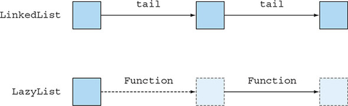

# 19강 

[[toc]]

## 1. 함수는 모든 곳에 존재한다.
- 앞에서 본 것 처럼 함수는 부작용이 없이 동작하는 것을 의미한다.
- 함수라는 용어를 좀더 폭넓게 사용해, 함수를 마치 일반값처럼 사용해서 인수로 전달하거나, 결과로 반환받거나 할 수있다.
- 이렇게 일반값처럼 취급할 수 있는 함수를 `일급 함수`라고 한다.
- 자바 8이 바뀐부분 중 하나가 이런 일급함수를 지원한다는 점이다.
- ::처럼 메소드 참조를 만들거나, 람다식의 사용이 가능하다.

### 1-1. 고차원 함수
- 함숫값을 자바8 스트림처리나, 메소드 참조를 사용해 동적파라미터화를 하는 용도로만 썼다.
- 아래 그림처럼 함수를 인수로 받아 다른 함수로 반환하는 정적메소드 Comparator.comparing같은 것도 있었다.


```java
Comparator<Apple> c = comparing(Apple::getWeight);
```

- 3장에서는 함수를 조립해서 연산 파이프라인을 만들 때 위 코드와 비슷한 기능을 활용했다.

```java
Function<String, String> transformationPipeline
  = addHeader.andThen(Letter::checkSpelling)
             .andThen(Letter::addFooter);
```

- Comparator.comapring처럼 다음 중 하나 이상의 동작을 수행하는 함수를 `고차원 함수`라 부른다.
    - 하나 이상의 함수를 인수로 받음
    - 함수를 결과로 반환

- 자바 8은 함수를 인수로 받기도하고 결과로도 반환하고, 지역 변수로도 할당하거나, 구조체로 삽입할 수 있어서 자바8의 함수도 고차원 함수라고 할 수 있다.

### 1-2. 커링
- 대부분의 어플리케이션은 국제화를 지원해야 하는데, 이때 단위 변환 문제가 발생할 수 있다.
- 보통 `변환 요소`와 `기준치 조정 요소`가 단위 변환 결과를 좌우한다.
- 예를들어 CtoF(x) = x*9/5 + 32 처럼 섭씨 to 화씨
- 다음과 같은 패턴으로 단위를 표현할 수 있다.
    - 변환 요소를 곱함
    - 기준치 조정 요소를 적용
- 아래와 같이 메소드로 표현해보면

```java
static double converter(double x, double f, double b) {
    return x * f + b;
}
```

- x는 변환하려는 값, f는 변환 요소, b는 기준치 보정 요소이다.
- 온도말고 km같은 거리 단위 변환이 필요할 수도 있으므로, 세 개의 인수를 받는 converter라는 메소드를 만들어 문제를 해결할 수 있다.
- 하지만 이런 방법은 인수에 변환 요소와 기준치를 넣어주는 귀찮은 일이고, 오타가 발생할 수 있다.
- 기존 로직을 활용해서 변환기를 특정 상호아에 적용할 수 있는 방법이 있는데, `커링`이라는 개념을 사용해 한 개의 인수를 갖는 변환 함수를 생산하는 팩토리를 정의하는거다.

```java
static DoubleUnaryOperator curriedConverter(double f, double b) {
    return (double x) -> x * f + b;
}
```

- 원래처럼 매번 새로운 값을 넣어 주는게 아닌, 위의 curriedConverter를 사용해 변환기 메소드를 정의해 주는 것이다.

```java
DoubleUnaryOperator convertCtoF = curriedConverter(9.0/5, 32);
DoubleUnaryOperator convertUSDtoGBP = curriedConverter(0.6, 0);
DoubleUnaryOperator convertKmtoMi = curriedConverter(0.6214, 0);
```

- DoubleUnaryOperator는 applyAsDouble이라는 메소드를 정의하므로, 이런식으로 사용이 가능하다.

```java
double gbp = convertUSDtoGBP.applyAsDouble(1000);
```

- 이런식으로 기존 변환 로직을 재활용하는 유연한 코드를 짤 수 있다.

:::tip
커링의 이론적 정의

커링은 x와 y라는 두 인수를 받는 함수 f를 한 개의 인수를 받는 g라는 함수로 대체하는 기법. g라는 함수 역시 하나의 인수를 받는 함수를 반환한다. 함수 g와 원래 함수 f가 최정적으로 반환하는 값은 같다. 수학적으로 f(x,y) = (g(x))(y) 인셈
:::

## 2. 영속 자료구조
- 함수형 프로그램에서는 자료구조를 함수형 자료구조, 불변 자료구조 등의 용어로도 사용하긴 하지만 보통은 영속 자료구조라고 부른다.
- 함수형 메소드에서는 전역 자료구조나 인수로 전달된 구조를 갱신할 수 없다. -> 당연히 값이 바뀔테니까..

### 2-1. 파괴적인 갱신과 함수형
- A에서 B까지 기차여행을 의미하는 가변 TrainJourney 클래스

```java
class TrainJourney {
    public int price;
    public TrainJourney onward;
    public TrainJourney(int p, TrainJourney t) {
        price = p;
        onward = t;
    }
}
```

- 이때 X에서 Y까지, 그리고 Y에서 Z까지의 여행을 나타내는 별도의 TrainJourney 객체가 있다고 가정한다.
- 이 두 개의 TrainJourney객체를 연결해 하나의 여행을 만들 수 있다.
- X -> Y -> Z
- 단순 명령형 메소드면 이런식으로 이으면 된다.

```java
static TrainJourney link(TrainJourney a, TrainJourney b){
    if (a==null) return b;
    TrainJourney t = a;
    while(t.onward != null){
        t = t.onward;
    }
    t.onward = b;
    return a;
}
```

- 위의 결합은, 문제가 link(first, second)를 하면, first를 변경시키게 돼서 X에서 Y로의 여정이 아닌 X에서 Z로의 여정을 의미하게 된다.
- 이런걸 파괴적인 갱신 (first가 변경됨)이라고 한다.
- 함수형에서는 이 같은 부작용을 수반하는 메소드를 제한하는 방식으로 문제를 해결한다.
- 계산 결과를 표현할 자료구조가 필요하면 기존 자료구조를 쓰는게 아닌, 새로운 자료구조를 만들어 사용한다.
- 이는 표준 객체지향 프로그래밍의 관점에서도 좋은 기법이다.
- 함수형을 따르지 않는 프로그램은 주석 따윌 남겨서 덕지덕지 되므로 깔끔한 함수형 해결 방버을 사용하자.

```java
static TrainJourney append(TrainJourney a, TrainJourney b){
    return a==null ? b : new TrainJourney(a.price, append(a.onward, b));
}
```

- 기존 자료구조를 변경하지 않는다.


### 2-2. 트리를 사용한 다른 예제
- HashMap 같은 인터페이스를 구현할 때는 이진 탐색 트리가 사용된다.

```java
class Tree {
   private String key;
   private int val;
   private Tree left, right;
   public Tree(String k, int v, Tree l, Tree r) {
     key = k; val = v; left = l; right = r;
   }
}
class TreeProcessor {
    public static int lookup(String k, int defaultval, Tree t) {
        if (t == null) return defaultval;
        if (k.equals(t.key)) return t.val;
        return lookup(k, defaultval,
                         k.compareTo(t.key) < 0 ? t.left : t.right);
    }
    // other methods processing a Tree
}
```

- 이제 값갱신 코드

```java
public static void update(String k, int newval, Tree t) {
    if (t == null) { /* should add a new node */ }
    else if (k.equals(t.key)) t.val = newval;
    else update(k, newval, k.compareTo(t.key) < 0 ? t.left : t.right);
}
```

- update의 가장 쉬운 방법은 메소드가 탐색한 트리를 그대로 반환하는 것이다.
- 하지만 이렇게 되면 기존 트리가 변경될 수 있다.

```java
public static Tree update(String k, int newval, Tree t) {
    if (t == null)
       t = new Tree(k, newval, null, null);
    else if (k.equals(t.key))
       t.val = newval;
    else if (k.compareTo(t.key) < 0)
       t.left = update(k, newval, t.left);
    else
       t.right = update(k, newval, t.right);
    return t;
}
```

### 2-3. 함수형 접근법 사용
- 이 문제를 함수형으로 처리해 본다.
- 매번 새로운 노드들을 만들어준다.

```java
public static Tree fupdate(String k, int newval, Tree t) {
     return (t == null) ?
         new Tree(k, newval, null, null) :
          k.equals(t.key) ?
            new Tree(k, newval, t.left, t.right) :
       k.compareTo(t.key) < 0 ?
         new Tree(t.key, t.val, fupdate(k,newval, t.left), t.right) :
         new Tree(t.key, t.val, t.left, fupdate(k,newval, t.right));
}
```

- fupadte를 호출하면 매번 새로운 트리를 뱉어서 던져준다.
- 이와 같은 함수형 자료구조를 `영속`(저장된 값이 다른 누군가에 의해 영향을 받지 않는 상태)라고 하며 따라서 프로그래머는 fupdate가 인수로 전달된 자료구조를 변화시키지 않는걸 알 수 있다.
- 다만 여기서 주의할 점은, 결과 자료구조를 바꾸면 안된다는 것이다. (생까고 키에 값을 넣는거 말하는듯) 그럴 경우 의도치 않는 갱신이 발생할 수 있다.


## 3. 스트림과 게으른 평가
- 스트림은 단 한번만 소비할 수 있는 제약이 있어 스트림은 재귀적으로 정의할 수 없다.
- 이런 제약으로 어떤 문제가 발생하는지 보자

### 3-1. 자기 정의 스트림
- 소수를 생성하는 예제로 스트림을 살펴본다.

```java
public static Stream<Integer> primes(int n) {
    return Stream.iterate(2, i -> i + 1)
                 .filter(MyMathUtils::isPrime)
                 .limit(n);
}
public static boolean isPrime(int candidate) {
    int candidateRoot = (int) Math.sqrt((double) candidate);
    return IntStream.rangeClosed(2, candidateRoot)
                    .noneMatch(i -> candidate % i == 0);
}
```

- 매번 candidate 수로 정확히 나눠지는지 매번 모든 수를 반복 확인해 깔끔하진 않은 코드이다.
- 이론적으로 소수로 나눌 수 있는 모든 수는 제외할 수 있다.

```java
1. 소수를 선택할 숫자 스트림이 필요하다.
2. 스트림에서 첫 번째 수 (스트림의 머리)를 가져온다. 이 숫자는 소수다.(2)
3. 이제 스트림의 꼬리에서 가져온 수로 나누어 떨어지는 모든 수를 걸러 제외시킨다.
4. 이렇게 남은 숫자만 포함하는 새로운 스트림에서 소수를 찾는다. 이제 1번부터 다시 이과정 반복 따라서 재귀.
```

- 위의 알고리즘은 부족한 알고리즘이다.

#### 1단계: 스트림 숫자 얻기
- InputStream.iterate 메소드를 이용하면 2에서 시작하는 무한 숫자 스트림 생성이 가능하다.

```java
static Intstream numbers(){
    return IntStream.iterate(2, n -> n + 1);
}
```

#### 2단계: 헤드 획득
```java
static int head(IntStream numbers){
    return numbers.findFirst().getAsInt();
}
```

#### 3단계: 꼬리 필터링

```java
static IntStream tail(IntStream numbers){
    return numbers.skip(1);
}
```

```java
IntStream numbers = numbers();
int head = head(numbers);
IntStream filtered = tail(numbers).filter(n -> n % head != 0);
```

#### 4단계: 재귀적으로 소수 스트림 생성
- 반복적으로 머리를 얻어 스트림을 필터링하려 할 수 있다.

```java
static IntStream primes(IntStream numbers) {
    int head = head(numbers);
    return IntStream.concat(
             IntStream.of(head),
             primes(tail(numbers).filter(n -> n % head != 0))
           );
}
```

#### 나쁜 소식
- 근데 이렇게 돌리면 "stream has already been operatied upon or closed" 에러가 발생한다.
- 머리와 꼬리로 분리하는 두 개의 최종연산 findFirst와 skip을 사용해서 두번 소비를 하게 돼 에러가 발생하는 것

#### 게으른 평가
- 더 심각한건 IntStream.concat은 두 개의 스트림 인스턴스를 인수로 받게되어, 두 번째 인수가 primes를 직접 재귀적으로 호출하면서 무한 재귀에 빠진다.
- 이런걸 해결하기 위해 concat의 두 번째 인수에서 primes를 게으르게 평가하는 방식으로 해결이 가능하다.

### 3-2. 게으른 리스트 만들기
- 스트림은 스트림에 최정연산을 적용해서 실제 계산을 할 때 실제 연산이 이루어 진다.
- 여기선 비슷한 개념인 게으른 리스트를 알아본다.
- 게으른 리스트는 고차원 함수라는 개념도 지원한다.



- LinkedList의 요소는 메모리에 존재하지만, LazyList의 요소는 Function이 요청해야 생성된다.

#### 기본적인 연결 리스트
```java
interface MyList<T> {
    T head();
    MyList<T> tail();
    default boolean isEmpty() {
        return true;
    }
}
class MyLinkedList<T> implements MyList<T> {
    private final T head;
    private final MyList<T> tail;
    public MyLinkedList(T head, MyList<T> tail) {
        this.head = head;
        this.tail = tail;
    }
    public T head() {
        return head;
    }
    public MyList<T> tail() {
        return tail;
    }
    public boolean isEmpty() {
        return false;
    }
}
class Empty<T> implements MyList<T> {
    public T head() {
        throw new UnsupportedOperationException();
    }
    public MyList<T> tail() {
        throw new UnsupportedOperationException();
    }
}
```

- 값을 만들 땐 다음과 같이 만든다.

```java
MyList<Integer> l =
    new MyLinkedList<>(5, new MyLinkedList<>(10, new Empty<>()));
```

#### 기본적인 게으른 리스트
- Supplier<T>를 이용해 게으른 리스트를 만들면 꼬리가 모두 메모리에 존재하지 않게 할 수 있다.

```java
import java.util.function.Supplier;
class LazyList<T> implements MyList<T>{
    final T head;
    final Supplier<MyList<T>> tail;
    public LazyList(T head, Supplier<MyList<T>> tail) {
        this.head = head;
        this.tail = tail;
    }
    public T head() {
        return head;
    }
    public MyList<T> tail() {
        return tail.get();
    }
    public boolean isEmpty() {
        return false;
    }
}
```

- 이제 Supplier의 get메소드를 호출하면 팩토리로 새로운 객체 만들듯이 LazyList의 노드가 만들어진다.
- 연속적인 숫자의 다음 요소를 만드는 LazyList의 생성자에 tail 인수로 Supplier를 전달하는 방식으로 무한히 게으른 리스트 생성이 가능하다.

```java
public static LazyList<Integer> from(int n) {
    return new LazyList<Integer>(n, () -> from(n+1));
}
```

#### 소수 생성으로 돌아와서
- 기존 코드에서 LazyList를 적용해 준다.

```java
public static MyList<Integer> primes(MyList<Integer> numbers) {
    return new LazyList<>(
                 numbers.head(),
                 () -> primes(
                         numbers.tail()
                                .filter(n -> n % numbers.head() != 0)
                             )
    );
}
```

#### 게으른 필터 구현
- LazyList는 당연히 filter메소드를 정의하지 않으므로, 컴파일 에러가 발생한다. 이걸 해결해본다.

```java
public MyList<T> filter(Predicate<T> p) {
    return isEmpty() ?
           this :
           p.test(head()) ?
               new LazyList<>(head(), () -> tail().filter(p)) :
               tail().filter(p);
}
```

- 실제 사용 코드

```java
LazyList<Integer> numbers = from(2);
int two = primes(numbers).head();
int three = primes(numbers).tail().head();
int five = primes(numbers).tail().tail().head();
System.out.println(two + " " + three + " " + five);
```

- 이제 재귀적으로 문제 해결이 가능하다.

```java
static <T> void printAll(MyList<T> list){
    while (!list.isEmpty()){
        System.out.println(list.head());
        list = list.tail();
    }
}
printAll(primes(from(2)));
```

- 물론 무한히 실행되지 않고 스택오버플로우가 발생한다.

## 4. 패턴 매칭

### 4-1. 방문자 디자인 패턴
- 특정 데이터 형식을 '방문'하는 알고리즘을 캡슐화하는 클래스를 따로 만들 수 있다.
- 방무자 클래스는 지정된 데이터 형식의 인스턴스를 입력으로 받는다.
- 그리고 인스턴스의 모든 멤버에 접근한다.

```java
class BinOp extends Expr{
    ...
    public Expr accept(SimplifyExprVisitor v){
        return v.visit(this);
    }
}
```

- SimplifyExprVisitor는 BinOp 객체를 언랩할 수 있다.

```java
public class SimplifyExprVisitor {
    ...
    public Expr visit(BinOp e){
        if("+".equals(e.opname) && e.right instanceof Number && ...){
            return e.left;
        }
        return e;
    }
}
```

#### 자바의 패턴매칭 흉내내기
```java
interface TriFunction<S, T, U, R>{
    R apply(S s, T t, U u);
}
static <T> T patternMatchExpr(
                       Expr e,
                       TriFunction<String, Expr, Expr, T> binopcase,
                       Function<Integer, T> numcase,
                       Supplier<T> defaultcase) {
    return
     (e instanceof BinOp) ?
        binopcase.apply(((BinOp)e).opname, ((BinOp)e).left,
                                           ((BinOp)e).right) :
     (e instanceof Number) ?
        numcase.apply(((Number)e).val) :
        defaultcase.get();
}
```

```java
public static Expr simplify(Expr e) {
    TriFunction<String, Expr, Expr, Expr> binopcase =
        (opname, left, right) -> {
            if ("+".equals(opname)) {
                if (left instanceof Number && ((Number) left).val == 0) {
                    return right;
                }
                if (right instanceof Number && ((Number) right).val == 0) {
                    return left;
                }
            }
            if ("*".equals(opname)) {
                if (left instanceof Number && ((Number) left).val == 1) {
                    return right;
                }
                if (right instanceof Number && ((Number) right).val == 1) {
                    return left;
                }
            }
            return new BinOp(opname, left, right);
        };
    Function<Integer, Expr> numcase = val -> new Number(val);
    Supplier<Expr> defaultcase = () -> new Number(0);
    return patternMatchExpr(e, binopcase, numcase, defaultcase);
```

```java
Expr e = new BinOp("+", new Number(5), new Number(0));
Expr match = simplify(e);
System.out.println(match);
```