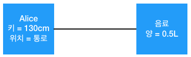
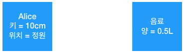
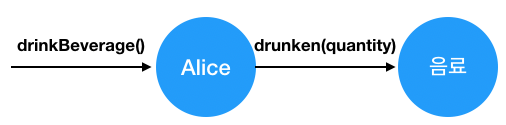

# 2강

[[toc]]

## 객체지향과 인지 능력
- 객체란 인간이 분명하게 인지하고 구별할 수 있는 물리적인 또는 개념적인 경계를 지닌 어떤 것
- 객체지향 패러다임의 목적은 현실 세계를 모방하는 것이 아니라 현실 세계를 기반으로 새로운 세계를 창조하는 것
- 소프트웨어의 객체와 현실의 객체는 다르다.

## 객체, 그리고 이상한 나라
### 이상한 나라의 엘리스

- 우리가 아는 앨리스 얘기

### 앨리스 객체
- 앨리스는 버섯을 먹고 키가 작아졌다 커졌다 하는데, 앨리스는 정원으로 통하는 문을 통과하기에 적당한 `상태`로 자신의 키를 계속해서 변화 시켰다.
- 문을 통과하기 적당한 상태란 바로 문을 통과하기에 적절한 키를 의미한다.
- 즉 특정 시점의 앨리스의 상태란 특정 시점에서의 앨리스의 키를 의미한다.
- 앨리스의 키를 변화시키는 것은 앨리스의 `행동`이다.
- 즉 앨리스가 하는 `행동`에 따라 `상태`가 변한다.
- 반대로 앨리스가 한 `행동의 결과`는 앨리스의 `상태`에 의존적이다.
- 앨리스는 행동에 의해 `상태`가 변경되더라도 앨리스라는 사실은 변하지 않는다.
- 정리하면 다음과 같다.

```java
1. 앨리스는 상태를 가지며 상태는 변경 가능하다.

2. 앨리스의 상태를 변경시키는 것은 앨리스의 행동이다.
    - 행동의 결과는 상태에 의존적이며 상태를 이용해 서술할 수 있다.
    - 행도의 순서가 결과에 영향을 미친다.

3. 앨리스는 어떤 상태에 있더라도 유일하게 식별 가능하다.
```

## 객체, 그리고 소프트웨어 나라
- 객체의 정의는 다음과 같다.

> 객체란 식별 가능한 개체 또는 사물이다. 객체는 자동차처럼 만질 수 있는 구체적인 사물일 수도 있고, 시간처럼 추상적인 개념일 수도 있다.
객체는 구별가능한 식별자, 특징적인 행동, 변경 가능한 상태를 가진다. 소프트웨어 안에서 객체는 저장된 상태와 실행 가능한 코드를 통해 구현된다.

### 상태
#### 왜 상태가 필요한가
- 상태를 이용하면 과거의 모든 행동 이력을 설명하지 않고도, 행동의 결과를 쉽게 예측하고 설명할 수 있다.
- 앨리스가 과거에 어떤 행동을 했었는지 모르더라도 앨리스의 키만 알면 문을 통과할 수 있는지 여부를 쉽게 판단할 수 있다.
- 즉, 앨리스의 키와 문의 높이라는 두 가지 상태만 알면 문을 통과하는 행동의 결과를 쉽게 예측할 수 있는 것이다.
- 상태는 근본적으로 세상의 복잡성을 완화하고 인지 과부하를 줄일 수 있는 중요한 개념이다.

#### 상태와 프로퍼티
- 앨리스의 스토리에서 나오는 앨리스, 음료, 케이크, 부채, 버섯 등등 뚜렷한 경계를 가지며 식별 가능하고 상태와 행동을 지니고 있어 모두 객체이다.
- 하지만 분명하게 인식할 수 있음에도 객체의 영역에 포함시킬 수 없는 것들이 존재하는데, 앨리스의 키, 위치, 음료와 케이크의 양 등은 객체가 아니다.
- 해당 값들은 단순한 값으로, 비록 객체가 아니지만 객체의 상태를 표현하기 위해 중요한 역할을 한다.
- 때로는 단순한 값이 아닌, 객체를 사용해 다른 객체의 상태를 표현해야 할 때가 있다.
- 만약 앨리스가 현재 음료를 들고 있는 상태인지를 표현하고 싶다면, 간단하고 직관적인 방법은 앨리스의 상태 일부를 음료라는 객체를 이용해 표현하면 된다. (객체내 객체 같은개념)
- 객체지향 관점에서 본다면 앨리스는 음료에 대해 알고 있는 상태이고, 앨리스 객체와 음료 객체는 서로 연결되어 있다.(의존 같은거라고 보면 될듯)



- 위의 그림에선 앨리스는 키가 130이고 통로에 있고 0.5리터의 음료를 가지고 있는 상태이다..
- 결론적으로 모든 객체의 상태는 단순한 값과 객체의 조합으로 표현할 수 있다.
- 이 때 객체의 상태를 구성하는 모든 특징을 통틀어 객체의 프로퍼티라고 한다.
- 위에선 앨리스의 키, 위치, 음료가 앨리스의 `프로퍼티`가 된다.
- `프로퍼티`는 정적으로 변경이 되지 않지만, `프로퍼티 값`은 동적이라 시간의 흐름에 따라 변경된다.



- 위의 그림처럼, 앨리스의 키와 위치는 변경되고, 음료는 버렸는지 선이 사라져버렸다.
- 이런식으로 `프로퍼티 값`은 얼마든지 변경이 가능하다.
- 이처럼 객체와 객체 사이의 의미 있는 연결을 `링크(link)`라고 한다.
- 객체와 객체 사이에는 링크가 존재해야만 요청을 보내고 받을 수 있다. -> 하나의 객체가 다른 객체를 참조
- 객체간에 선으로 표현되는 링크와 달리 객체를 구성하는 단순한 값은 속성(attribute)이다. -> 키와 위치
- 객체의 상태는 다음과 같이 정의한다.

> 상태는 특정 시점에 객체가 가지고 있는 정보의 집합으로 객체의 구조적 특징을 표현한다. 객체의 상태는
객체에 존재하는 정적인 프로퍼티와 동적인 프로퍼티 값으로 구성된다. 객체의 프로퍼티는 단순한 값과 다른 객체를 참조하는 링크로 구분할 수 있다.

- 객체는 자율적인 존재여서, 하나의 객체가 다른 객체의 상태에 직접적으로 접근도 안되고, 상태를 변경할 수 없다.

### 행동
#### 상태와 행동
- 객체의 상태를 변경하는 것은 객체의 자발적인 행동뿐이다.
- 예를 들어 앨리스의 키가 작아진 이유는 앨리스가 음료를 마셨기 때문이다.
- 객체가 취하는 행동은 객체 자신의 상태를 변경시킨다.
- 객체의 행동은 객체의 상태를 변경시키지만, 행동의 결과는 객체의 상태에 의존적이다.
- 상태와 행동 사이의 관계는 다음과 같다.

```java
- 객체의 행동은 상태에 영향을 받는다.
- 객체의 행동은 상태를 변경시킨다.
```

- 상태라는 개념을 이용해 행동의 다음의 두 가지 관점에서 서술할 수 있다.

```java
- 상호작용이 현재의 상태에 어떤 방식으로 의존하는가
- 상호작용이 어떻게 현재의 상태를 변경시키는가
```

```java
- 앨리스의 키가 40센티미터 이하라면 문을 통과할 수 있다.
- 문을 통과한 후에 앨리스의 위치는 아름다운 정원으로 바뀌어야 한다.
```

#### 협력과 행동
- 모든 객체는 자신이 해야할 역할을 완수하기 위해 다른 객체를 이용하고, 다른객체에는 서비스를 제공한다.
- 객체의 행동으로 인한 결과는 두 가지 관점으로 설명할 수 있다.

```java
1. 객체 자신의 상태 변경
2. 행동 내에서 협력하는 다른 객체에 대한 메세지 전송
```

- 행동의 정의는 다음과 같다.

> 행동이란 외부의 요청 또는 수신된 메세지에 응답하기 위해 동작하고 반응하는 활동이다. 행동의 결과로 객체는 자신의 상태를
변경하거나 다른 객체에게 메세지를 전달할 수 있다. 객체는 행동을 통해 다른 객체와의 협력에 참여하므로 행동은 외부에 가시적이어야 한다.

#### 상태 캡슐화
- 현실 세계와는 다르게 객체지향 세계에선 앨리스 객체가 음료수 양을 줄이려면, 앨리스가 하는게 아닌 음료수 객체가 음료수의 양을 줄여야 한다.
- 앨리스는 직접적으로 음료수의 양을 변경할 수 없으므로, 음료 객체에 음료 상태를 변경해 달라고 메세지를 보낸다.



- 위의 메세지 명을 보면, 앨리스 객체에게 요청하는 객체건, 앨리스 객체건 메세지 송신자는 메세지 수신자의 상태 변경에 대해서는 전혀 알 수가 없다.
- 이런걸 `캡슐화`라고 부른다.
- 객체는 상태를 캡슐안에 감춰둔 채 외부로 노출하지 않는다.
- 객체가 외부에 노출하는 것은 행동뿐이며, 외부에서 객체에 접근할 수 있는 유일한 방법 역시 행동 뿐이다. (핵심..!)
- 객체의 행동을 유발하는 것은 외부로부터 전달된 메세지지만 객체의 상태를 변경할지 여부는 객체 스스로 결정한다.
- 즉, 아무리 송신자가 요청해도 수신자가 반응하지 않으면 송신자는 간섭을 할 수가 없다.
- 이런식으로 캡슐화를 하면, 결과적으로 객체의 자율성이 높아진다.
- 이런식으로 각 객체들의 자율성이 높아지면 객체의 지능도 높아지고, 결국 객체간 협력은 유연하고 간결해진다. (`느슨한 결합 가능`)

> 캡슐화의 이유 : 상태를 잘 정의된 행동 집합 뒤로 캡슐화하는 것은 객체의 자율성을 높이고 협력을 단순하고 유연하게 만든다. 

### 식별자
- 객체가 식별 가능하다는 것은 객체를 서로 구별할 수 있는 특정한 프로퍼티가 객체안에 존재하는 것을 의미한다.
- 이 프로퍼티를 `식별자`라고 부른다.
- 값과 객체의 가장 큰 차이점은 값은 식별자가 없고, 객체는 식별자가 있다는 점이다.

> 식별자란 어떤 객체를 다른 객체와 구분하는 데 사용하는 객체의 프로퍼티다. 값은 식별자를 가지지 않기 때문에 상태를 이용한 동등성 검사를 통해 두 인스턴스를 비교해야 한다. 객체는 상태가 변경될 수 있기 때문에 식별자를 이용한 동일성 검사를 통해 두 인스턴스를 비교할 수 있다.

```java
1. 객체는 상태를 가지며 상태는 변경 가능하다.

2. 객체의 상태를 변경시키는 것은 객체의 행동이다.
    - 행동의 결과는 상태의 의존적이며 상태를 이용해 서술할 수 있다.
    - 행동의 순서가 실행 결과에 영향을 미친다.

3. 객체는 어떤 상태에 있더라도 유일하게 식별 가능하다.
```

## 기계로서의 객체
- 객체의 상태를 조회하는것을 `쿼리` 객체의 상태를 변경하는 작업을 `명령`이라 부른다.
- 객체가 외부에 제공하는 행동의 대부분은 `쿼리`와 `명령`으로 구성된다.
- 마이어란 인간이 정의한 건데, 기계로서의 객체라는 이미지는 차가운 금속 외피로 둘러싸인 블랙박스이다.
- 즉 기계의 부품은 단단한 금속 외피 안에 감춰져 있기 때문에 기계를 분해하지 않는 한 기계의 내부를 직접 볼 수 없다.


- 위의 기계가 앨리스라고 보면, 앨리스의 행동은 버튼을 만들 수 있다.
- 예를 들어 `음료를 먹다`, `케이크를 먹다`등등
- 즉 위의 버튼들은 기계의 상태를 변경하는 것이다.
- 사용자는 그 버튼들을 눌러 메세지를 보낸다고 생각하면 된다.
- 즉 라디오는 실제 그 행동에 대한 결과만 알려줄뿐, 내부의 상태가 어떤지는 제공해 주지 않는다.
- 이런걸 `객체`라고 생각하면 된다. -> 캡슐화!

## 행동이 상태를 결정한다
- 객체지향에 갓 입문하면 가장 쉽게 실수하는 부분이 상태를 중심으로 객체를 바라보는 것이다.
- 초보자들은 먼저 객체에 필요한 상태가 무엇인지를 결정하고 그 상태에 필요한 행동을 결정한다.
- 이렇게 하면 문제가 발생할 가능성이 크다.

```java
1. 상태를 먼저 결정할 경우 캡슐화가 저해된다.

    상태에 초점을 맞출 경우 상태가 객체 내부로 깔끔하게 캡슐화되지 
    못하고 공용 인터페이스에 그대로 노출되버릴 확률이 높아진다.

2. 객체를 협력자가 아닌 고립된 섭으로 만든다.

    객체가 필요한 이유는 어플리케이션의 문맥 내에서 다른 객체와 협력하기 위해서다.
    불행하게도 상태를 먼저 고려하는 방식은 협력이라는 문맥에서 멀리 벗어난 채 객체를 
    설계해서 자연스럽게 협력에 적합하지 못한 객체를 생성해 내게 된다.

3. 객체의 재사용성이 저하된다.

    객체의 재사용성은 다양한 협력에 참여할 수 있는 능력에서 나온다. 
    상태에 초점을 맞춘 객체는 다양한 협력에 참여하기 어렵기 때문에 재사용성이 저하될 수 밖에 없다.
```

- 즉 상태가 아닌 `행동`에 초점을 맞춰 객체를 만들어야 한다.
- 객체지향 설계는 어플리켕이션에 필요한 협력을 생각하고 협력에 참여하는 데 필요한 행동을 생각한 후 행동을 수행할 객체를 선택하는 방식으로 수행된다.
- 즉 행동을 결정하고 나서 행동동에 필요한 정보가 무엇인지를 고려하게 되며 이 과정에서 필요한 상태가 결정된다.
- 따라서 먼저 객체의 행동을 결정하고 그 후에 행동에 적절한 상태를 선택하게 된다.
- RDD (Responsibility-Drive Design) 책임 주도 설계

## 은유와 객체
### 두 번째 도시전설
- 객체지향이란 현실 세계의 모방 -> 잘못된 도시전설급 생각이다.

### 의인화
- 현실과 객체지향의 가장 큰 차이점은 ? -> 현실 속에서는 수동적인 존재가 소프트웨어 객체로 구현될 때는 능동적으로 변하는 것
- 객체지향의 객체는 현실의 객체가 가지지 못한 추가적인 능력을 보유하게 된다.
- 소프트웨어 객체의 특징은 의인화..! 이다

### 은유
- 현실세계를 잘보고 필요한걸 뽑아서 객체지향으로 만들라는건 잘못된 생각이다.
- 정확하게 따오는게 아닌 `은유`를 해야한다.

### 이상한 나라를 창조하라
- 트럼프 카드가 말을하고 하트여왕 기타등등.. 현실에 없는게 존재한다.
- 현실에 있는 트럼프 카드가 나오지만, 말을 하는 등 현실의 모습과는 거리가 멀다.
- 현실속의 객체를 은유를 통해 이상한 나라의 객체를 묘사하는 것이다.
- 굳이 현실과 닮아야 할 필요도 없다.
- 객체지향 설계자로서 우리의 목적은 현실을 모방하는 것이 아닌, `이상한 나라`를 창조하면 된다.