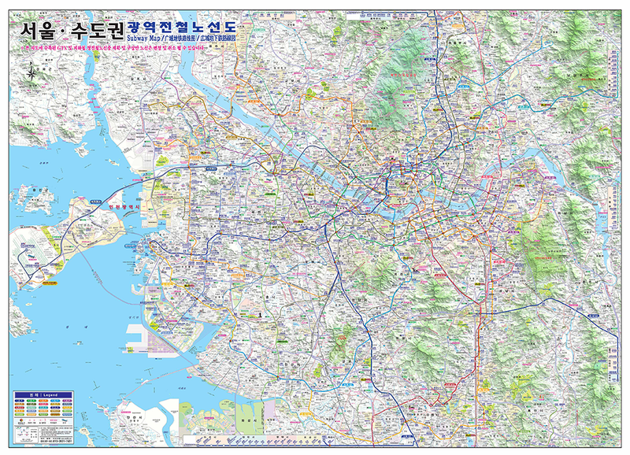
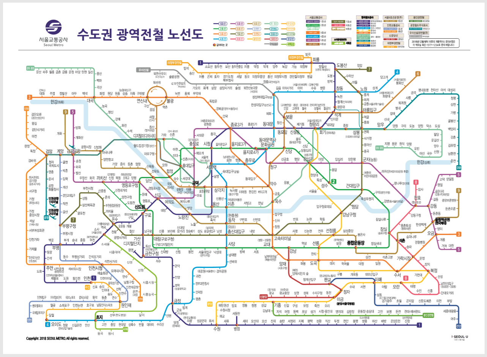
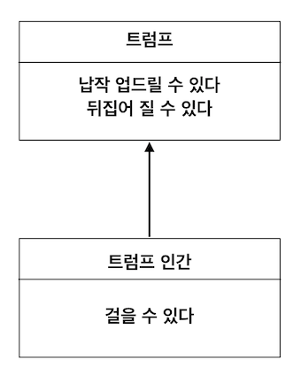

# 3강

[[toc]]

## 지하철 노선도의 추상화
- 초기 지하철은 실제 지형의 지도 모양 위에 지하철 역을 표시했다.
- 이런건 보기도 어렵고 직관성이 엄청 떨어짐
- 해리 벡이라는 사람은 이런 지형지물은 무시하고, 역의 순서와 갈아타는 역의 표시만 남겼다.
- 이런 방식은 지도가 가져야 한다고 생각하는 `정확성`은 버리고 `목적`에만 집중했다.
- 실제로 지하철 탈때 실제 지형따윈 관심 없고 지하철을 어디서 내리고 어디서 갈아타는지가 중요하다.
- 즉 지하철 노선을 `추상화`했다.



- 이런거보단



- 이런게 추상화가 더 잘됐다고 보면 된다.

## 추상화를 통한 복잡성 극복
- 지하철 노선도에서 불필요한 지형 정보를 제거해 단숨함을 달성한 건 추상화의 훌륭한 예다.
- 지형 정보를 제거하고 역 사이의 연결성을 강조해, 지하철 노선도를 이용하는 승객들의 목적에 맞게 현실을 단순화 했다.
- 이런 추상화가 유용한 이유는 승객들이 지하철을 바라보는 모델과 일치했기 때문이다. (필요성에 맞는 모델)
- 즉 중요한건 역의 위치따위가 아닌 역과 역 사이의 연결관계이기 때문임

> 즉 진정한 의미에서 추상화란 현실에서 출발하되 불필요한 부분을 도려내가면서 사물의 본진을 드러나게 하는 과정..!

- 만약 현대의 지하철 노선도로 실제 위치 지하철역을 찾고자 한다면 찾기가 매우 어려울 것이다.
- 어떠한 추상화도 의도된 목적이 아닌 다른 목적으로 사용되면 쓸모가 없을 수 있다.

:::tip
추상화란?

어떤 양상, 세부 사항, 구조를 좀 더 명확하게 이해하기 위해 특정 절차나 물체를 의도적으로 생략하거나 감춤으로써 복잡도를 극복하는 방법

복잡성을 다루기 위해 추상화는 두 차원에서 이뤄진다.
1. 첫 번째 차원은 구체적인 사물들 간의 공통점은 취하고 차이점은 버리는 일반화를 통해 단순하게 만드는 것.
2. 두 번째 차원은 중요한 부분을 강조하기 위해 불필요한 세부 사항을 제거함으로써 단순하게 만드는 것이다.

즉 모든 경우에 추상화의 목적은 이해하기 쉬운 수준으로 단순화하는 것
:::

## 객체지향과 추상화
### 모두 트럼프일 뿐
- 이러쿵 저러쿵 이상한 나라의 엘리스 얘기
- 트럼프가 종류가 여러개 > 정원사, 병사, 여왕 등등..
- 어짜피 다 `트럼프`라고 엘리스가 말함.
- 하고싶은 말은 결국 종류가 뭐건 뭐건 트럼프라고 단순하게 개념을 추상화 시켜버렸다.
- 예를 들어 왕과 왕비, 병사들 의 사소한 특징은 개무시하고 그냥 공통점만 취해서 `추상화`를 한 것

### 그룹으로 나누어 단순화하기
- 트럼프들은 각자의 특징을 가지고 있다.
- 예를들어 정원사는 정원도구를 들고, 왕은 왕관을 쓰고..
- 이처럼 명확하게 경계를 가지고 서로 구별할 수 있는 구체적인 사람이나 사물을 객체지향 패러다임에서는 객체라고 한다.
- 왜 우리는 다양한 인물들을 '트럼프'라는 한 단어로 지칭할 수 있을까? -> 모든 인물들이 공통적으로 트럼프라고 했을 때 떠오르는 공통적인 외형과 행동방식이 있기 때문이다.
- 이렇게 앨리스는 트럼프의 특징을 갖는 군집을 `트럼프` 객체로 분류하고, 토끼는 트럼프가 아니기 때문에 따로 분리한다.

### 개념
- 앨리스가 인물들(트럼프들)의 차이점을 무시하고 공통점만 모아서 트럼프라는 `개념`으로 단순화 한것이 바로 추상화라고 할 수 있다.
- 이처럼 공통점을 기반으로 객체들을 묶기 위한 그릇을 개념(concept)라고 한다.
- 일상적으로 사람들은 이 개념을 잘 적용시키는데, 예를 들어 길거리를 빠르게 달리는 교통수단을 '자동차'라는 개념으로 묶는다.
- 하늘을 나는 교통수단은 '비행기' 이다.
- 요런식으로 개념적으로 공통된 특징을 갖는 사물을 묶을 수 있다.
- 이런 개념을 이용하면 객체를 여러 그룹으로 `분류`할 수 있다.

> 객체란 특정한 개념을 적용할 수 있는 구체적인 사물을 의미한다. 개념이 객체에 적용됐을 때 객체를 개념의 인스턴스라고 한다.

### 개념의 세 가지 관점
```java
1. 심볼(symbol) : 개념을 가리키는 간략한 이름이나 명칭

2. 내연(intension) : 개념의 완전한 정의를 나타내며 내연의 의미를 이용해 객체가 개념에 속하는지 여부를 확인할 수 있다.

3. 외연(extension) : 개념에 속하는 모든 객체의 집합
```

- 간단하게 설명하면..
- 심볼은 개념을 가리키는 이름이다.
- 위에서는 트럼프라는 이름은 개념의 심볼이라고 할 수 있다.
- 내연은 앨리스 이야기에서 몸이 납작하고 두 손과 두 발이 네모난 몸 모서리에 달려있다는 트럼프에 대한 설명 같은걸 말한다.
- 하얀 토끼는 트럼프의 내연을 만족시키지 못하기 때문에 트럼프가 아니다.
- 외연은 개념에 속하는 객체들, 즉 개념의 인스턴스들이 모여 이뤄진 집합이다.
- 즉 앨리스의 얘기에선 왕, 왕비, 하트 잭, 하트왕, 하트 여왕등은 모두 트럼프의 외연을 구성하는 객체 집합에 속한다.

```java
1. 심볼 : 트럼프

2. 내연 : 몸이 납작하고 두 손과 두 발은 네모 귀퉁이에 달려 있는 등장 인물

3. 외연 : 정원사, 병사, 신하, 왕자 등 
```

### 객체를 분류하기 위한 틀
> 분류란 객체에 특정하나 개념을 적용하는 작업. 객체에 특정한 개념을 적용하기로 결심했을 때 우리는 그 객체를 특정한 집합의 멤버로 분류하고 있는 것이다.

- 분류는 객체지향의 가장 중요한 개념으로, 어던 객체를 어떤 개념으로 분류할지가 객체지향의 품질을 결정한다.

### 분류는 추상화를 위한 도구다
- 개념을 통해 객체를 분류하는 과정은 추상화의 두 가지 차원을 모두 사용한다.
- 공통점을 취해 추상화하고, 특정 중요한 부분만 챙겨서 추상화 한다.
- 즉 개념은 객체들의 복잡성을 극복하기 위한 추상화의 도구이다.

## 타입
### 타입은 개념이다
- 개념이란 단어를 좀더 컴덕후스럽게 바꾼게 `타입`이다.

> 타입은 개념과 동일하다. 따라서 타입이란 우리가 인식하고 있는 다양한 사물이나 객체에 적용할 수 있는 아이디어나 관념을 의미한다. 어떤 객체에 타입을 적용할 수 있을 때 그 객체를 타입의 인스턴스라고 한다. 타입의 인스턴스는 타입을 구성하는 외연인 객체 집합의 일원이 된다.

### 데이터 타입
- 타입에 관한 2가지 중요한 사실
- 첫째, 타입은 데이터가 어떻게 사용되느냐에 관한 것
    - 숫자형 데이터가 숫자형인 이유는 데이터를 더하거나 빼거나 곱하거나 나눌 수 있어서
- 둘째, 타입에 속한 데이터를 메모리에 어덯게 표현하는지는 외부로부터 철저하게 감춰진다.
    - 개발자는 해당 데이터 타입의 표현 방식따윈 몰라도 데이터를 사용하는데 지장이 없다.

> `데이터 타입`은 메모리 안에 저장된 데이터의 종류를 분류하는 데 사용하는 메모리 집합에 관한 메타데이터다. 데이터에 대한 분류는 암시적으로 어던 종류의 연산이 해당 데이터에 대해 수행될 수 있는지를 결정한다.

### 객체와 타입
- 전통적인 데이터 타입과 객체지향의 타입은 연관성이 있다.
- 실제로 객체지향프로그램을 작성할 때 우리는 객체를 일종의 데이터처럼 사용한다.
- 객체지향 프로그램을 작성할 때 우리는 객체를 일종의 데이터처럼 사용한다. 
- 새로 객체를 선언하고 하는게 새로운 데이터타입 선언하는 것과 비슷하다.

### 행동이 우선이다
- 내부에 어떻게 표현하는지 방식이 다르더라도 어떤 객체들이 동일하게 행동한다면 그 객체들은 동일한 타칩에 속한다.
- 결과적으로 동일한 책임을 수행하는 일련의 객체는 동일한 타입에 속한다고 할 수 있다.
- 객체가 타입에 속한 다른 객체와 동일한 행동을 하면 동일한 타입의 객체라고 보면 된다.
- 같은 데이터를 갖고 있어도 행동이 다르면 다른객체
- 결론적으로 객체의 타입을 결정하는 것은 객체의 `행동` 뿐
- 동일한 타입에 속한 객체는 내부의 데이터 표현 방식이 다르더라도 동일한 메세지를 수신하고 이를 처리할 수 있는데, 내부의 표현 방식이 달라 동일한 메세지를 처리하는 방식은 다를 수 있다.
- 이것은 `다형성`에 의미를 부여한다.
- 즉 동일한 메세지를 수신하고 다른 방식으로 처리하기 때문에, 다형적인 객체들은 동일한 타입에 속하게 된다.
- 또한 내부에 어떻게 표현을 하건간에 동일한 행동을 해야한다는 것은 `캡슐화`를 뜻한다.
- 즉 동일한 행동을 취하지만, 행동은 뒤로 숨겨야 한다.
- 결과적으로 행동을 먼저 생각해서 객체를 구성해야 하는데, 이를 위해 나온게 `책임-주도-설계` 의 객체지향 설계 방법이다.
- 즉 외부에 전달해 주어야 하는 책임을 먼저 설계하고, 그책임을 수행하는데 적합한 데이터를 나중에 결정하고 데이터를 책임을 수행하는데 필요한 외부 인터페이스 뒤로 캡슐화 해야한다.
- 결국 계속 말하는게 캡슐화

## 타입의 계층
- 인터페이스 같은 개념
- 앨리스 얘기에 나오는 트럼프들은 실제 우리가 쓰는 트럼프가 아닌 트럼프 인간이다.
- 트럼프의 특성을 갖고 있는 트럼프 인간
- 트럼프의 특징 : 납작 엎드릴수 있고 뒤집어 질 수 있다 >>> 트럼프 인간 : 납작 엎드릴 수 있고 뒤집어 질 수 있고 걸을 때마다 몸이 종이처럼 좌우로 펄럭인다.
- 즉 트럼프가 트럼프 인간을 포괄하는 일반적인 개념
- 이런 두 개념사이의 관계를 `일반화/특수화` 관계라고 부름

### 일반화/특수화 관계
- 일반화와 특수화는 동시에 일어난다.
- 트럼프 인간은 트럼프를 좀더 특수하게 표현한거로, 트럼프는 일반화 한거고 트럼프 인간은 특수화 한 것
- 여기서도 중요한건 일반화/특수화 관계를 결정하는건 객체의 상태를 표현하는 데이터가 아니라 `행동`이다. (계속 행동 강조)
- 즉 일반화/특수화 관계를 형성하려면 한 타입은 다른 타입보다 좀 더 특수하게 행동하고, 나머진 좀더 일반적으로 행동해야 한다.
- 일반적인 타입은 특수한 타입이 가진 모든 행동 중 일부의 행동만 갖고있다. 

### 슈퍼타입과 서브타입
- 일반적인걸 `슈퍼타입`, 특수한걸 `서브타입` 이라고 한다.



- 이런식으로 표현한다.

### 일반화는 추상화를 위한 도구다
- 추상화의 두 번째 차원은 중요한 부분을 강조하기 위해 불필요한 세부 사항을 제거시켜 단순하게 만드는 것이다.
- 이런 일반화/특수화 계층은 객체지향 패러다임에서 추상화의 두 번째 차원을 적절하게 활용하는 대표적인 예
- 앨리스의 예제에서 앨리스는 등장인물들을 트럼프 인간이 아닌 `트럼프`로 좀더 단순하게 생각했다.
- 트럼프 인간의 특성따윈 버리고 트럼프의 특성에 집중한 것.
- 이런식으로 일반화해서 추상화를 한 것이다.

## 정적 모델
### 타입의 목적
- 인간의 인지능력으로는 시간에 따라 동적으로 변하는 객체의 복잡성을 극복하기가 어려워 타입을 사용한다.
- 앨리스는 뭘 쳐먹을 때마다 키가 변하지만, 앨리스라는 사실 자체는 변하지않는다.
- 이런식으로 앨리스 라는 `타입`으로 생각하고, 앨리스의 키는 단지 자유자제로 변한다 라는 정도로만 인식해 상황을 좀 더 단순하게 볼 수 있다.
- 앨리스의 키가 100센치가 되건 3미터가 될 수 있건 그런 사실 따윈 뒤로 미뤄버리고 걍 변경되는 키라는 상태를 가진다고 단순화 하면 이해하기가 더 쉽다는 뜻
- 결국 앨리스의 상태를 표현하는 키는 앨리스가 어떤 행동을 하냐에 따라 변화한다.
- 타입은 시간에 따라 동적으로 변하는 앨리스의 상태(키)를 정적인 모습으로 다룰 수 있게 해준다 -> 즉 우리같은 인간이 이해하기 좀더 편하다

### 그래서 결국 타입은 추상화다
- 이런 관점에서 타입은 결국 추상화이다.
- 불필요한 시간이라는 요소와 상태변화 따윈 뒤로 보내고 철저하게 정적인 관점에서의 앨리스의 모습을 묘사하는게 가능하다.
- 결국 돌고 돌다 다시말해 타입은 추상화라고 볼 수 있다.

### 동적 모델과 정적 모델
- 두 가지 모델을 전부다 고려해야 한다.
- 실제로 객체가 살아 움직이는 동안 상태가 어떻게 변하고 어떻게 행동하는지를 포착하는 것을 `동적 모델` 이라고 한다.
- 객체가 가질 수 있는 모든 상태와 모든 행동을 시간에 독립적으로 표현하는 것을 `정적 모델` 이라고 한다.
- 실제 개발할 때 이 두 가지 개념은 아주 중요하다.

### 클래스
- 객체지향 프로그래밍 언어에서 정적인 모델은 클래스를 이용해 구현한다.
- 즉 타입을 구현하는 가장 보편적인 방법은 `클래스`를 이용하는 것이다.
- 하지만 클래스는 타입을 구현하는 메커니즘 중 하나일 뿐이니 클래스 !== 타입 이란것을 알아둬야 한다.
- 자바스크립트 같은건 클래스가 없지만 객체지향을 구현이 가능하다.
- 헷갈리지 말자