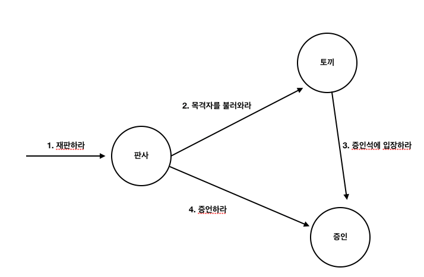

# 4강

[[toc]]

- 개별 객체의 품질이 중요한 것이 아니라 객체들 간의 협력의 품질이 중요

## 협력
### 요청하고 응답하며 협력하는 사람들
- 협력은 한 사람이 다른 사람에게 도움을 요청할 때 시작
- 다른 사람으로부터 요청을 받은 사람도 자신에게 주어진 일을 처리하다가 다른 요청이 들어오는 경우가 있다.
- 전체적으로 ㅎㅂ력은 다수의 연쇄적인 요청과 응답의 흐름으로 구성

### 재판 속의 협력
- 재판 과정을 보자
- 모든 재판 참여자는 객체이다

```java
1. 누군가가 왕에게 재판을 요청함으로써 재판이 시작된다
2. 왕이 하얀 토끼에게 증인을 부를것을 요청 한다.
3. 왕의 요청을 받은 토끼는 모자 장수에게 증인석으로 입장할 것을 요청...
...
```

- 이런식으로 각 객체들은 `요청`을 하고, 그에 대한 `응답`으로 특정한 `수행`을 한다.

### 책임
- 객체지향에서 특정한 객체가 어떤 요청해 대해 응답하거나, 적절항 행동등을 할 의무가 있는 경우 해당 객체가 `책임`을 갖는다고 한다.
- 책임은 객체지향 설계의 가장 중요한 재료
- 객체 지향 개발에서 가장 중요한 능력은 책임을 능숙하게 소프트웨어 객체에 할당하는 것

#### 책임의 분류
- 협력에 참여하는 객체들은 목표를 달성하는데 필요한 책임을 수행한다.
- 객체의 책임은 `무엇을 알고있는가?` & `무엇을 할 수 있는가?`

```java
하는 것(doing)
  - 객체를 생성하거나 계산을 하는 등의 스스로 하는 것
  - 다른 객체의 행동을 시작시키는 것
  - 다른 객체의 활동을 제어하고 조절하는 것

아는 것(knowing)
  - 개인적인 정보에 관해 아는 것
  - 관련된 객체에 관해 아는 것
  - 자신이 유도하거나 계산할 수 있는 것에 관해 아는 것
```

- 책임은 객체의 외부에 제공해 줄 수 있는 정보 (`아는 것`) + 외부에 제공해 줄 수 있는 서비스 (`하는 것`)
- 즉 책임은 객체의 `공용 인터페이스(public interface)`를 구성한다.

#### 책임과 메세지
- 협력 안에서 객체는 다른 객체로부터 요청이 전송됐을 경우에만 자신에게 주어진 책임을 수행한다.
- 즉 한 객체가 다른 객체에게 전송한 요청은 그 요청을 수신한 객체의 책임이 수행되게 한다.
- 이런식으로 다른 객체에게 책임을 수행하도록 요청하는 것을 `메세지 전송`이라고 한다.
- 두 객체간의 협력은 `메세지`를 통해 한다.
- 메세지는 전송하는 객체와 수신하는 객체가 있다.
- 책임과 메세지는 정확하게 일치하는건 x -> 책임이 좀더 추상적이고 큰 단위라고 보면 된다. (interface 느낌)

### 역할
#### 책임의 집합이 의미하는 것
- 역할은 재사용 가능하고 유연한 객체지향 설계를 낳는 매우 중요한 구성요소
- 앨리스 예시로 들면, 왕은 왕일수도 있고 판사일 수도 있다.. 뭐 이런거?
- 왕이 모자장수에게 증언요청 / 왕이 요리사에게 증언 요청 / 여왕이 앨리스에게 증언 요청 -> 모두 다 동일한 과정을 가짐
- 이런 상황이면 모든 부분을 따로따로 관리 하고 수정을 모두다 해야 되는가? (중복임)

#### 역할이 답이다
- 위의 예시에서 세 개의 협력 (3가지 일)이 있다.
- 문제는 협력에 참여하는 인물들을 제외하고 나머지 과정은 너무 유사해서 하나의 협력으로 다루고 싶다.
- 방법 is simple -> 왕과 여왕 = `판사`의 역할 / 모자 장수, 요리사, 앨리스 = `증인`역할 이런식으로 추상화를 해준다.



- 역할은 협력 내에서 다른 객체로 대체할 수 있음을 나타내는 일종의 표식이다.
- 즉 판사엔 왕과 여왕이 들어갈 수 있고, 증인엔 앨리스가 들어가거나 모자장수가 들어갈 수 있다.
- 역할을 이용해 `추상화`했다.
- 그렇다고 모든 객체가 특정 역할을 맡는건 아님
- 판사라면 판사의 재판하라 라는 메세지를 처리할 수 있기 때문이다.
- 즉 같은 메세지를 이해할 수 있는 객체만이 특정 역할을 맡을 수 있다.
- 역할은 `단순성` `유연성` `재사용성` 을 뒷받침하는 핵심 개념

#### 협력의 추상화
- 역할의 가장 큰 가치는 하나의 협력 안에 여러 종류의 객체가 참여할 수 있게해서 협력을 추상화 할 수 있게 해준다.
- 협력의 추상화는 설계자가 다룰 협력의 개수를 줄이고, 구체적인 객체를 추상적인 역할로 대체함으로써 협력의 양상을 단순화 시킨다.
- 즉 설계가 쉽고 이해가거나 기억하기가 편해진다.

#### 대체 가능성
- 역할은 협력 안에서 구체적으로 객체로 대체될 수 있는 추상적인 협력자다.
- 즉 역할은 다른 객체에 의해 대체 가능성이 있다.
- 물론 객체는 역할에 주어진 책임 이외에 다른 책임을 수행할 수도 있다. (다중 상속 느낌)
- 왕은 판사의 역할로 재판을 책임 질 수 있지만, 왕의 역할로 나라를 운영할 수도 있다.

### 객체의 모양을 결정하는 협력
#### 흔한 오류
```java
1. 객체는 데이터를 저장하기 위한 존재가 아니다.
-> 데이터는 객체가 행위를 수행하는데 필요한 재료
-> 행위를 수행하며 협력에 참여하기 위해 객체가 필요

2. 객체지향이 클래스와 클래스 간의 관계를 표현하는 시스템 x
-> 객체가 협력 안에서 어떤 책임과 역할을 수행할 것인지 결정하는 것이 핵심

3. 데이터 위주로 설계 하면 안된다
-> 왕을 기준으로 설계를 하면, 왕이 판사역할을 해야 할 때 제대로 못한다.
-> 왕이 참여하는 협력을 우선적으로 고려해야 한다. (전체적인 와꾸잡기)

4. 협력을 떼놓고 단순 데이터, 클래스 위주로 설계하면 아무 쓰잘대기 없음
```

#### 협력을 따라 흐르는 객체의 책임
- 객체 설계를 깔끔하게 하기 위해선 견고하고 깔끔한 협력을 설계해야 한다.
- 객체들이 주고받을 요청과 응답의 흐릅을 결정한다는 소리
- 협력을 만들고 -> 책임을 고안하고 -> 책임에 맞는 객체를 설정한다

### 객체지향 설계 기법
- 책임-주도 설계 : 협력에 필요한 책임들을 식별하고 적합한 객체에게 책임 할당
- 디자인 패턴 : 전문가들이 반복적으로 사용하는 해결 방법을 정의한 설계 템플릿 모음
- 테스트-주도 개발 : 테스트 먼저 작성 후 테스트를 통과하는 구체적인 코드를 작성해서 채워나가는 방법

#### 책임-주도 설계
- 계속 얘기했던 협력 고안 -> 책임, 역할 설정 -> 적절한 객체 분배

```java
1. 시스템이 사용자에게 제공해야 하는 기능인 시스템 책임을 파악
2. 시스템 책임을 더 작은 책임으로 분할
3. 분할된 책임을 수행할 수 있는 적절한 객체 또는 역할을 찾아 책임 할당
4. 객체가 책임을 수행하는 중에 다른 객체의 도움이 필요한 경우, 이를 책임질
적절한 객체 또는 역할을 찾음
5. 해당 객체 또는 역할에게 책임을 할당함으로써 두 객체가 협력
```

#### 디자인 패턴
- 디자인 패턴을 공부해보도록 하자
- 여기 나온건 단순 예시 / 좋은 책 소개
- GOF 추천
- 결국 똑똑한 사람들이 잘 만들어놓은 패턴을 잘 사용하면 내가 고민할 필요 없이 쫘라락 설계가 가능할 수 있다. (많은 학습 필요)

#### 테스트-주도 개발
- 실패하는 테스트 작성 -> 테스트를 통과하는 간단한 코드 작성 -> 리팩토링 -> 반복
- 결과물로 `작동하는 깔끔한 코드`를 얻을 수 있다.
- 테스트를 잘 작성하는 방법을 익혀야 한다.
- 물론 이거도 역할,책임,협력의 관점에서 객체를 바라보고 작성해야 한다.

### 정리
- 결국 협력 - 책임 - 역할 을 매우 강조한다.
- TDD건 책임-주도 건 모두 기본 골자는 협력 - 책임 - 역할
- 즉 전체적인 구성을 잘하고, 어떤 메세지 (기능)을 하는지 정의하고, 역할에 맞는 객체를 할당 (동일한 역할의 객체들은 상속 or interface 개념)을 해준다.