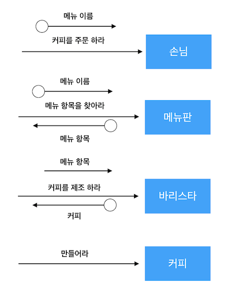

# 7강

[[toc]]

## 커피 전문점 도메인
### 커피 주문
- 커피 전문점은 작고, 단순하고, 고려해야 할 사항도 거의 없는 아주 간단한 도메인
- 최종 목표는 손님이 커피를 주문하는 사건을 컴퓨터 안에 재구성하는 것. with 객체

### 커피 전문점이라는 세상
- 커피 전문점엔 메뉴판이 있다.
- 객체 지향적 관점에서 메뉴판은 하나의 객체
- 메뉴판의 아메리카노, 카페모카 같은 메뉴항목들 역시 객체
- 손님은 메뉴판을 보고 바리스타에게 원하는 커피를 주문한다.
- 객체의 관점에서 손님 또한 객체
- 이제 순서대로 봐보면

```java
1. 손님이 메뉴를 보고 하나를 골라 바리스타 객체에게 전달

2. 바리스타는 주문을 받은 메뉴로 커피를 제조

3. 바리스타가 제주할 수 있는 커피는 4개 

4. 바리스타는 자율적으로 커피를 제조하는 객체
-> 당연 바리스타가 제조하는 커피도 객체
```

- 이런식으로 주문이 진행된다.
- 객체들 간의 관계를 살펴보자

<br/>

- 손님은 메뉴판에서 커피를 주문하므로, 손님과 메뉴판 사이엔 관계가 존재한다.
- 바리스타는 커피를 만드므로 당연히 자신이 만든 커피와 관계를 맺는다.
- 손님 객체는 손님 타입의 인스턴스고, 바리스타는 바리스타 타입, 커피 종류들은 모두 커피 타입의 인스턴스로 볼 수 있다.
- 커피 항목들은 또한 메뉴타입 인스턴스로 구분지을 수 있다


- 메뉴 항목은 메뉴판 항목에 포함된다.
- 위의 메뉴판과 메뉴 항목은 `합성 관계`, 또는 `포함 관계`라고 부른다.


- 손님은 메뉴판 타입을 알아야 원하는 커피를 선택할 수 있다.
- 메뉴판 타입은 손님에 포함되지 않는다.
- 이런관계를 `연관 관계` 라고한다.


- 전체 그림은 다음과 같다.
- 이제 도메인을 단순화 했으므로, 초점을 소프트 웨어로 옮겨보자

## 설계하고 구현하기
### 커피를 주문하기 위한 협력 찾기
- 객체지향 설계의 첫 번째 못표는 훌륭한 협력을 설계하는 것
- 협력을 설계할 때는 객체가 메세지를 선택하는 것이 아니라 메세지가 객체를 선택하게 해야 한다.
- 현재 설계하는 부분의 첫 번째 메세지는 '커피를 주문하라'


- 메뉴 이름(인자)를 주문하라 라는 메세지
- 이제 메세지를 찾았으니 메세지를 처리하기에 적합한 객체를 선택해야 한다.
- 이 메세지를 수신할 객체는 손님 타입의 인스턴스이다


- 이제 손님은 무슨 메뉴가 있는지 알아야 하므로 '메뉴항목을 찾아라' 라는 새로운 메세지를 보낸다.


- 이제 메뉴항목을 찾아라 라는 메세지를 받을 객체를 선택해야한다.
- 당연히 메뉴판


:::tip
현실에서 실제로 메뉴판은 메뉴항목을 찾아서 반환 따윈 해주지 않는다.
하지만 객체 지향에선 수동적인 존재는 없다.
모조리 자율적인 객체로, 현실과는 다르게 능동적으로 움직이다.
객체 지향에서 객체는 현실을 모방하는게 아닌 은유하는 것.
:::

- 이제 손님은 어떤 메뉴가 있는지 안다.
- 이제 필요한 메세지는 메뉴항목(인자) 커피를 제조하라는 메세지


- 누가 커피를 제조할까?
- 당연 바리스타


- 이제 바리스타가 커피를 만들면 된다


- 이제 필요한 객체의 종류와 책임, 주고받아야 하는 메세지에 대한 대략적인 윤곽이 잡힌다.
- 이제 메세지를 정제해 각 객체의 인터페이스를 구현 가능할 정도로 상세하게 정제한다.

### 인터페이스 정리하기
- 이렇게 얻어낸 것들은 객체의 인터페이스 이다.
- 메세지가 객체를 선택했고, 선택된 객체는 메세지를 자신의 인터페이스로 받아들인다.
- 각 객체를 협력이라는 문맥에서 떼어낸 수신 가능한 메세지만 추려내면 객체의 인터페이스가 된다.
- 객체의 인터페이스 안에는 오퍼레이션이 포함돼야 한다.



- 이제 객체들을 포괄하는 타입을 정의한 후 식별된 오퍼레이션을 타입의 인터페이스에 추가해야 한다.
- class 를 이용한다

```java
class Customer {
    public void order(String menuName) {}
}

class MenuItem {

}

class Menu {
    public MenuItem choose(String name) {}
}

class Barista {
    public Coffee makeCoffe(MenuItem menuItem) {}
}

class Coffee {
    public Coffee(MenuItem menuItem) {}
}
```

### 구현하기
- 클래스의 인터페이스를 식별했으므로 이제 오퍼레이션을 수행하는 방법을 메소드로 구현한다.
- Customer가 Menu객체와 Barista객체에 접근하는 방법은?
- Customer 객체는 어떤 방법으로든 자신과 협력하는 Menu 객체와 Barista 객체에 대한 참조를 알아야 한다.
- 이제 Customer의 인터페이스를 변경해 보자

```java
class Customer {
    public void order(String menuName, Menu menu, Barista barista){}
}
```

- 이제 order의 내용을 채워보자

```java
class Customer {
    public void order(String menuName, Menu menu, Barista barista){
        MenuItem menuItem = menu.choose(menuName);
        Coffee coffee = barista.makeCoffe(menuItem);
        ...
    }
}
```

:::tip
구현하지 않고 머리속으로 구성한 설계는 코드로 구현하는 단계에서 대부분 변경된다.
설계도 물론 중요하지만, 진짜 중요한 것은 코드이다.
즉 구상만 너무 오래하지 말고 코드를 짜도록 하자
:::

- 이제 메뉴는 메뉴 아이템을 찾아야 하는 책임이 있다
- 이 책임을 수행하기 위해서는 Menu가 내부적으로 MenuItem을 관리하고 있어야 한다.

```java
class Menu {
    private List<MenuItem> items;

    public Menu(List<MenuItem> items) {
        this.items = items;
    }

    public MenuItem choose(String name) {
        for(MenuItem each: items) {
            if (each.getName().equals(name)) {
                return each;
            }
        }
        return null;
    }
}
```

- Barista는 MenuItem을 이용해 커피를 제조한다.

```java
class Barista {
    public Coffee makeCoffee(MenuItem menuItem) {
        Coffee coffee = new Coffee(menuItem);
        return coffee;
    }
}
```

- Coffee는 자기 자신을 생성하기 위한 생정자를 제공한다.
- 이름, 가격을 가지고 생성자 안에서 커피를 만든다.

```java
class Coffee {
    private String name;
    private int price;

    public Coffee(MenuItem menuItem) {
        this.name = menuItem.getName();
        this.price = menuItem.getCost();
    }
}
```

- MenuItem은 이름과 price를 가져올 수 있어야 한다.

```java
public class MenuItem {
    private String name;
    private int price;

    // 생성자
    // getter setter
}
```

- 구현이 끝났다.
- 굳굳

## 코드와 세 가지 관점
### 코드는 세 가지 관점을 모두 제공해야 한다
- 개념 관점, 명세 관점, 구현 관점
- 개념 관점에서 코드를 보면 Customer, Menu ... 등등의 클래스가 보인다.

<br/>

- 명세 관점은 클래스의 인터페이스를 바라본다.
- 클래스의 public 메소드는 다른 클래스가 협력할 수 있는 공용 인터페이스를 드러낸다.
- 최대한 내부 구현과 세부 사항은 안드러 나게 구현하는게 좋다

<br/>

- 구현 관점은 클래스의 내부 구현을 바라본다.

### 도메인 개념을 참조하는 이유
- 어떤 메세지가 있을 때 그 메세지를 수신할 객체를 어떻게 선택할까?
- 가장 적절한 것을 선택하는것

### 인터페이스와 구현을 분리하라
- 인터페이스와 구현을 분리해야 한다.
- 명세 관점과 구현 관점이 섞이면 헷갈린다.
- 명세 관점은 클래스의 안정적인 측면을 나타내고, 구현 관점은 클래스의 불안정한 측면을 드러내야 한다.
- 중요한 건 클래스를 밨을 때 클래스를 명세 관점과 구현 관점으로 나눠 볼 수 있어야 한다는 것