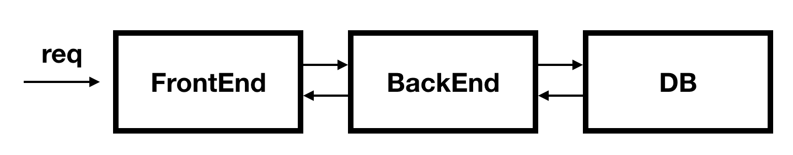
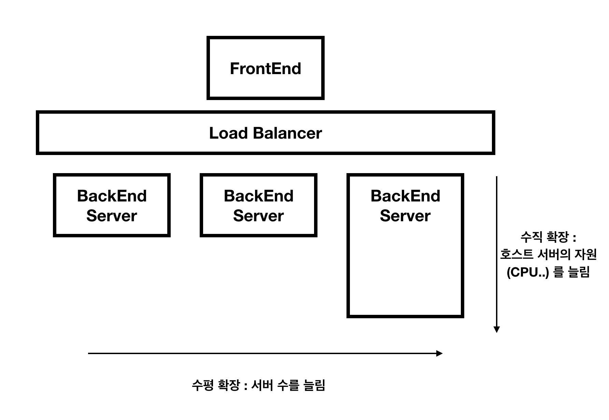
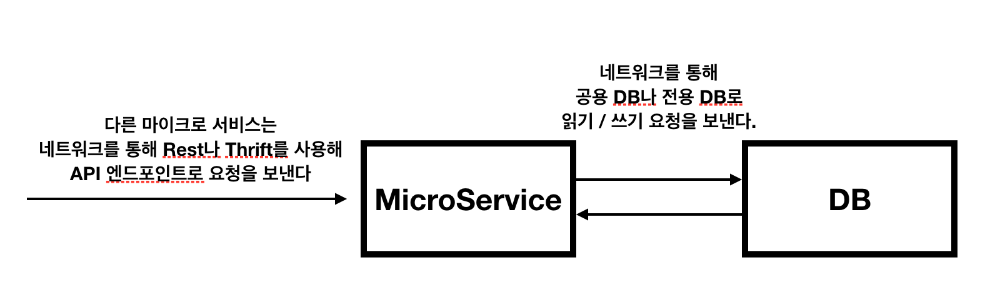
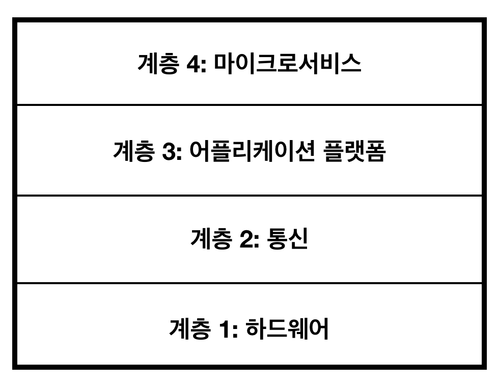

# 1강

[[toc]]

- 지난 몇년간 모놀리틱 구조의 단점인 확장성 문제, 효율성 부족, 개발자 속도 저하 같은 문제로 MSA구조로 많이 바뀌고 있다.
- 마이크로 서비스를 성공시키기 위해선 안정적이고 정교한 인프라가 필요하다.
- 팀 구조도 변화시켜야 하고, 마이크로 서비스 아키텍쳐를 꼭 표준화 해야할 필요성이 있다.

## 모놀리스에서 마이크로 서비스로
- 대부분의 소프트웨어 어플리케이션은 프론트엔드 - 백엔드 - 데이터저장소 형태로 되어 있다.



- 이런 구조를 3-계층 아키텍쳐라 부른다.
- 초기에 프로젝트를 구성할 땐 개발자 수가 적기 때문에 별 문제없이 돌아가지만, 사람이 많아지면 다음과 같은 문제가 발생한다.

```java
1. 운영 업무량 증가

2. 어플리케이션에 새로운 기능이 추가되면서 어플리케이션의 코드 라인 수와 복잡도 증가

3. 어플리케이션을 불가피하게 수직, 수평적으로 확장
```



- 이런식으로 프로젝트가 계속 커지다보면 관리도 어려워지고 하나의 소스 수정도 소스 무결성을 손상시키지 않기 위해 수십개의 테스트를 추가하는 형식이 나오게 된다.
- 이런 어플리케이션을 '모놀리스' 라고 부른다.

<hr />

- 마이크로 서비스는 한가지 일만 수행하는 작은 어플리케이션이다.
- 쉽게 교체될 수 있고, 독립적으로 개발되고 전개될 수 있는 작은 컴포넌트다.
- 마이크로 서비스 아키텍쳐를 도입하면 기술적 부채 감소, 개발자 생산성 및 속도 향상, 테스트 효율성 향상, 확장성 향상 등의 이점이 존재한다.

## 마이크로서비스 아키텍쳐


- 모놀리틱 구조와 비슷해 보이지만 다른점은 전형적인 프론트엔드 -> 백엔드 구조가 아닌, 각각의 마이크로 서비스끼리 엔드포인트 API를 통해 통신을 한다.
- 대부분의 마이크로서비스는 캐시로 활용된 메모리나 외부 데이터베이스에 데이터를 저장한다.
- 모든 마이크로 서비스가 잘 동작하기 위해선 표준화 해야할 아키텍쳐 요소가 필요하다.
- API 엔드포인트를 표준화해야 한다.
- 예를 들어 REST면 REST로만 한다던가 통신의 통일화가 필요하다.
- 또한 마이크로서비스는 언어의 제약이 별로 없다.

## 마이크로서비스 생태계
- 마이크로서비스는 단독으로 고립된 존재가 아니므로, 체계적인 생태계 구축이 필요하다.



- 위의 그림을 마이크로서비스 생태계의 4-계층 모델이라고 부른다.

### 계층 1: 하드웨어
- 물리적인 서버. 회사 자체적으로 소유하거나 클라우드 제공 업체로부터 임대
- 전용 데이터베이스와 공유 데이터베이스
- 운영 체제
- 자원 격리와 자원 추상화
- 구성 관리
- 호스트 수준의 모니터링
- 호스트 수준의 로깅

### 계층 2: 통신
- 네트워크
- DNS
- RPC
- 엔드포인트
- 메시징
- 서비스 디스커버리
- 서비스 레지스트리
- 로드 밸런싱

### 계층 3: 어플리케이션 플랫폼
- 셀프 서비스 내부 개발 도구
- 개발 환경
- 테스트, 패키징, 빌드, 배포도구
- 전개 파이프라인
- 마이크로서비스 수준의 로깅
- 마이크로서비스 수준의 모니터링

### 계층 4: 마이크로서비스
- 마이크로서비스 생태계의 마이크로서비스 계층은 다음을 포함한다.
    - 모든 마이크로서비스
    - 마이크로서비스 관련 환경설정 구성

## 조직이 직면하는 문제
### 역콘웨이의 법칙
- 마이크로서비스 아키텍쳐를 도입한 회사는 조직 구조를 매우 작고 격리된 독립적인 팀으로 구성해야 한다.
- 이러한 팀 구조는 필연적으로 사일로 현상과 스프롤 현상을 야기한다.
- 마이크로서비스는 조직이 세분화 되서 각 팀이 격리되고 단절된 채로 마이크로 서비스를 개발해야 한다.
- 마이크로서비스는 서비스 간의 협력이 매우 중요한대, 팀이 격리되있어 자신의 서비스만 잘알고 다른 서비스를 모르는 문제가 발생할 수 있다.
- 추가적으로 조직의 구성이 기존 모놀리틱 서비스 조직과는 달라 운영의 어려움이 존재한다.

### 기술적 스프롤 현상
- 자유로운 언어 선택과, 서비스마다 다른 기술스택을 사용을 해서 기술적 스프롤 현상이 두드러 질 수 있다.
- 200개의 마이크로서비스가 있으면, 언어가 200개가 있을 수도 있어서 추후 유지보수와 개발이 어려워 질 수 있다.
- 빠른 개발속도로 인한 기술적 부채가 생길 수 있다.

### 좀더 많은 장애 발생 조건
- 마이크로서비스는 작고 독립적인 부분이 많고 복잡한 대규모 분산 시스템을 이뤄서, 상당히 복잡해지고 개별적인 컴포넌트에 문제가 발생하면 아무도 예측하지 못한 방식의 문제가 발생할 수 있다.
- 이러한 문제를 해결하기 위해 좀더 꼼꼼히 테스트하고, 장애 시나리오를 만들어야 한다.

### 자원 경쟁
- 물리적인 서버, 클라우드 하드웨어, 디비 저장 장치같이 유한한 하드웨어 및 인프라자원에 대한 팀간 경쟁이 발생할 수 있다.
- 서로의 서비스가 중요하다고 여기면서, 한정된 자원에 대한 경쟁이 심해지면, 팀간 불화가 발생할 수 있다.