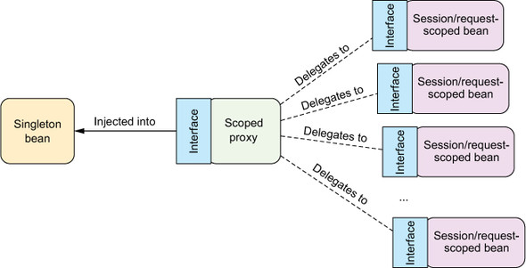

# 3강
[[toc]]
## 1. 환경과 프로필
- 소프트웨어 개발 시 특정 환경에서 다른 어플리케이션으로 마이그레이션 하는일은 어렵다.
- 로컬 / 테스트환경에서 잘 동작하던 프로젝트가 상용에서 안돌다던지
- DB의 예시를 들면 개발환경에서 특정 내장된 테스트 데이터를 이용해 사용한다고 가정해보자.

```java
@Bean(destroyMethod="shutdown")
public DataSource dataSource() {
    return new EmbededDatabaseBuilder()
        .addScript("classpath:schema.sql")
        .addScript("classpath:test-data.sql")
        .build();
        // 스프링 구성 클래스에서는 EmbededDatabaseBuilder를 사용한다.
}
```

- 이렇게 하면 schema.sql로 스키마를 생성하고, test-data.sql로 데이터를 세팅한다.
- 이런건 개발환경에서 테스트하기엔 매우 좋지만, 상용에선 매우 구리다.
- 이유를 생각해보면, 새로운 데이터를 추가하거나 하려면 소스내부를 수정해야 되는거같음

```java
@Bean
public Datasource dataSource() {
    JndiObjectFactoryBean jndiObjectFactoryBean = 
        new JndiObjectFactoryBean();
    jndiObjectFactoryBean.setJndiName("jdbc/myDS");
    jndiObjectFactoryBean.setResourceRef(true);
    jndiObjectFactoryBean.setProxyInterface(javax.sql.DataSource.class);
    return (Datasource) jndiObjectFactoryBean.getObject();
}
```

- 위에처럼 jndi로 관리해주면, 상용에서 사용해주기 조금더 좋다.

```java
@Bean(destroyMethod="close")
public DataSoruce dataSource() {
    BasicDataSource dataSource = new BasicDataSource();
    dataSource.setUrl(~);
    dataSource.setUsername(~);
    ...

    return dataSource;
}
```

- 위에는 BasicDataSource 자료형으로 객체를 생성해 일일히 설정을 세팅해주는 방법이다.
- 책에선 QA설정이라고 나와있는데, 우린 local / sandbox 설정 할 때 저렇게해줌.
- 여기서 중요한건 결국 데이터소스를 어떻게 설정하는지가 중요하다기 보단, 개발 환경에 따라 설정이 다를 경우가 있다는걸 얘기하고 싶은거다.

- 해결방법으로 각각의 환경마다 개별 클래스를 만들고, 메이븐에서 프로필 설정을 해주고난 후 빌드타임에 프로필을 넣어 적절한 컴파일 환경을 선택하는 것이다. (약간 이해가 안됨)
- 이렇게하면 환경별로 애플리케이션을 재구성 해야한다. -> war가 재빌드된다고 보면된다.

## 2. 빈 프로필 설정
- 위에 문제가 별로여서, 스프링에서 제공해주는 빈 프로필을 사용하는 것이다.
- 실제로 환경 설정관련에 따라 바뀌는 부분을 프로젝트 빌드시에 결정하는 것이 아닌, 프로젝트 빌드는 다 똑같이하고 실제로 프로필에 맞는 빈생성 및 선택을 스프링에게 위임하는 형식이다.
- 즉 war를 굳이 환경별로 재빌드를 할 필요가 없이, 같은 war파일로 실행을 하면서 환경변수로 넣어주는 프로필 값으로 스프링이 알아서 맞는 빈을 만들고 쓴다.

```java
@Configuration
@Profile("DEV")
public class DevelopmentProfileConfig {
    @Bean
    public Datasource dataSource() {
        ...
    }
}
```
- 이렇게 @Profile 어노테이션을 통해 프로필을 지정해 줄 수 있다.
- 클래스에 붙어있는 @Profile은 프로필이 DEV일 때만 빈을 생성해준다.

```java
@Configuration
public class DataSourceConfig {

    @Bean
    @Profile("DEV")
    public class devDataSource(){...}

    @Bean
    @Profile("PROD")
    public class prodDataSource(){...}
}
```
- 메소드 단위로 프로필을 걸 수도 있다. 이렇게하면 하나의 클래스에서 관련 설정들을 쫙 해줄 수 있어서 이쁨

## 3. 프로필 활성화
- spring.profiles.active / spring.profiles.default
- default는 active가 설정 안될때의 값이다.
```
프로필 설정 방법
- DispatcherServlet에 초기화된 파라미터
- 웹 애플리케이션의 컨텍스트 파라미터
- JNDI 엔트리
- 환경변수
- JVM 시스템 프로퍼티
- 통테 클래스에서 @ActiveProfile 어노테이션
```
- web.xml 에서 default profile 설정이 가능하다.
- 프로필은 복수개 설정이 가능하다.

## 4. 조건부 빈
- 말그대로 조건에 맞춰서 빈을 생성해주는 방법으로, 특정 조건이 참일 경우 생성하는 빈
- @Conditional 어노테이션 사용
```java
@Bean
@Conditional(ManyMuchMoneyCondition.class)
public Happy superHappy() {
    return new SuperHappy("Money is best");
}
```
- 위의 경우, ManyMuchMoneyCondition 클래스 조건을 만족해야 superHappy 빈이 생성된다.

```java
public interface Condition {
    boolean matches(ConditionContext ctxt,
                  AnnotatedTypeMetadata metadta)
}
```
- @Conditional에 지정된 클래스는 Condition 인터페이스를 구현한 클래스여야 한다.
- mathes 는 boolean 값을 뱉어내는데, 결국 true가 될 때만 @Conditional이 걸린게 빈으로 설정된단 소리

```java
public class ManyMuchMoneyCondition implements Condition {
    public boolean matches(ConditionContext context, AnnotatedTypeMetadata metadata) {
        Environment env = context.getEnvironment();
        return env.containsProperty("MONEY");
    }
}
```
- 이런식으로 matches를 만들어서 특정 프로퍼티가 있을 시 라는 조건을 만들어 줄 수 있다.

```java
public interface ConditionContext {
    BeanDefinitionRegistry getRegistry();
    ConfigurableListableBeanFactory getBeanFactory();
    Environment getEnvironment();
    ResourceLoader getResourceLoader();
    ClassLoader getClassLoader();
}
```
- matches에서 파라미터로 받는 ConditionContext 클래스를 보면 빈, 환경변수 등등 필요한 것들을 가져올 수 있다.

```java
public interface AnnotatedTypeMetadata {

	boolean isAnnotated(String annotationName);
	Map<String, Object> getAnnotationAttributes(String annotationName);
	Map<String, Object> getAnnotationAttributes(String annotationName, boolean   classValuesAsString);
	MultiValueMap<String, Object> getAllAnnotationAttributes(String annotationName);
	MultiValueMap<String, Object> getAllAnnotationAttributes(String annotationName, boolean classValuesAsString);
}
```
- AnnotatedTypeMetadata는 @Bean 메소드의 어노테이션을 검사 할 수 있다.

- @Profile 어노테이션도 @Conditional 어노테이션 기반으로 만들어진 어노테이션이다.

```java
@Target({ElementType.TYPE, ElementType.METHOD})
@Retention(RetentionPolicy.RUNTIME)
@Documented
@Conditional(ProfileCondition.class) // 요거. 실제로 들어가보면 환경변수 체크해준다.
public @interface Profile {
	String[] value();
}
```

## 4. 오토와이어링의 모호성
- 오토와이어링이 동작 하는 방식은 정확하게 조건과 일치하는 한개의 빈이 있을때 동작한다.

```java
@Autowired
public void setGameConsole(GameConsole gameConsole) {
    this.gameConsole = gameConsole;
}
```
- 위에서 보면 setGameConsole 메소드가 오토와이어드 되어있다.
- GameConsole 은 인터페이스라고 가정하고, 3개정도의 클래스가 구현됐다고 가정해본다.

```java
@Component
public class PS4 implements GameConsole {...}

@Component
public class XBOX implements GameConsole {...}

@Component
public class Switch implements GameConsole {...}
``` 

- 위의 경우를 보면, 세터 인젝션을 할때 넣을 수 있는 게임기는 3개나 되서 스프링은 NoUniqueBeanDefinition 예외가 발생한다.

### 4-1. 기본빈 지정 (@Primary)
- 위와같은 상황 해결을 위해, @Primary 빈을 등록하는 방법이 있다.

```java
@Component
@Primary
public class Switch implements GameConsole {...}
```

- 요러면 스위치를 먼저 선택하게 된다.
- 하지만 마찬가지로, 다른 클래스에도 @Primary를 넣으면 똑같이 모호해지는 문제가 생긴다.

### 4-2. 이름주기 (@Qualifier)

- @Primary도 결국 모호해 질 수 있는 문제가 있다.
- 이런 경우를 해결하기 위해, 좀더 명확하게 @Qualifier 어노테이션을 사용 할 수 있다.

```java
@Autowired
@Qualifier("switch")
public void setGameConsole(GameConsole gameConsole) {
    this.gameConsole = gameConsole;
}
```

- 이럴 경우, 위의 오토와이어는 switch라는 아이디를 가진 빈을 오토와이어링을 해준다.
- 특정 클래스가 명시적으로 빈의 아이디를 설정 해주지 않으면, 기본으로 앞글자를 소문자를 만들어 빈을 생성해 주는데, 이럴 경우 클래스명이 바뀌거나 하면 위의 코드는 또 에러가 나게된다.

```java
@Component
@Qualifier("nintendo")
public class Switch implements GameConsole {...}
```

- 이렇게 사용될 빈에도 @Qualifier 어노테이션을 사용해 이름을 지정해주면, 이제 클래스명이 바껴도 문제가 없다.
- 사용될 빈에 @Qualifier 를 사용 할 땐, 해당 클래스를 설명할 수 있는 포괄적인 용어를 사용하는것이 좋다.
- 닌텐도에서 새로운 게임기를 내서 클래스명이 바뀔수도 있지만, 닌텐도란 이름은 안바뀔 테니까
- 근데 이럴 경우 또 문제점이 생길 수 있는게, 같은 Qualifer 이름을 갖는 클래스가 생성 되서 또 모호해 질 수 있다.

```java
@Component
@Qualifier("nintendo")
public class nintendo3DS implements GameConsole {...}
```

- 이럴 경우 nintendo로 오토와이어 할 경우, 2개의 빈이생겨 또다시 문제가 생겨버린다.
- 이런 문제를 해결하려고 2개의 Qualifier를 사용하면 좋은데, 자바는 두개의 같은 어노테이션을 반복하는 걸 싫어해서 오류를 뱉어낸다.

```java
@Component
@Qualifier("nintendo")
@Qualifier("version3")
public class Switch implements GameConsole {...}

@Autowired
@Qualifier("nintendo")
@Qualifier("version3")
public void setGameConsole(GameConsole gameConsole) {
    this.gameConsole = gameConsole;
}
// 이렇게 하면 될 것 같지만, 같은 어노테이션 두개라 에러가 발생한다.
```

- 이런 경우엔 그냥 특정 Quaifier에 정의된 이름으로 커스텀 어노테이션을 만들면 된다.

```java
// @Nintendo
@Target({ElementType.CONSTRUCTOR, ElementType.FIELD,
         ElementType.METHOD, ElementType.TYPE})
@Retention(RetentionPolicy.RUNTIME)
@Qualifier
public @interface Nintendo {}


// @VersionThree
@Target({ElementType.CONSTRUCTOR, ElementType.FIELD,
         ElementType.METHOD, ElementType.TYPE})
@Retention(RetentionPolicy.RUNTIME)
@Qualifier
public @interface VersionThree {}
```

- 이제 @Qualifier 대신에 해당 어노테이션들을 사용하면 된다. -> 수십개도 가능
- 또한 Qualifier에 문자열 넣는거보다 좀더 type-safe 해지니 어노테이션을 이용하도록 하자

```java
@Component
@Nintendo
@VersionThree
public class Switch implements GameConsole {...}

@Autowired
@Nintendo
@VersionThree
public void setGameConsole(GameConsole gameConsole) {
    this.setGameConsole = gameConsole;
}

//깔끔!
```

## 5. 빈 범위
- 기본적으로 생성되는 빈은 전부다 싱글톤이다.
- 대부분의 경우 싱글톤이 짱짱맨이지만, 가끔은 다른걸 써야할 때도 있다.
```
- 싱글톤 : 전체 어플리케이션을 위해 생성되는 빈의 인스턴스 하나
- 프로토타입 : 빈이 주입될 때마다 생성되거나 스프링 어플리케이션 컨텍스트에서 얻는 빈의 인스턴스 하나
- 세션 : 웹 어플리케이션에서 각 세션용으로 생성되는 빈의 인스턴스 하나
- 요청 : 웹 어플리케이션에서 각 요청용으로 생성되는 빈의 인슽턴스 하나
```

- @Scope 어노테이션을 통해 설정이 가능하다

```java
@Component
@Scope(ConfigurableBeanFactory.SCOPE_PROTOTYPE)
public class NotePadd{...}
```

- 세션 범위로 범위를 줄 수도 있다.
- 장바구니 같은게 대표적인 예인데, 장바구니는 개인별로 따로 갖고 있으므로 세션단위로 주는게 적절하다.

```java
@Component
@Scope(
    value=WebApplicationContext.SCOPE_SESSION,
    proxyMode=ScopedProxyMode.INTERFACES
)
public ShoppingCart cart() {...}
```

- 요렇게 생성이 되는데, 세션별로 쇼핑카트 빈이 생성되고, 그 빈은 해당 세션에 관해서는 싱글톤이다.
- proxyMode 도 중요한대, 문제가 발생 할 수 있는 시나리오를 보면

```java
@Component
public class StoreService {
    @Autowired
    public void setShoppingCart(ShoppingCart shoppingCart) {
        this.shoppingCart = shoppingCart;
    }
}
```

- 위의 상황을 보면, 스프링에서 저장 서비스를 빈으로 만드는데, 쇼핑카트는 고객이 세션을 만들때 까지 존재하지 않게된다.
- 위에 처럼 단일한 인스턴스를 주입하는 저장 서비스는 잘못 설계된 것이다.
- 이런 문제를 해결하기 위해 proxyMode를 INTERFACE로 설정해 준다.
- 정리해보면, 빈을 등록할때 모드를 인터페이스로 지정해주면, 오토와이어링을 하면 실제 빈이 등록되는게 아니라 프록시 인터페이스가 등록되고, 실제 빈생성은 세션이 생성될 때 작동한다.
- 만약 ShoppingCart가 인터페이스가 아니라면 (위의 예시는 인터페이스 이지만) 스프링은 자동으로 프록시 인터페이스를 만들어 주는 것 같다. CGLIB을 사용해서. (이거 디버깅 하다보면 많이 나왔는데 이런 상황에서 쓰는거같다.)
- 여기에 추가로 요청 범위 빈 (request)도 비슷한 문제를 발생시키므로, 요청 범위 빈 자체도 또한 프록시로 주입이 된다.

- https://stackoverflow.com/questions/39945163/proxymode-scopedproxymode-target-class-vs-scopedproxymode-interface
- https://livebook.manning.com/book/spring-in-action-fourth-edition/chapter-3/185



## 6. 런타임 값 주입
- DI와 와이어링을 할 때, 하드코딩된 값이 아닌 런타임에 값이 정해지는게 필요할 때가 있다.

```java
@Bean
public CompactDisc iUAlbum() {
    return new BlankDisc(
        "Love poem",
        "IU"
    );
}
// 이런식으로 노래제목과 가수를 하드코딩 되도 되지만, 따로 주입받을 수도 있다.
```
- 이걸 해주는 방법은 Porperty placeholders, SpEL 이다.

```java
@Configuration
@PropertySource("classpaht:~/application.properties")
public class ExpressiveConfig {

    @Autowired
    Environment env;

    @Bean
    public blankDisc disc() {
        return new BlankDisc(
            env.getProperty("disc.title"),
            env.getProeprty("disc.artist")
        );
    }
}
```
- 프로퍼티에서 값을 가져오는 방법
- getProperty는 key만 받는게 아닌 다른 타입을 받거나, 디폴트값을 설정할 수 도 있다.

```java
// 액티프 프로필 목록 
String[] getActiveProfiles()
// 기본 프로필 목록
String[] getDefaultProfiles()
// 해당 프로필이 허용 프로필인지 확인해줌
boolean acceptsProfiles(String... profiles)
```

- 보통 프로퍼티값을 가져올 땐 @Value를 사용해서 가져온다.

```java
public BlackDisc(
    @Value("${disc.tiitle}") String title,
    @Value("${disc.artist}") String artist
    ...
)
```

- 이러한 플레이스홀더 값을 사용하기 위해서 PropertyPlaceholderConfigurer 빈 또는 PropertySourcePlaceholderConfigurer 빈을 설정한다.

```java
@Bean
public static PropertySourcePlaceholderConfigurer placeholderConfigurer() {
    return new PropertySourcesPlaceholderConfigurere();
}
```

## 7. SpEL
- SpEL은 런타임에 표현식을 사용하여 빈의 프로퍼티나 생성자 파라미터에 값을 전달하게 하는 스프링 표현 언어 이다.
```
기능들
- ID로 빈을 참조하는 기능
- 메소드 호출과 객체의 프로퍼티 액세스
- 값에서의 수학적인 동작, 관계와 관련된 동작, 논리연산 동작
- 정규 표현식 매칭
- 컬렉션 처리
```
- 여러가지 예시가 있는데 쓸때 찾아보자


