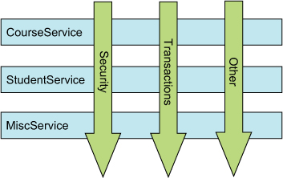
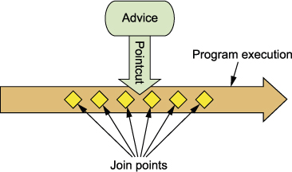
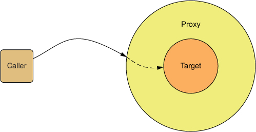
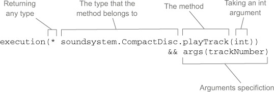
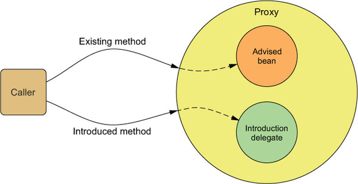

# 4강
[[toc]]
## 1. AOP란?
- 애스팩트의 목적은 횡단 관심사의 모듈화 이다.
- 즉 한 프로젝트에서 여러부분에 영향을 주는 기능이다.
- 횡단으로 중복된 코드를 줄여주는 역할을 한다.
- 대부분의 서비스들은 로깅과 트랜잭션 처리같은 기능이 필요하지만, 모든 비지니스 로직에 해당 기능이 들어가면 보기가 싫다.


- 애스팩트는 여러 애플리케이션 객체에 걸치는 로직에 적용된 횡단 관심사 (로깅, 트랜잭션 등)를 모듈화 한다.
- 객체 지향에서 공통된 기능을 재사용 하기위해 사용하는 기법
- AOP도 공통 기능을 한곳에 모아두어 선언적으로 적용할지 선언이 가능하고, 대상클래스의 수정없이 적용이 가능하다.
```zsh
AOP의 장점
1. 전체 코드 기반에 흩어져있는 공통적인 기능이 하나의 장소로 응집된다.
2. 서비스 로직에서 실제 비지니스 로직을 제외한 기능들을 모두 애스팩트로 모아둬 코드가 깔끔하다.
```

## 2. AOP 용어


### 2-1 어드바이스
- 애스팩트가 해야할 작업을 AOP 용어에서 어드바이스라고 정의한다.
- 어드바이스는 애스팩트가 *무엇*을 *언제* 할지를 정의한다.
```
어드바이스 종류
- before : 어드바이스 대상 메소드가 호출되기 전에 어드바이스 기능 수행
- after : 결과에 상관 없이 어드바이스 대상 메소드가 완료된 이후에 어드바이스 기능 수행
- after-returning : 대상 메소드가 성공적으로 리턴한 후 어드바이스 기능 수행
- after-throwing : 대상 메소드가 예외를 던진 후 어드바이스 기능 수행
- around : 어드바이스가 어드바이스 대상 메소드를 감싸 전,후로 작동
```

### 2-2 조인포인트
- 어드바이스를 적용 할 수 있는 곳을 조인포인트 라고 정의한다.
- 끼울 수 있는 지점은 메소드 호출 지점, 예외발생, 필드 값 수정 등이 있다.
- 조인포인트에 애스팩트가 삽입되면 정상적인 어플리케이션 흐름에 추가 기능이 적용 된다.

### 2-3 포인트커트
- 포인트커트란 애스팩트가 어드바이스 할 조인포인트의 영역을 좁히는 일을 하는 기능이다.
- 어드바이스는 무엇을 언제 라면 포인트커트는 *어디서* 할지를 정의한다.

### 2-4 애스펙트
- 어드바이스 + 포인트커트 = 애스팩트

### 2-5 인트로덕션
- 인트로덕션은 기존 코드 수정 없이 메소드나 멤버 변수를 추가하는 기능

### 2-6 위빙
- 타깃 객체에 애스펙트를 적용해 새로운 프록시 객체를 생성하는 절차
- 애스팩트는 타깃 객체의 조인포인트로 위빙된다.
```
수행 시점
- compile time : 타깃 클래스가 컴파일 될 때 애스펙트가 위빙되며, 별도의 컴파일러가 필요. AspectJ의 위빙 컴파일러는 이러한 목적으로 사용된다.
- classload time : 클래스가 JVM에 로드될 때 애스팩트가 위빙된다. 특정 클래스 로더 필요
- runtime : 애플리케이션 실행 중에 애스팩트가 위빙된다. 보통 타깃 객체에 호출을 위임하는 구조의 프록시 객체를 위빙중에 AOP 컨테이너가 동적으로 만들어 낸다. 스프링의 AOP 위빙 방식
```

## 3. 스프링의 AOP
- 스프링은 4가지 형태의 AOP를 지원
```
- classic 스프링 프록시 기반 AOP
- Pure-POJO 애스팩트
- @AspectJ 어노테이션 기반 애스팩트
- AspectJ 애스펙트에 빈 주입 (스프링의 모든 버전 지원)
```
-  클래식은 복잡하니 버림
- 스프링에서 생성하는 모든 어드바이스는 표준 자바 클래스로 작성한다.
- 포인트 커트의 경우 어드바이스를 적용할 곳을 정의하는데, 보통 xml(...) 설정을 해주면 된다.
- AspectJ는 지금은 어노테이션기반으로 작동하지만, 자바 언어를 확장한 형태라 러닝커브가 높다.



- 스프링에서의 어드바이스는 위의 그림처럼 프록시객체가 타깃 객체를 감싸고, 대상 메소드로의 호출을 가로챈 후 타깃 객체로 호출을 포워딩 해준다.
- 애스펙트의 로직은 프록시가 메소드의 호출을 훔친 후에 실행되고, 그 이후에 타깃 빈의 메소드가 호출된다. (after 일땐?)
- 스프링은 프록시 타깃 빈을 실제 필요로 하기 전까지 프록시 타깃 객체를 생성하지 않는다.
- 스프링은 런타임 시에 프록시를 생성하므로, 스프링 AOP의 애스팩트를 위빙하기 위한 별도의 컴파일러는 필요로 하지 않는다.
- 스프링은 메소드 조인포인트만 지원한다.
- AspectJ나 JBoss같은 AOP 프레임워크들은 필드나 생성자 조인 포인트까지 제공
- 즉 스프링은 필드같은걸 포인트커트로 지정이 불가능헤, 세밀하게 필드값 조정같은건 안된다.

## 4. 포인트커트를 이용한 조인포인트 선택
- 스프링은 AspectJ에서 지정자에 속하는 포인트커트만 지원한다.

```java
package concert;

public interface Performance {
    public void perform();
}
```

- 위의 소스에서 Performance 의 perform() 메소드를 트리거링하는 애스팩트를 작성할 수 있다.


- AspectJ의 포인트커트 표현식을 이용한 Performance의 perform() 메소드 선택
- *은 모든타입 리턴이고, 패키지+클래스 명과 메소드명 지정, 이후에 받는 인자를 적어준다.


- 위에처럼 콘서트 패키지에서 호출건만 처리하도록 제한을 둘 수도 있다.
- 포인트커트에서 bean() 지정자 사용이 가능하다. 
```java
execution(* concert.Performance.perform()) and bean('woodstock')
```

## 5. 애스펙트 어노테이션 만들기
### 5-1 애스팩트 정의
- @Aspect 어노테이션을 사용하면 클래스를 애스펙트로 바꿀 수 있다.
- 위의 Performance 예시를 다시 사용해보자
- 공연에 관객이 없으면 공연은 의미가없다. 하지만 공연 자체의 기능은 관객이 아니다. 따라서 관객은 애스펙트로 지정해줄 수 있다.

```java
package concert;

@Aspect
public class Audience {
    // 공연 이전에 관객이 해야할 행동
    @Before("execution(** concert.Performance.perform(..))")
    public void silenceCellPhone() {
        ...
    }

    // 공연 이전에 관객이 해야할 행동
    @Before("execution(** concert.Performance.perform(..))")
    public void takeSeats() {
        ...
    }

    // 공연 이후에 관객이 해야할 행동
    @AfterReturning("execution(** concert.Performance.perform(..))")
    public void applause() {
        ...
    }

    // 공연이 실패하면 관객이 해야할 행동
    @AfterThrowing("execution(** concert.Performance.perform(..))")
    public void demandRefund() {
        ...
    }
}
```
- 맨위의 @Aspect 어노테이션은 해당 관객 클래스가 POJO가 아닌 애스펙트임을 명시해 준다.
- 관객은 공연(어드바이스된 타깃 클래스)의 전,후,문제발생 시의 행동을 어노테이션을 통해 정의가 가능하다.
- 모든 어노테이션은 포인트커트 표현식 값의 형태로 설정된다. (execution...)
- 위의 예시에서 모든 어드바이스 어노테이션은 같은 포인트커트 표현식을 사용하고 있어 중복된 모습이 별로다.

```java
package concert;

@Aspect
public class Audience {

    @Pointcut("execution(** concert.Performance.perform(..))")
    public void performance() {}

    // 공연 이전에 관객이 해야할 행동
    @Before("performance()")
    public void silenceCellPhone() {
        ...
    }

    // 공연 이전에 관객이 해야할 행동
    @Before("performance()")
    public void takeSeats() {
        ...
    }

    // 공연 이후에 관객이 해야할 행동
    @AfterReturning("performance()")
    public void applause() {
        ...
    }

    // 공연이 실패하면 관객이 해야할 행동
    @AfterThrowing("performance()")
    public void demandRefund() {
        ...
    }
}
```
- 중복은 보기 싫으니까 @Pointcut 어노테이션을 사용해 특정 포인트커트 표현식을 따로 정의해 주도록 하자.
- Audience 클래스는 어노테이션과 별개로 POJO 이다.. (이거 뭔소린지 모르겠음. 위에선 아니랬는데)

```java
@Bean
public Audience audience() {
    return new Audience(); // 이런식으로 다른 자바 클래스처럼 스프링에서 빈으로 와이어링 된다.
}
```

- 이렇게만 설정해주면 Audience는 일반 스프링 빈처럼 사용된다. 
- 애스팩트 어노테이션을 썼지만, 애스팩트로 변경해주는 프록시를 생성하고, 어노테이션을 해석하기 위해선 @EnableAspectJAutoProxy 어노테이션을 JavaConfig에 넣어줘서 오토프록싱을 가능하게 해야한다.

```java
@Configuration
@EnableAspectJAutoProxy // AspectJ 오토 프록싱 할성화
@ComponentScan
public class ConcertConfig {
    @Bean
    public Audience audience() {
        return new Audience(); // 빈선언
    }
}
```
### 5-2 Around 어드바이스

```java
@Aspect
public class Audience {
    @Pointcut("execution(** concert.Performance.perform(..))")
    public void performance() {}

    @Around("performance()")
    public void watchPerformance(ProceedingJoinPoint jp) {
        try {
            Syso("silent"); Syso("take seat");
            jp.proceed();
            Syso("Applause");
        } catch (Throwable e) {
            Syso("refund");
        }
    }
}
```
- @Around 어드바이스는 watchPerformance() 메소드에 포인트커트가 적용 되었다.
- 이전에 4개로 나눠진 어드바이스는 하나로 뭉쳐졌다.
- 특이한건 ProceedingJoinPoint를 파라미터로 받는데, 이건 어드바이스 대상 메소드를 실행을 제어하는거라고 생각하면 된다.
- 즉 silent, seat 을 하고난 후, jp.proceed() 를 하면 공연 (perform()) 메소드를 실행하고, 이후에 박수를 치게 된다.
- @Around 어노테이션을 쓰려면 ProceedingJoinPoint는 필수!
- 재밌는건 저 proceed()메소드는 어드바이스 내에서 여러번 호출이 가능하다. 즉 대상 메소드 반복 수행하는 재시도 로직도 구현이 가능하다.  

### 5-3 어드바이스에서 파라미터 처리
- 어드바이스에서 파라미터를 받아 처리할 수도 있다.
- blank disc에 플레이 횟수를 카운트하는 애스펙트를 만든다고 가정하면
```java
@Aspect
public class TrackCounter {
    private Map<Integer, Integer> trackCounts = new HashMap<Integer, Integer>();

    @Pointcut(
        "execution(* soundsystem.CompactDisc.playTrack(int))" + 
        "&& args(trackNumber)"
    public void trackPlayed(int trackNumber) {}

    @Before("trackPlayed(trackNumber)")
    public void countTrack(int trackNumber) {
        int currentCount = getPlayCount(trackNumber);
        trackCounts.put(trackNumber, currentCount+1);
    }

    public int getPlayCount(int trackNumber) {
        return trackCounts.containsKey(trackNumber) 
            ? trackCounts.get(trackNumber) : 0;
    }
}
```


- 이전 것과의 차이는 trackNumber라는 파라미터를 받았다.
- Pointcut에 정의되어있는 args(trackNumber) 식별자로, playTrack() 메소드에 전달되는 int인자가 어드바이스에도 똑같이 전해진다는 것을 뜻한다.
- 즉 실제로직에서 playTrack(3); 을 하면, 어드바이스에서도 인자로 3을 받게 된다.
- 그리고 나서, 실제로 그 3이라는 인자는 trackPlayed 포인트커트로 설정된 @Before로 정의되어 있는 메소드 countTrack의 인자 (int trackNumber) 에도 전달이 되게 된다. (꼬리에 꼬리에 꼬리에)

### 5-4 인트로덕션 어노테이션
- AOP를 이용하면, 루비나 그루비처럼 동적으로 객체나 클래스에 새로운 메소드를 추가해주는 기능을 유사하게 구현이 가능하다.
- 실제로 객체에 새로운 메소드를 추가하진 않았지만, 위에서 구현한 것처럼 Around 어드바이스를 사용하면 기존 메소드 전, 후로 새로운 기능을 추가 할 수있다.
- 이러한 개념과 비슷하게 실제로 새롭게 도입된 AOP개념으로 애스펙트는 스프링 빈에 새로운 메소드(?!)를 추가 할 수 있다.



- 실제로 애스펙트는 어드바이스 대상 빈과 동일한 인터페이스를 구현하는 프록시 일 뿐이다.
- 반대로 생각해서 위의 그림처럼 하부 구현 클래스가 없어도, 애스펙트가 어드바이스한 모든 빈은 새로운 인터페이스를 구현하기 위해 나타난다. (그냥 새로 생성되는거인듯)
- 정리하면 스프링 AOP로 새로운 메소드를 빈에 추가하게 되면 프록시는 메소드 호출을 가로채고, 메소드를 구현한 다른 객체에 위임해 버린다. -> 위의 그림에서 Introduction 빈은 Advised bean으로 기능을 위임함 -> 메소드가 추가된 거!

```java
package concert;

public interface Encoreable {
    void performEncore();
    // 앵콜 기능을 모든 Performance 구현체에 제공해보기
}
```

- 앵콜 기능을 추가로 개발을 하게 되었는데, 모든 Performance 구현체를 다 바꿀 수가 없다.
- 이럴때 쓰는게 AOP 인트로덕션!

```java
package concert;

@Aspect
public class EncoreableIntroducer {
    @DeclareParents(value="concert.Performance+",
                           defaultImpl=DefaultEncoreable.class)
    public static Encoreable encoreable;
}
```

- 새로운 EncoreableIntroducer 애스펙트인데, 기존과 달리 @Before 같은 어드바이스가 없다.
- 대신 DeclareParents 어노테이션을 사용해서, Performance빈에 Encoreable 인터페이스를 제공한다.
```
DeclareParents 어노테이션
- value 애트리뷰트는 인터페이스를 제공하는 여러 빈을 식별한다. 위에선 Performance 구현체
- defaultImpl 애트리뷰트는 인트로덕션 구현체를 제공하는 클래스를 식별한다. 여기선 기본앵콜!
- DeclareParents로 어노테이션 되는 적정 프로퍼티는 도입 인터페이스를 지정한다. 여기선 encorable
```

## 6. AspectJ
- 스프링 AOP만으로 해결이 안되는 건 AspectJ로 해결이 가능하다.
- 실제로 AspectJ는 스프링을 위한거라기 보단 자바 어플리케이션을 위한 라이브러리 라고 보는게 맞다.

```java
package concert;

public aspect CriticAspect {
    public CriticAspect() {}
    
    pointcut performace() : excution(* perform(..));

    afterRunning() : performance() {
        Syso(criticismEngine.getCriticism());
    }

    private CriticismEngine criticismEngine;

    public void setCriticismEngine(CriticismEngine criticismEngine) {
        this.criticismEngine = criticismEngine;
        // CriticismEngine 주입
    }
}
```

- 이렇게 짜면 모든 perform에 대해서 끝나고나면 (afterRunning) 비평을 시작하는 애스펙트를 얻게된다.
- 문제는 심사위원 혼자서 평가하는게 아니라 CriticismEngine 객체와 같이 평가 (getCriticism())를 내린다.
- CriticismEngine에 관한 레퍼런스는 위에선 세터 인젝션을 통해 얻게 된다.


```java
public class CriticismEngineImpl implements CriticismEngine {
    ...

    // 이렇게 CriticismEngine을 구현한 Impl 클래스도 만들어준다.
}
```

- 위에처럼 Impl 클래스도 구현이 되면, CriticismEngineImpl 을 CriticAspect로 와이어링을 해주면 끝나는데, AspectJ는 스프링이랑은 상관없이 애플리케이션에 위빙된다.
- 이러한 문제를 막기위해, 위의 CriticAspect를 CriticismEngine 빈이 주입된 빈으로 설정해 주면 끝! 