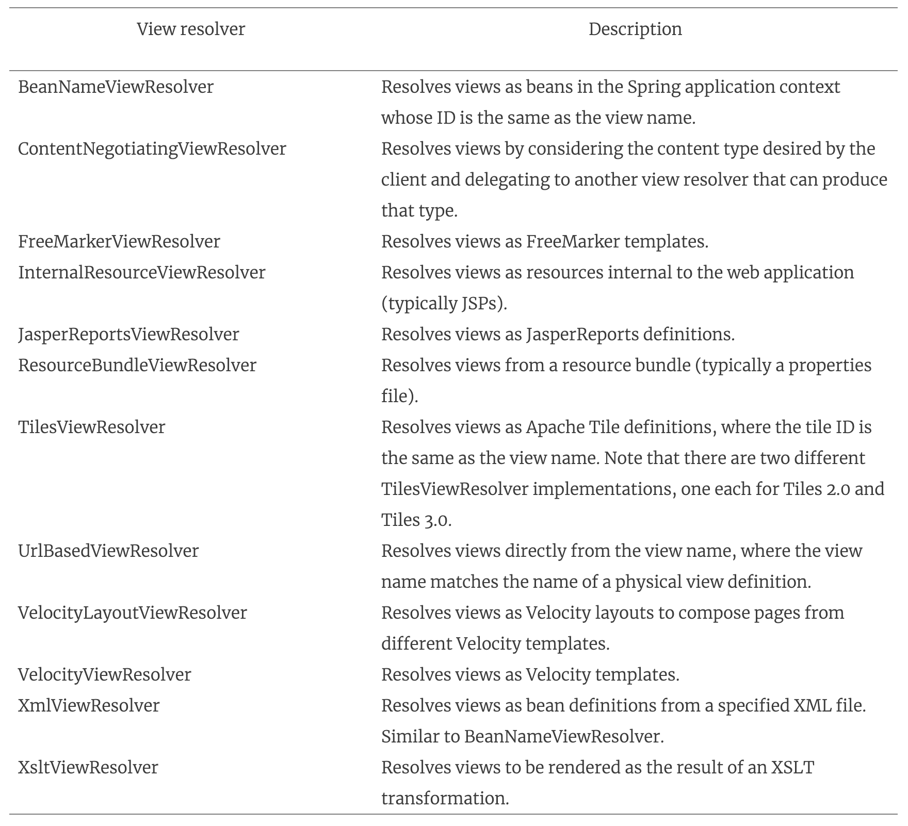
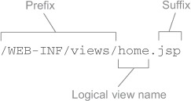
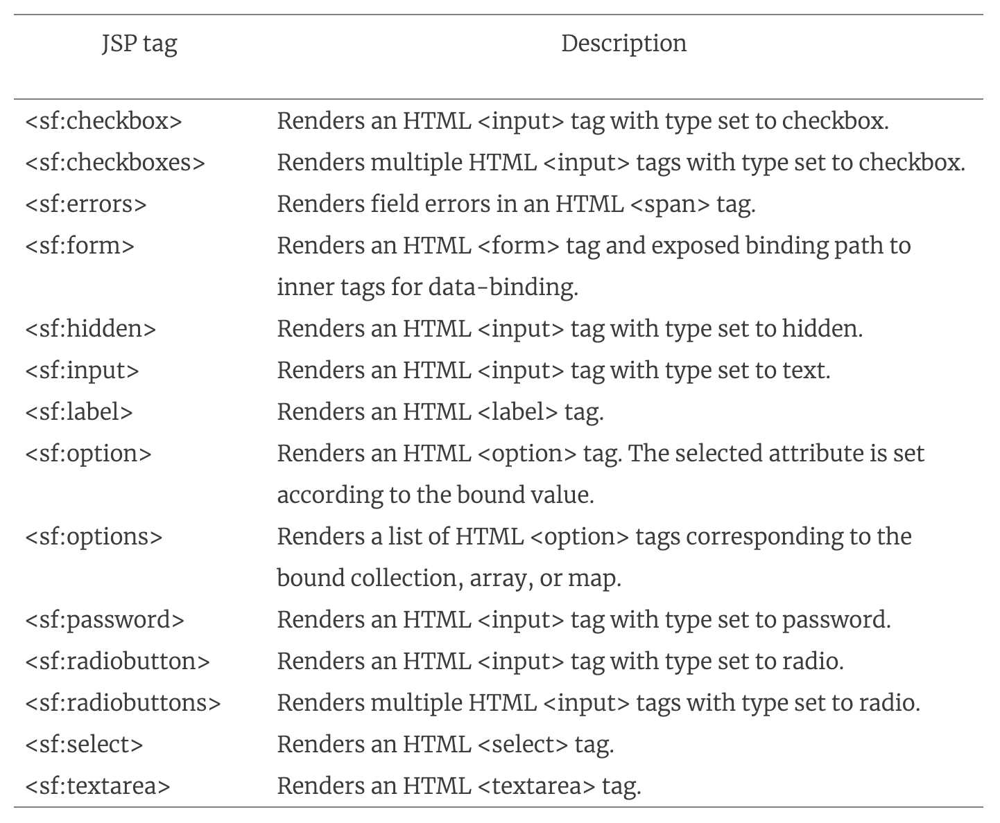
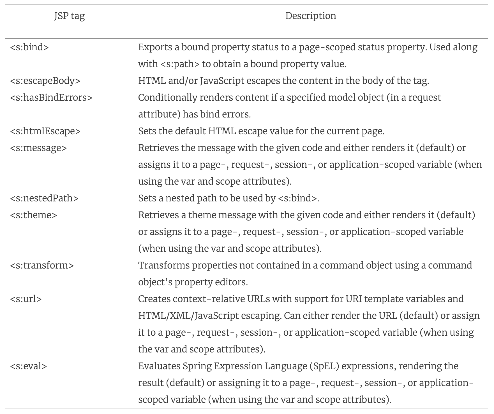

# 6강
[[toc]]
## View Resolution 이해하기
- 실질적으로 컨트롤러에서는 html을 생성하는 코드가없다.
- 스프링에서 모델을 실제로 렌더링 하기 위해 구현되어 있는 뷰를 어떻게 결정할지 정해주는게 View Resolver이다.
- 스프링에서 제공하는 ViewResolver 는 아래와 같다.

```java
public interface ViewResolver {
    View resolveViewName(String viewName, Locale locale) throws Exception
}
```

- resolveViewName 메소드는 뷰의 이름과 Locale을 파라미터로 받아 View 를 리턴해 준다.

```java
public interface View {
    String getContentType();
    void render(Map<String, ?> model,
                HttpServletRequest request,
                HttpServletResponse response) throws Exception;
}
```
- 또다른 인터페이스인 view 인터페이스로, 모델을 전달받는거 뿐만 아니라 서블릿 요청과 응답객체를 전달받아 결과를 응답내의 결과에 렌더링을 한다.



- 스프링에서 제공하는 13개의 리졸버 목록이다.
- InternalResourceResolver 는 보통 JSP 지원이고, TilesViewResolver는 아파치 타일즈 뷰에 사용된다.

## 2. JSP 뷰 만들기
- 스프링은 JSP를 아래의 두가지 방식으로 지원한다.
```
1. InternalResourceViewResolver는 JSP파일에 뷰 이름을 결정하기 위해 사용한다.
2. 스프링은 form-to-model 바인딩을 위한 것과 
일반적인 유틸리티 기능을 제공하는 두개의 JSP 태그 라이브러리를 제공한다.
```
### 2-1. JSP-ready 뷰 리졸버 설정
- InternalResouceViewResolver는 웹 어플리케이션 뷰 리소스의 물리적인 패스를 결정하기 위해, 
접두사와 접미사를 뷰 이름에 붙이는 규칙을 사용한다.
- 예를들어 접두사를 "/WEB-INF/views/" 를 사용하고, 접미사를 ".jsp"를 쓰면 /WEB-INF/views/ 경로 안에 있는 jsp를 찾아가도록 유도한다.



```java
@Bean
public ViewResolver viewResolver() {
    InternalResourceViewResolver resolver = 
        new InternalResourceViewResolver();
    resolver.setPrefix("/WEB-INF/views/");
    resolver.setSuffix(".jsp");
    /**
    * resolver.setViewClass(
    *    org.springframework.web.servlet.view.JstlView.class
    * );
    * JSTL을 사용하면 필요한 설정
    */
    return resolver;
}
```

- 보통 설정은 이렇게 해준다.

### 2-2. 스프링의 JSP 라이브러리 사용하기
- 태그 라이브러리는 스크립틀릿 블록에 직접 자바코드를 작성할 필요 없이 JSP 템플릿에 기능을 추가하는 방법이다.
- 스프링의 폼 바인딩 JSP 태그 라이브러리에는 14개의 태그가 있다.
- 이걸 사용하면, 모델의 객체로 바인딩이 되고 모델 객체의 프로퍼티로부터 값의 입력이 가능하다.
```html
<%@ taglib uri="http://www.springframework.org/tags/form" prefix="sf" %> 
```



- 여러가지 사용법이 나오는데 쓸때 찾아보면 될듯하다..(실제로 쓸모가 있는지 궁금. 좀 종속적일 것 같다)
- 예시가 꽤나 많은데 화면단은 재미없어서 패스
#
- 스프링의 일반 태그라이브러리는 조금더 일반적인 JSP 태그 라이브러리 이다.

```html
<%@ taglib uri="http://www.springframework.org/tags" prefix="s" %>
```
- 스프링 일반 태그라이브러리는 10개의 태그가 있다.



- 역시나 쓸때 찾아보자 (안쓰고싶음)

## 3. 아파치 타일즈 뷰
- 화면에서 공통적으로 처리해야 할 헤더와 푸터 등을 적용할 때 타일즈를 사용한다.

### 3-1. 타일 뷰 리졸버 설정
- 스프링에서 타일을 사용하기 위해서 TilesConfigurer 빈을 설정하고, TilesViewResolver를 설정해 줘야한다

```java
@Bean
public TilesConfigurer tilesConfigurer() {
    TilesConfigurer tiles = new TilesConfigurer(); // 타일 정의
    tiles.setDefinitions(new String[] {"/WEB-INF/layout/tiles.xml"}) // 위치 설정
    tiles.setCheckRefresh(true);
    return tiles;
}
```
- tiles 설정시 가장 중요한건 definition 이다. /**/ 같은 아스타를 사용이 가능하다.

```java
@Bean
public ViewResolver viewResolver() {
    return new TilesViewResolver();
}
```

```xml
<?xml version="1.0" encoding="ISO-8859-1" ?>
<!DOCTYPE tiles-definitions PUBLIC
       "-//Apache Software Foundation//DTD Tiles Configuration 3.0//EN"
       "http://tiles.apache.org/dtds/tiles-config_3_0.dtd">
<tiles-definitions>

  <definition name="base"	
              template="/WEB-INF/layout/page.jsp">
    <put-attribute name="header"
                   value="/WEB-INF/layout/header.jsp" />
    <put-attribute name="footer"
                   value="/WEB-INF/layout/footer.jsp" />	
  </definition>

  <definition name="home" extends="base">	
    <put-attribute name="body"
                   value="/WEB-INF/views/home.jsp" />
  </definition>

  <definition name="registerForm" extends="base">
    <put-attribute name="body"
                   value="/WEB-INF/views/registerForm.jsp" />
  </definition>

  <definition name="profile" extends="base">
    <put-attribute name="body"
                   value="/WEB-INF/views/profile.jsp" />
  </definition>

  <definition name="spittles" extends="base">
    <put-attribute name="body"
                   value="/WEB-INF/views/spittles.jsp" />
  </definition>

  <definition name="spittle" extends="base">
    <put-attribute name="body"
                   value="/WEB-INF/views/spittle.jsp" />
  </definition>

</tiles-definitions>
```

- 각 Definition 요소는 초종적으로 JSP 템플릿을 참조하는 타일을 정의하낟.
- 타일의 이름이 base인 애는 /WEB-INF/layout/page.jsp에 있다.
- 기본 레이아웃 jsp에 헤더타일과 푸터타입같은걸 넣어서 참조에 참조를 만들수 도 있다.

```xml
<%@ taglib uri="http://www.springframework.org/tags" prefix="s" %>
<%@ taglib uri="http://tiles.apache.org/tags-tiles" prefix="t" %>
<%@ page session="false" %>
<html>
  <head>
    <title>Spittr</title>
    <link rel="stylesheet"
          type="text/css"
          href="<s:url value="/resources/style.css" />" >
  </head>
  <body>
    <div id="header">
      <t:insertAttribute name="header" />	
    </div>
    <div id="content">
      <t:insertAttribute name="body" />	
    </div>
    <div id="footer">
      <t:insertAttribute name="footer" />	
    </div>
  </body>
</html>
```

## 4. Thymeleaf
- JSP는 모양새가 HTML도 아니고 XML도 아닌 보기 어렵고 좀 지저분하게 생긴 언어이다.
- 또한 JSP의 서블릿 스펙과 강하게 결합되어 있억서 일반적인 목적의 템플릿을 만들거나 서블릿 기반이 아닌 웹 어플리케이션에선 쓰기 어렵다.
- 그래서 나온게 타임리프

### 4-1. Thymeleaf ViewResolver 설정
- 세개의 빈 설정이 필요하다
```java
1. 논리적인 뷰 이름으로 Thymeleaf 템플릿 뷰를 결정하는 ThymeleafViewResolver
2. 템플릿을 처리하고 결과를 렌더링하는 SpringTemplateEngine
3. Thymeleaf 템플릿을 불러오는 TemplateResolver
```

```java
@Bean
public ViewResolver viewResolver(SpringTemplateEngine templateEngine){
    ThymeleafViewResolver viewResolver = new ThymeleafViewResolver();
    viewResolver.setTemplateEngine(templateEngine);
    return viewResolver;
    // 스프링 MVC의 ViewResolver 구현, 논리적 뷰 이름은 Thymeleaf 템플릿이 된다.
}

@Bean
public TemplateEngine templateEngine(TemplateResolver templateResolver) {
    SpringTemplateEngine templateEngine = new SprintTemplateEngine();
    templateEngine.setTemplateResolver(templateResolver);
    return templateEngine;
}

@Bean
public TemplateResolver templateResolver() {
    TemplateResolver templateResolver = new ServletContextTemplateResolvder();
    templateResolver.setPrefix("/WEB-INF/templates/");
    templateResolver.setSuffix(".html");
    templateResolver.setTemplateMode("HTML5");
    return templateResolver;
}
```

### 4-2. Thymeleaf 템플릿 정의하기
- 타임리프는 기본적으로 html로 타임리프를 사용하려면 사용자가 지정한 네임스페이스를 통해 표준 HTML태그에 Thymeleaf 어트리뷰트를 추가해 주면 된다.

```html

<html xmlns="http://www.w3.org/1999/xhtml"
      xmlns:th="http://www.thymeleaf.org">	// 타임리프 네임스페이스 선언
  <head>
    <title>Spittr</title>
    <link rel="stylesheet"
          type="text/css"
          th:href="@{/resources/style.css}"></link>	// 스타일 시트에 연결되는 th:href
  </head>
  <body>
    <h1>Welcome to Spittr</h1>

    <a th:href="@{/spittles}">Spittles</a> |	
    <a th:href="@{/spitter/register}">Register</a>
  </body>
</html>
```

- 대부분 th:href를 사용하는데, 동적으로 값을 계산할 수 있는 Thymeleaf 표현식을 값으로 가질 수 있다.
- 타임리프 코드를 보면 거의 순수한 html 코드로, th:href 태그말곤 다른게 없다.
- 타임리프 템플릿은 JSP 와는 달리 특별한 처리과정 없이 자연스럽게 렌더링하거나 편집하는 것이 가능하다.

### 4-3 Thymeleaf로 폼 바인딩
```html
<sf:label path="firstName"
    cssErrorClass="error">First Name</sf:label>:
  <sf:input path="firstName" cssErrorClass="error" /><br/>
```
- JSP 의 폼바인딩을

```html
<label th:class="${#fields.hasErrors('firstName')}? 'error'">
    First Name</label>:
<input type="text" th:field="*{firstName}"
       th:class="${#fields.hasErrors('firstName')}? 'error'" /><br/>
```

- Thymeleaf 로 바꾼 모습

```html
<form method="POST" th:object="${spitter}">
  <div class="errors" th:if="${#fields.hasErrors('*')}">	
    <ul>
      <li th:each="err : ${#fields.errors('*')}"
          th:text="${err}">Input is incorrect</li>
    </ul>
  </div>
  <label th:class="${#fields.hasErrors('firstName')}? 'error'">	
      First Name</label>:
    <input type="text" th:field="*{firstName}"
           th:class="${#fields.hasErrors('firstName')}? 'error'" /><br/>

  <label th:class="${#fields.hasErrors('lastName')}? 'error'">	
      Last Name</label>:
    <input type="text" th:field="*{lastName}"
           th:class="${#fields.hasErrors('lastName')}? 'error'" /><br/>

  <label th:class="${#fields.hasErrors('email')}? 'error'">	
      Email</label>:
    <input type="text" th:field="*{email}"
           th:class="${#fields.hasErrors('email')}? 'error'" /><br/>

  <label th:class="${#fields.hasErrors('username')}? 'error'">	
      Username</label>:
    <input type="text" th:field="*{username}"
           th:class="${#fields.hasErrors('username')}? 'error'" /><br/>

  <label th:class="${#fields.hasErrors('password')}? 'error'">	
      Password</label>:
    <input type="password" th:field="*{password}"
           th:class="${#fields.hasErrors('password')}? 'error'" /><br/>

  <input type="submit" value="Register" />
</form>
```

- 전체적인 form 모습
- th:if를 통해 조건으로 렌딩 여부를 결정해주기도 하고, th:each로 반복문을 돌리기도 한다.
- *{변수}는 선택 표현식으로 선택된 객체에 대해서만 처리한다. 여기선 th:object 어트리뷰트에서 주어진 Spitter 객체이다.
- 즉 *{firstName}은 spitter.firstName 이라고 생각하면 된다.