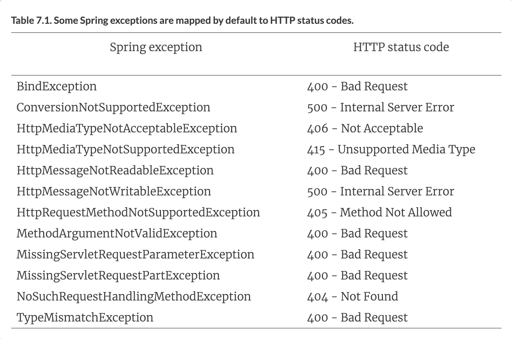
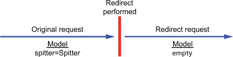
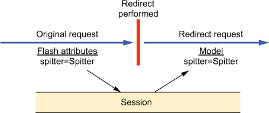

# 7강
[[toc]]
## 1. 다양한 스프링 MVC 설정
- 5장에서 했던 AbstractAnnotationConfigDispatcherServletInitializer 상속을 통해 빠르게 설정함
- 요기서 설정을 다해주면 좋겠지만, 안되는 것도 많음

### 1-1. DispatcherServlet 사용자 설정 정의하기
- 이전에 추가했던 3개의 설정 이외에 오버라이딩 할 수 있는추상메소드 들이 있다.
- 대표적으로 customizeRegistration()

```java
@Override
protected void customizeRegistration(Dynamic registration) {
    registration.setMultipartConfig(
        new MultipartConfigElement("/tmp/spittr/uploads")
    );
}
```

- customizeRegistration()에서 넘겨지는 ServletRegistrtaion.Dynamic으로 setLoadOnStartup()을 호출하여 load-on-startup 우선순위를 설정하는 등 여러가지 설정을 해준다.

### 1-2. 서블릿과 필터 추가하기
- AbstractAnnotationConfigDispatcherServletInitializer을 설정하면 기본적으로 DispatcherServlet과 ContextLoader가 생성된다.
- 추가로 다른설정을 하기 위해선 WebApplicationInitializer를 구현한다.

```java
public class MyServletInitializer implements WebApplicationInitializer {

    @Override
    public void onStartup(SevletContext servletContext) throws ServletException {
        Dynamic myServlet = servletContext.addServlet("myServlet", MyServlet.class);
        myServlet.addMapping("/custom/**"); // 서블릿 등록 및 매핑
    }
}
```

- 위의 소스는 기본적인 서블릿-등록 초기화 클래스이다.
- 이 클래스는 서블릿을 등록하고 각 서블릿을 단일 패스에 매핑시킨다.

```java
@Override
public void onStartup(SevletContext servletContext) throws SevletException{
    javax.sevlet.FilterRegistration.Dynamic filter = 
        servletContext.addFilter("myFilter",MyFilter.class); // 필터 등록

    filter.addMappingForUrlPatterns(null, false, "/custom/*"); // 필터 매핑 추가
}
```

- 서블릿 3.0 컨테이너로 배포할 때, WebApplicationInitializer는 자바로 서블릿, 필터, 리스너를 등록하는 일반적인 방법이다.
- 하지만 필터를 등록할 땐 AbstractAnnotationConfigDispatcherServletInitializer를 사용해도 된다.

```java
@Override
protected Filter[] getServletFilters() {
    return new Filter[] { new MyFilter() };
}
```

- 이 메소드는 javax.servlet.Filter 배열을 반환한다.
- 필터의 매핑에 대한 선언은 따로 필요없고, getServletFilters에서 반환된 필터는 자동적으로 DispatcherServlet에 매핑된다.

## 2. 멀티파트 폼 데이터 처리하기
### 2-1. 멀티파트 리졸버 설정
- 스프링엔 2개의 멀티파트 리졸버 구현을 제공한다.
```java
1. CommonsMultipartResolver : 멀티 파트 요청을 jakarta Commons FileUpload를 사용하여결정
2. StandardServletMultipartResolver : 서블릿 3.0 을 사용한 멀티파트 요청에 대한 지원
```

- 보통 2번을 많이 쓴다.

```java
@Bean
public MultipartResolver multipartResolver() throws IOException {
    return new StandardServletMultipartResolver();
}
```

- 설정이 굉장히 간단해 보이는데, 최소한의 설정은 WebApplicationInitializer를 구현한 클래스에서 설정을 해줘야 한다.

```java
DispatcherServlet ds = new DispatcherServlet();
Dynamic registration = context.addServlet("appServlet", ds);
registration.addMapping("/");
registration.setMultipartConfig(
    new MultipartConfigElement("/tmp/spittr/uploads");
)
```
- 위에서 했던 customizeRegistration() 을 통해서도 설정이가능하다.
- 만약 서블릿 3.0환경이 아니라면, JakartaCommonsFileUpload 설정을 해주면 된다.

```java
@Bean
public MultipartResolver multipartResolver() {
    return new CommonsMulitpartResolver();
}
```

 - 얘는 따로 임시파일 위치를 설정해 줄 필요는 없지만, 물론 해줄수도 있다.

```java
@Bean
public MultipartResolver multipartResolver() throws IOException {
    CommonMultipartResolver multipartResolver = 
        new CommonMultipartResolver();
    multipartResolver.setUploadTempDir(
        new FileSystemResource("/tmp/spittr/...");
    )
    return multipartResolver;
}
```

### 2-2. 멀티파트 요청 처리하기
- 멀티파트 지원 설정이 완료 되었으니, 이젠 컨트롤러 메소드가 필요하다.
- 가장 일반적인 방법은 @RequestPart 어노테이션을 컨트롤러에 추가해준다.

```html
<form method="POST" th:object="${spitter}"
      enctype="multipart/form-data">

...
  <label>Profile Picture</label>:
    <input type="file"
           name="profilePicture"
           accept="image/jpeg,image/png,image/gif" /><br/>

...

</form>
```

- 이런식으로 클라에서 multipart라고 명시해주고

```java
@RequestMapping(value="/register", method=POST)
public String processRegistration(
    @RequestPart("profilePicture") byte[] profilePicture,
    @Valid Spitter spitter,
    Errors errors){
        ...
    }
)
```

- 업로드된 파일의 미가공된 바이트를 작업하는건 간단하지만 제약이많다.
- 이런 경우를 대비해 스프링에서 MultipartFile을 제공한다.

```java
public interface MultipartFile {
    String getName();
    String getOriginalFilename();
    String getContentType();
    boolean isEmpty();
    long getSize();
    byte[] getBytes() throws IOException;
    InputStream getInputStream() throws IOException;
    void transferTo(File dest) throws IOException
}
```

- MultipartFile은 업로드된 파일의 바이트를 얻는 방법을 제공한다.
- 이외에도 여러가지 기능들을 제공해서 조금더 편하게 사용이 가능하다.
- 서블릿 3.0 이상으로 배포되면, Part를 사용하는 방법도 있다.

```java
@RequestMapping(value="/register", method=POST)
public String processRegistration(
    @RequestPart("profilePicture") Part profilePicture,
    @Valid Spitter spitter,
    Errors errors) {
  ...
}
```

```java
public interface Part {
  public InputStream getInputStream() throws IOException;
  public String getContentType();
  public String getName();
  public String getSubmittedFileName();
  public long getSize();
  public void write(String fileName) throws IOException;
  public void delete() throws IOException;
  public String getHeader(String name);
  public Collection<String> getHeaders(String name);
  public Collection<String> getHeaderNames();
}
```

## 3. 예외처리
- 스프링은 예외를 응답으로 변환시켜주는 유용한 방법들을 제공한다.
```java
1. 몇가지 스프링 예외들은 자동으로 명시된 HTTP 상태 코드로 매핑된다.
2. HTTP 상태 코드로 매핑하기 위해 예외는 @ResponseStatus 어노테이션을 붙여 줄 수 있다.
3. 예외 처리를 위한 메소드에는 @ExceptionHandler 어노테이션을 붙여 줄 수 ㅇㅆ다.
```

### 3-1. 예외를 HTTP 상태 코드에 매핑하기
- 스프링은 자동적으로 12개의 예외를 상태코드로 매핑시켜 준다



- 위의 예외들은 일반적으로 DispatcherServlet 동작이나 검증 수행 과정에서 오류가 나면 발생한다.
- 위의 내장 매핑들이 유용하긴 하지만, 실제 어플리케이션 예외에선 쓸모가 없다.
- 이런 경우를 해결하기 위해 쓰이는게 @ResponseStatus

```java
@RequestMapping(value="/{spittleId}", method=RequestMethod.GET)
public String spittle(
    @PathVariable("spittleId") long spittleId,
    Model model
) {
    Spittle spittle = spittleRepository.findOne(spittleId);
    if (spittle == null) {
        throw new SpittleNotFoundException();
    }
    model.addAttribute(spittle);
    return "spittle";
}
```

```java
public class SpittleNotFoundException extends RuntimeException {}
```

- 위의 로직에서 에러가 발생하면, 기본 결과 상태 코드인 500 에러를 발생시킨다.
- 하지만 커스텀 예외에서 404의 상태와 같이 다른 상태값으로 매핑도 가능하다.

```java
@ResponseStatus(value=HttpStatus.NOT_FOUND, // 404로 매핑
                reason="Spittle Not Found")
public class SpittleNotFoundException extends RuntimeException {}
```

- 이런 식으로 @ResponseStatus를 활용하면 어떤 에러 상태값으로 보낼지 정해 줄 수 있다.

### 3-2. 예외 처리 메소드 작성하기
- 위에처럼 단순히 에러 상태값을 보여주는 것도 좋지만, 메세지등 다양한 예외 정보가 필요할 때가 있다.

```java
@RequestMapping(method=RequestMethod.POST)
public String saveSpittle(SpittleForm form, Model model) {
    try {
        spittleRepository.save(
            new Spittle(null, form.getMessage(), new Date(),
                        form.getLongitude(), form.getLatitude())
        );
        return "redirect:/spittles";
    } catch (DuplicateException e) {
        return "error/duplicate";
    }
}
```

- 이렇게 좀 지저분하지만 특정 상황에 예외를 잡아 처리가 가능하다.
- 하지만 이렇게하면 더러우니까 메소드별로 처리를 해보자

```java
@RequestMapping(method=RequestMethod.POST)
public String saveSpittle(SpittleForm form, Model model) {
    spittleRepository.save(
        new Spittle(null, form.getMessage(), new Date(),
                    form.getLongitude(), form.getLatitude())
    );
    return "redirect:/spittles";
}
```

- 이렇게 메소드는 따로 예외 처리를 해주지 않고, 컨트롤러 내부에서 @ExceptionHandler를 만들어준다.

```java
@ExceptionHandler(DuplicateSpittleException.class)
public String handleDuplicateSpittle() {
    return "error/duplicate";
}
```

- 이런식으로 ExceptionHandler 어노테이션을 사용하면 특정 컨트롤러 내에서 예외 발생시 공통으로 처리해 준다.

## 4. 어드바이징 컨트롤러
- 컨트롤러 어드바이스는 @ControllerAdvice이 붙어있는 클래스로 아래의 메소드를 포함한다.
```java
1. @ExceptionHandler 어노테이션이 붙어있는 메소드
2. @InitBinder 어노테이션이 붙어있는 메소드
3. @ModelAttribute 어노테이션이 붙어있는 메소드
```

- 가장 쓸모있어 보이는거는 위에서 썼던 컨트롤러 단위의 예외처리인 @ExceptionHandler와 같이 사용하는 거다.

```java
@ControllerAdvice
public class AppWideExceptionHandler {

    @ExceptionHandler(DuplicateSpittleException.class)
    public String duplicateSpittleHandler() {
        return "error/duplicate";
    }
}
```

- 이제 컨트롤러 어드바이스를 사용을 해서, 어떤 컨트롤러에서 DuplicateSpittleException이 발생해도,위의 메소드를 타게 된다.

## 5. 리다이렉션되는 요청 간의 데이터 전달
- 리다이렉트는 좋은 페이지 이동 방법이지만, 데이터를 전달할 필요성이 있을 때가 있다.
- 아래의 그림은 새로운 리퀘스트가 생성되어 데이터가 사라지는걸 보여준다.


- 리다이렉션시에 데이터 전달하는 방법

```java
1. 데이터를 URL 템플릿을 사용하여 패스 변수나 쿼리 인자로 전달
2. 데이터를 플래시 애트리뷰트에 넣어서 전달
```

### 5-1. URL 템플릿과 함께 리다이렉션하기
- 간단하게 리다이렉트 시에 path param으로 넘겨준다.

```java
return "redirect:/spitter/{username}";
```

- 모델에 데이터를 추가해 준다.

```java
@RequestMapping(value="/register", method=POST)
public String processRegistration(Spitter spitter, Model model) {
    spitterRepository.save(spitter);
    model.addAttribute("username", spitter.getUsername());
    return "redirect:/spitter/{username}";
}
```

- 쿼리 파람에 포함시키려면 모델에 값을 추가만 해주고, 플레이스홀더로 안보내 주면된다.

```java
@RequestMapping(value="/register", method=POST)
public String processRegistration(Spitter spitter, Model model) {
    spitterRepository.save(spitter);
    model.addAttribute("username", spitter.getUsername());
    model.addAttribute("spitterId", spitter.getId());
    return "redirect:/spitter/{username}";
}
```

- 위와 같이 보낼경우, 실질적인 리다이렉트 패스는 "spitter/username?spittleId=idValue" 이다.
- 이런식으로 쿼리파람이나 패스파람으로 넘기는건 편해보이지만, 보내는 데이터 타입에 한계가 있음

### 5-2. 플래시 어트리뷰트로 작업하기
- 짜잘하게 ID나 이름같은거 넘기지말고 객체를 통채로 넘기면 좋을거 같음
- 그래서 세션을 쓰는방법이 있는데, 기능은 좋지만 까먹을 확률이 높아서 비추
- 그래서 나온게 리다이렉트할 때 한번만 쓰고 사라지는 플래시 어트리뷰트

```java
@RequestMapping(value="/register", method=POST)
public String processRegistration(Spitter spitter, RedirectAttributes model) {
    spitterRepository.save(spitter);
    model.addAttribute("username", spitter.getUsername());
    model.addFlashAttribute("spitter", spitter);
    return "redirect:/spitter/{username}";
}
```
- 리다이렉트 되기전에 모든 플래시 어트리뷰트는 세션으로 보사되고, 리다이렉션 이후 세션에 있던
플래시 어트리뷰트는 모델로 저장된 후, 세션은 삭제해버린다.

