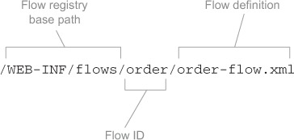
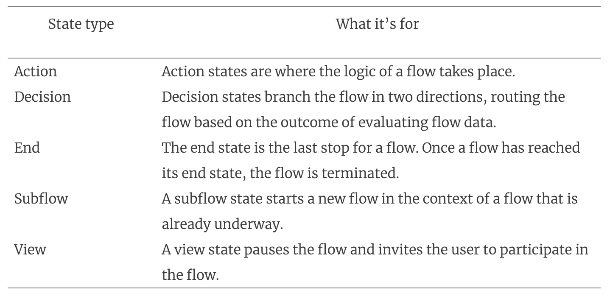
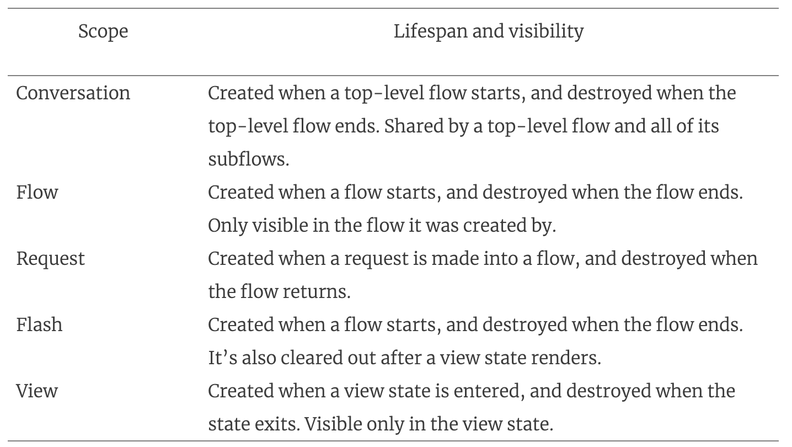
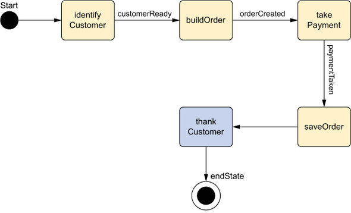
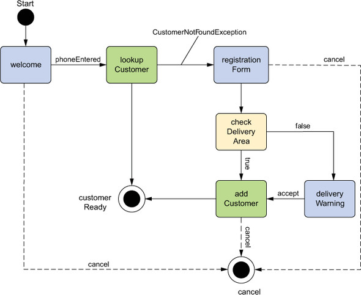

# 8강
[[toc]]
- Spring Web Flow 는 정해진 플로에 따른 요소의 개발을 가능하게 해주는 웹 프레임워크

## 1. 웹 플로 설정하기
- 웹 플로는 MVC 기반으로 만들어졌다.
- xml 설정만 존재......

```html
<?xml version="1.0" encoding="UTF-8"?>
<beans xmlns="http://www.springframework.org/schema/beans"
 xmlns:xsi="http://www.w3.org/2001/XMLSchema-instance"
 xmlns:flow="http://www.springframework.org/schema/webflow-config"
 xsi:schemaLocation=
  "http://www.springframework.org/schema/webflow-config
   http://www.springframework.org/schema/webflow-config/[CA]
   spring-webflow-config-2.3.xsd
http://www.springframework.org/schema/beans
http://www.springframework.org/schema/beans/spring-beans.xsd">
```

- 이렇게 webflow 설정을 추가해준다.

### 1-1. 플로 실행기 연결
- 플로실행기(flow executor)는 플로의 실행을 진행한다.
- 사용자가 플로에 들어오면 플로 실행기는 플로 실행 인스턴스를 실행한다.

```xml
<flow:flow-executor id="flowExecutor" />
```


### 1-2. 플로 설정하기
- 플로 저장소 (flow registry)는 플로 정의를 불러와서 플로 실행기에서 사용이 가능하도록 만든다.

```xml
<flow:flow-registry id="flowRegistry" base-path="/WEB-INF/flows">
   <flow:flow-location-pattern value="*-flow.xml" />
</flow:flow-registry>
```

- 플로 저장소는 /WEB-INF/flows에서 찾고, -flow.xml로 끝나는 모든 xml파일을 플로 정의로 간주한다.



- base path를 빼고 좀더 명시적으로 플로 정의파일을 찾을 수 있다.

```xml
<flow:flow-registry id="flowRegistry">
   <flow:flow-location path="/WEB-INF/flows/springpizza.xml" />
</flow:flow-registry>
```

- ID를 좀더 상세하게도 가능

```xml
<flow:flow-registry id="flowRegistry">
   <flow:flow-location id="pizza"
         path="/WEB-INF/flows/springpizza.xml" />
</flow:flow-registry>
```

### 1-3. 플로 요청 처리하기
- DispatcherServlet에서 플로요청을 스프링 웹 플로어로 보내도록 하기위해 FlowHandlerMapping 설정이 필요하다.

```xml
<bean class=
        "org.springframework.webflow.mvc.servlet.FlowHandlerMapping">
  <property name="flowRegistry" ref="flowRegistry" />
</bean>
```

- FlowHandlerMapping의 역할이 플로 요청을 스프링 웹 플로에 보내주는 것이면, FlowHandlerAdpater의 역할은 호출에 대한 응답이다.

```xml
<bean class=
       "org.springframework.webflow.mvc.servlet.FlowHandlerAdapter">
  <property name="flowExecutor" ref="flowExecutor" />
</bean>
```

- 이 해드러 어댑터는 DispatcherServlet과 스프링 웹 플로를 연결시키는 다리이다.

## 2. 플로의 컴포넌트

### 2-1. 상태


- 뷰 상태란 사용자에게 정보를 표시하고 플로에서 능동적인 역할을 할 기회를 주기 위해 사용된다.

```xml
<view-state id="welcome" />

<view-state id="welcome" view="greeting" />

<view-state id="takePayment" model="flowScope.paymentDetails"/>
```

- 동작 상태란 플로의 어플리케이션 사용자와 관련이 있다면 동작 상태는 어플리케이션 자체의 동작 결과를 의미한다.

```xml
<action-state id="saveOrder">
  <evaluate expression="pizzaFlowActions.saveOrder(order)" />
  <transition to="thankYou" />
</action-state>
```

- 결정 상태란 Boolean 표현식을 쓰는것과 비슷

```xml
<decision-state id="checkDeliveryArea">
  <if test="pizzaFlowActions.checkDeliveryArea(customer.zipCode)"
      then="addCustomer"
      else="deliveryWarning" />
</decision-state>
```

- 서브 플로. 여러 매소드로 쪼개지는것과 비슷한 기능이라고 보면된다.

```xml
<subflow-state id="order" subflow="pizza/order">
  <input name="order" value="order"/>
  <transition on="orderCreated" to="payment" />
</subflow-state>
```

- End 상태. 끝날때 하는 것들
```xml
<end-state id="customerReady" />
```

### 2-2. 전이
- 플로안의 상태를 연결해 주는 것

### 2-3. 플로 데이터
- 플로가 상태를 따라 진행하면서 필요한 데이터 들.
- 플로 데이터의 범위



3. 모든 것을 합쳐 보기
- 피자 주문 과정



- 고객 추가 피자 주문 과정



- 이후 설정들은 로직들을 추가하고 그걸 보여주는 형태의 글들임
- 기본적으로 xml로 설정하고, 그거에 맞춰서 자바 클래스를 생성하는 형태 인것 같다. 
- 쓰고싶지는 않음.